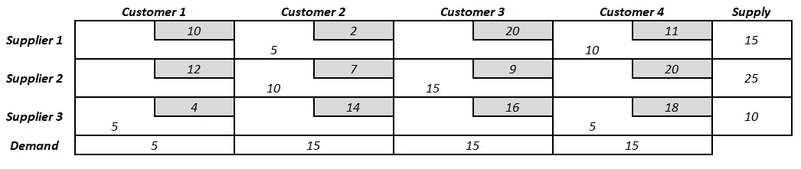

# R-运输问题的运筹学

> 原文：<https://towardsdatascience.com/operations-research-in-r-transportation-problem-1df59961b2ad?source=collection_archive---------0----------------------->

## r 代表工业工程师

## 探索“LP solve”*R*包

Image by iplenio available at [HDqwalls](http://hdqwalls.com/wallpapers/road-freeway-4k-72.jpg)

# 运输问题

运输问题是一种特殊类型的线性规划问题，其中目标在于最小化给定商品从多个**来源**或**起点**(例如工厂、制造设施)到多个**目的地**(例如仓库、商店)的运输成本**。每个来源都有有限的供应(即可以从其发送的最大数量的产品)，而每个目的地都有需要满足的需求(即需要运送到其的最小数量的产品)。从源头到目的地的运输成本与运输的数量成正比。**

**基本符号:**

*   *m* =信号源数量( *i* = 1 … *m* )
*   *n* =目的地数量( *j* = 1 … *n* )
*   *c i，j* =从来源地 *i* 到目的地 *j* 的单位运输成本
*   *x i，j* =从来源 *i* 运送到目的地 *j* 的金额
*   *a i* =源头供应 *i*
*   *b j* =目的地需求 *j*

LP Transportation Problem Diagram

源由行表示，而目的地由列表示。一般来说，一个运输问题有 *m* 行和 *n* 列。如果恰好有( *m* + *n* -1)个基本变量，问题是可解的。

LP Transportation Problem Simplex Tableau

# 运输问题的类型

基于初始给定的信息，有两种不同类型的运输问题:

*   **均衡运输问题:**总供给等于总需求的情况。
*   **不平衡运输问题:**总供给不等于总需求的情况。当供给高于需求时，在等式中引入一个*虚拟*目的地，使其等于供给(运输成本为 0 美元)；超额供应被认为会进入库存。另一方面，当需求高于供应时，在等式中引入一个*虚拟*源，使其等于需求(在这些情况下，不满足需求通常会产生惩罚成本)。

为了着手解决任何给定的运输问题，第一步是检验它是否平衡。如果不是，就要相应的平衡。

R 的 *lpSolve* 包包含了求解线性规划运输问题的特定函数。对于下面的例子，让我们考虑下面要求解的数学模型:

LP Transportation Problem — Mathematical Model

LP Transportation Problem — Simplex Tableau

我们来看看 R 代码！

Transportation Problem R Code

**解决方案:**

LP Transportation Problem Example — Solution

总运输成本:435 美元

上表显示了在满足供需约束的情况下，从供应商 *i* 到客户 *j* 的最优产品组合。没有其他可能的变量组合会导致更低的运输成本。

# 总结想法

运输问题代表了用于以最佳方式分配资源的特定类型的线性规划问题；对于经理和供应链工程师来说，这是一个优化成本的非常有用的工具。LP solve R 包只需要几行代码就可以解决 LP 运输问题。虽然有其他免费的优化软件(如 GAMS、AMPL、TORA、LINDO)，但在你的个人代码库中存储一个 LP 运输问题 R 代码可以节省你大量的时间，因为你不必从头开始编写公式，而只需改变相应矩阵的系数和符号。

*— —*

*如果你觉得这篇文章有用，欢迎在*[*GitHub*](https://github.com/rsalaza4/R-for-industrial-engineering/blob/master/Operations%20Research/Transportation%20Problem.R)*上下载我的个人代码。你也可以直接在 rsalaza4@binghamton.edu 给我发邮件，在*[*LinkedIn*](https://www.linkedin.com/in/roberto-salazar-reyna/)*上找到我。有兴趣了解工程领域的数据分析、数据科学和机器学习应用的更多信息吗？通过访问我的媒体* [*简介*](https://robertosalazarr.medium.com/) *来探索我以前的文章。感谢阅读。*

*-罗伯特*