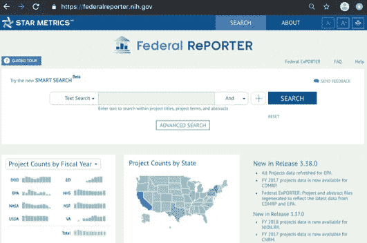
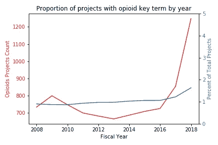
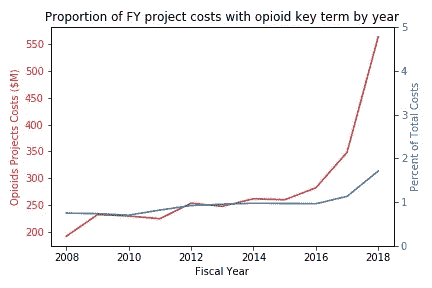
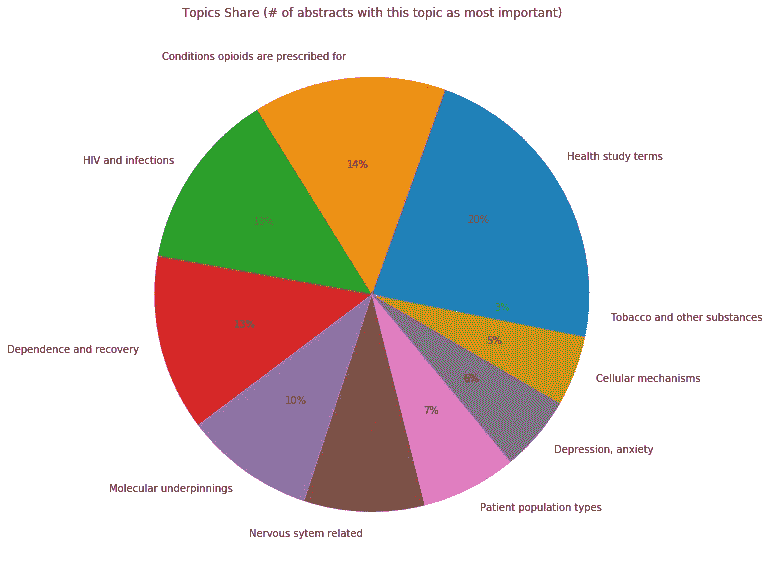
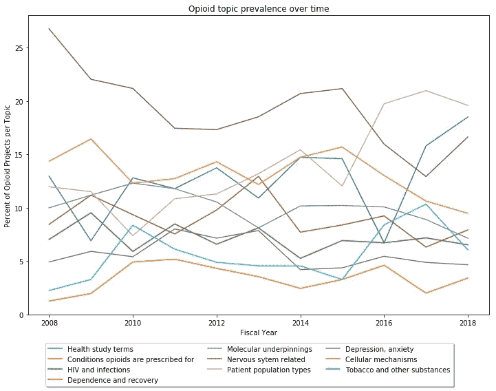
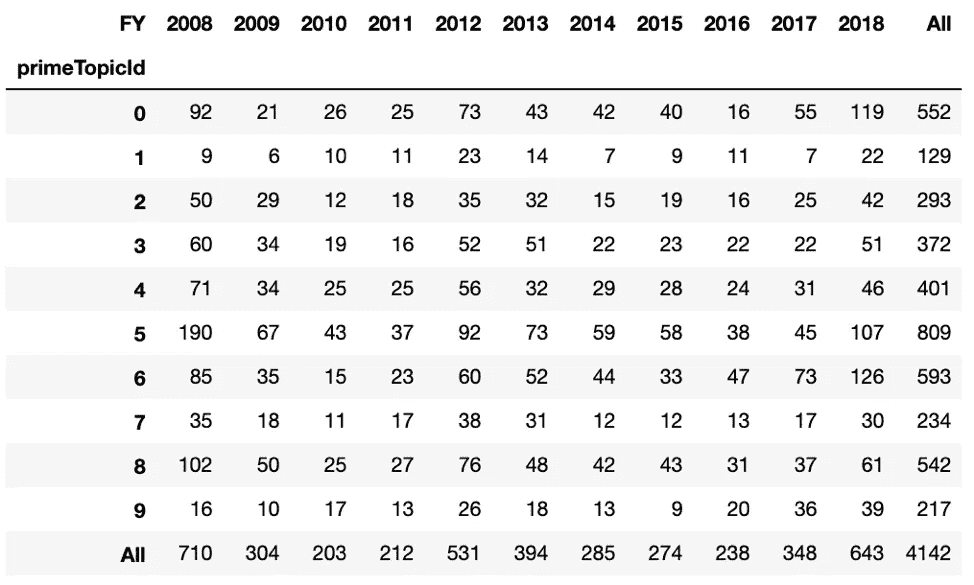
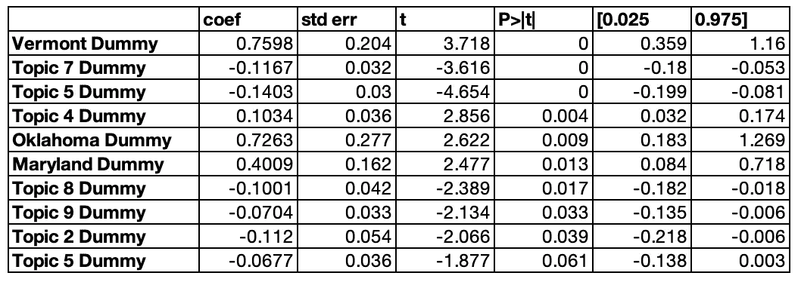

# 阿片类药物危机:政府在做什么？

> 原文：<https://towardsdatascience.com/opioid-crisis-whats-the-government-doing-about-it-42f5f50fe6e4?source=collection_archive---------23----------------------->

## [现实世界中的数据科学](https://medium.com/towards-data-science/data-science-in-the-real-world/home)

## NIH 如何资助与阿片类药物相关的研究

如果你一直生活在岩石下，美国一直面临着巨大的公共健康危机。大约在 2006 年至 2012 年的高峰期，处方阿片类药物危机导致近 10 万人死亡(据《华盛顿邮报》报道[)。](https://www.washingtonpost.com/graphics/2019/investigations/dea-pain-pill-database/)

美国卫生与公众服务部(HHS)已经加大了各种努力，以打击用药过量，提高公众意识，并控制处方阿片类药物的供应。今天，我们想特别关注一下联邦政府是如何*研究危机的各个方面的。你可以在这里找到这篇文章的代码，它涉及到更多的技术细节:[https://github.com/TheLastQuestion/nihOpioidData](https://github.com/TheLastQuestion/nihOpioidData)。*

**数据**

每年，美国国立卫生研究院、国家科学基金会和其他联邦机构通过数百亿美元的拨款资助大约 100，000 个科研项目。关于受资助项目、赞助机构和受资助研究性质的数据可在 https://federalreporter.nih.gov[下载。](https://federalreporter.nih.gov)

**NIH 每年在阿片类药物研究项目上花费多少？**

项目术语字段提供了一个指示器，指示哪些项目与阿片类药物有关。NIH 在 2018 财年花费了 5.64 亿美元，占 NIH 在 2018 财年投入的以“阿片类药物”为关键术语的研究项目的 330 亿美元的 1.7%。在过去的几个财年中，这一研究领域在项目数量和总拨款方面都有了显著增长，从 2008 年到 2015 年，这一领域在 NIH 研究组合中所占的比例一直保持稳定。

**哪些类型的项目属于“阿片类药物”范畴？**

阿片类药物相关项目仅占过去十年 NIH 资助项目总数的 1%左右[注:实际数据是 11 个财政年度的项目]。但是对于一个人来说，它们仍然太多了，无法通读和综合。这就是自然语言处理可以助一臂之力的地方！

每个联邦记者项目都有一段很长的摘要(除了少数缺失的记录)。一种无监督的机器学习方法，称为“主题建模”，可以帮助我们摄取所有这些简单语言的摘要，然后根据这些摘要共有的和*没有*共有的单词将它们聚类成主题(更多技术细节见[链接代码](https://github.com/TheLastQuestion/nihOpioidData))。运行我们的模型将摘要分成 10 个主题，得到如下分布。

也许不出所料，最大的摘要集将健康研究术语(例如，“试验”、“试点”、“调查者”和“大学”)作为其最流行的主题。当然，这些只是对我来说有意义的标签——主题建模只提供最好地描述一个主题的单词列表，并在数学意义上将其与其他主题区分开来。解释是留给人类的(在链接的代码中有更多关于这个主题的说明)。

用这种方法发现的其他主题似乎涉及:

> 2)处方阿片类药物有助于解决的病症(疼痛、镰状细胞病、癌症、炎症……)
> 
> 3)阿片类药物与 HIV 和其他免疫系统相关感染的交叉，
> 
> 4)阿片类药物滥用的康复途径(戒断、渴求、结果、美沙酮…)，
> 
> 5)阿片样物质作用和滥用的分子基础(κ、配体、拮抗剂…)，
> 
> 6)神经系统相关(神经、抑制、通道、脊髓…)，
> 
> 7)不同的患者群体(退伍军人、孕妇、儿童、老人…)，
> 
> 8)抑郁和焦虑，
> 
> 9)与阿片类药物(谷氨酸盐、γ-氨基丁酸、摄入……)相关的细胞机制，以及
> 
> 10)阿片类药物与其他物质(吸烟者、烟草、注射、物质使用)的重叠。

**随着时间的推移，阿片类药物的研究组合发生了怎样的变化？**

现在我们有了一个粗略的方法来描述过去十年中资助了哪些类型的阿片类药物相关研究，我们可以检查这种组合是否随着时间的推移而发生了变化。

我们的分析表明，提及特定患者人群的项目最近流行率增加，而神经系统相关项目略有下降。但是，请注意，这只是阿片类药物标记项目的百分比趋势。就数量而言，*在我们有数据可查的过去三个财年中，所有以阿片类药物为主题的家庭获得资助的项目数量都有所增加。*

Project counts by topic over time

**阿片类药物项目获得的资助金额与哪些因素有关？**

对主题、组织状态和控制预算随时间的增长对财年成本进行线性回归，我们观察到与主题 4(“恢复之路”主题)相关的项目与第一个主题(“健康研究术语”)中的项目相比，增加了 100，000 美元。其他主题或者与第一个主题相比成本更低，或者与第一个主题没有显著差异(即 p 值超过 0.05)。

Truncated table of regression coefficients sorted by lowest p-value then highest coef value

与佛蒙特州和俄克拉荷马州组织相关的阿片类药物项目的项目成本/资金溢价最高。与这些州的组织相关联的项目比基线项目成本多 700，000 美元(在这种情况下，以阿拉巴马州相关联的项目为代表)。然而，请注意，这些州的数据相对较少——OK 组织只有 7 个阿片类药物项目，而 VT 组织只有 23 个。

**结束**

正如媒体记录的那样，阿片类药物的流行给美国家庭和社区带来了巨大而痛苦的代价。通过分析国家卫生研究院的资金数据，我们发现了联邦政府对此正在做些什么的几个答案。

**1)研究滞后于当前事件——尽管阿片类药物危机(就死亡率而言)在 21 世纪后期已经开始，但 NIH 的阿片类药物相关研究组合直到很久以后才出现资金激增，大约从 2016 年开始。这种激增表现为获得阿片类药物项目的*数量*以及获得阿片类药物项目的*美元*的增加。**

**2)使用自然语言处理和主题建模，我们观察到涉及特定患者亚组的研究越来越重要。然而，从整体上看，过去 11 个财政年度的多个阿片类药物项目往往涉及阿片类药物的处方条件、艾滋病毒和其他感染以及依赖性和康复。**

**3)虽然项目总成本往往不会因主题领域的不同而有很大差异，但那些与复苏之路*相关的项目*似乎比大多数其他主题的项目获得了大约 100，000 美元的资助。某些国家的组织往往有较高的项目成本，但这可能是那些获得阿片类药物项目赠款相对较少的组织的人为因素。**

*这篇文章和附带的分析不是美国联邦政府的官方观点。