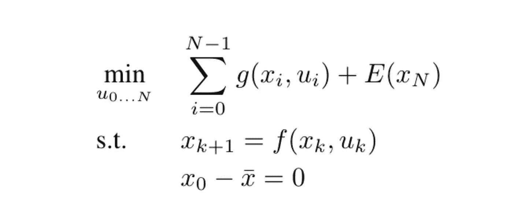
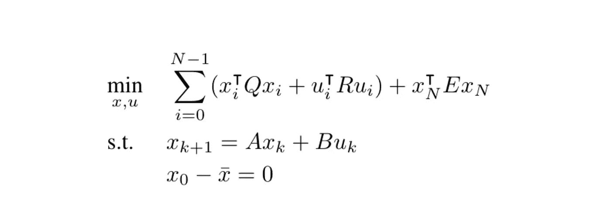
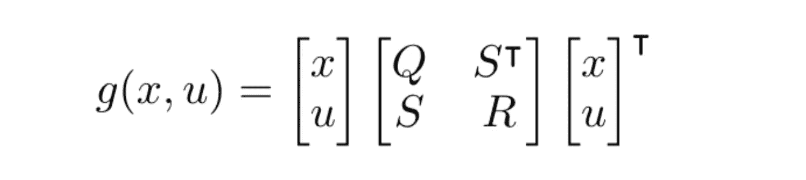
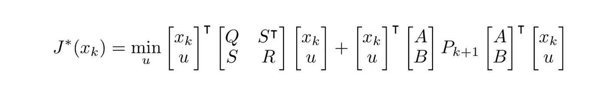
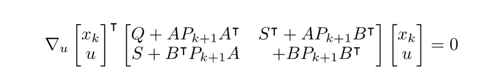
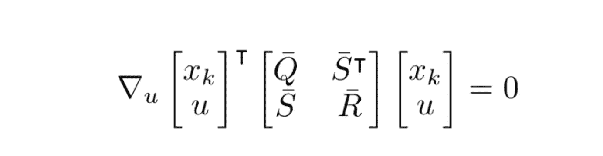
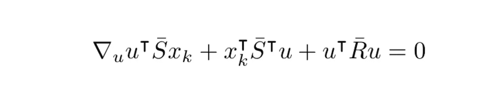
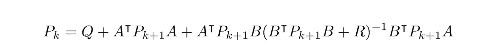

# 最佳控制:LQR

> 原文：<https://towardsdatascience.com/optimal-control-lqr-417b41e10d0d?source=collection_archive---------8----------------------->

## 在最优控制问题中吃掉你的蛋糕

在这篇文章中，我将谈论最优控制。更具体地说，我将谈论令人难以置信的令人敬畏的线性二次调节器，它在最优控制领域中经常使用，并且还将讨论最优控制和最近大肆宣传的强化学习之间的一些相似之处。令人着迷的是，它们的名称不同，但它们在连续的决策过程中处理类似的问题。也就是说，给读者一个友好的数学警告:

> 这篇文章包含了一些线性代数和微积分，但是不要惊慌，它很简单，你可以做到。

既然我们已经解决了这个问题，让我们开始吧。首先让我们定义一个一般的最优控制问题，或者更好地说一个最优化问题。这仅仅意味着我们想要最大化或最小化某个函数，该函数受变量的某些约束。典型的最优控制问题如下所示:

这是非常直接的，最小化一个函数***【f】****服从一些约束(s.t .是 subject to 的简称)。现在，在优化世界里，基于目标函数的样子和约束，这可能是任意困难的。当然，约束可以是基于问题的等式约束或不等式约束。不用说，优化问题中的非凸函数很难优化，但是在凸函数的情况下，我们可以高效快速地解决问题。无论如何，它是如此重要，以至于你在问题中寻找凸性的反应应该是这样的:*

**

*在控制问题中，我们优化我们的轨迹，以最小化成本函数，或者更确切地说，最大化回报，就像在强化学习中所做的那样。自然地，环境的动态，即基于当前动作和当前状态给出我们下一个状态的函数，是优化约束的一部分。因此，我们可以将控制优化问题写成如下:*

**

*这是直到 n 的有限范围的情况。让我们简单地分解它。x 是我们在每个时间步的状态变量，*是我们的动作。 **E** 将是最终状态的最终成本， ***g*** 每个状态-动作对的成本函数。 ***x*** 条是我们想要优化的起始状态，而 ***f*** 是我们的动力学函数。在这种情况下，我们没有不等式约束。事实证明，如果我们的函数 ***f*** 是一次函数***x******u***而函数 ***g*** 是二次函数*和 ***u*** ，这就让问题简单了很多。这就是我们如何得出线性二次调节器问题的定义:***

****

**这里， **Q** ， **R** 和 **E** 是定义我们多项式系数的代价矩阵。我们也可以用分块矩阵表示法写出每个时间步长的成本，以使表达式更简单:**

****

**In the upper case we leaved out the S or better to say we assumed that S = 0, but this doesn’t change the math greatly, S can also be some kind of matrix for interplay between x and u in the cost function.**

**我们将利用最优性原理，该原理陈述了一个自然事实，即如果在 A 点和 C 点之间有一条最优路线，如果我们在这条路线上选择 B 点，那么从 A 到 B 的子路线也是从 A 到 B 的最优路线。基于此，我们可以递归地定义我们轨迹的最优剩余成本，或总成本。这就是我们如何得出汉密尔顿-雅可比-贝尔曼方程的:**

****

**其中 **J** star 是我们的最佳出发成本。在我们的例子中，我们将目标函数描述为一个多项式函数，所以从逻辑上来说，我们可以假设我们的最佳行驶成本是一个多项式函数，我们可以这样写:**

****

**根据我们对优化问题的定义，逻辑上我们的最终成本如下:**

****

**现在，如果我们把函数 g 的定义和环境动力学代入贝尔曼方程，我们会得到这样的结果:**

****

**由于二次成本假设，我们如何找到这个函数的最小值？很简单，我们取相对于 u 的梯度，并使其等于 0，我们将所有项组合成一个大的中心矩阵:**

****

**为了节省空间，我们用下列矩阵代替这些术语(这是不言自明的):**

****

**将所有内容相乘后，只看包含*的项，因为我们要对*求导，所以我们得到以下中间结果:****

******

***在计算梯度和重新排列之后，我们得到 u star 的表达式，它使成本最小化，即最优操作:***

******

***或许可以思考一下这个问题。这是什么意思？这意味着我们有最优行动的封闭解！这真是太棒了。那么我们需要什么来解决这个问题呢？我们需要时间步长 k+1 的矩阵 P。我们可以根据以下等式，从上一时间步开始递归计算:***

******

***这也是众所周知的代数黎卡提方程。在我们想要一个不动点解的情况下，对于无限长的地平线，方程可以求解一个固定的 **P.** 在这种情况下，我们甚至不需要一个递归。我们只是免费得到最优反馈控制。***

***基本上就这些了。你不得不欣赏 LQR 的力量。当然，许多问题不能简化为线性动力学，但是如果我们进行简化，我们会得到什么样的解决方案是令人惊讶的。这种方法甚至用在我们的动力学是非线性的情况下，通过泰勒展开使它们在固定点附近线性化。这是一种在复杂问题的轨迹优化中经常使用的方法，称为微分动态规划(DDP)，其一个实例是 iLQR(迭代 LQR)，go figure。***

***既然你获得了一些 LQR 赋，你就获得了理解最优控制中许多事情的工具。***

******

***我希望 LQR 的这个解释能让你有所启发。这是一个非常简单而强大的概念，也是许多最优控制算法的基础。***