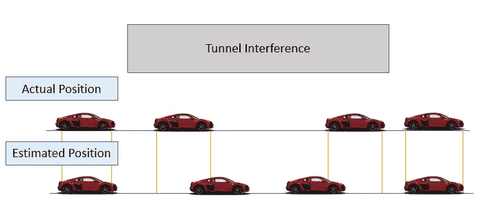
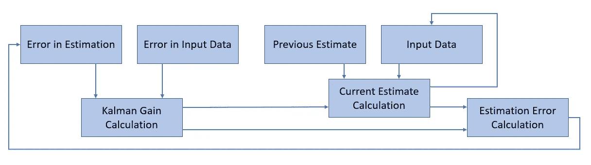
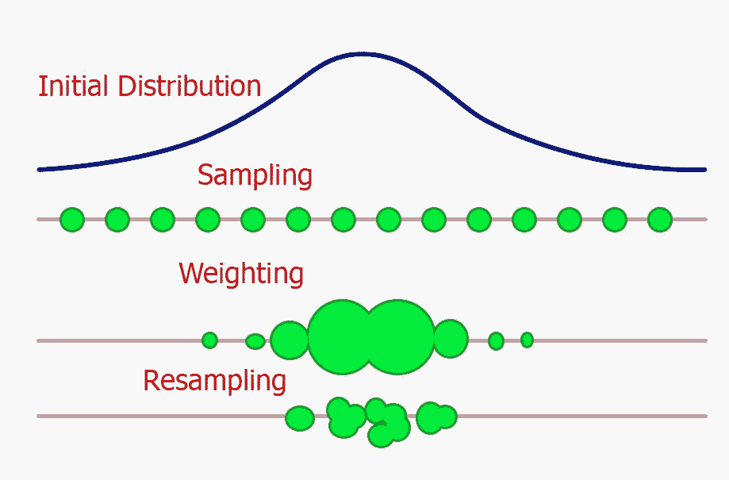

# 最佳估计算法:卡尔曼和粒子滤波器

> 原文：<https://towardsdatascience.com/optimal-estimation-algorithms-kalman-and-particle-filters-be62dcb5e83?source=collection_archive---------6----------------------->

## 介绍卡尔曼和粒子滤波器及其在机器人和强化学习等领域的应用。

Photo by [Daniel Jerez](https://unsplash.com/@danieljerez?utm_source=medium&utm_medium=referral) on [Unsplash](https://unsplash.com?utm_source=medium&utm_medium=referral)

# 最优估计算法

最优估计算法在我们的日常生活中起着非常重要的作用。今天，我将使用一些实际示例向您介绍其中的两种(卡尔曼滤波器和粒子滤波器)。

让我们想象一下，我们正驾驶着一辆无人驾驶汽车，我们即将穿过一条长长的隧道。在这个例子中，我们的汽车使用不同的传感器，如 GPS 估计、加速度计和摄像头，以便跟踪它在地图中的位置以及它与其他车辆或行人的交互。尽管如此，当在隧道中行驶时(特别是在一个很长的隧道中)，我们的 GPS 信号会因为干扰而变弱。因此，我们的汽车估计它的位置可能变得更加困难。为了解决这个问题，我们能做些什么呢？

一个简单的解决方案是将我们的加速计传感器数据与微弱的 GPS 信号结合使用。事实上，对我们的加速度进行二重积分，我们就能计算出我们的车的位置。虽然这种简单的测量会包含一些漂移，因此不会完全准确，因为我们的测量误差会随着时间传播(图 1)。为了解决这个问题，我们可以使用卡尔曼滤波器或粒子滤波器。

Figure 1: Autonomous car position estimation against time

## 卡尔曼滤波器

卡尔曼滤波器在机器人学(例如 [SLAM 系统](https://ieeexplore.ieee.org/document/8321612))和强化学习中有常见的应用。卡尔曼滤波器可用于 Robotis，以跟踪环境中一群机器人的运动，也可用于强化学习，以跟踪不同的软件代理。

> 卡尔曼滤波器是一种迭代数学过程，当测量值包含不确定性或误差时，它使用一组方程和连续数据输入来估计物体的真实位置、速度等。[1]

因此，卡尔曼滤波器可以简化为机器学习模型。他们获取一些输入数据，执行一些计算以进行估计，计算其估计误差，并反复重复该过程以减少最终损失。卡尔曼滤波器执行的迭代过程可以总结为 3 个主要步骤:

1.  **卡尔曼增益计算**:利用输入数据和估计中的误差进行计算。
2.  **当前估计计算**:使用原始输入数据、我们先前的估计和卡尔曼增益进行计算。
3.  **估算误差计算**:最终使用卡尔曼增益和我们当前的估算值进行计算。

图 2 简要总结了这一过程。

Figure 2: Kalman Filter WorkFlow (Adapted from [1])

存在不同种类的卡尔曼滤波器，一些例子是:线性卡尔曼滤波器、扩展卡尔曼滤波器和无迹卡尔曼滤波器。如果你对卡尔曼滤波器更详细的数学解释感兴趣，麻省理工学院托尼·莱西的这个教程是一个很好的起点。

卡尔曼滤波器的一个主要问题是，它们只能用于模拟可以用高斯噪声描述的情况。尽管许多非高斯过程可以用高斯项来近似，或者通过某种形式的变换(如对数、平方根等)转换成高斯分布..).

为了克服这种类型的限制，可以使用另一种方法:粒子滤波器。

## 粒子过滤器

可以使用粒子滤波器来解决非高斯噪声问题，但是粒子滤波器通常比卡尔曼滤波器在计算上更昂贵。这是因为粒子滤波器使用模拟方法而不是分析方程来解决估计任务。

粒子过滤器通常用于:

*   金融市场分析(特别是在[随机过程分析](/stochastic-processes-analysis-f0a116999e4)
*   强化学习
*   机器人本地化(例如直接全局策略搜索)

粒子滤波器基于[蒙特卡罗方法](https://en.wikipedia.org/wiki/Monte_Carlo_method)，通过将原始数据离散成粒子(每个粒子代表一个不同的状态)来处理非高斯问题。粒子数量越多，我们的粒子过滤器就越能更好地处理任何可能的分布类型。

像卡尔曼滤波器一样，粒子滤波器也利用迭代过程来产生它的估计。每次迭代可以分为三个主要步骤[3]:

1.  从原始分布中取出多个样本( ***粒子*** )。
2.  按照重要性的顺序对所有采样粒子进行加权(在给定间隔内落下的粒子越多，它们的概率密度就越高)。
3.  通过用更可能的粒子替换更不可能的粒子进行重采样(就像在进化算法中，只有种群中最适合的元素才能存活)。

图 3 总结了这一过程。正如我们可以从下图中看到的，在这个例子中，我们的粒子过滤器能够在一次迭代后了解哪个范围更可能是我们的对象。反复重复这个过程，我们的滤波器将能够进一步限制其色散范围。

Figure 3: Single Particle Filter Iteration

如果你对用 Python 实现最优估计算法感兴趣，那么 [FilterPy](https://filterpy.readthedocs.io/en/latest/) 或 [Pyro](http://docs.pyro.ai/en/stable/) 库是两个很好的解决方案。特别地，Pyro 是由优步开发的通用概率编程语言，其可以使用 PyTorch 作为后端用于各种贝叶斯分析。

*我希望你喜欢这篇文章，谢谢你的阅读！*

# 联系人

如果你想了解我最新的文章和项目[，请通过媒体](https://medium.com/@pierpaoloippolito28?source=post_page---------------------------)关注我，并订阅我的[邮件列表](http://eepurl.com/gwO-Dr?source=post_page---------------------------)。以下是我的一些联系人详细信息:

*   [领英](https://uk.linkedin.com/in/pier-paolo-ippolito-202917146?source=post_page---------------------------)
*   [个人博客](https://pierpaolo28.github.io/blog/?source=post_page---------------------------)
*   [个人网站](https://pierpaolo28.github.io/?source=post_page---------------------------)
*   [中等轮廓](https://towardsdatascience.com/@pierpaoloippolito28?source=post_page---------------------------)
*   [GitHub](https://github.com/pierpaolo28?source=post_page---------------------------)
*   [卡格尔](https://www.kaggle.com/pierpaolo28?source=post_page---------------------------)

# 文献学

[1]专题—简单示例(单个测量值)的卡尔曼滤波器(55 个中的第 2 个)流程图，Michel van Biezen。访问地点:[https://www.youtube.com/watch?v=CaCcOwJPytQ](https://www.youtube.com/watch?v=CaCcOwJPytQ)

[2]第十一章。教程:卡尔曼滤波器，托尼莱西。访问网址:[http://web . MIT . edu/kirt ley/kirt ley/binlustuff/literature/control/Kalman % 20 filter . pdf](http://web.mit.edu/kirtley/kirtley/binlustuff/literature/control/Kalman%20filter.pdf)

[3]粒子滤波器和蒙特卡罗定位简介，Cyrill Stachniss。访问网址:[http://ais . informatik . uni-freiburg . de/teaching/ws12/mapping/pdf/slam 09-particle-filter-4 . pdf](http://ais.informatik.uni-freiburg.de/teaching/ws12/mapping/pdf/slam09-particle-filter-4.pdf)