# 深度学习中的优化算法

> 原文：<https://towardsdatascience.com/optimization-algorithms-in-deep-learning-191bfc2737a4?source=collection_archive---------3----------------------->

## AdaGrad、RMSProp、带动量的梯度下降和 Adam 优化器揭秘

**在本文中，我将向您介绍深度学习中最复杂的优化算法，这些算法可以让神经网络更快地学习，并实现更好的性能。**

**这些算法是带动量的随机梯度下降、AdaGrad、RMSProp 和 Adam Optimizer。**

【https://www.deeplearning-academy.com】最初发表于**。**

## *如果你喜欢这篇文章，想分享你的想法，问问题或保持联系，请随时通过 LinkedIn 与我联系。*

# *目录*

1.  *为什么我们需要更好的优化算法？*
2.  *带动量的随机梯度下降*
3.  *阿达格拉德*
4.  *RMSProp*
5.  *Adam 优化器*
6.  *深度学习的最佳优化算法是什么？*

# *1.为什么我们需要更好的优化算法？*

*为了训练神经网络模型，我们必须定义损失函数，以便测量我们的模型预测和我们想要预测的标签之间的差异。我们所寻求的是一组特定的权重，利用这些权重，神经网络可以做出准确的预测，从而自动导致损失函数值更低。*

*我想你现在一定知道了，它背后的数学方法叫做梯度下降。*

*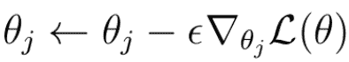*

*Eq. 1 Gradient Descent for parameters θ with loss function **L**.*

*在该技术(等式 1)中，我们必须计算损失函数 ***L*** 相对于我们想要改善的权重(或参数 ***θ*** )的梯度。随后，在梯度的负方向上更新权重/参数。*

> ***通过周期性地对权重应用梯度下降，我们将最终达到最佳权重，使损失函数最小化，并允许神经网络做出更好的预测。***

*目前为止这个理论。*

*不要误解我，梯度下降仍然是一个强大的技术。然而，在实践中，这种技术在训练期间可能会遇到某些问题，这些问题会减慢学习过程，或者在最坏的情况下，甚至会阻止算法找到最佳权重*

*这些问题一方面是损失函数的**鞍点**和**局部最小值**，其中损失函数变得平坦，梯度变为零:*

*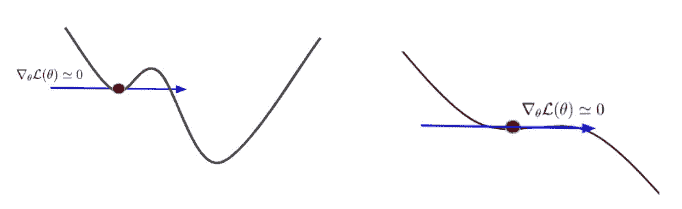*

*Fig. 1 Saddle Points and Local Minima*

*接近零的梯度不会改善权重参数，并且会妨碍整个学习过程。*

*另一方面，即使我们有不接近零的梯度，为来自训练集的不同数据样本计算的这些梯度的值在值和方向上也可能不同。我们说梯度是有噪声的，或者有很多方差。这导致向最佳重量的曲折移动，并使学习速度变慢:*

*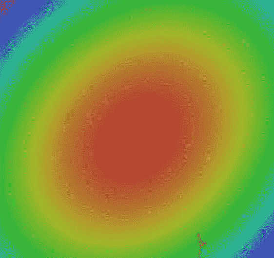*

*Fig. 3 Example of zig-zag movements of noisy gradients.*

*在下面的文章中，我们将学习更复杂的梯度下降算法。所有这些算法都是基于我们到目前为止所知道的规则梯度下降优化。但是，我们可以通过一些数学技巧来扩展这种常规的权重优化方法，以建立更有效的优化算法，使我们的神经网络能够充分处理这些问题，从而学习更快，实现更好的性能*

# *2.带动量的随机梯度下降*

*我想向你们展示的第一个复杂算法叫做带动量的随机梯度下降。*

*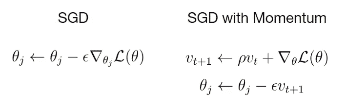*

*Eq. 2 Equations for stochastic gradient descent with momentum.*

*在等式的左边。2，您可以看到权重根据规则随机梯度下降进行更新的等式。右边的等式显示了根据具有动量的 SGD 的权重更新的规则。动量作为添加到常规更新规则中的附加项***【ρ】***乘以 ***v*** 出现。*

*直观地说，通过增加这个动量项，我们让我们的梯度在训练期间建立一种速度 ***v*** 。速度是由 ***ρ*** 加权的梯度的运行和。*

****ρ*** 可以认为是一点点减缓速度的摩擦力。一般来说，你可以看到速度随着时间的推移而增加。通过使用动量项，鞍点和局部极小值对梯度变得不那么危险。因为朝向全局最小值的步长现在不仅取决于当前点的损失函数的梯度，还取决于随时间推移而增加的速度。*

> ***换句话说，在某一点上，我们更多的是朝着速度的方向移动，而不是朝着梯度的方向。***

*如果你想有一个有动量的随机梯度下降的物理表示，想象一个球滚下山坡，并随着时间的推移增加速度。如果这个球在途中碰到一些障碍物，比如一个洞或没有向下斜坡的平地，速度 ***v*** 会给球足够的力量滚过这些障碍物。在这种情况下，平地和洞代表鞍点或损失函数的局部最小值。*

*在下面的视频中(图 4)，我想给大家展示一个正则随机梯度下降和带动量项的随机梯度下降的直接对比。两种算法都试图达到三维空间中损失函数的全局最小值。请注意动量项是如何使梯度具有更小的方差和更少的曲折移动的。*

*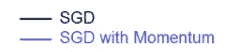**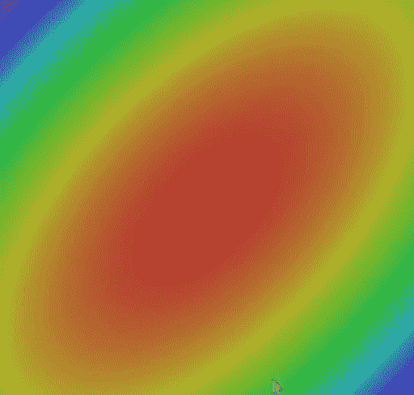*

*Fig. 4 SGD vs. SGD with Momentum*

*一般来说，动量项使得向最优权重的收敛更稳定和更快。*

# *3.阿达格拉德*

*另一种优化策略叫做 AdaGrad。这个想法是你在优化过程中保持梯度平方和的运行。在这种情况下，我们没有动量项，而是一个表达式 ***g*** 它是梯度平方的和。*

*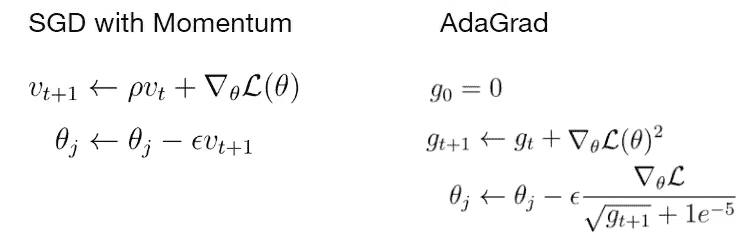*

*Eq. 3 Parameter update rule for AdaGrad.*

*当我们更新一个权重参数时，我们将当前梯度除以该项的根 ***g*** 。为了解释 AdaGrad 背后的直觉，想象一个二维空间中的损失函数，其中损失函数在一个方向上的梯度非常小，而在另一个方向上非常高。*

*沿着梯度较小的轴对梯度求和会导致这些梯度的平方和变得更小。如果在更新步骤中，我们将当前梯度除以一个非常小的梯度平方和***【g】***，该除法的结果变得非常高，反之亦然，对于具有高梯度值的另一个轴也是如此。*

> *因此，我们强制算法以相同的比例在任何方向进行更新。*

*这意味着我们通过增加沿着轴的梯度来加速沿着具有小梯度的轴的更新过程。另一方面，沿着具有大梯度的轴的更新稍微慢了一些。*

*但是，这种优化算法有一个问题。想象一下，当训练需要很长时间时，梯度的平方和会发生什么。随着时间的推移，这一项会变得更大。如果当前梯度除以这个大的数，则权重的更新步长变得非常小。这就好像我们使用了非常低的学习，随着训练时间的延长，这种学习会变得更低。在最坏的情况下，我们会被困在阿达格拉德，训练将永远继续下去。*

**

# *4.RMSProp*

*AdaGrad 有一个名为 RMSProp 的细微变化，它解决了 AdaGrad 的问题。对于 RMSProp，我们仍然保持梯度平方的运行总和，但是我们没有让该总和在训练期间持续增长，而是让该总和实际上衰减。*

*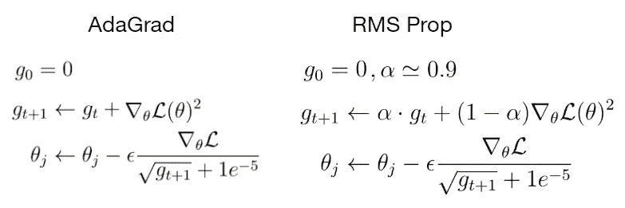*

*Eq. 4 Update rule for RMS Prop.*

*在 RMSProp 中，我们将梯度的平方和乘以衰减率 **α** ，并加上由(1- **α)** 加权的当前梯度。RMSProp 中的更新步骤看起来与 AdaGrad 中的完全相同，我们将当前梯度除以梯度的平方和，以获得沿一个维度加速运动并沿另一个维度减慢运动的良好特性。*

*让我们看看 RMSProp 在寻找最优权重方面与 SGD 和 SGD with momentum 相比做得如何。*

*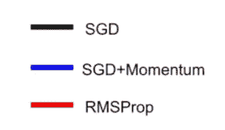**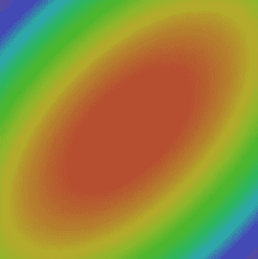*

*Fig. 5 SGD vs. SGD with Momentum vs. RMS Prop*

*虽然具有动量的 SGD 能够更快地找到全局最小值，但这种算法需要更长的路径，这可能是危险的。因为更长的路径意味着更多可能的鞍点和局部极小值。另一方面，RMSProp 直接走向损失函数的全局最小值，而不走弯路。*

# *5.Adam 优化器*

*到目前为止，我们已经使用了矩项来建立梯度的速度，以朝着该速度的方向更新权重参数。在 AdaGrad 和 RMSProp 的例子中，我们使用梯度的平方和来缩放当前梯度，因此我们可以在每个维度中以相同的比率进行权重更新。*

*这两种方法看起来都是不错的主意。为什么我们不把两个世界的优点结合到一个单一的算法中呢？*

*这就是最终优化算法 Adam 背后的确切概念，我想向大家介绍一下。*

*算法的主要部分由以下三个等式组成。乍一看，这些方程似乎令人不知所措，但如果你仔细观察，你会发现对以前的优化算法有些熟悉。*

*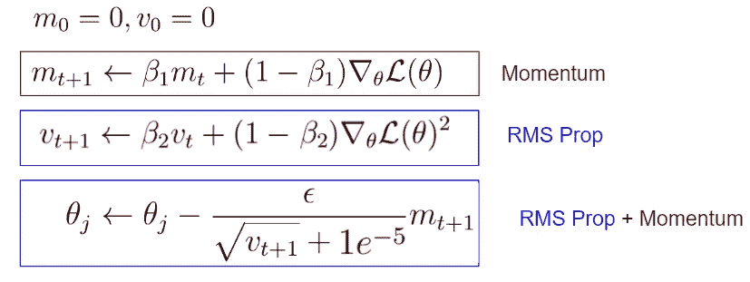*

*Eq. 5 Parameter update rule for Adam Optimizer*

*第一个方程看起来有点像带动量的 SGD。在这种情况下，这一项就是速度和摩擦力。在亚当的例子中，我们称之为第一动量，它只是一个超参数。*

*然而，与具有动量的 SGD 的差异是因子(1- ***β1*** )，该因子与电流梯度相乘。*

*另一方面，方程的第二部分可以被视为 RMSProp，其中我们保持梯度平方的运行和。同样，在这种情况下，存在与平方梯度相乘的因子(1- ***β2*** )。*

*方程中的项称为第二动量，也是一个超参数。最终的更新方程可以看作是 RMSProp 和 SGD 与动量的组合。*

*到目前为止，Adam 已经集成了前两个优化算法的良好特性，但这里有一个小问题，那就是开始时会发生什么的问题。*

*在第一时间步，第一和第二动量项被初始化为零。第二次动量第一次更新后，这一项还是很接近零的。当我们更新最后一个等式中的权重参数时，我们除以非常小的第二动量项 ***v*** ，导致非常大的第一更新步长。*

*这个第一个非常大的更新步骤不是问题几何的结果，而是我们已经将第一个和第二个动量初始化为零这一事实的产物。为了解决大的首次更新步骤的问题，Adam 包括一个修正条款:*

*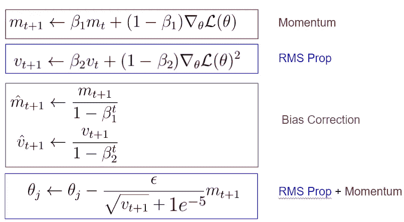*

*Eq. 6 Bias Correction for Adam Optimizer*

*你可以看到，在第一和第二动量的第一次更新之后，我们通过考虑当前的时间步长，对这些动量做了一个无偏的估计。这些校正项使得第一和第二动量的值在开始时比没有偏差校正的情况下更高。*

*因此，神经网络参数的第一个更新步骤不会变得太大，并且我们不会在开始时搞乱我们的训练。额外的偏差修正为我们提供了完整形式的 Adam 优化器。*

*现在，让我们在寻找损失函数的全局最小值方面相互比较所有算法:*

*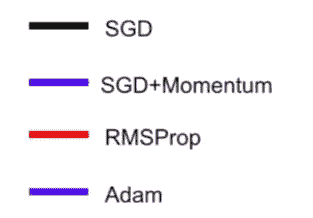**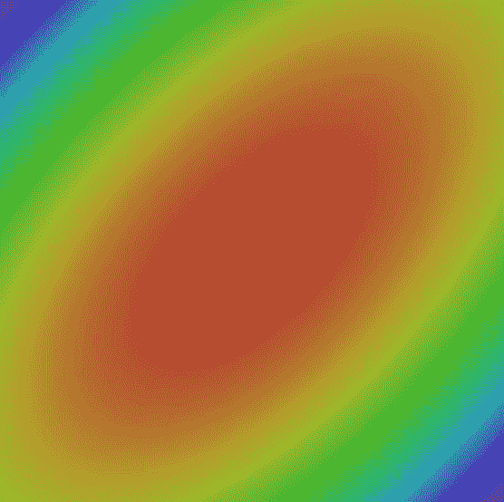*

*Fig. 6 Comparison of all optimization algorithms.*

# *6.深度学习的最佳优化算法是什么？*

*最后，我们可以讨论什么是最佳梯度下降算法的问题。*

*一般来说，普通的梯度下降算法对于较简单的任务来说已经足够了。如果您对模型的准确性不满意，您可以尝试 RMSprop 或在梯度下降算法中添加动量项。*

*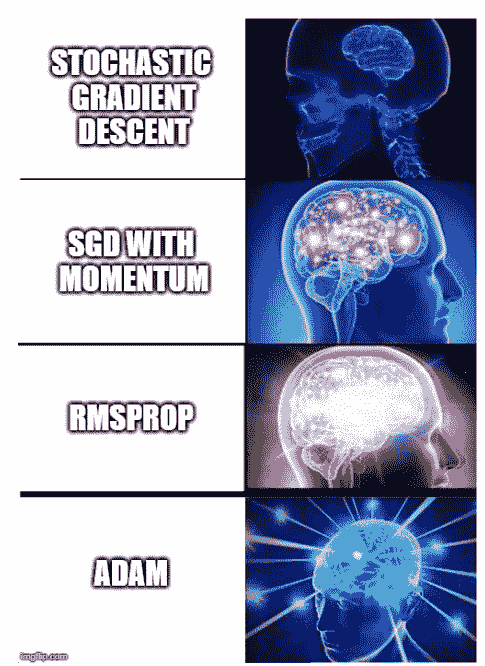*

*但是根据我的经验，神经网络的最佳优化算法是 Adam。这种优化算法对于你将会遇到的几乎任何深度学习问题都非常有效。尤其是当您将超参数设置为以下值时:*

*   ****β1=0.9****
*   ****β2=0.999****
*   *学习率= 0.001–0.0001*

*…这将是一个非常好的起点，可以解决任何问题，事实上也可以解决我曾经使用过的所有类型的神经网络架构。*

*这就是为什么 Adam Optimizer 是我想解决的每个问题的默认优化算法。只有在极少数情况下，我才会切换到我之前介绍的其他优化算法。*

*从这个意义上说，我建议您总是从 Adam 优化器开始，而不管您正在处理的问题领域的神经网络的架构如何。*

**原载于*[*https://www.deeplearning-academy.com*](https://www.deeplearning-academy.com/p/ai-wiki-optimization-algorithms)*。**