# 用 Python 优化:如何用最少的风险赚最多的钱？

> 原文：<https://towardsdatascience.com/optimization-with-python-how-to-make-the-most-amount-of-money-with-the-least-amount-of-risk-1ebebf5b2f29?source=collection_archive---------4----------------------->

## 我们展示了如何将获得诺贝尔奖的经济理论应用于股票市场，并使用简单的 Python 编程解决由此产生的优化问题。

# 介绍

现代数据科学和分析企业的主要目标之一是[为商业和技术公司解决复杂的优化问题](https://www.quora.com/Is-optimization-related-to-data-science-And-how)以实现利润最大化。

在我的文章“[用 Python 进行线性编程和离散优化](/linear-programming-and-discrete-optimization-with-python-using-pulp-449f3c5f6e99)”中，我们谈到了基本的离散优化概念，并介绍了一个用于解决此类问题的 [Python 库 PuLP](https://pythonhosted.org/PuLP/) 。

 [## 用 Python 实现线性规划和离散优化

### 线性和整数规划是离散优化的关键技术，它们在现代数学中随处可见

towardsdatascience.com](/linear-programming-and-discrete-optimization-with-python-using-pulp-449f3c5f6e99) 

虽然线性规划(LP)问题仅由线性目标函数和约束条件定义，但它可以应用于从医疗保健到经济、商业到军事等不同领域的各种问题。

在本文中，我们展示了一个在经济规划领域使用 Python 编程的 LP 的惊人应用— ***最大化股票市场投资组合的预期利润，同时最小化与之相关的风险*** 。

听起来很有趣？请继续读下去。

# 如何在股市中实现利润最大化，风险最小化？

1990 年诺贝尔经济学奖授予了哈里·马科维茨，他因著名的现代投资组合理论(MPT)而被认可，这在金融市场的说法中是众所周知的。最初的论文发表于 1952 年。

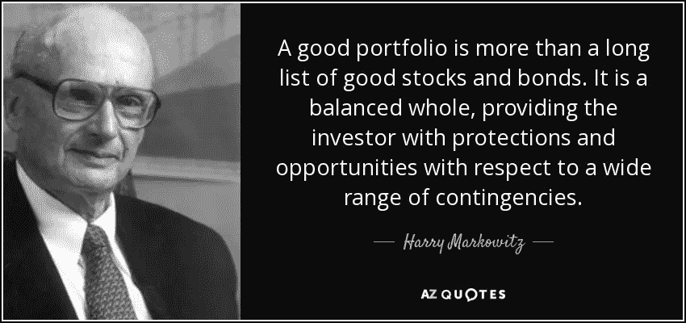

**Source**: AZ Quotes

这里的关键词是**平衡**。

一个好的、平衡的投资组合必须提供保护(最小化风险)和机会(最大化利润)。

 [## 如何优化投资组合风险模型

### 单个资产的集合相互作用，影响整个投资组合。所以当几项投资都…

www.dummies.com](https://www.dummies.com/business/accounting/auditing/how-to-optimize-portfolio-risk/) 

并且，当涉及到最小化和最大化这样的概念时，很自然地用 [**数学最优化理论**](https://en.wikipedia.org/wiki/Mathematical_optimization) 来投射问题。

> 基本思想相当简单，植根于人类天生的风险厌恶本性。

一般来说，股票市场的统计数据表明，风险越高，回报越高的可能性越大，风险越低，回报越小的可能性越大。

[MPT 假设投资者厌恶风险](https://www.investopedia.com/ask/answers/041615/how-risk-aversion-measured-modern-portfolio-theory-mpt.asp)，**这意味着给定两个提供相同预期回报的投资组合，投资者会更喜欢风险较小的一个**。想想吧。只有当高风险股票有很高的回报率时，你才会收集它们。

**但是如何量化风险**？这肯定是一个模糊的概念，对不同的人有不同的含义。然而，在普遍接受的经济理论中，股票价格的[可变性(波动性)(在固定时间范围内定义)等同于风险](https://www.investopedia.com/ask/answers/041415/variance-good-or-bad-stock-investors.asp)。

> 因此，中心优化问题是在保证一定的利润回报的同时，使风险最小化。或者，最大化利润，同时将风险保持在某个阈值以下。

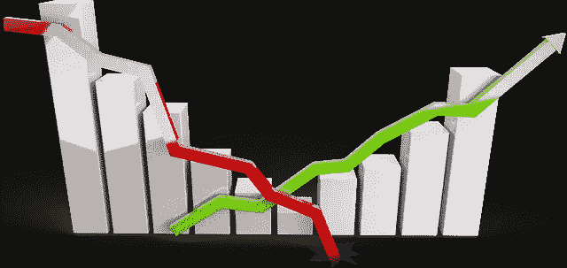

# 一个例题

在本文中，我们将展示投资组合优化问题的一个非常简化的版本，它可以被转换到一个 LP 框架中，并使用简单的 Python 脚本高效地解决。

我们的目标是展示这种优化求解器处理复杂现实问题的能力和可能性。

我们使用三只股票的 24 个月股价(月平均)——微软、Visa 和沃尔玛。这些是旧数据，但它们完美地展示了这一过程。

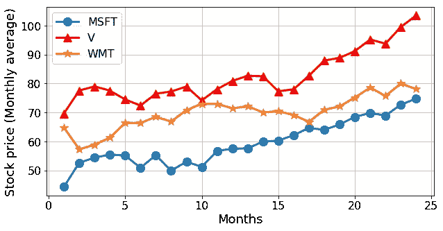

Fig: Monthly stock price of three companies over a certain 24-month period.

**如何定义退货**？我们可以简单地通过从当月减去上月的平均股价并除以上月的价格来计算滚动月回报率。

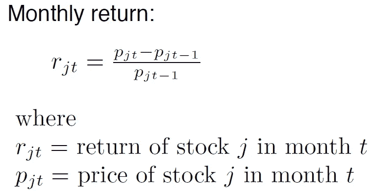

下图显示了返回结果，

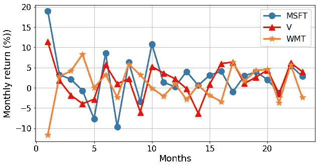

# 优化模型

股票的回报是一个不确定的量。我们可以将其建模为一个随机向量。

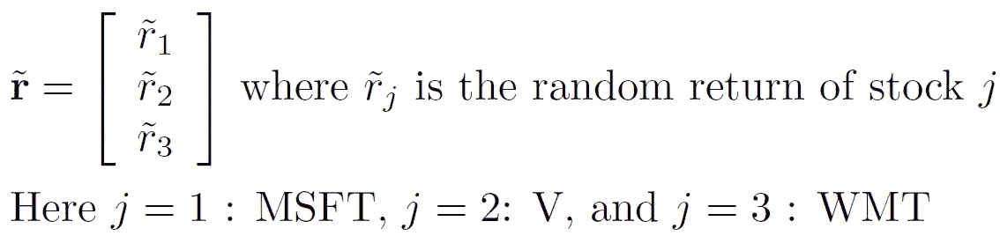

投资组合也可以被建模为向量。

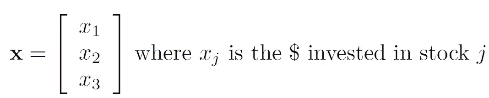

因此，某个投资组合的回报由这些向量的内积给出，它是一个随机变量。最重要的问题是:

> 如何比较随机变量(对应不同的投资组合)来选择一个“最佳”的投资组合？

根据马科维兹模型，我们可以将问题公式化为:

> 给定固定数量的资金(比如 1000 美元)，我们应该在三只股票中的每只股票上投资多少，以便(a)至少有给定阈值的一个月预期回报，以及(b)最小化投资组合回报的风险(方差)。

我们不能投资负的数量。这就是**非消极约束**，

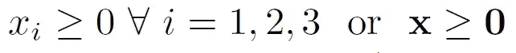

假设没有交易成本，总投资受到手头资金的限制，

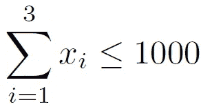

投资回报，

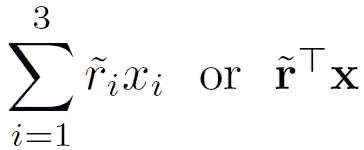

但这是一个**随机变量**。因此，我们必须处理**预期数量**，

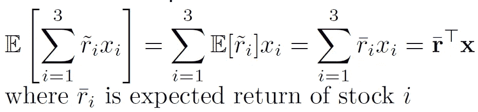

假设我们想要一个**最小预期收益**。因此，

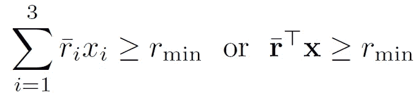

现在，为了模拟风险，我们必须计算**方差**，

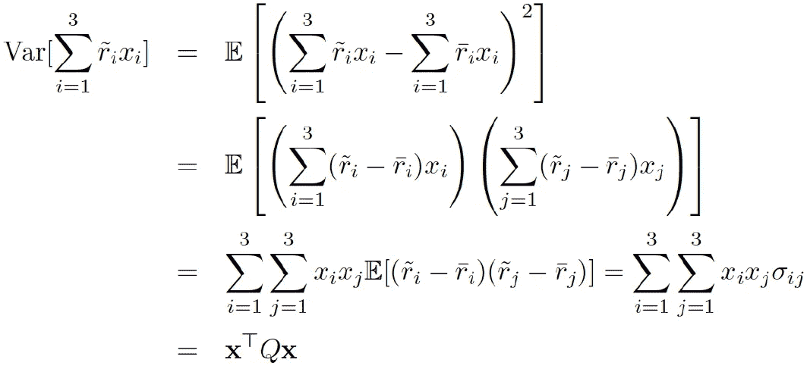

综合起来，最终的优化模型是，

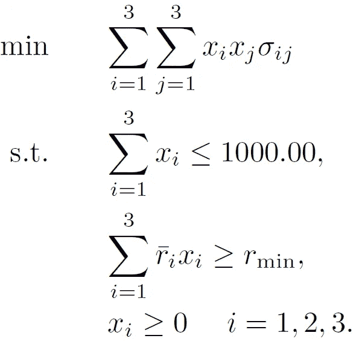

接下来，我们将展示使用一个流行的 Python 库来阐述和解决这个问题是多么容易。

# 使用 Python 解决优化问题:CVXPY

这个问题我们要用的库叫做 [**CVXPY**](https://www.cvxpy.org/index.html) 。它是一种用于凸优化问题的 Python 嵌入式建模语言。它允许你以一种遵循数学模型的自然方式来表达你的问题，而不是以求解者所要求的限制性标准形式。

本 Jupyter 笔记本 中给出了 [**的全部代码。在这里，我只展示核心代码片段。**](https://github.com/tirthajyoti/Optimization-Python/blob/master/Portfolio_optimization.ipynb)

要建立必要的数据，关键是从每月价格的数据表中计算出回报矩阵。代码如下所示，

现在，如果您并排查看原始数据表和返回表，看起来如下所示:

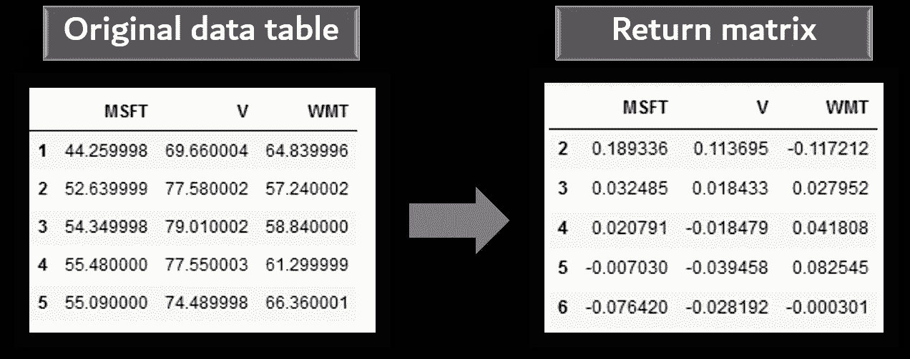

接下来，我们简单地从这个回报矩阵计算平均(预期)回报和协方差矩阵，

之后，CVXPY 允许简单地按照我们上面构建的数学模型来设置问题，

注意 CVXPY 框架中非常有用的类的使用，如`**quad_form()**`和`**Problem()**`。

瞧啊。

我们可以编写一个简单的代码来解决`**Problem**`，并显示最佳投资数量，确保最低回报率为 2%，同时也将风险保持在最低水平。

最终结果由下式给出:

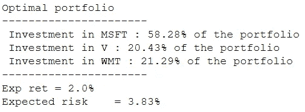

# 延伸问题

不用说，我们模型的设置和简化假设会使这个问题听起来比实际情况更简单。但是一旦您理解了解决这种优化问题的基本逻辑和机制，您就可以将其扩展到多种场景，

*   数百只股票，更长时间范围的数据
*   多重风险/回报比率和阈值
*   最小化风险或最大化回报(或两者兼而有之)
*   一起投资一组公司
*   非此即彼的情景——要么投资 Cococola，要么投资百事可乐，但不能两者都投资

你必须构建更复杂的矩阵和更长的约束列表，使用指示变量将这变成一个****-**混合整数问题，但所有这些都是 CVXPY 这样的包所固有的支持。**

**[查看 CVXPY 包](https://www.cvxpy.org/examples/index.html)的示例页面，了解使用该框架可以解决的优化问题的广度。**

# **摘要**

**在本文中，我们讨论了如何从一个开创性的经济理论的关键概念可以用来制定一个简单的股票市场投资优化问题。**

**为了说明这一点，我们选取了三家公司的月平均股价样本数据集，并展示了如何使用基本的 Python 数据科学库(如 NumPy、Pandas)和一个名为 CVXPY 的优化框架来快速建立线性规划模型。**

> ****拥有这种灵活而强大的软件包的工作知识为未来的数据科学家的技能组合增加了巨大的价值，因为解决优化问题的需求出现在科学、技术和商业问题的所有方面。****

**鼓励读者尝试这个投资问题的更复杂版本，以获得乐趣和学习。**

**#数据科学，#编程，#统计**

****

**如果您有任何问题或想法要分享，请通过[**tirthajyoti【AT】Gmail . com**](mailto:tirthajyoti@gmail.com)联系作者。此外，您可以查看作者的 [**GitHub**](https://github.com/tirthajyoti?tab=repositories) **资源库**中其他有趣的 Python、R 或 MATLAB 代码片段和机器学习资源。如果你像我一样对机器学习/数据科学充满热情，请随时[在 LinkedIn 上添加我](https://www.linkedin.com/in/tirthajyoti-sarkar-2127aa7/)或[在 Twitter 上关注我。](https://twitter.com/tirthajyotiS)**

** [## Tirthajyoti Sarkar - Sr .首席工程师-半导体、人工智能、机器学习- ON…

### 佐治亚理工学院理学硕士- MS，分析这一 MS 计划传授理论和实践…

www.linkedin.com](https://www.linkedin.com/in/tirthajyoti-sarkar-2127aa7/)**