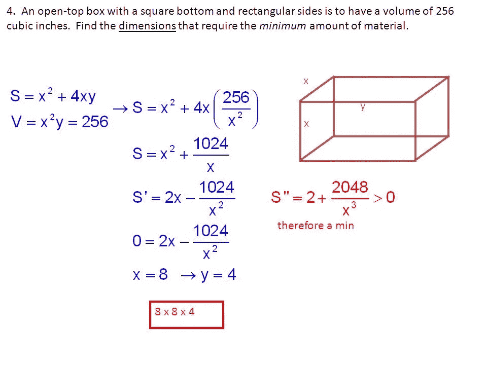
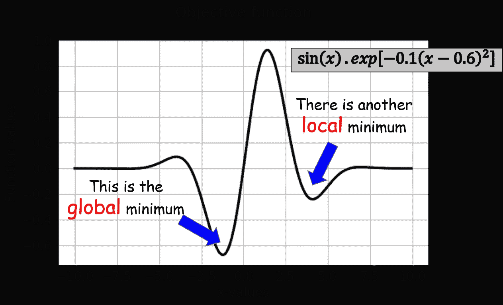
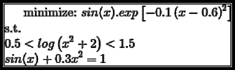
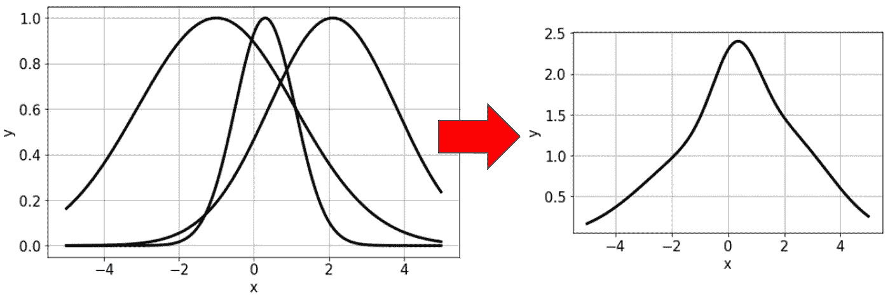
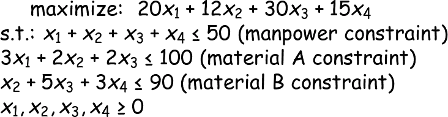
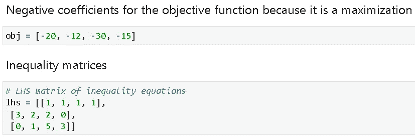
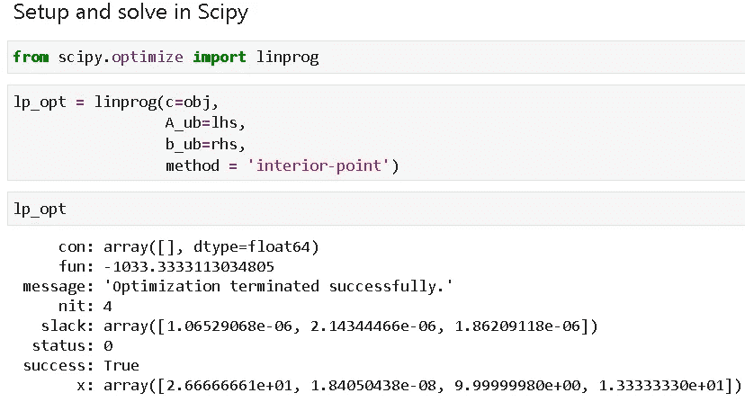
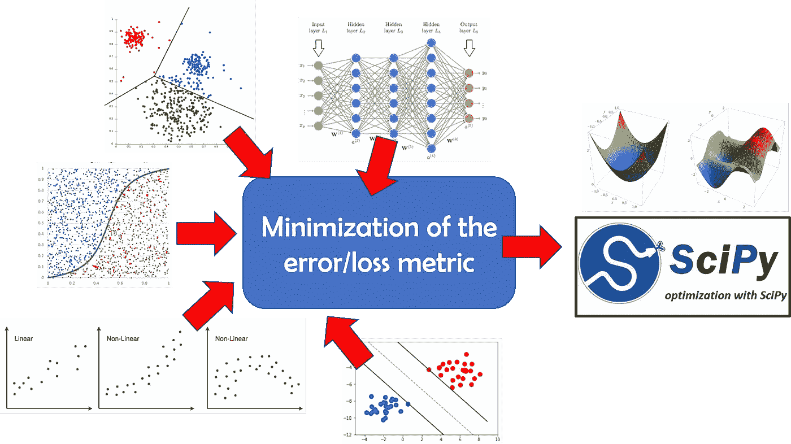
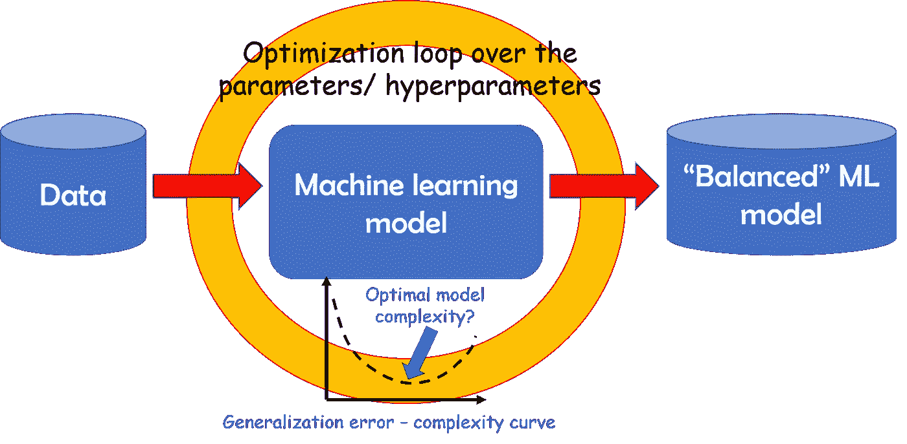
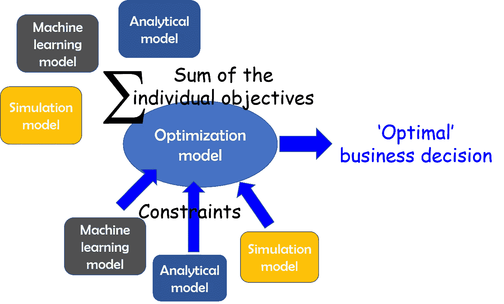

# SciPy 优化及其在机器学习中的应用

> 原文：<https://towardsdatascience.com/optimization-with-scipy-and-application-ideas-to-machine-learning-81d39c7938b8?source=collection_archive---------5----------------------->

## 对于各种各样的业务和技术流程来说，优化通常是最终的边界，需要被征服才能交付真正的价值。我们展示了如何使用 Python 中最流行的科学分析包 SciPy 进行优化，并讨论了在机器学习领域的独特应用。


# 介绍

你可能还记得高中时代的一个简单的微积分问题——在给定一个盒子的体积限制的情况下，找出建造一个盒子所需的最少材料。



够简单吗？

思考一下这个问题，并认识到这里应用的相同原理在复杂、大规模的商业和社会问题中广泛使用，这是有益的。

仔细看上面的问题。约束是固定的体积。**把它想成一个商业可交付成果**(也就是对客户的承诺)。

但是问题的目标是找到所需的(就表面积而言)的*最小材料。**认为这与生产商的利润率有关**(需要的材料越少，相同售价的生产成本越低，因此利润率更高)。*

数学优化是解决工程、金融、医疗保健和社会经济事务中主要商业问题的核心。几乎所有的商业问题都可以归结为某种资源成本的最小化或给定其他约束条件下某种利润的最大化。

优化过程也是运筹学的灵魂，运筹学[与现代数据驱动的商业分析](http://analytics-magazine.org/what-is-analytics-and-how-does-it-relate-to-operations-research/)密切相关。以这种方式，它也与数据科学管道密切相关，几乎在今天的所有业务中使用。

虽然已经有很多关于数据科学项目的数据争论和预测建模方面的文章，但最终的前沿通常涉及使用数据驱动模型解决优化问题，这些模型可以通过降低成本或提高生产力来提高业务的底线。

[](https://medium.com/analytics-vidhya/why-a-business-analytics-problem-demands-all-of-your-expertise-at-once-1290170808c4) [## 为什么业务分析问题需要您所有的数据科学技能

### 对于现实生活中的业务问题，数据驱动分析的现代实践总是一个复杂的混合体…

medium.com](https://medium.com/analytics-vidhya/why-a-business-analytics-problem-demands-all-of-your-expertise-at-once-1290170808c4) 

除了纯粹的商业驱动动机，优化的主题本身也值得研究，因为它是所有**机器学习** (ML)算法的核心，从**简单线性回归**一直到**深度神经网络**。理解优化问题的各种算法、限制和公式化可以产生有效解决 ML 问题的有价值的洞察力。

[](/a-quick-overview-of-optimization-models-for-machine-learning-and-statistics-38e3a7d13138) [## 下面是什么？机器学习的核心是优化

### 我们展示了最流行的机器学习/统计建模技术背后的核心优化框架。

towardsdatascience.com](/a-quick-overview-of-optimization-models-for-machine-learning-and-statistics-38e3a7d13138) 

因此，对于一名数据科学家来说，学习解决优化问题的基本工具和框架以产生实际影响是必不可少的。

# Python 和 SciPy 用于优化

Python 已经成为分析、数据科学和机器学习的事实上的通用语言。因此，在 Python 生态系统中讨论优化包和框架是有意义的。

[](https://www.netguru.com/blog/how-did-python-become-the-language-of-choice-for-data-science) [## Python 是如何成为数据科学的首选语言的？

### 多年来，R 一直是那些进入数据科学领域的人的显而易见的选择。近年来，有些事情发生了变化…

www.netguru.com](https://www.netguru.com/blog/how-did-python-become-the-language-of-choice-for-data-science) 

在我之前的帖子中，我已经涵盖了使用 Python 的 [**线性规划**](/linear-programming-and-discrete-optimization-with-python-using-pulp-449f3c5f6e99) 和其他 [**离散优化方法论**](/optimization-with-python-how-to-make-the-most-amount-of-money-with-the-least-amount-of-risk-1ebebf5b2f29) 并介绍了强大的包，如[纸浆](https://pythonhosted.org/PuLP/)和 [CVXPY](https://www.cvxpy.org/) 。

在这篇文章中，我将介绍 SciPy 生态系统中可用的[优化算法。SciPy 是用于科学和数学分析的最广泛使用的 Python 包，难怪它拥有强大而易用的优化例程来解决复杂的问题。](https://docs.scipy.org/doc/scipy/reference/tutorial/optimize.html)

相关的示例代码可以在[作者的 GitHub 资源库](https://github.com/tirthajyoti/Optimization-Python)中找到。

# 开始简单—单变量标量优化

我们从一个简单的标量函数(一个变量)最小化的例子开始。假设，我们想要最小化下面的函数，它绘制在 *x* = -10 到 *x* = 10 之间。该函数如下所示。在函数域内，它有一个全局最小值和一个局部最小值。



定义该函数的代码是，

```
def scalar1(x):
    return np.sin(x)*np.exp(-0.1*(x-0.6)**2)
```

用 SciPy 确定全局最小值的代码非常简单。在这种情况下，我们可以使用`**minimize_scalar**`函数。

```
from scipy import optimize
result = optimize.minimize_scalar(scalar1)
```

就是这样。信不信由你，优化完成了！我们可以打印出结果对象，以获得更多有用的信息。

```
print(result)>> fun: -0.6743051024666711
   nfev: 15
   nit: 10
   success: True
   x: -1.2214484245210282
```

达到最小值的值存储在`result['x']`变量中。

```
print("Minimum occurs at: ",result['x'])
>> Minimum occurs at:  -1.2214484245210282
```

剩余量产生关于函数求值次数、迭代次数、解的状态(成功与否)以及最终解的函数值的信息。

# 如果变量是有界的呢？

上面的代码实现了所谓的无约束/无界优化，即没有对问题施加任何类型的限制。然而，大多数实际优化问题涉及复杂的约束。一个简单的例子是约束自变量( *x* )。

正如我们看到的，这个函数有两个极小值，如果我们只考虑 *x* 的正值，结果会不同。使用 bound 进行搜索的代码与上面的代码略有不同。

```
result = optimize.minimize_scalar(scalar1, bounds = (0,10),method='Bounded')
```

因此，我们必须用一个合适的包含最小和最大边界的元组传递`**bounds**`参数，并使用`**method='Bounded'**`参数。

```
print("When bounded between 0 and 10, minimum occurs at: ",result['x'])>> When bounded between 0 and 10, minimum occurs at:  4.101466164987216
```

# 引入其他功能约束

在这个问题中，我们可能有其他复杂的约束。假设，我们希望满足以下条件以及找到全局最小值的目标。



注意，其中一个是**不等式**，另一个是**等式**约束。

## 将约束作为函数放入字典中

SciPy 允许通过更通用的方法`**optimize.minimize**`处理任意约束。约束必须按照特定的语法写在 Python 字典中。不等式约束需要分解成形式为 ***f(x) < 0*** 的单个不等式。下面的代码演示了这个想法。

## 选择合适的方法

之后，我们可以通过选择支持约束的合适方法来运行优化(**函数** `**minimize**` **中并非所有方法都支持约束和界限**)。这里我们选择 SLSQP 方法，代表 [**序列最小二乘二次规划**](https://en.wikipedia.org/wiki/Sequential_quadratic_programming) 。

## 初步猜测和第一次试运行

此外，为了使用`minimize`，我们需要以`x0`参数的形式传递一个**初始猜测**。假设，我们通过`x0=0`进行试运行。

```
result = optimize.minimize(scalar1,x0=0,method='SLSQP',
constraints=cons,options={'maxiter':1000})
```

## 失败！

如果我们打印结果，我们会看到与简单的无约束优化结果不同的东西。

```
fun: 0.7631695862891654
jac: array([0.59193639])
message: 'Iteration limit exceeded'
nfev: 1254
nit: 101
njev: 101
status: 9
success: False
x: array([0.8773752])
```

优化参数 **success: False** 表示没有成功达到全局最小值。消息为**“迭代限制超过**”，即它尝试了 101 次迭代，但无法达到最小值。

## 但是，为什么呢？

答案在于数学优化(和相关算法)的深层理论，但可以说最初的猜测起了很大的作用。一般来说，非凸优化问题没有成功解决的数学保证，我们这里的问题的本质是非凸的。要了解更多关于最优化问题的凸性，请看这个视频，

## 怎样才能提高优化(搜索)？

一般情况下，我们做不了多少。然而，在这个玩具例子中，我们已经有了函数的图形，并能看到最优解。因此，我们可以给算法一个更好的初始猜测。我们给`**x0=-2**`。

```
result = optimize.minimize(scalar1,x0=-2,method='SLSQP',
constraints=cons,options={'maxiter':100})
```

现在结果是有利的！

```
fun: -0.2859494456768613
jac: array([-0.4675066])
message: 'Optimization terminated successfully.'
nfev: 811
nit: 71
njev: 67
status: 0
success: True
x: array([-2.37569791])
```

## 迭代次数呢？

如果我们限制算法执行的迭代次数会怎么样？仅出于演示目的，我们将迭代次数严格限制为 3 次。

```
result = optimize.minimize(scalar1,x0=-20,method='SLSQP',
constraints=cons,options={'maxiter':3})
```

不出所料，结果并不令人满意。

```
fun: -0.4155114388552631
jac: array([-0.46860977])
message: 'Iteration limit exceeded'
nfev: 12
nit: 4
njev: 4
status: 9
success: False
x: array([**-2.10190632**])
```

请注意，优化接近全局最小值，但没有完全达到——当然，这是因为不允许迭代足够的次数。

## **为什么考虑这一点很重要？**

这是因为每次迭代等于**计算(有时不是计算而是实际物理)成本**。

> 这是优化过程的一个业务方面。在现实生活中，如果单个函数评估耗费大量资源，我们可能无法长时间运行优化。

当优化不涉及简单的数学评估，而是涉及复杂、耗时的模拟或成本和劳动密集型实验时，就会出现这种情况。

> 当每次评估都要花费金钱或资源时，那么不仅算法的选择，而且更精细的细节都变得需要考虑。

# 变得更复杂—多变量函数

尽管我们在前面的章节中考虑了解决一个标准优化问题的所有基本方面，但是这个例子由一个简单的单变量分析函数组成。

但事实并非如此！

SciPy 方法适用于任何 Python 函数，不一定是封闭形式的一维数学函数。

让我们展示一个多值函数的例子。

## 高斯混合的最大化

通常在一个化学或制造过程中，多个随机子过程被组合起来产生一个**高斯混合**。可能需要通过**选择单个子过程**中的最佳操作点来最大化最终的合成过程输出(在一定的过程限制内)。



诀窍是**使用一个向量作为目标函数**的输入，并确保目标函数仍然返回单个标量值。此外，因为这里的优化问题是关于目标函数的最大化，我们需要**改变符号并返回高斯函数和的负数**作为目标函数的结果。

同样的`result['x']`将单个程序的最佳设置存储为一个向量。这就是优化单值函数和多元函数的唯一区别，我们得到的是一个向量，而不是一个标量。

```
x: array([-1.00017852,  0.29992313,  2.10102748])
```

## 有界输入

不用说**我们可以改变这里的界限来反映实际的约束**。例如，如果子过程设置只能占用一定范围的值(一些必须是正的，一些必须是负的，等等。)那么解决方案将略有不同—它可能不是全局最优的。

这里，解决方法如下。这表示将第三个子过程设置推至最大可能值(零)，同时适当调整其他两个子过程设置。

```
x: array([-1.00000644e+00,  3.00115191e-01, -8.03574200e-17])
```

多变量优化的约束处理方式类似于单变量优化。

## 更详细的文档和示例

SLSQP 并不是 SciPy 生态系统中唯一能够处理复杂优化任务的算法。有关更详细的文档及其用法，请参见以下链接:

*   [优化和求根(scipy.optimize)](https://docs.scipy.org/doc/scipy/reference/optimize.html#module-scipy.optimize)
*   [科学优化(TutorialsPoint)](https://www.tutorialspoint.com/scipy/scipy_optimize.htm)
*   [实用优化套路](https://people.duke.edu/~ccc14/sta-663/BlackBoxOptimization.html)

# 用 Scipy 进行线性编程

简单、直接的线性规划(LP)问题也可以通过 Scipy 解决。在 2014 年之前，它没有内置的 LP 求解器，但从那时起它已经发生了变化。

让我们举一个实际的工厂生产问题(借用了[这个例子](https://realpython.com/linear-programming-python/)并略有改动)

一个工厂生产四种不同的产品，第一种产品的日产量是 *x1* ，第二种产品的日产量是 *x2* ，以此类推。目标是确定每种产品的利润最大化日产量，有以下约束条件:

*   第一个、第二个、第三个和第四个产品的单位产品利润分别是 20、12、30 和 15。
*   由于人力的限制，每天生产的总数量不能超过五十(50)。
*   对于每单位的第一种产品，消耗三单位的原材料 A。第二种产品的每单位需要两个单位的原料 A 和一个单位的原料 b。第三种产品的每单位需要两个单位的 A 和五个单位的 b。最后，第四种产品的每单位需要三个单位的 b。
*   由于运输和储存的限制，工厂每天可以消耗一百单位的原材料 A 和九十单位的 B。



在 Scipy 中设置这个问题很容易。



然后用一行代码解决它，



所以，解决方案说，

*   工厂每天应生产 26.66 台 *x1* ，10 台 *x3* ，13.33 台 *x4* 。与 *x2* 相对应的极小数字实质上表示不应该产生任何数量的 *x2* 。
*   在这种安排下，可获得的最大利润是 1033.33 美元。

值得注意的一点是，该解决方案表示分数选择，这在实际情况下可能不可行。这就是 Scipy solver 的局限性，它不能解决所谓的整数规划问题。其他 Python 包如 PuLP 可能是解决这类问题的一个选择。在这里看我的文章。

[](/linear-programming-and-discrete-optimization-with-python-using-pulp-449f3c5f6e99) [## 用 Python 实现线性规划和离散优化

### 线性和整数规划是离散优化的关键技术，它们在现代数学中随处可见

towardsdatascience.com](/linear-programming-and-discrete-optimization-with-python-using-pulp-449f3c5f6e99) 

# 将该过程扩展到机器学习领域

老实说，只要您能够定义一个合适的目标函数来生成一个标量值以及与实际问题场景相匹配的合适的边界和约束，那么您可以推动这种方法的复杂程度是没有限制的。

## 机器学习中的误差最小化

几乎所有机器学习(ML)算法的关键是定义合适的误差函数(或损失度量)，迭代数据，并找到最小化总误差的 ML 模型参数的最佳设置。通常，误差是模型预测和实际情况(给定数据)之间某种距离的度量。



因此，完全可以使用 SciPy 优化例程来解决 ML 问题。

> 这使您能够深入了解算法的实际工作，因为您必须自己构建损失度量，而不依赖于一些现成的开箱即用的函数。

## ML 中超参数优化

调整 ML 模型的参数和超参数通常是一项麻烦且容易出错的任务。虽然有网格搜索方法可用于搜索最佳参数组合，但通过在参数空间上运行优化循环**，可以轻松引入一定程度的自动化。在这种情况下，目标函数必须是 ML 模型预测质量的某种度量(例如，均方误差、复杂性度量或 F1 分数)。**



## 使用机器学习作为函数评估器

在许多情况下，你不可能有一个好的、封闭形式的分析函数来作为优化问题的目标。

但是当我们有了深度学习的时候，谁会在乎变好呢？

想象一下**的威力，一个由众多模型**(针对其目标函数和约束条件)提供的优化模型——在基本性质上不同，但在输出格式上是标准化的，因此它们可以协调一致地行动。

> 你可以自由选择一个解析函数，一个深度学习网络(也许是作为回归模型)，甚至是一个复杂的仿真模型，把它们一起扔进优化的坑里。

可能性是无限的！



如果您有任何问题或想法要分享，请联系作者在[**tirthajyoti【AT】Gmail . com**](mailto:tirthajyoti@gmail.com)。另外，你可以查看作者的 [**GitHub**](https://github.com/tirthajyoti?tab=repositories) **资源库**中其他有趣的 Python、R 或 MATLAB 代码片段和机器学习资源。如果你像我一样对机器学习/数据科学充满热情，请随时[在 LinkedIn 上添加我](https://www.linkedin.com/in/tirthajyoti-sarkar-2127aa7/)或[在 Twitter 上关注我。](https://twitter.com/tirthajyotiS)

[](https://www.linkedin.com/in/tirthajyoti-sarkar-2127aa7/) [## Tirthajyoti Sarkar - Sr .首席工程师-半导体、人工智能、机器学习- ON…

### 佐治亚理工学院理学硕士- MS，分析这一 MS 计划传授理论和实践…

www.linkedin.com](https://www.linkedin.com/in/tirthajyoti-sarkar-2127aa7/)