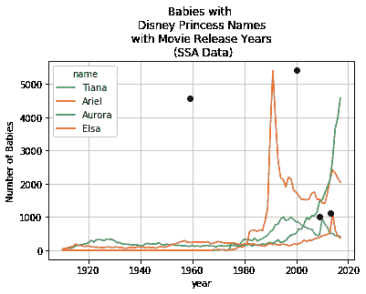
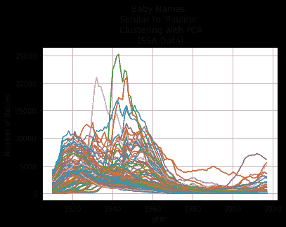

# 利用特征工程优化数据科学模型

> 原文：<https://towardsdatascience.com/optimize-data-science-models-with-feature-engineering-cluster-analysis-metrics-development-and-4be15489667a?source=collection_archive---------22----------------------->

## 聚类分析、指标开发和婴儿姓名数据的 PCA

正如婴儿名字的文章是即将为人父母者的必读之作一样，美国社会保障(SSA)的婴儿名字数据集应该是初露头角的数据科学家的必修课。数据集可以用许多不同的方式分割，包括语言、基于时间的方法和创造性问题的素材。这是一个健康的基于频率的数据集，具有很长的时间线。例如，网站分析工具统计独立用户的访问次数，零售销售点系统统计按颜色销售的产品，银行跟踪一个月内拖欠的贷款数量。本文是关于频率数据集的特征工程教程，其中特征工程的目标是提取每个名称的特征，并发现名称随时间变化的趋势之间的关系。

[http://unsplash.com/](http://unsplash.com/)

我开始探索名字来寻找选择。首先，我假设随着时间的推移，趋势捕捉到了父母选择某些名字的内在品质和社会态度。婴儿名字的趋势能够解释很多关于社会偏好的问题，参见婴儿名字的交叉相关性 [NCBI 文章](https://www.ncbi.nlm.nih.gov/pmc/articles/PMC4491744/)。同样，当你知道某人的名字时，你很可能知道那个人的年龄，见*当你只知道某人的名字时，如何说出她的名字，*[fivethirtyeeight 文章](https://fivethirtyeight.com/features/how-to-tell-someones-age-when-all-you-know-is-her-name/)。

我自己关于名字的问题:*哪些美国名字与我过去的名字 Pauline 最相似？*

我根据旧的时尚假设创建了一个功能列表。这意味着类似的名字将在 20 世纪初达到流行的顶峰，在过去的 50 年左右的时间里不会再出现。然后，我使用峰值检测和频率指标从 SSA 数据中手动提取这些特征。这些被称为“手动”特征。然后，我使用主成分分析(PCA)中的手动特征和趋势来创建“自动”特征。

最后，我使用这些自动化的、手动的和组合的特性比较了聚类分析结果。聚类是一种用相似性度量将对象分组在一起的方法。数据科学方法在汇集相似事物方面有着坚实的记录。例如，产品推荐算法通过购买历史和/或人口统计数据来识别像您这样的人，或者确定彼此最常购买的产品(例如，番茄酱和薯条)。

**从 SSA 数据集创建的“手动”特征列表:**

1.  相似的名字不会不处于或接近它的流行度的峰值(峰值检测)，
2.  类似的名字在美国比较晦涩(量和加速度)，
3.  相似的名字不要太独特(数量)，而且
4.  相似的名字是主观愉悦的(不可量化)。

数据集、Python 代码和分析可在公共和交互式 Kaggle 笔记本中获得:[https://www . ka ggle . com/Pauline chow/baby-names-optimize-w-feature-engineering](https://www.kaggle.com/paulinechow/baby-names-optimize-w-feature-engineering)

# 什么特征会产生“最好”的婴儿名字短列表？

## 婴儿名字度量:峰值检测、加速度和等级

SSA 的名字数据追踪了从 1910 年到 2017 年名字的使用频率。姓名频率按年份和性别进行汇总和分组。在笔记本中，第 1 至 3 部分是数据的一般检查，包括数据的抽样、测试统计、大小和形状。该笔记本根据最受欢迎程度、年复一年的变化以及过去 3 年中最受欢迎的 500 个名字的出现情况来创建分类指标。笔记本的第 4 部分介绍了创建、组合和分析这些指标的步骤。

*(1)峰值人气检测*

每一个名字都有高点(“峰值”)和低点(“谷值”)与自身和全球进行比较，以提供重要信息。例如,“伯莎”和“珍妮”这两个名字分别在 1920 年代和 1970 年代达到了最流行的程度，从那以后就逐渐减少了。从巅峰时期开始，伯莎就一直在稳步下降，而珍妮和詹妮弗在 20 世纪 40 年代至 70 年代稳定下降之前是强有力的竞争者。

在我孩子的一生中，她同龄人的名字将会很流行。一个假设是，如果名字相对于当前群体之前的人口达到显著峰值，并且目前处于减速趋势，那么名字就不太可能再次流行。峰值检测与了解当前加速度或年同比变化相结合，有助于缩小符合当前要求的名称范围。

峰值检测还会返回信息来创建指标。

峰值检测用于数字信号处理和语音识别，以在固定和实时数据中找到局部最小值和最大值。对于姓名，峰值检测可以将姓名与事件、人物和文化联系起来。这里，利用峰值检测来确定最近 5 年、10 年、15 年、20 年和 25 年内的任何峰值，这些峰值作为分类特征保存在数据集中。

在这个笔记本中，波峰和波谷是用一种简单和复杂的方法检测出来的。

(a)峰值检测最直接的方法是计算连续周期之间的符号变化。两个周期之间从正到负的符号变化表示从峰值开始下降。简单算法返回与前一个元素相比减少的索引。 **peak_detection_simple 函数**的输入数据是一个值列表，例如年度或 5 年滚动平均值。此列表的计算在函数返回索引之前完成。

下面简单的峰值检测函数计算连续时间段之间的差值，并返回符号变化的次数。符号变化被定义为从正到负的运动，并且不区分峰值的幅度或时间长度。

这种简单的方法缺乏纵观一个名字的大趋势的能力。这个简单函数的结果引发了一些问题:如果一个名字在一个“峰值”上花了更多的时间会怎么样？我们应该聚集非常接近的相似峰值吗？从正 a 峰到负 a 峰的哪些波动是显著的？从顶峰倾斜或下降的斜率是否有一个阈值？

(b) Scipy 是一个开放源代码的科学计算软件包，提供数学、科学和工程方面的内置功能。该软件包提供了识别峰值的功能，并且通过附加参数可以进一步区分，参见 [scipy.signal.find_peaks](https://docs.scipy.org/doc/scipy/reference/generated/scipy.signal.find_peaks.html) 。 **scipy find_peaks 函数**提供了定义峰的绝对最小值和最大值(高度)、设置峰的最小垂直(阈值)和水平(距离)测量值以及峰的相对强度(突出度)的选项。

*(2)年复一年(或任何时间段)的加速或同比变化*指标是分析和报告环境中的标准。比较的时间周期越长，输出中标准化的季节性因素就越多。在 python pandas 中，计算 x 年之间的百分比变化会创建最近 x 年加速率的代理。基于不同时期的名称创建了许多特征。

*(3)500 强排名名称指标*

创建一个分类变量来标记一个名称在过去 3 年中是否排在前 500 名列表中。该指标是一种防止使用实际排名赋予过多权重的方法，即使我们扩大了这个数字。可以将此指标更改为聚合或多或少的年份，收集每年的所有前 X 个名称，并对按州分组的名称进行排名。

一份过去 3 年中排名前 500 名的名单将在以后从最终名单中筛选名字时派上用场。

## 主成分分析(PCA)的特征

仅凭频率很难预测名字的受欢迎程度。模式不一定是可辨别的，因为灵感是随机的。父母可能会受到迪斯尼电影、公众人物或个人生活事件的影响。一项使用婴儿名字作为美国文化特征指标的研究表明，新名字是发明的，而不是使用过去几代人的名字。[婴儿名字的交叉相关性](https://www.ncbi.nlm.nih.gov/pmc/articles/PMC4491744/)代替手动提取指标，整个趋势可以被分解成解释每个趋势的变化的特征。PCA 变换 PCA 背后的数学原理在这里[解释](https://medium.com/@aptrishu/understanding-principle-component-analysis-e32be0253ef0)。

用 25 个成分运行 PCA，结果显示 3 个和 10 个成分分别累计解释了数据中 80%和 99%的方差。可以在 PCA 结果之前设置累积方差的阈值，尤其是在数据集非常大的情况下。利用主成分分析作为降维技术可以节省计算时间。或者，为后续分析选择的组件数量可以取决于最终模型的结果。这意味着模型可以通过数据输入进一步优化，在这种情况下，它将是组件的数量。

笔记本的第 5 部分转换了功能，并对 4 个和 10 个组件进行了聚类分析。在这种分析中，考虑名称之间的更多差异能够更清晰地将名称划分到聚类中。这里利用的组件越多，最终的聚类轮廓得分就越好。优化聚类质量的结果最符合期望的结果。

## 使用 k 均值查找聚类

我选择了 Kmeans 聚类分析，这是一种更一般化的姓名分组方法。Kmeans 聚类用于将姓名(观察值)分组为 n 个簇，其中每个姓名被分配给具有最近平均值的簇。聚类的质量可以用剪影分数来度量，范围从-1 到+1，剪影分数确定其自身聚类内以及与其他聚类相比较的观察值的内聚性。

手动、自动和组合数据集的聚类数是根据与 Pauline 相同的聚类中的姓名计数来选择的。

## 结果婴儿名单

婴儿名字列表的结果是有希望的，因为我们能够从数千到不到 200 个名字。具有手动和自动特征的聚类生成的列表分别包含 155 和 57 个名字。两个名单共有 37 个名字(交叉)。一个集合了人工和自动特征的混合数据集产生了最短的 47 个名字的列表。PCA 特征(自动)识别较少的姓名，但是“遗漏”了由手动特征挑选的潜在姓名。

对于父母来说，为梳理 155 个名字创造一个永远的名字是一个可以接受的任务。我不需要进一步推敲。这与企业形成对比，在企业中，将产量提高两倍可能会导致运营和实质性问题。

特征工程既是一门艺术也是一门科学。聚类分析将产生满足要求的分组，要求越多意味着分组越严格。自动功能更准确地反映了一段时间的趋势。手动特性捕获了内在化的规则或假设，但是导致了大量的噪音。当仅仅依靠自动特性时，感觉就像分析的创造性方面丢失了。我们可以看到特征工程的艺术通过混合数据悄悄渗透到结果中。以下是使用不同功能集生成的名称示例。

这两套特性的完整列表可以从 Jupyter 笔记本上下载。以下是从名单中随机选择的 10 个名字:

关于这些数据，您可以问更多的问题:

*   我们还能从 SSA 数据集中得出什么其他指标？
*   SSA 数据集中的男性名字也有类似的趋势和见解吗？
*   聚类分析的哪些属性可以优化以找到相似的名字？此分析仅探究 k 均值分析的聚类数量。如果使用基于连接性或分布的聚类而不是基于质心的聚类会怎样？

*阅读 www.fountainofdata.com*[*上的其他数据科学帖子。*](http://www.fountainofdata.com.) *Kaggle 笔记本有代码可用* [*此处*](https://www.kaggle.com/paulinechow/baby-names-optimize-w-feature-engineering) *。借助***上传加载。*照片由[尹新荣](https://unsplash.com/photos/iioAHjNYA_o?utm_source=unsplash&utm_medium=referral&utm_content=creditCopyText)在 [Unsplash](https://unsplash.com/search/photos/baby?utm_source=unsplash&utm_medium=referral&utm_content=creditCopyText) 上拍摄*