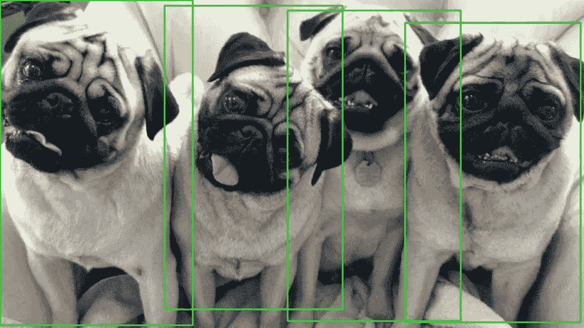
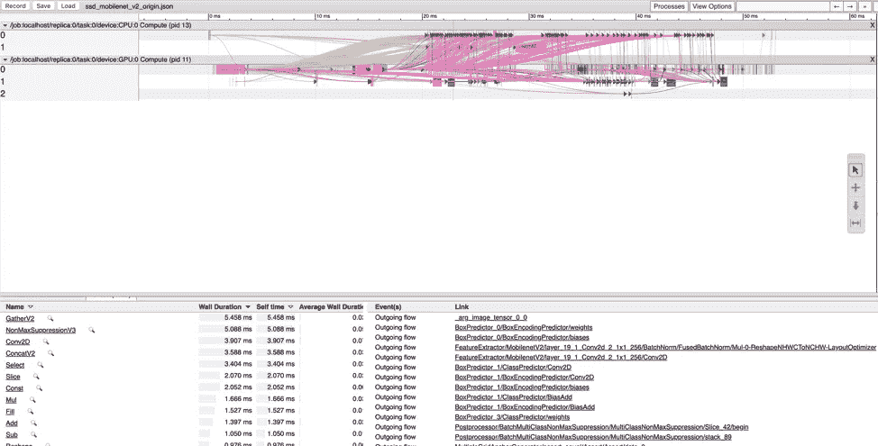
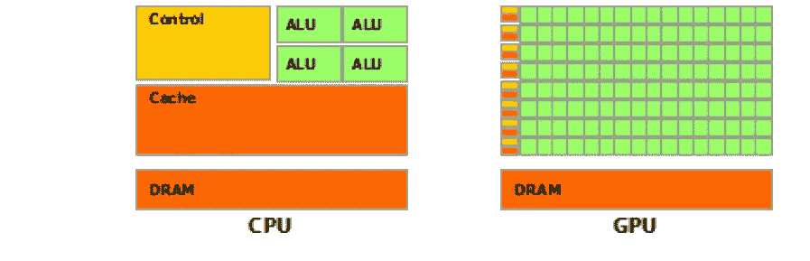
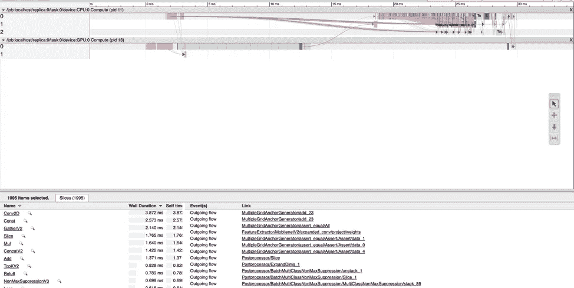
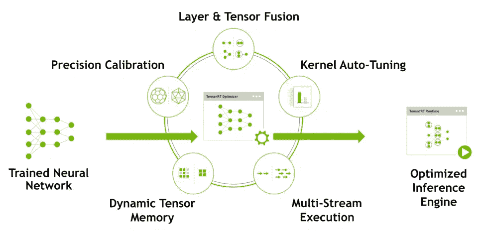
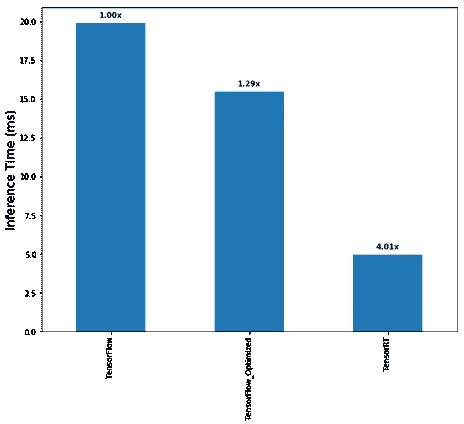

# 优化 NVIDIA GPU 性能，实现高效的模型推断

> 原文：<https://towardsdatascience.com/optimize-nvidia-gpu-performance-for-efficient-model-inference-f3e9874e9fdc?source=collection_archive---------5----------------------->

Image from [https://www.cgdirector.com/best-hardware-for-gpu-rendering-in-octane-redshift-vray/](https://www.cgdirector.com/best-hardware-for-gpu-rendering-in-octane-redshift-vray/)

GPU 已被证明是加速计算机视觉和自然语言处理(NLP)等深度学习和人工智能工作负载的有效解决方案。现在，许多基于深度学习的应用程序在其生产环境中使用 GPU 设备，如 NVIDIA Tesla 用于数据中心，Jetson 用于嵌入式平台。这就带来了一个问题:如何从你的 NVIDIA GPU 设备中获得最佳的推理性能？

在本文中，我们将一步一步地展示我们如何优化预训练的 TensorFlow 模型，以改善支持 CUDA 的 GPU 上的推理延迟。在我们的实验中，我们使用 SSD MobileNet V2 进行目标检测。我们在 Colab 上进行实验。所有重现结果的源代码和指令都可以在[本笔记本](https://colab.research.google.com/drive/10ah6t0I2-MV_3uPqw6J_WhMHlfLflrr8)中找到。本文组织如下:

1.  在 TensorFlow 中下载并运行原始模型
2.  通过与 CPU 协作优化模型
3.  使用 TensorRT 优化模型
4.  比较和结论

TL；速度三角形定位法(dead reckoning)

我们将 Colab GPU 实例上的推理时间改进为:

1.  通过将控制流操作放在 CPU 上，提高了 1.3 倍
2.  通过转换预训练的 TensorFlow 模型并在 TensorRT 中运行，可提高 4.0 倍

**第 0 步:下载并运行 TensorFlow 中的 origin 模型**

我们首先从[tensor flow Detection Model Zoo](https://github.com/tensorflow/models/blob/master/research/object_detection/g3doc/detection_model_zoo.md)下载 SSD MobileNet V2 预训练模型，该模型提供了一组在 COCO 数据集上训练的预训练模型。

在这个解压缩的文件夹中，我们可以找到以下文件:

*   `frozen_inference_graph.pb`是针对任意图像和批次大小的冻结推理图
*   `pipeline.config`包含用于生成模型的配置
*   `model.ckpt.*`包含预先训练好的模型变量
*   `saved_model`文件夹包含 TensorFlow *SavedModel* 文件

然后，我们使用 [TensorFlow 对象检测 API](https://github.com/tensorflow/models/tree/master/research/object_detection) 导出模型。这允许我们固定批量大小和图像大小。对于这个实验，我们使用 300x300 的图像作为输入，批量大小为 1。因此，我们的输入形状是`[1, 300, 300, 3]`。

现在我们已经准备好运行模型了。我们首先从互联网上下载输入图像，并预处理成所需的形状。然后，我们使用 TensorFlow 加载模型并执行推理。请注意，我们添加了`options`和`run_metadata`来记录分析数据，以便进一步分析。

最后，我们执行健全性检查以确保模型做出有意义的推断。注意，SSD MobileNet V2 模型将图像阵列作为每个检测到的对象的输入和输出绑定框`[xmin, ymin, xmax, ymax]`。我们使用输出来绘制结合框，并得到以下结果。

Detection result we get from previous run

这个结果听起来很合理。因此，我们可以相信我们的模型工作正常。现在，我们准备分析性能。我们将使用 Chrome 的跟踪工具来分析模型。打开 Chrome 浏览器，输入网址`chrome://tracing`。拖动我们从上一个脚本中得到的时间轴 JSON 文件，然后我们可以看到下面的界面。

Inference timeline trace for origin SSD MobileNert V2

从上面的跟踪中，您可能会注意到一些操作是在 CPU 上运行的，即使我们告诉 TensorFlow 在 GPU 上运行所有这些操作。这是因为 TensorFlow 没有为这些操作注册 GPU 内核(例如`NonMaxSuppressionV3`)。由于这些操作无法在 GPU 上处理，TensorFlow 必须将中间输出从 GPU 内存传输到 CPU 内存，在 CPU 上处理，并将结果传输回 GPU，然后继续进行。从图中可以看出，这种情况发生了很多次。结果，我们的程序在数据传输上花费了太多时间，变得更慢。

此外，从图表的底部，我们可以看到每种类型的操作的时间成本。花费时间最多的前 3 项操作是`GatherV2`、`NonMaxSuppressionV3`和`Conv2D`。当它对`Conv2D`有意义时，因为 MobileNet V2 严重依赖它，并且计算量很大，它对其他人没有意义。我们将在下一节中解决这些问题并优化我们模型的推理性能。

**第一步:与 CPU 合作优化模型**

许多人认为 GPU 比 CPU 快——这就是为什么我们使用 GPU 来加速我们的程序。然而，这只是部分正确。为了解释这一点，我们需要了解一点 GPU 是如何工作的。

> CPU 和 GPU 之间浮点能力的差异背后的原因是 GPU 专门用于计算密集型、高度并行的计算，这正是图形渲染的目的，因此设计了更多的晶体管用于数据处理，而不是数据缓存和流控制，如下图所示:

CPU vs. GPU structure, reference from [CUDA Toolkit documentation](https://docs.nvidia.com/cuda/cuda-c-programming-guide/index.html#from-graphics-processing-to-general-purpose-parallel-computing)

因此，对于可以并行处理的操作，如矩阵乘法，GPU 比 CPU 快得多。然而，由于 GPU 具有较少的用于流控制和高速缓存的晶体管，这可能不是流控制操作的情况(例如，`if`、`where`、`while`等)。).

我们在 CPU 和 GPU 上运行时间开销最高的 5 个操作(除了`NonMaxSuppressionV3`，因为它只能在 CPU 上处理),并比较它们的性能，我们得到以下结果:

我们可以看到，对输入数据进行矩阵乘法和加法运算的`Conv2D`，在 GPU 上的运行速度比预期快了~ 10 倍。但是对于`GatherV2`、`ConcatV2`和`Select`这些访问内存给定索引的，CPU 的表现都优于 GPU。因此，我们可以通过简单地将这些操作放在 CPU 上来提高我们的推理性能:

上述代码将所有操作放在 CPU 的`NonMaxSuppression`块中，因为大多数流控制操作都发生在这个块中。然后，我们使用相同的代码测试修改后的模型，并记录时间轴跟踪。我们得到以下结果:

Inference timeline trace for our optimized model

请注意，总推断时间从~**50 毫秒**减少到~**30 毫秒**。`GatherV2`的时间成本现在是 **2.140** 毫秒，相比之下原来是 **5.458** 毫秒。`ConcatV2`的时间成本从 **3.588** 毫秒减少到 **1.422** 毫秒。此外，在修改后的模型中，GPU 和 CPU 之间的数据传输更少。所以像`NonMaxSuppressionV3`这种原本在 CPU 上运行的操作也受益于此。

**第二步:使用 TensorRT 优化模型**

在本节中，我们将展示如何通过使用 NVIDIA TensorRT 来进一步加速推理。

> *什么是 tensort*
> 
> *NVIDIA TensorRT 是一个高性能深度学习推理平台。它包括一个深度学习推理优化器和运行时，为深度学习推理应用程序提供低延迟和高吞吐量。*

TensorRT overview from [NVIDIA TensorRT](https://developer.nvidia.com/tensorrt)

**为什么使用 tensort**

TensorRT 提供了一系列用于深度学习模型优化的工具，如精度校准和层融合。您可以在不了解底层算法细节的情况下使用这些方便的工具。此外，TensorRT 专门为您的 GPU 设备选择内核，进一步优化性能。我们总结了使用 TensorRT 的利弊:

**优点**:

*   方便的优化工具使用户能够轻松有效地优化生产模型
*   特定于平台的内核选择，最大限度地提高您设备的性能
*   支持 TensorFlow 和 Caffe 等主要框架

**缺点**:

*   TensorRT 中仅支持部分操作。因此，在构建模型时，您必须仔细选择图层，以使其与 TensorRT 兼容

要在 TensorRT 中运行预训练的 TensorFlow 模型，我们需要执行以下步骤:

1.  将张量流模型转换为 UFF 格式
2.  构建 TensorRT 推理引擎

**将张量流模型转换为 UFF 格式**

首先，我们使用图形外科医生和 UFF 转换器将 SSD MobileNet V2 TensorFlow 冻结模型转换为 TensorRT 可以解析的 UFF 格式。对于一些简单的模型(例如 Mobilenet V2，Inception v4 用于图像分类)，我们可以直接使用 UFF 转换器进行转换。但是，对于包含 TensorRT 不支持的操作的模型(如 SSD MobileNet V2 中的`NonMaxSuppression` )，我们必须做一些预处理。诀窍是使用 Graph Surgeon 用支持的操作替换不支持的操作。

下面的脚本提供了一个预处理函数并修改了原始图形。关键的操作是用`NMS_TRT`操作代替了原图中的`NonMaxSuppression` 操作，这是一个用于非最大值抑制的 TensorRT 核。然后，它将修改后的图形传递给 UFF 转换器，并输出最终的 UFF 模型。

**构建 TensorRT 推理机**

现在我们有了 UFF 模型文件。我们准备制造 TensorRT 发动机。您可以构建一次引擎，并将其部署到不同的设备上。但是，由于引擎针对构建它的设备进行了优化，因此建议针对不同的设备重新构建引擎，以最大限度地提高设备性能。

现在我们有了 tensort 引擎，我们准备在 tensort 上运行我们的模型。请注意，TensorRT 需要 NCHW 格式的输入图像。因此，我们的输入格式应该是`[1, 3, 300, 300]`，而不是 TensorFlow 中的`[1, 300, 300, 3]`。

在我们的实验中，这次运行的平均推断时间是 4.9 毫秒。

**比较和结论**

我们比较我们实验的推理时间，得到如下的情节:

Inference time comparison

我们可以看到，通过简单地将控制流操作放在 CPU 上，与原始模型相比，我们获得了 1.3 倍的性能提升。通过使用 TensorRT，与原始模型相比，我们可以获得 4 倍的改进。

总之，使用各种技术可以进一步提高 GPU 性能。在我们的实验中，我们通过以下方式优化预训练的 SSD Mobilenet V2 张量流模型:

1.  将控制流操作放在 CPU 上并获得 1.3 倍的改进
2.  跑合 TensorRT，增益 **4x** 提升

当 TensorRT 达到最佳性能时，它支持有限的操作。考虑在您生产环境中使用这些技术来最大化您的 GPU 性能。最后，我们强烈建议在 [Colab](https://colab.research.google.com/drive/10ah6t0I2-MV_3uPqw6J_WhMHlfLflrr8) 上运行这个实验，看看如何实现性能。