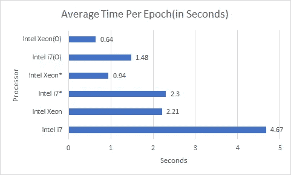
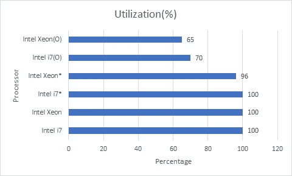
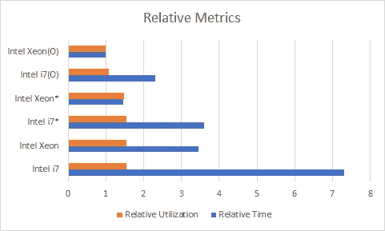

# 为深度学习优化您的 CPU

> 原文：<https://towardsdatascience.com/optimize-your-cpu-for-deep-learning-424a199d7a87?source=collection_archive---------3----------------------->

在过去的几年里，深度学习已经在学术界和工业界加快了步伐。每个公司现在都在寻找基于人工智能的问题解决方案。这种繁荣有其自身的优点和缺点，但这是另一篇文章，另一天。机器学习从业者的激增已经渗透到了学术界的根部，几乎每个领域的每个学生都可以通过课程、MOOCs、书籍、文章和课程论文获得人工智能和人工智能知识。

然而，这种增长受到硬件资源可用性的限制。有人建议，并证明了图形处理器是最好的设备之一，你可以有执行你的 ML 任务的速度。但是，一个好的高性能 GPU 的价格标签甚至可以高达 20，449.00 美元一个[英伟达特斯拉 V100 32GB GPU](https://www.dell.com/en-us/work/shop/dell-nvidia-tesla-v100-32gb-passive-gpu/apd/490-beob/graphic-video-cards) ，它具有类似服务器的计算能力。此外，一台配有像样 GPU 的消费笔记本电脑价格约为**2000 美元**，GPU 为 1050Ti 或 1080Ti。为了减轻痛苦，谷歌、Kaggle、英特尔和英伟达免费提供基于云的高计算系统，对空间、计算能力、内存或时间都有限制。但是这些在线服务有其缺点，包括管理数据(上传/下载)、数据隐私等。这些问题引出了我的文章的主要观点，“为什么不优化我们的 CPU，以提高深度学习任务的速度？”。

英特尔已经为 Python、Tensorflow、Pytorch 等提供了优化。拥有一整套英特尔优化支持库，如 NumPy、scikit-learn 等。这些都可以免费下载和设置，并在英特尔酷睿 i7 这样的 CPU 上提供 2 倍甚至 5 倍的速度，而英特尔酷睿 i7 也不是至强系列这样的高性能 CPU。在本文的剩余部分，我将演示如何在您的 PC/笔记本电脑中设置英特尔优化，并将提供我观察到的加速数据。

# 获得性能提升

对于下面提到的各种实验，我将展示我观察到的时间和利用率提升。

1.  用于 CIFAR-100 图像分类的 10 层深度 CNN。
2.  用于 IMDB 情感分析的 3 层深度 LSTM。
3.  6 层深密 ANN 用于 MNIST 影像分类。
4.  用于 MNIST 的 9 层深度全卷积自动编码器。

这些任务已使用 tensorflow 后端在 Keras 中编码，数据集与代码和可执行库位于同一硬盘中。使用的硬盘是 SSD。

我们将考虑以下六种优化组合。

1.  英特尔酷睿 i7 处理器。
2.  英特尔至强处理器 E3–1535m V6。
3.  英特尔酷睿 i7 和英特尔 Python(英特尔 i7*)。
4.  英特尔至强处理器 E3–1535m V6，采用英特尔 Python(英特尔至强*)。
5.  采用英特尔 Python 和处理器线程优化的英特尔酷睿 i7(英特尔 i7(O))。
6.  英特尔至强处理器 E3–1535m V6，采用英特尔 Python 和处理器线程优化(英特尔至强处理器)。

对于每项任务，历元数固定为 50。在下面的图表中，我们可以看到，对于一个**英特尔(R)酷睿(TM)i7–7700 HQ CPU @ 2.80 GHz CPU**，每个时期的平均时间接近 4.67 秒，经过适当的优化后，它下降到 1.48 秒，提升了 3.2 倍。对于一个英特尔至强处理器 E3–1535m V6 @ 3.10 GHz CPU，每个周期的平均时间接近 2.21 秒，经过适当优化后下降到 0.64 秒，提升了 3.45 倍。



Average time per epoch

优化不仅是及时的，优化的分布还优化了 CPU 利用率，最终导致更好的热量管理，并且您的笔记本电脑不会像过去那样受热，而训练深度神经网络。



Utilization

我们可以看到，在没有任何优化的情况下，训练时的 CPU 利用率达到了 100%，降低了所有其他进程的速度，并使系统发热。然而，通过适当的优化，i7 的利用率下降到 70%,至强的利用率下降到 65%,尽管在时间方面提供了性能增益。

这两个指标可以相对概括如下。



在上图中，**值越低越好**，也就是说，相对而言，经过所有优化的英特尔至强处理器是性能指标评测的基准，在优化使用后，英特尔酷睿 i7 处理器每周期的时间几乎是至强处理器的两倍。上图清楚地显示了英特尔 Python 优化在训练神经网络所用时间和 CPU 使用方面的光明面。

# 设置英特尔的 Python 发行版


英特尔软件提供了关于如何设置的详尽资源列表，但我们可能会经常遇到一些问题。更多关于发行的细节可以在[这里](https://software.intel.com/en-us/distribution-for-python)找到。您可以选择安装类型，即本机 pip 或 conda。我更喜欢 conda，因为它为我节省了大量的麻烦，我可以专注于 ML 而不是解决我的库的兼容性问题。

## 1)下载并安装 Anaconda

你可以从[这里](https://www.anaconda.com/distribution/)下载 Anaconda。他们的网站列出了在 windows、ubuntu 和 macOS 环境下安装 Anaconda 的所有步骤，并且很容易掌握。

## 2)在您的 Anaconda 发行版中设置英特尔 python

这一步通常会变得棘手。最好为英特尔分发创建一个虚拟环境，这样您就可以随时在一个地方添加/更改您的优化库。让我们创建一个名为“ ***intel”的新虚拟环境***

```
conda create -n intel -c intel [intelpython3_ful](https://anaconda.org/intel/intelpython3_full)l
```

这里 ***-c*** 代表通道，所以我们不把 Intel 加为通道，而是把那个通道称为 via ***-c*** 。在这里，intelpython3_full 将自动从英特尔的发行版中获取必要的库，并将它们安装到您的虚拟环境中。此命令将安装下列库。

```
The following NEW packages will be INSTALLED:asn1crypto         intel/win-64::asn1crypto-0.24.0-py36_3
bzip2              intel/win-64::bzip2-1.0.6-vc14_17
certifi            intel/win-64::certifi-2018.1.18-py36_2
cffi               intel/win-64::cffi-1.11.5-py36_3
chardet            intel/win-64::chardet-3.0.4-py36_3
cryptography       intel/win-64::cryptography-2.3-py36_1
cycler             intel/win-64::cycler-0.10.0-py36_7
cython             intel/win-64::cython-0.29.3-py36_1
daal               intel/win-64::daal-2019.3-intel_203
daal4py            intel/win-64::daal4py-2019.3-py36h7b7c402_6
freetype           intel/win-64::freetype-2.9-vc14_3
funcsigs           intel/win-64::funcsigs-1.0.2-py36_7
icc_rt             intel/win-64::icc_rt-2019.3-intel_203
idna               intel/win-64::idna-2.6-py36_3
impi_rt            intel/win-64::impi_rt-2019.3-intel_203
intel-openmp       intel/win-64::intel-openmp-2019.3-intel_203
intelpython        intel/win-64::intelpython-2019.3-0
intelpython3_core  intel/win-64::intelpython3_core-2019.3-0
intelpython3_full  intel/win-64::intelpython3_full-2019.3-0
kiwisolver         intel/win-64::kiwisolver-1.0.1-py36_2
libpng             intel/win-64::libpng-1.6.36-vc14_2
llvmlite           intel/win-64::llvmlite-0.27.1-py36_0
matplotlib         intel/win-64::matplotlib-3.0.1-py36_1
menuinst           intel/win-64::menuinst-1.4.1-py36_6
mkl                intel/win-64::mkl-2019.3-intel_203
mkl-service        intel/win-64::mkl-service-1.0.0-py36_7
mkl_fft            intel/win-64::mkl_fft-1.0.11-py36h7b7c402_0
mkl_random         intel/win-64::mkl_random-1.0.2-py36h7b7c402_4
mpi4py             intel/win-64::mpi4py-3.0.0-py36_3
numba              intel/win-64::numba-0.42.1-np116py36_0
numexpr            intel/win-64::numexpr-2.6.8-py36_2
numpy              intel/win-64::numpy-1.16.1-py36h7b7c402_3
numpy-base         intel/win-64::numpy-base-1.16.1-py36_3
openssl            intel/win-64::openssl-1.0.2r-vc14_0
pandas             intel/win-64::pandas-0.24.1-py36_3
pip                intel/win-64::pip-10.0.1-py36_0
pycosat            intel/win-64::pycosat-0.6.3-py36_3
pycparser          intel/win-64::pycparser-2.18-py36_2
pyopenssl          intel/win-64::pyopenssl-17.5.0-py36_2
pyparsing          intel/win-64::pyparsing-2.2.0-py36_2
pysocks            intel/win-64::pysocks-1.6.7-py36_1
python             intel/win-64::python-3.6.8-6
python-dateutil    intel/win-64::python-dateutil-2.6.0-py36_12
pytz               intel/win-64::pytz-2018.4-py36_3
pyyaml             intel/win-64::pyyaml-4.1-py36_3
requests           intel/win-64::requests-2.20.1-py36_1
ruamel_yaml        intel/win-64::ruamel_yaml-0.11.14-py36_4
scikit-learn       intel/win-64::scikit-learn-0.20.2-py36h7b7c402_2
scipy              intel/win-64::scipy-1.2.0-py36_3
setuptools         intel/win-64::setuptools-39.0.1-py36_0
six                intel/win-64::six-1.11.0-py36_3
sqlite             intel/win-64::sqlite-3.27.2-vc14_2
tbb                intel/win-64::tbb-2019.4-vc14_intel_203
tbb4py             intel/win-64::tbb4py-2019.4-py36_intel_0
tcl                intel/win-64::tcl-8.6.4-vc14_22
tk                 intel/win-64::tk-8.6.4-vc14_28
urllib3            intel/win-64::urllib3-1.24.1-py36_2
vc                 intel/win-64::vc-14.0-2
vs2015_runtime     intel/win-64::vs2015_runtime-14.0.25420-intel_2
wheel              intel/win-64::wheel-0.31.0-py36_3
win_inet_pton      intel/win-64::win_inet_pton-1.0.1-py36_4
wincertstore       intel/win-64::wincertstore-0.2-py36_3
xz                 intel/win-64::xz-5.2.3-vc14_2
zlib               intel/win-64::zlib-1.2.11-vc14h21ff451_5
```

您可以看到，对于每个库，轮盘的描述以“***【Intel/…”***开头，这表示该库正在从英特尔的分销渠道下载。一旦您同意安装这些库，它们将开始被下载和安装。

这一步是第一个问题的来源。有时，这些库没有被下载，列表传播，或者我们得到一个 SSL 错误，命令退出。这个问题甚至可能会被延迟，也就是说，现在所有的东西都会被下载和安装，但是稍后如果你想添加任何新的库，提示会抛出 SSL 错误。如上所述，在为英特尔创建虚拟环境之前，有一个简单的方法可以解决这个问题。

在您的 shell 或命令提示符下，通过以下命令关闭 anaconda 的默认 SSL 验证

```
conda config --set ssl_verify false
```

关闭 SLL 验证后，您可以通过删除之前创建的环境并重新启动来重复步骤 2。

## 3)建立张量流


恭喜你！！现在，您已经在您的 PC/笔记本电脑中设置了英特尔的 python 发行版。是时候进入 ML 管道了。

英特尔已通过所有分销渠道为 tensorflow 提供了优化，安装非常顺利。你可以在这里了解更多信息[。让我们看看如何为我们的 CPU 安装优化的 tensorflow。英特尔软件提供了一个优化的数学内核库(mkl ),它可以优化数学运算，并为用户提供所需的加速。因此，我们将如下安装 tensorflow-mkl。](https://software.intel.com/en-us/ai/frameworks/tensorflow)

```
conda install tensorflow-mkl
```

或者使用 pip，可以按如下方式进行设置。

```
pip install intel-tensorflow
```

瞧啊。！Tensorflow 现已启动并在您的系统中运行，并进行了必要的优化。如果你是一个 ***Keras*** 粉丝，你可以用一个简单的命令来设置它

```
conda install keras -c intel
```

## 4)建立 Jupyter

由于我们已经创建了一个新的虚拟环境，默认情况下它不会与 spyder 或 jupyter 笔记本一起提供。然而，设置这些是很简单的。只要一句话，我们就能创造奇迹。

```
conda install jupyter -c intel
```

## 5)激活环境，开始实验

现在我们已经设置好了所有的东西，是时候开始在我们优化的 CPU 系统上用各种 ML 和 DL 方法进行编码和实验了。首先，在执行任何代码之前，确保您正在使用正确的环境。您需要激活虚拟环境，然后才能使用其中安装的库。这个激活步骤是一个全天候的过程，而且毫不费力。在 anaconda 提示符下编写以下命令，就可以开始了。

```
conda activate intel
```

要对您的环境进行健全性检查，请在激活环境后，在命令提示符/shell 中键入以下内容。

```
python
```

键入 python 后按 enter 键，命令提示符中应该会出现以下文本。确保在管道之间有“英特尔公司”字样，并有消息“英特尔公司为您提供 Python 的英特尔(R)发行版。”。这些验证了英特尔 Python 发行版的正确安装。

```
Python 3.6.8 |Intel Corporation| (default, Feb 27 2019, 19:55:17) [MSC v.1900 64 bit (AMD64)] on win32
Type "help", "copyright", "credits" or "license" for more information.
Intel(R) Distribution for Python is brought to you by Intel Corporation.
Please check out: [https://software.intel.com/en-us/python-distribution](https://software.intel.com/en-us/python-distribution)
```

现在，您可以使用命令行来试验或在其他地方编写您的脚本，并使用。py 扩展名。然后，可以通过“cd”命令导航到文件的位置并通过以下方式运行脚本来访问这些文件:-

```
(intel) C:\Users\User>python script.py
```

通过执行步骤 1 到 4，您的系统将具备上述性能指标评测图表中提到的*英特尔 xyz** 水平。这些仍然不是基于多处理器的线程优化。我将在下面讨论如何为您的多核 CPU 实现进一步的优化。

# 多核优化

要为您的多核系统添加进一步的优化，您可以将以下代码行添加到您的。py 文件，它将相应地执行脚本。这里***NUM _ PARALLEL _ EXEC _ UNITS***代表你拥有的核心数；我有一台四核 i7。因此数字是 4。对于 Windows 用户，您可以通过导航到任务管理器- >性能- > CPU - >核心来检查任务管理器中的核心数。

```
from keras import backend as K
import tensorflow as tfNUM_PARALLEL_EXEC_UNITS = 4
config = tf.ConfigProto(intra_op_parallelism_threads=NUM_PARALLEL_EXEC_UNITS, inter_op_parallelism_threads=2,
                       allow_soft_placement=True, device_count={'CPU': NUM_PARALLEL_EXEC_UNITS})session = tf.Session(config=config)K.set_session(session)os.environ["OMP_NUM_THREADS"] = "4"os.environ["KMP_BLOCKTIME"] = "30"os.environ["KMP_SETTINGS"] = "1"os.environ["KMP_AFFINITY"] = "granularity=fine,verbose,compact,1,0"
```

如果您不使用 Keras，而更喜欢使用 core tensorflow，那么脚本几乎保持不变，只需删除以下两行。

```
from keras import backend as K

K.set_session(session)
```

在您的代码中添加这些行之后，速度应该可以与上面性能图表中的*英特尔 xyz(O)* 条目相媲美。

如果您的系统中有一个 GPU，并且它与当前的库集冲突或抛出 cudnn 错误，那么您可以在代码中添加以下行来禁用 GPU。

```
os.environ["CUDA_VISIBLE_DEVICES"] = "-1"
```

# 结论

就是这样。你现在有一个优化的管道来测试和开发机器学习项目和想法。这一渠道为参与学术研究的学生提供了很多机会，让他们可以利用自己的系统继续工作。该管道还将防止从业者可能正在处理的私人数据的隐私担忧。

还可以观察到，通过适当的微调，人们可以在工作流程中获得 3.45 倍的加速，这意味着如果您正在试验您的想法，您现在的工作速度可以是以前的三倍。