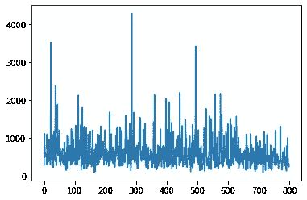
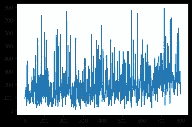
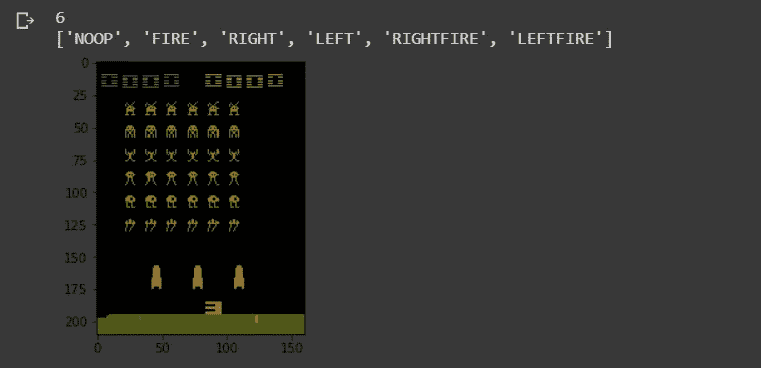
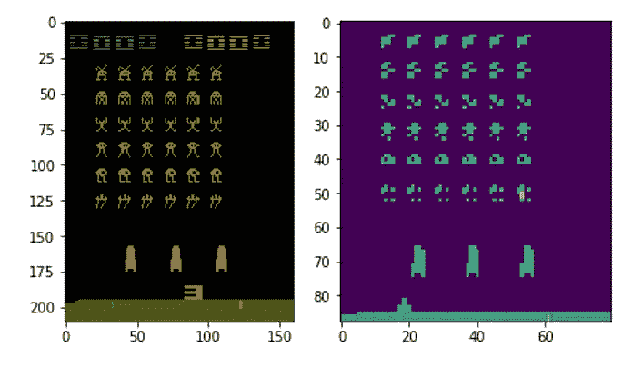
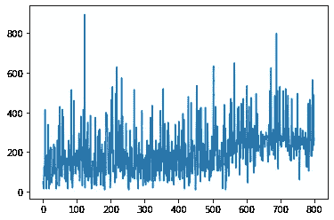

# 使用深度 Q 学习优化空间入侵者:Tensorflow 2.0 中的实现。

> 原文：<https://towardsdatascience.com/optimized-deep-q-learning-for-automated-atari-space-invaders-an-implementation-in-tensorflow-2-0-80352c744fdc?source=collection_archive---------13----------------------->

## 探索数据预处理的效果

# 介绍

在过去几篇关于 GradientCrescent 的文章中，我们花了大量时间探索[在线学习](https://medium.com/gradientcrescent/fundamentals-of-reinforcement-learning-illustrating-online-learning-through-temporal-differences-ec4833b6b06a)领域，这是一个高度反应性的强化学习算法家族，背后隐藏着许多通用人工智能的最新成就。在线学习属于[基于样本的学习](https://medium.com/gradientcrescent/fundamentals-of-reinforcement-learning-automating-pong-in-using-a-policy-model-an-implementation-b71f64c158ff)类方法，reliant 允许简单地通过重复观察来确定状态值，消除了对转换动态的需要。与它们的[离线对应方式](https://medium.com/gradientcrescent/fundamentals-of-reinforcement-learning-understanding-blackjack-strategy-through-monte-carlo-88c9b85194ed)，**不同，在线学习方法允许在环境事件期间对状态和动作的值进行增量更新，允许观察到持续的、增量的性能改进。**

除了时间差异学习(TD ),我们还讨论了 Q-learning 的[理论](https://medium.com/gradientcrescent/fundamentals-of-reinforcement-learning-navigating-cliffworld-with-sarsa-and-q-learning-cc3c36eb5830)和[实际实现](/automating-pac-man-with-deep-q-learning-an-implementation-in-tensorflow-ca08e9891d9c),这是 TD 的一种发展，旨在允许增量估计和状态-动作值的改进。Q-learning 因成为模拟游戏环境的强化学习方法的支柱而闻名，如在 OpenAI 的健身房中观察到的那些。因为我们已经在[过去的文章](/automating-pac-man-with-deep-q-learning-an-implementation-in-tensorflow-ca08e9891d9c)中涉及了 Q-learning 的理论方面，所以这里不再重复。

Q-learning powered Miss Pacman, a implemented in our [previous article](/automating-pac-man-with-deep-q-learning-an-implementation-in-tensorflow-ca08e9891d9c).

在我们之前对 OpenAI 的 Pacman 小姐健身房环境的[实现中，我们依赖于一组单个游戏帧的观察实例(状态)作为我们训练过程的输入。然而，这种方法存在部分缺陷，因为它没有考虑 Atari 游戏环境的许多特性，包括:](/automating-pac-man-with-deep-q-learning-an-implementation-in-tensorflow-ca08e9891d9c)

*   经典 Atari 游戏中观察到的游戏环境的跳帧渲染。
*   环境中存在多个快速移动的参与者。
*   在代理和环境中观察到的特定于帧的闪烁。

总的来说，这些问题可能会大大降低代理的性能，因为一些数据实例实际上已经超出了领域，或者与实际的游戏环境完全无关。此外，这些问题只会随着更复杂的游戏环境和现实世界的应用(如自动驾驶)而变得更加复杂。我们在之前的实施中观察到，在培训过程中，这种情况表现为高水平的变化和绩效持平。



Reward versus training episodes for our Q-learning trained Miss Pacman agent, trained over 600+800 cycles.

为了克服这些问题，我们可以利用由 [Deepmind 团队](https://danieltakeshi.github.io/2016/11/25/frame-skipping-and-preprocessing-for-deep-q-networks-on-atari-2600-games/)在 2015 年首次引入的几项技术。

*   **帧堆叠**:将几个游戏帧连接在一起，为我们的游戏环境提供一个时间参考。
*   **帧合成:**两个游戏帧的元素最大化，以提供一个运动参考，也克服了部分渲染的问题。

让我们在更复杂的 Atari Space Invader 环境中实现检查这些技术的效果。

# **实施**

我们的 Google 协作实现是利用 Tensorflow Core 用 Python 编写的，可以在 [GradientCrescent Github 上找到。](https://github.com/EXJUSTICE/GradientCrescent)我们已经使用新的 *compat* 包将我们的代码转换为 TF2 兼容的。首先，让我们简要回顾一下 Q-learning 实现所需的操作。

1.  **我们定义我们的深度 Q 学习神经网络**。这是一个 CNN，它拍摄游戏中的屏幕图像，并输出 Ms-Pacman gamespace 中每个动作的概率，或 Q 值。为了获得概率张量，我们在最后一层不包括任何激活函数。
2.  由于 Q-learning 要求我们了解当前和下一个状态，我们需要从数据生成开始。我们将表示初始状态 *s* 的游戏空间的预处理输入图像输入到网络中，并获取动作的初始概率分布，或 Q 值。在训练之前，这些值将是随机的和次优的。请注意，我们的预处理现在还包括堆叠和合成。
3.  利用我们的概率张量，我们然后**使用 argmax()函数选择具有当前最高概率**的动作，并使用它来构建ε贪婪策略。
4.  使用我们的策略，我们将选择动作 *a* ，并评估我们在健身房环境中的决定，以让**接收关于新状态*s’*的信息、奖励 *r*** ，以及该集是否已经结束。
5.  我们以列表形式~~将该信息组合存储在一个缓冲区中，并重复步骤 2-4 预设次数，以建立一个足够大的缓冲区数据集。~~
6.  一旦步骤 5 完成，我们转到**生成损失计算所需的目标 *y* 值*R’*和*A’***。虽然前者只是从 *R* 中减去，但我们通过将*S’*输入到我们的网络中来获得 A’。
7.  所有的组件都准备好了，我们就可以**计算训练网络的损耗了。**
8.  培训结束后，我们将通过图形和演示来评估代理的表现。

作为参考，让我们首先演示使用普通数据输入方法的结果，这与我们之前为 Pacman 小姐实施的[中观察到的结果基本相同。](/automating-pac-man-with-deep-q-learning-an-implementation-in-tensorflow-ca08e9891d9c)在对我们的代理人进行了 800 集的训练后，我们观察到以下的报酬分布。



Reward distribution for the vanilla data input approach for the Space Invaders environment.

请注意性能的变化如何表现出高度的变化，在 650 次发作后观察到非常有限的改善。

同样，我们代理的性能也不太好，几乎没有检测到任何逃避行为。如果你仔细观察，你会注意到出射和入射激光轨迹的闪烁——这是游戏环境中有意的一部分，导致某些帧中根本没有投射物，或者只有一组投射物可见。**这意味着我们输入数据的元素具有高度误导性，并对代理绩效产生负面影响。**

让我们检查一下改进后的实现。

我们首先导入所有必要的包，包括 OpenAI gym 环境和 Tensorflow 核心。

```
import numpy as npimport gymimport tensorflow as tffrom tensorflow.contrib.layers import flatten, conv2d, fully_connectedfrom collections import deque, Counterimport randomfrom datetime import datetime
```

接下来，我们定义一个预处理函数，从我们的健身房环境中裁剪图像，并将它们转换成一维张量。在我们的 [Pong 自动化实现](https://medium.com/gradientcrescent/fundamentals-of-reinforcement-learning-automating-pong-in-using-a-policy-model-an-implementation-b71f64c158ff)中，我们已经看到了这一点。

```
def preprocess_observation(obs): # Crop and resize the image img = obs[25:201:2, ::2] # Convert the image to greyscale img = img.mean(axis=2) # Improve image contrast img[img==color] = 0 # Next we normalize the image from -1 to +1 img = (img - 128) / 128 - 1 return img.reshape(88,80)
```

接下来，让我们初始化健身房环境，检查几个游戏画面，并了解 gamespace 中可用的 9 个动作。当然，我们的代理人无法获得这些信息。

```
env = gym.make(“SpaceInvaders-v0”)n_outputs = env.action_space.nprint(n_outputs)print(env.env.get_action_meanings())observation = env.reset()import tensorflow as tfimport matplotlib.pyplot as pltfor i in range(22):if i > 20:plt.imshow(observation)plt.show()observation, _, _, _ = env.step(1)
```

您应该遵守以下几点:



我们可以借此机会比较我们的原始和预处理输入图像:



接下来，我们将输入堆叠和输入组合引入预处理管道。在新的一集里，我们从获取两个输入帧开始，并返回这两个帧的元素式最大总和 *maxframe* (注意，从技术上讲这是不必要的，因为这两个帧是相同的，但这是一种很好的实践)。堆叠的帧存储在队列中，当引入新的条目时，队列会自动删除旧的条目。最初，我们复制预处理的 maxframe 来填充我们的 deque。随着剧集的进展，我们通过获取新的帧来创建新的 *maxframes* ，将它与我们的 dequee 中最近的条目进行元素式最大求和，然后将新的 maxframe 附加到我们的 dequee。然后，我们在流程的最后堆叠这些帧。

```
stack_size = 4 # We stack 4 composite frames in total# Initialize deque with zero-images one array for each image. Deque is a special kind of queue that deletes last entry when new entry comes instacked_frames = deque([np.zeros((88,80), dtype=np.int) for i in range(stack_size)], maxlen=4)def stack_frames(stacked_frames, state, is_new_episode):# Preprocess frameframe = preprocess_observation(state) if is_new_episode: # Clear our stacked_frames stacked_frames = deque([np.zeros((88,80), dtype=np.int) for i in range(stack_size)], maxlen=4) # Because we’re in a new episode, copy the same frame 4x, apply elementwise maxima maxframe = np.maximum(frame,frame) stacked_frames.append(maxframe) stacked_frames.append(maxframe) stacked_frames.append(maxframe) stacked_frames.append(maxframe) # Stack the frames stacked_state = np.stack(stacked_frames, axis=2) else: #Since deque append adds t right, we can fetch rightmost element maxframe=np.maximum(stacked_frames[-1],frame) # Append frame to deque, automatically removes the oldest frame stacked_frames.append(maxframe) # Build the stacked state (first dimension specifies different frames) stacked_state = np.stack(stacked_frames, axis=2) return stacked_state, stacked_frames
```

接下来，让我们定义我们的模型，一个深度 Q 网络。这本质上是一个三层卷积网络，它获取预处理的输入图像，展平并将其馈送到一个全连接层，并输出在游戏空间中采取每个行动的概率。如前所述，这里没有激活层，因为激活层的存在会导致二进制输出分布。

```
**def q_network(X, name_scope):**# Initialize layersinitializer = tf.compat.v1.keras.initializers.VarianceScaling(scale=2.0)with tf.compat.v1.variable_scope(name_scope) as scope:# initialize the convolutional layerslayer_1 = conv2d(X, num_outputs=32, kernel_size=(8,8), stride=4, padding=’SAME’, weights_initializer=initializer)tf.compat.v1.summary.histogram(‘layer_1’,layer_1)layer_2 = conv2d(layer_1, num_outputs=64, kernel_size=(4,4),    stride=2, padding=’SAME’, weights_initializer=initializer)tf.compat.v1.summary.histogram(‘layer_2’,layer_2)layer_3 = conv2d(layer_2, num_outputs=64, kernel_size=(3,3), stride=1, padding=’SAME’, weights_initializer=initializer)tf.compat.v1.summary.histogram(‘layer_3’,layer_3)flat = flatten(layer_3)fc = fully_connected(flat, num_outputs=128, weights_initializer=initializer)tf.compat.v1.summary.histogram(‘fc’,fc)#Add final output layeroutput = fully_connected(fc, num_outputs=n_outputs, activation_fn=None, weights_initializer=initializer)tf.compat.v1.summary.histogram(‘output’,output)vars = {v.name[len(scope.name):]: v for v in tf.compat.v1.get_collection(key=tf.compat.v1.GraphKeys.TRAINABLE_VARIABLES, scope=scope.name)}#Return both variables and outputs togetherreturn vars, output
```

让我们也借此机会为我们的模型和训练过程定义超参数。注意，由于我们的堆叠框架，X_shape 现在是*(无，88，80，4)* 。

```
num_episodes = 800batch_size = 48input_shape = (None, 88, 80, 1)learning_rate = 0.001X_shape = (None, 88, 80, 4)discount_factor = 0.97global_step = 0copy_steps = 100steps_train = 4start_steps = 2000
```

回想一下，Q-learning 要求我们选择具有最高行动值的行动。为了确保我们仍然访问每一个可能的状态-行为组合，我们将让我们的代理遵循一个ε贪婪策略，探索率为 5%。我们将这个探索率设置为随时间衰减，因为我们最终假设所有的组合都已经被探索过了——在那个点之后的任何探索只会导致次优行动的强制选择。

```
epsilon = 0.5eps_min = 0.05eps_max = 1.0eps_decay_steps = 500000#**def epsilon_greedy(action, step):** p = np.random.random(1).squeeze() #1D entries returned using squeeze epsilon = max(eps_min, eps_max — (eps_max-eps_min) * step/eps_decay_steps) #Decaying policy with more steps if np.random.rand() < epsilon: return np.random.randint(n_outputs) else: return action
```

回想上面的等式，Q-learning 的更新函数要求如下:

*   当前状态 *s*
*   当前动作*一个*
*   当前动作后的奖励 *r*
*   下一个状态*s’*
*   下一个动作*a’*

为了以有意义的数量提供这些参数，我们需要按照一组参数评估我们当前的策略，并将所有变量存储在一个缓冲区中，我们将在训练期间从该缓冲区中提取迷你批次中的数据。让我们继续创建我们的缓冲区和一个简单的采样函数:

```
buffer_len = 20000#Buffer is made from a deque — double ended queueexp_buffer = deque(maxlen=buffer_len)**def sample_memories(batch_size):** perm_batch = np.random.permutation(len(exp_buffer))[:batch_size] mem = np.array(exp_buffer)[perm_batch] return mem[:,0], mem[:,1], mem[:,2], mem[:,3], mem[:,4]
```

接下来，让我们将原始网络的权重参数复制到目标网络中。这种双网络方法允许我们在使用现有策略的训练过程中生成数据，同时仍然为下一次策略迭代优化我们的参数。

```
# we build our Q network, which takes the input X and generates Q values for all the actions in the statemainQ, mainQ_outputs = q_network(X, ‘mainQ’)# similarly we build our target Q network, for policy evaluationtargetQ, targetQ_outputs = q_network(X, ‘targetQ’)copy_op = [tf.compat.v1.assign(main_name, targetQ[var_name]) for var_name, main_name in mainQ.items()]copy_target_to_main = tf.group(*copy_op)
```

最后，我们还将定义我们的损失。这就是我们的目标动作(具有最高动作值)和我们的预测动作的平方差。我们将使用 ADAM 优化器来最大限度地减少我们在训练中的损失。

```
# define a placeholder for our output i.e actiony = tf.compat.v1.placeholder(tf.float32, shape=(None,1))# now we calculate the loss which is the difference between actual value and predicted valueloss = tf.reduce_mean(input_tensor=tf.square(y — Q_action))# we use adam optimizer for minimizing the lossoptimizer = tf.compat.v1.train.AdamOptimizer(learning_rate)training_op = optimizer.minimize(loss)init = tf.compat.v1.global_variables_initializer()loss_summary = tf.compat.v1.summary.scalar(‘LOSS’, loss)merge_summary = tf.compat.v1.summary.merge_all()file_writer = tf.compat.v1.summary.FileWriter(logdir, tf.compat.v1.get_default_graph())
```

定义好所有代码后，让我们运行我们的网络并检查培训过程。我们已经在最初的总结中定义了大部分，但是让我们为后代回忆一下。

*   对于每个时期，在使用ε-贪婪策略选择下一个动作之前，我们将输入图像堆栈输入到我们的网络中，以生成可用动作的概率分布
*   然后，我们将它输入到网络中，获取下一个状态和相应奖励的信息，并将其存储到我们的缓冲区中。我们更新我们的堆栈，并通过一些预定义的步骤重复这一过程。
*   在我们的缓冲区足够大之后，我们将下一个状态输入到我们的网络中，以便获得下一个动作。我们还通过贴现当前的奖励来计算下一个奖励
*   我们通过 Q 学习更新函数生成我们的目标 y 值，并训练我们的网络。
*   通过最小化训练损失，我们更新网络权重参数，以便为下一个策略输出改进的状态-动作值。

```
with tf.compat.v1.Session() as sess: init.run() # for each episode
  history = [] for i in range(num_episodes): done = False obs = env.reset() epoch = 0 episodic_reward = 0 actions_counter = Counter() episodic_loss = [] #First step, preprocess + initialize stack obs,stacked_frames= stack_frames(stacked_frames,obs,True) # while the state is not the terminal state
    while not done: #Data generation using the untrained network # feed the game screen and get the Q values for each action actions = mainQ_outputs.eval(feed_dict={X:[obs], in_training_mode:False}) # get the action
    action = np.argmax(actions, axis=-1) actions_counter[str(action)] += 1 # select the action using epsilon greedy policy

    action = epsilon_greedy(action, global_step) # now perform the action and move to the next state, next_obs, receive reward next_obs, reward, done, _ = env.step(action) #Updated stacked frames with new episode next_obs, stacked_frames = stack_frames(stacked_frames, next_obs, False) # Store this transition as an experience in the replay buffer! Quite important exp_buffer.append([obs, action, next_obs, reward, done]) # After certain steps, we train our Q network with samples from the experience replay buffer if global_step % steps_train == 0 and global_step > start_steps: #Our buffer should already contain everything preprocessed and stacked o_obs, o_act, o_next_obs, o_rew, o_done = sample_memories(batch_size) # states o_obs = [x for x in o_obs] # next states o_next_obs = [x for x in o_next_obs] # next actions next_act = mainQ_outputs.eval(feed_dict={X:o_next_obs, in_training_mode:False}) # discounted reward: these are our Y-values y_batch = o_rew + discount_factor * np.max(next_act, axis=-1) * (1-o_done) # merge all summaries and write to the file mrg_summary = merge_summary.eval(feed_dict={X:o_obs, y:np.expand_dims(y_batch, axis=-1), X_action:o_act, in_training_mode:False}) file_writer.add_summary(mrg_summary, global_step) # To calculate the loss, we run the previously defined functions mentioned while feeding inputs train_loss, _ = sess.run([loss, training_op], feed_dict={X:o_obs, y:np.expand_dims(y_batch, axis=-1), X_action:o_act, in_training_mode:True}) episodic_loss.append(train_loss) # after some interval we copy our main Q network weights to target Q network if (global_step+1) % copy_steps == 0 and global_step > start_steps: copy_target_to_main.run() obs = next_obs epoch += 1 global_step += 1 episodic_reward += rewardnext_obs=np.zeros(obs.shape)exp_buffer.append([obs, action, next_obs, reward, done])obs= env.reset()obs,stacked_frames= stack_frames(stacked_frames,obs,True)history.append(episodic_reward)print('Epochs per episode:', epoch, 'Episode Reward:', episodic_reward,"Episode number:", len(history))
```

一旦训练完成，我们就可以根据增量情节绘制奖励分布图。前 800 集如下所示:



Reward distribution for the stacked and composited approach in the Space Invaders environment.

请注意奖励分布的核心变化是如何显著减少的，从而可以观察到更加一致的剧集间分布，并且表现的增加在统计上变得更加显著。从 550 集开始可以观察到性能的明显提高，比普通数据方法早了整整 100 集，验证了我们的假设。

为了在实验室环境的限制下评估我们的结果，我们可以录制整个情节，并使用基于 IPython 库的包装在虚拟显示器中显示:

```
“””Utility functions to enable video recording of gym environment and displaying it. To enable video, just do “env = wrap_env(env)””“”**def show_video():**mp4list = glob.glob(‘video/*.mp4’)if len(mp4list) > 0:mp4 = mp4list[0]video = io.open(mp4, ‘r+b’).read()encoded = base64.b64encode(video)ipythondisplay.display(HTML(data=’’’<video alt=”test” autoplayloop controls style=”height: 400px;”><source src=”data:video/mp4;base64,{0}” type=”video/mp4" /></video>’’’.format(encoded.decode(‘ascii’))))else:print(“Could not find video”)    
**def wrap_env(env):**env = Monitor(env, ‘./video’, force=True)return env
```

然后，我们使用我们的模型运行一个新的环境会话，并记录它。

```
Evaluate model on openAi GYMenvironment = wrap_env(gym.make('SpaceInvaders-v0'))done = Falseobservation = environment.reset()new_observation = observationprev_input = Nonewith tf.compat.v1.Session() as sess: init.run() observation, stacked_frames = stack_frames(stacked_frames, observation, True) while True: #set input to network to be difference image # feed the game screen and get the Q values for each action actions = mainQ_outputs.eval(feed_dict={X:[observation], in_training_mode:False}) # get the action action = np.argmax(actions, axis=-1) actions_counter[str(action)] += 1 # select the action using epsilon greedy policy action = epsilon_greedy(action, global_step) environment.render() new_observation, stacked_frames = stack_frames(stacked_frames, new_observation, False) observation = new_observation # now perform the action and move to the next state, next_obs, receive reward new_observation, reward, done, _ = environment.step(action) if done: breakenvironment.close()show_video()
```

我们来考察几轮玩法。

我们的特工已经学会了防守和进攻，有效地利用掩护和躲避。这两个事件之间行为的巨大差异可以归因于 Q 学习的工作方式——早先选择的行为获得了 Q 值，这往往有利于ε贪婪策略。随着进一步的训练，我们希望这两种行为会趋于一致。

这就结束了优化 Q-learning 的介绍。在我们的下一篇文章中，我们将带着我们所学到的一切，从 Atari 的世界继续前进，去解决世界上最著名的 FPS 游戏之一。

我们希望你喜欢这篇文章，并希望你查看 GradientCrescent 上的许多其他文章，涵盖人工智能的应用和理论方面。为了保持对 [GradientCrescent](https://medium.com/gradientcrescent) 的最新更新，请考虑关注该出版物并关注我们的 Github 资源库。

**参考文献**

萨顿等人。强化学习

怀特等人。阿尔伯塔大学强化学习基础

席尔瓦等人。阿尔，强化学习，UCL

Ravichandiran 等人。al，用 Python 实践强化学习

Takeshi 等人。艾尔， [Github](https://danieltakeshi.github.io/2016/11/25/frame-skipping-and-preprocessing-for-deep-q-networks-on-atari-2600-games/)