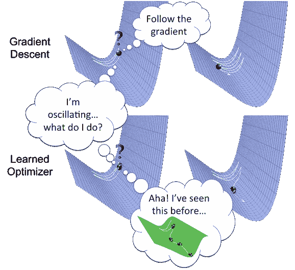
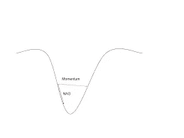
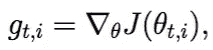
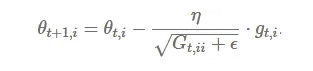
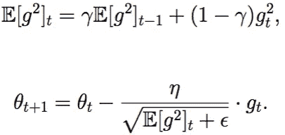
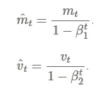
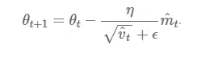

# 训练神经网络的各种优化算法

> 原文：<https://towardsdatascience.com/optimizers-for-training-neural-network-59450d71caf6?source=collection_archive---------1----------------------->

## 正确的优化算法可以成倍地减少训练时间。

许多人可能在训练神经网络时使用优化器，而不知道该方法被称为优化。优化器是用来改变神经网络属性的算法或方法，如权重和学习速率，以减少损失。

Optimizers help to get results faster

你应该如何改变你的神经网络的权重或学习速率来减少损失是由你使用的优化器定义的。优化算法或策略负责减少损失，并尽可能提供最准确的结果。

我们将了解不同类型的优化器及其优势:

# **梯度下降**

梯度下降是最基本但最常用的优化算法。它大量用于线性回归和分类算法。神经网络中的反向传播也使用梯度下降算法。

梯度下降是一种一阶优化算法，它依赖于损失函数的一阶导数。它计算出应该以何种方式改变权重，以使函数达到最小值。通过反向传播，损耗从一层转移到另一层，并且模型的参数(也称为权重)根据损耗进行修改，以便损耗可以最小化。

算法: **θ=θ−α⋅∇J(θ)**

**优点**:

1.  容易计算。
2.  容易实现。
3.  很好理解。

**缺点**:

1.  可能陷入局部最小值。
2.  计算整个数据集的梯度后，权重会发生变化。因此，如果数据集过大，可能需要数年时间才能收敛到最小值。
3.  需要大量内存来计算整个数据集的梯度。

# **随机梯度下降**

这是梯度下降的一个变种。它试图更频繁地更新模型的参数。在这种情况下，在计算每个训练样本的损失之后，改变模型参数。因此，如果数据集包含 1000 行，SGD 将在数据集的一个周期内更新模型参数 1000 次，而不是像梯度下降那样更新一次。

**θ=θ−α⋅∇j(θ；x(一)；y(i))，其中{x(i)，y(i)}为训练示例**。

由于模型参数频繁更新，参数在不同强度的损失函数中具有高方差和波动。

**优点**:

1.  因此，模型参数的频繁更新在更短的时间内收敛。
2.  需要较少的存储器，因为不需要存储损失函数值。
3.  可能会得到新的最小值。

**缺点**:

1.  模型参数的高方差。
2.  甚至在达到全局最小值后也可以射击。
3.  为了获得与梯度下降相同的收敛性，需要缓慢降低学习率的值。

# **小批量梯度下降**

它是所有梯度下降算法中最好的。这是对 SGD 和标准梯度下降的改进。它会在每次批处理后更新模型参数。因此，数据集被分成不同的批次，在每一批次之后，参数被更新。

**θ=θ−α⋅∇j(θ；B(i))，其中{B(i)}为训练样本**的批次。

**优势**:

1.  经常更新模型参数，并且方差较小。
2.  需要中等大小的内存。

**所有类型的梯度下降都有一些挑战:**

1.  选择学习率的最佳值。如果学习率太小，梯度下降可能需要很长时间才能收敛。
2.  对所有参数都有一个恒定的学习率。可能有些参数我们不想以同样的速度改变。
3.  可能会陷入局部最小值。

# **气势**

动量是为了减少 SGD 中的高方差和软化收敛而发明的。它加速了向相关方向的收敛，减少了向无关方向的波动。该方法中还使用了一个超参数，称为动量，用“ **γ** 表示。

**V(t)=γV(t1)+α。∇J(θ)**

现在，权重更新为**θ=θV(t)。**

动量项 **γ** 通常设置为 0.9 或类似值。

**优点**:

1.  减少参数的振荡和高方差。
2.  比梯度下降收敛得更快。

**缺点**:

1.  增加了一个需要手动精确选择的超参数。

# 内斯特罗夫加速梯度

动量可能是一个好方法，但是如果动量太高，算法可能错过局部最小值，并且可能继续上升。因此，为了解决这个问题，开发了 NAG 算法。这是一种前瞻方法。我们知道我们将使用**γV(t1)**来修改权重，因此**θγV(t1)**大致告诉我们未来的位置。现在，我们将基于这个未来参数而不是当前参数来计算成本。

**V(t)=γV(t1)+α。∇j(θγv(t1))**，然后使用**θ=θv(t)更新参数。**

NAG vs momentum at local minima

**优点**:

1.  不会错过局部最小值。
2.  如果出现最小值，速度会变慢。

**缺点**:

1.  尽管如此，超参数仍需要手动选择。

# 阿达格拉德

所解释的所有优化器的缺点之一是，对于所有参数和每个周期，学习率是恒定的。这个优化器改变了学习率。它改变每个参数的学习率**‘η’**和每个时间步长**‘t’。**这是一种二阶优化算法。它对误差函数的导数起作用。

A derivative of loss function for given parameters at a given time t.

Update parameters for given input i and at time/iteration t

**η** 是一个学习率，在给定的时间，基于为给定的参数 **θ(i)计算的先前梯度，对给定的参数 **θ(i)** 进行修改。**

我们存储梯度的平方和 w.r.t. **θ(i)** 直到时间步长 **t** ，而 **ϵ** 是一个避免被零除的平滑项(通常约为 1e 8)。有趣的是，如果没有平方根运算，该算法的性能会差得多。

它对不太频繁的参数进行大的更新，对频繁的参数进行小的更新。

**优点**:

1.  每个训练参数的学习率变化。
2.  不需要手动调整学习率。
3.  能够在稀疏数据上训练。

**缺点**:

1.  因为需要计算二阶导数，所以计算成本高。
2.  学习率总是下降，导致训练缓慢。

# 阿达德尔塔

它是阿达格勒的扩展，倾向于消除它的*衰减学习率*问题。 ***Adadelta*** 将累积的过去梯度的窗口限制为某个固定大小 **w** ，而不是累积所有先前平方的梯度。在此，使用指数移动平均值，而不是所有梯度的总和。

**E[g ](t)=γ。e[g](t1)+(1γ)。g (t)**

我们将 **γ** 设置为与动量项相似的值，大约为 0.9。

Update the parameters

**优点**:

1.  现在学习速度不衰减，训练不停止。

**缺点**:

1.  计算开销很大。

# 圣经》和《古兰经》传统中）亚当（人类第一人的名字

[Adam](https://arxiv.org/pdf/1412.6980.pdf) (自适应力矩估计)适用于一阶和二阶动量。Adam 背后的直觉是，我们不希望滚动得太快，因为我们可以跳过最小值，我们希望稍微降低速度，以便仔细搜索。除了存储类似于 **AdaDelta** 、**Adam、**、*、*的过去平方梯度的指数衰减平均值之外，还保存过去梯度的指数衰减平均值 **M(t)。**

**M(t)和 V(t)** 分别是梯度的 ***均值*** 和 ***无中心方差*** 的一阶矩值。

First and second order of momentum

这里，我们取 **M(t)** 和 **V(t)** 的平均值，使得**E[M(t)】**可以等于 **E[g(t)]** 其中，**E[f(x)】**是 **f(x)** 的期望值。

要更新参数:

Update the parameters

β1 的值是 0.9，β2 的值是 0.999，而' **ϵ'** 的值是(10 x exp(-8))。

**优点**:

1.  方法太快，收敛很快。
2.  纠正消失学习率，高方差。

**缺点**:

计算成本高。

# 各种优化器之间的比较

Comparison 1

comparison 2

# **结论**

亚当是最好的优化者。如果一个人想在更短的时间内比亚当更有效地训练神经网络，那么他就是优化者。

对于稀疏数据，使用具有动态学习率的优化器。

如果，想使用梯度下降算法比 min-batch 梯度下降是最好的选择。

我希望你们喜欢这篇文章，并且能够对不同优化算法的不同行为有一个很好的直觉。