# 用蒙特卡罗方法优化 21 点策略

> 原文：<https://towardsdatascience.com/optimizing-blackjack-strategy-through-monte-carlo-methods-cbb606e52d1b?source=collection_archive---------23----------------------->

## 强化学习的基础

# 介绍

强化学习已经席卷了人工智能世界。从 [AlphaGo](https://www.bbc.co.uk/news/technology-35785875) 到 [AlphaStar](https://www.space.com/alphastar-artificial-intelligence-starcraft-2-grandmaster.html) ，越来越多的传统人类主导的活动现在已经被由强化学习驱动的人工智能代理所征服。简而言之，这些成就依赖于在一个环境中优化一个主体的行为以获得最大的回报。在过去几篇关于 [GradientCrescent](https://medium.com/gradientcrescent) 的文章中，我们讨论了强化学习的各个基本方面，从[基本的 bandit 系统](https://medium.com/gradientcrescent/fundamentals-of-reinforcement-learning-the-k-bandit-problem-illustrat-940eea430296)和 p [基于策略的方法](https://medium.com/gradientcrescent/fundamentals-of-reinforcement-learning-automating-pong-in-using-a-policy-model-an-implementation-b71f64c158ff)，到在[马尔可夫环境中优化基于奖励的行为](https://medium.com/gradientcrescent/fundamentals-of-reinforcement-learning-markov-decision-processes-policies-value-functions-94f7389e1e82)。所有这些方法都要求我们完全了解我们的环境——[例如，动态编程](https://medium.com/gradientcrescent/fundamentals-of-reinforcement-learning-navigating-gridworld-with-dynamic-programming-9b98a6f20310)要求我们拥有所有可能状态转换的完整概率分布。然而，在现实中，我们发现大多数系统是不可能完全知道的，并且由于复杂性、固有的不确定性或计算限制，概率分布不能以显式形式获得。打个比方，考虑一下气象学家的任务——预测天气背后涉及的因素可能如此之多，以至于不可能知道确切的概率。

Can you guarantee a certain probability for hurricane formation?

对于这些情况，基于样本的学习方法，如蒙特卡罗，是一个解决方案。术语蒙特卡罗通常用于描述任何依赖于随机抽样的估计方法。换句话说，我们并不假设我们的环境知识，而是通过从与环境的互动中获得的状态、动作和回报的样本序列，从经验中学习。这些方法是通过直接观察模型在正常运行时返回的回报来判断其状态的平均值。有趣的是，已经证明即使没有环境的*动态*(可以认为是状态转换的概率分布)的任何知识，我们仍然可以获得最佳行为以最大化回报。

作为一个例子，考虑投掷 12 次骰子的回报。通过将这些滚动视为单个状态，我们可以对这些回报进行平均，以接近真实的预期回报。随着样本数量的增加，我们就越能准确地接近实际的预期收益。

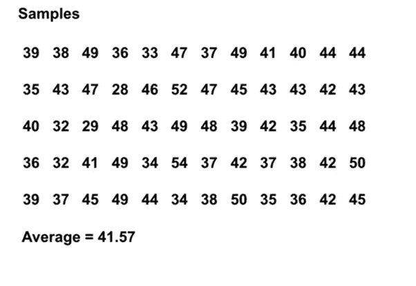

The average expected sum of throwing 12 dice rolls 60 times (University of Alberta)

这种基于抽样的估值对我们的忠实读者来说可能很熟悉，因为抽样也是针对 k-bandit 系统进行的。**蒙特卡罗方法不是用来比较不同的强盗，而是用来比较马尔可夫环境中的不同政策**，通过确定一个状态的值，同时遵循一个特定的政策直到终止。

# 用蒙特卡罗方法估计状态值

在强化学习的背景下，蒙特卡罗方法是一种通过平均样本回报来估计模型中状态值的方法。由于终端状态的需要，蒙特卡罗方法固有地适用于情节环境。由于这种限制，蒙特卡罗方法通常被认为是“离线”的，在这种情况下，所有的更新都是在到达终端状态之后进行的。一个简单的类比是在迷宫中随机导航——离线方法会让代理到达终点，然后使用经验来尝试减少迷宫时间。相比之下，在线方法会让代理不断修改其在迷宫中的行为——也许它注意到绿色走廊通向死胡同，并决定在迷宫中避开它们。我们将在下一篇文章中讨论在线方法。

蒙特卡洛程序可总结如下:

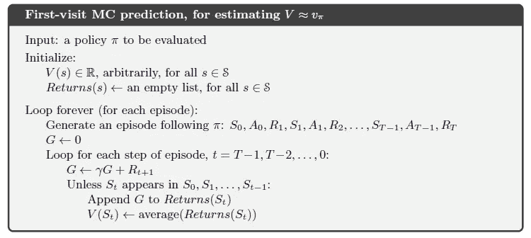

Monte Carlo State-Value Estimation (Sutton et. al)

为了更好地理解蒙特卡罗是如何工作的，请看下面的状态转换图。每个状态转换的奖励显示为黑色，适用的折扣系数为 0.5。让我们暂时把实际的状态值放在一边，专注于计算一轮收益。

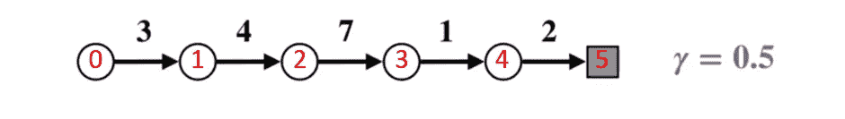

State transition diagram. State number is shown in red, returns are shown in black.

假设终端状态的返回值为 0，让我们从终端状态(G5)开始计算每个状态的返回值。请注意，我们已经将折扣因子设置为 0.5，从而对最近的状态进行加权。

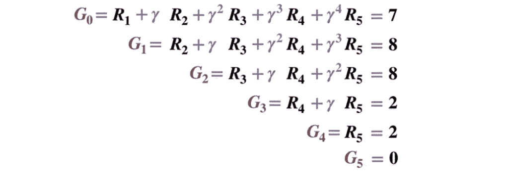

或者更一般地说，

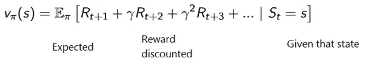

为了避免将所有返回保存在一个列表中，我们可以使用一个与传统梯度下降有一些相似之处的等式，增量地执行蒙特卡罗状态值更新过程:

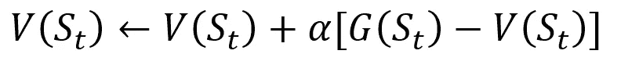

Incremental Monte Carlo update procedure. S stands for state, V its value, G it return, and alpha is a step size parameter.

在强化学习中，蒙特卡罗方法可以进一步分为“首次访问”或“每次访问”。简而言之，两者之间的区别在于在 MC 更新之前，一个状态在一集内可以被访问的次数。首次访问 MC 方法将所有状态的值估计为终止前首次访问每个状态后的平均回报，而每次访问 MC 方法将终止前访问一个状态的次数*n*-**后的平均回报。** **由于相对简单，本文中我们将使用首次访问蒙特卡罗。**

# 用蒙特卡罗方法进行策略控制

如果一个模型不能用来提供政策，MC 也可以用来估计状态-行动值。这比单独的状态值更有用，因为给定状态中每个动作(q)的值的想法允许代理根据未知环境中的观察自动形成策略。

更正式地说，我们可以使用**蒙特卡洛来估计 q(s，a，pi)，即从状态 s 开始，采取行动 a，然后遵循政策 pi 时的预期收益。蒙特卡洛方法保持不变，只是我们现在增加了对某个状态采取行动的维度。如果访问了状态 s 并且在其中采取了动作 a，则称一个**状态-动作对(s，a)在一个情节中被访问。类似地，可以通过首次访问或每次访问的方法进行状态动作值估计。****

如同在动态编程中一样，我们可以使用广义策略迭代来从状态-动作值的观察中形成策略。

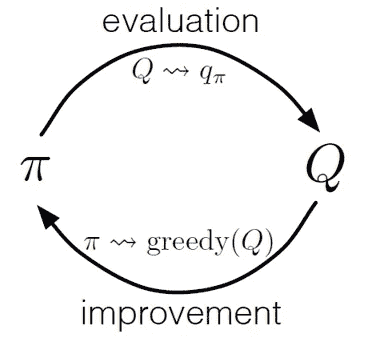

通过交替执行策略评估和策略改进步骤，并结合探索启动以确保所有可能的操作都被访问，我们可以为每个状态实现最优策略。对于蒙特卡洛 GPI 来说，这种交替一般在每集结束后进行。

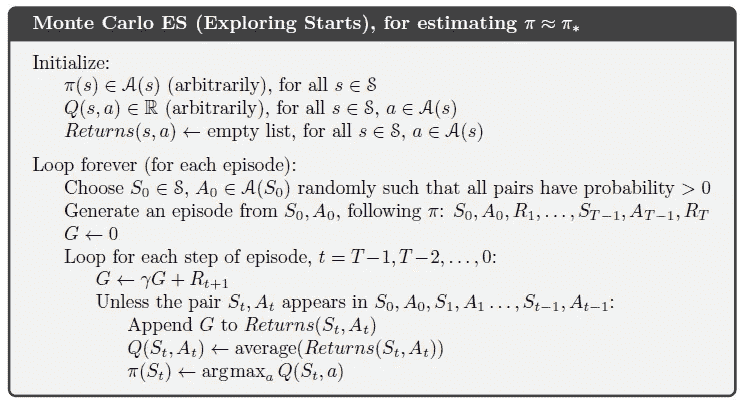

Monte Carlo GPI (Sutton et. al)

# 了解 21 点策略

为了更好地理解蒙特卡罗在评估不同状态值和状态动作值的实践中是如何工作的，让我们用 21 点游戏进行一步一步的演示。首先，让我们定义游戏的规则和条件:

*   我们将只和庄家对打，没有其他玩家参与。这使得我们可以将经销商的手视为环境的一部分。
*   数字卡的价值是按面值计算的。牌 J、K 和 Q 的值是 10。ace 的值可以是 1 或 11，取决于玩家的选择
*   双方都发了两张牌。玩家的两张牌正面朝上，而庄家的一张牌正面朝上。
*   目标是在第一轮拿到所有牌的总和。
*   **你一共画了 19 张。但是你得寸进尺，抽到了 3，然后破产了。当你破产时，庄家只有一张可见的牌，总共 10 元。这可以想象如下:**
*   当我们破产时，我们这一轮的奖励是-1。让我们相应地将此指定为倒数第二个状态的回报，格式为[代理商总和，经销商总和，ace？]:

那真是不幸。我们再来一轮吧。

# **第二轮。**

你一共画了 19 张。这一次，你决定留下。庄家得到 13，命中，破产。倒数第二个状态可以描述如下。

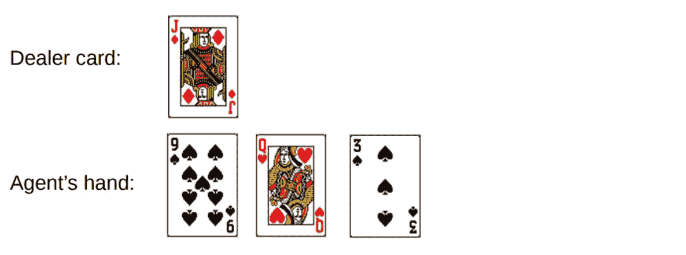

Round 1.

让我们描述一下这一轮发生的状态和奖励:

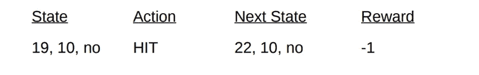

随着剧集的结束，我们现在可以使用计算的回报来更新这一轮中所有状态的值。假设贴现因子为 1，我们只需像之前的状态转换一样，在之前的手牌中传播新的奖励。由于状态 V(19，10，no)之前的收益为-1，我们计算预期收益，并将其分配给我们的状态:

# 履行

让我们通过使用基于 [Sudharsan 等人的 Python 方法，使用首次访问蒙特卡罗来实现 21 点游戏，以了解游戏中所有可能的状态值(或不同的手牌组合)。艾尔。像往常一样，我们的代码可以在 gradient crescent](http://aigradients.com/2019/07/03/blackjack-with-monte-carlo-prediction/)[Github](https://github.com/EXJUSTICE/GradientCrescent)上找到。

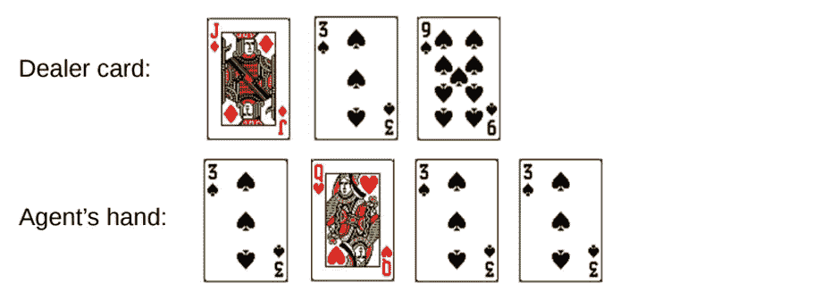

Round 2.

我们将使用 OpenAI 的健身房环境来实现这一点。把环境想象成用最少的代码运行 21 点游戏的界面，让我们专注于实现强化学习。方便的是，所有收集到的关于状态、动作和奖励的信息都保存在“观察”变量中，这些变量是通过运行游戏的会话积累的。

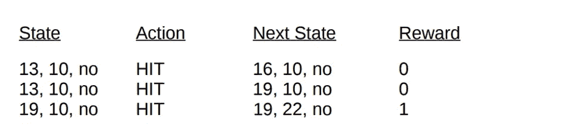

让我们从导入所有需要获取和绘制结果的库开始。

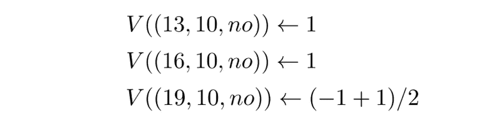

Final state values for the Blackjack demonstration.

# 接下来，让我们初始化我们的健身房环境，并定义指导我们的代理行动的策略。基本上，我们会继续打，直到我们的手牌总数达到 19 或更多，之后我们会站起来。

接下来，让我们定义一种方法，使用我们的策略为一集生成数据。我们将存储状态信息、采取的行动以及行动后立即获得的奖励。

最后，让我们定义首次访问蒙特卡罗预测函数。首先，我们初始化一个空字典来存储当前的状态值，同时初始化另一个字典来存储跨集的每个状态的条目数。

对于每一集，我们调用前面的 generate_episode 方法来生成关于状态值和状态后获得的奖励的信息。我们还初始化了一个变量来存储我们的增量回报。接下来，我们获得该集期间访问的每个州的奖励和当前状态值，并使用该步骤的奖励增加我们的 returns 变量。

```
import gym
import numpy as np
from matplotlib import pyplot
import matplotlib.pyplot as plt
from mpl_toolkits.mplot3d import Axes3D
from collections import defaultdict
from functools import partial
%matplotlib inline
plt.style.use(‘ggplot’)
```

回想一下，因为我们正在执行首次访问蒙特卡洛，所以我们在一集内只访问一个州一次。因此，我们在状态字典上执行条件检查，以查看该状态是否已经被访问过。如果满足这个条件，我们就可以使用前面定义的蒙特卡罗状态值更新过程来计算新值，并将该状态的观测值增加 1。然后我们在下一集重复这个过程，以便最终获得平均回报。

```
#Observation here encompassess all data about state that we need, as well as reactions to itenv = gym.make(‘Blackjack-v0’)
#Define a policy where we hit until we reach 19.
# actions here are 0-stand, 1-hitdef sample_policy(observation):
  score, dealer_score, usable_ace = observation
  return 0 if score >= 19 else 1
```

让我们跑起来看看我们的结果吧！

```
def generate_episode(policy, env):
# we initialize the list for storing states, actions, and rewards  
  states, actions, rewards = [], [], []# Initialize the gym environment  
  observation = env.reset()  
  while True:# append the states to the states list  
    states.append(observation)
# now, we select an action using our sample_policy function and append the action to actions list
    action = sample_policy(observation)
    actions.append(action)# We perform the action in the environment according to our sample_policy, move to the next state
    observation, reward, done, info = env.step(action)
    rewards.append(reward)# Break if the state is a terminal state (i.e. done)
    if done:
      break
  return states, actions, rewards
```

显示 21 点各手牌状态值的输出示例。

```
def first_visit_mc_prediction(policy, env, n_episodes):
# First, we initialize the empty value table as a dictionary for storing the values of each state
  value_table = defaultdict(float)
  N = defaultdict(int)
```

我们可以继续观察蒙特卡洛 5000 集，并绘制描述玩家和庄家手牌的任意组合的值的状态值分布。

```
for _ in range(n_episodes):
# Next, we generate the epsiode and store the states and rewards
  states, _, rewards = generate_episode(policy, env)
  returns = 0# Then for each step, we store the rewards to a variable R and states to S, and we calculate
  for t in range(len(states) — 1, -1, -1):
    R = rewards[t]
    S = states[t]
    returns += R# Now to perform first visit MC, we check if the episode is visited for the first time, if yes,
#This is the standard Monte Carlo Incremental equation.
# NewEstimate = OldEstimate+StepSize(Target-OldEstimate) if S not in states[:t]:
      N[S] += 1
      value_table[S] += (returns — value_table[S]) / N[S]
return value_table
```

所以让我们总结一下我们所学到的。

基于样本的学习方法允许我们在没有任何转换动力学知识的情况下，简单地通过采样来估计状态和状态动作值。

```
value = first_visit_mc_prediction(sample_policy, env, n_episodes=500000)
for i in range(10):
  print(value.popitem())
```

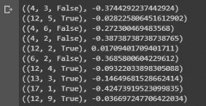

Sample output showing the state values of various hands of blackjack.

蒙特卡罗方法依赖于模型的随机抽样，观察模型返回的回报，并在正常操作期间收集信息，以定义其状态的平均值。

通过蒙特卡罗方法，广义策略迭代是可能的。

```
def plot_blackjack(V, ax1, ax2):
  player_sum = np.arange(12, 21 + 1)
  dealer_show = np.arange(1, 10 + 1)         
  usable_ace = np.array([False, True]) state_values = np.zeros((len(player_sum), len(dealer_show), len(usable_ace))) for i, player in enumerate(player_sum):
    for j, dealer in enumerate(dealer_show):
      for k, ace in enumerate(usable_ace):
        state_values[i, j, k] = V[player, dealer, ace]
  X, Y = np.meshgrid(player_sum, dealer_show)
  ax1.plot_wireframe(X, Y, state_values[:, :, 0])   
  ax2.plot_wireframe(X, Y, state_values[:, :, 1]) for ax in ax1, ax2:    ax.set_zlim(-1, 1)
    ax.set_ylabel(‘player sum’)
    ax.set_xlabel(‘dealer sum’)
    ax.set_zlabel(‘state-value’)fig, axes = pyplot.subplots(nrows=2, figsize=(5, 8),subplot_kw={'projection': '3d'})
axes[0].set_title('state-value distribution w/o usable ace')
axes[1].set_title('state-value distribution w/ usable ace')
plot_blackjack(value, axes[0], axes[1])
```

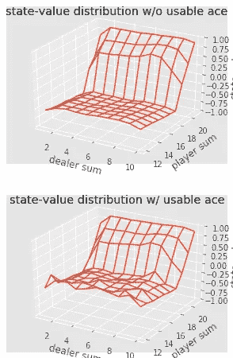

State-value visualization of different blackjack hand combinations

在 21 点游戏中，玩家和庄家所有可能组合的价值可以通过反复的蒙特卡洛模拟来判断，从而为优化策略开辟了道路。

*   这就结束了蒙特卡罗方法的介绍。在我们的下一篇文章中，我们将继续讨论基于样本学习的在线方法，以时间差异学习的形式。
*   我们希望您喜欢这篇关于走向数据科学的文章，并希望您查看我们的母出版物 [GradientCrescent 上的许多其他文章，这些文章涵盖了应用人工智能](https://medium.com/gradientcrescent)。
*   **参考文献**
*   萨顿等人。强化学习

怀特等人。阿尔伯塔大学强化学习基础

席尔瓦等人。阿尔，强化学习，UCL

[普拉特等人。艾尔，东北大学](http://www.ccs.neu.edu/home/rplatt/cs7180_fall2018/slides/monte_carlo.pdf)

Sutton et. al, Reinforcement Learning

White et. al, Fundamentals of Reinforcement Learning, University of Alberta

Silva et. al, Reinforcement Learning, UCL

[Platt et. Al, Northeaster University](http://www.ccs.neu.edu/home/rplatt/cs7180_fall2018/slides/monte_carlo.pdf)