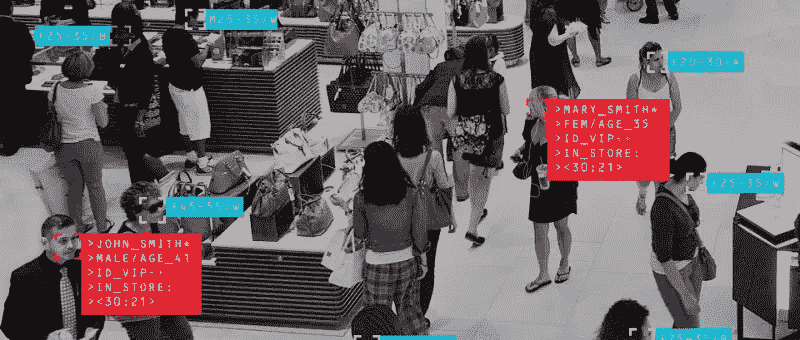
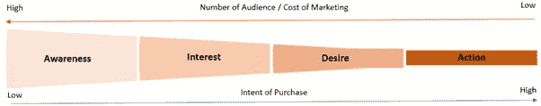
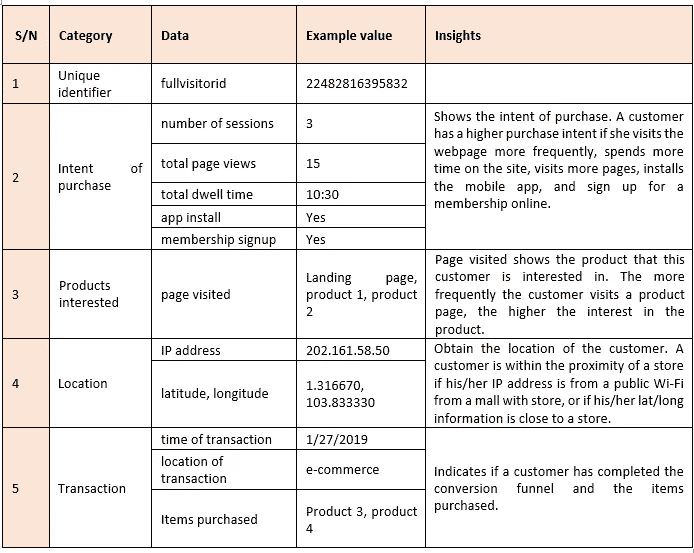
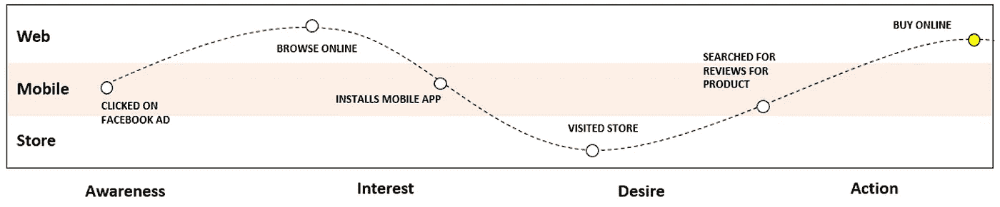
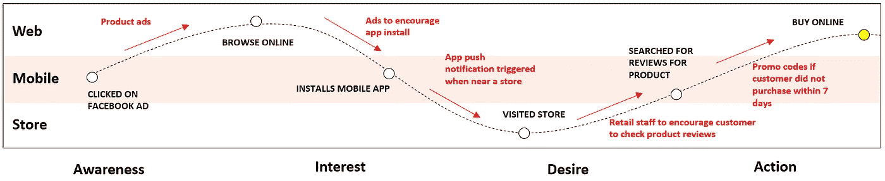

# 全渠道零售中优化顾客旅程的艺术和科学

> 原文：<https://towardsdatascience.com/optimizing-customers-journey-in-omni-channel-retailing-279e730a4cf9?source=collection_archive---------16----------------------->

嗨，我是一家全球美容零售公司的营销科学分析师。我工作的公司是该地区最成熟的全渠道零售商之一。

随着数据分析的出现，全渠道零售正处于历史上最激动人心的前沿。通过客户的线上和线下旅程收集的数据提供了对客户行为的独特见解。当有效使用时，这种见解为公司提供了改善顾客购物体验的机会。这将反过来增加客户的转换和公司的收入和利润。

在本文中，我们将尝试使用纯粹的 web/app cookie 数据(来自 Google Analytics)来了解客户的旅程。这将为我们提供关于适当营销信息的见解，以便在正确的时间接触到每个客户。

**转换漏斗**

**Figure 1 — Conversion Funnel**

我们将使用一个由四个阶段组成的简单转换漏斗:意识>兴趣>欲望>行动来描述客户的旅程。客户的购买意图在每个阶段都不同，并且随着不同阶段而增加。因此，重要的是首先要确定客户所处的意向阶段，以便能够有效地针对客户的需求。

**使用的数据和见解**

我们能够从网络 cookies 收集的数据中识别出客户的购买意向所处的阶段。下面的表 1 显示了可以捕获的各种类型的数据以及可以从这些数据中获得的见解。

Table 1 — Data Used and Insights

在确定了客户的意向阶段后，公司可以应用适当的营销策略，将客户推向转化漏斗。该公司将能够向客户发送相关的和有针对性的营销信息。这有助于最大限度地提高公司的营销效率。

**客户之旅**

**Figure 2 — Customer Journey (Unassisted)**

鉴于其全渠道零售业务的性质，该公司客户的转换漏斗横跨物理和数字空间。客户可能通过数字渠道了解新产品，但通过实体店购买，反之亦然。

如上面的图 2 所示，客户首先在脸书上看到一个正在他/她的手机上销售的产品的广告。他/她知道该产品，并且对该产品感兴趣，在线浏览该产品。几天后，客户决定安装该公司开发的移动应用程序，并前往一家零售店实地查看产品。在商店中，顾客搜索产品的用户评论，最终对产品满意，在线购买产品。

图 2 中的图解显示了理想的顾客旅程，在顾客购买意向的各个阶段，不需要公司的任何干预。因此，只需要最少的营销支出。然而，在大多数情况下，公司需要干预转化漏斗的每一步，以“推动”客户进入下一步。

**将客户旅程与洞察力相结合**

**Figure 3 — Customer Journey (Assisted)**

因此，重要的是，我们首先要准确识别客户所处的意向阶段。如上所述，这是通过分析获得的 cookie 数据来执行的。如上面图 3 所示，自动触发器(即营销信息)被设置到位，以将客户“推向”转化漏斗的下一步。各阶段的意图和相关的营销行动，该公司可以执行如下所述。

**认知:**在认知阶段，让顾客意识到产品的存在是很重要的。新产品尤其如此。因此，公司可以在社交媒体网站上购买广告空间，显示针对所需受众的预期广告，以提高产品的公众认知度。

**关注度**:点击潜在客户广告的客户表示对广告中的产品感兴趣。根据客户在第一次访问中点击的产品，公司可以通过以横幅或视频的形式推送更多类似的类别/品牌广告来进一步增加和激起客户的兴趣。

**兴趣到欲望:**为了让顾客从兴趣到欲望阶段，在大多数情况下，顾客需要测试产品，尝试各种功能，感受产品的质地和质量。因此，为了让顾客进入这一阶段，顾客去实体店做上述事情是很重要的。有了位置数据，如果客户在商店附近，公司可以发送推送通知或 SMS 来吸引客户，并将其重定向到实体店。

在商店里，零售顾问可以鼓励顾客访问该公司的网页，或者使用该公司的移动应用程序来阅读独立用户对产品的评论，或者找到任何其他附加信息。当顾客在商店中访问网页时，位置数据或 IP 地址将被捕获，并且将指示顾客已经访问了商店。这将有助于公司了解客户很可能已经发展到转换漏斗中的期望阶段。

**行动欲望**:了解了顾客在此阶段的经历后，如果顾客没有在店内购物，公司可以制定行动策略，将顾客从欲望阶段转变为行动阶段。

**哪里可以找到谷歌分析数据**

Google Analytics 与 Bigquery 进行了 360 度集成，这使我们能够在会话和点击率级别深入了解网站性能。但是，如果您无法访问 Google Analytics 或 Bigquery，也可以从销售 Google 商品的电子商务网站 Google 商品商店访问 Google Analytics 数据样本。

**结论**

Cookie 数据能够为我们提供关于客户对各种产品的兴趣以及他/她购买各种产品的意图的广泛见解。这些数据与来自客户旅程的其他信息(如交易数据、会员数据)相结合时至关重要，可用于制定业务行动战略，以便将客户移至转化漏斗下方。当数据得到有效利用时，公司将能够提高其营销效率以及相应的收入和利润。

[孟勇](https://www.linkedin.com/in/mylee1/)