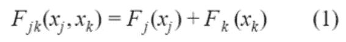
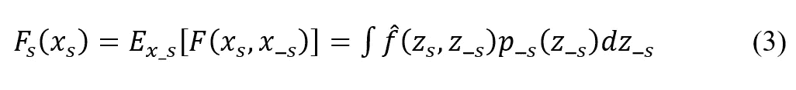
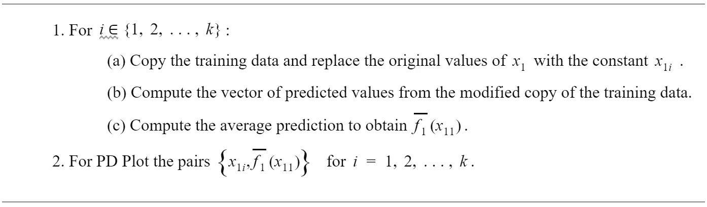
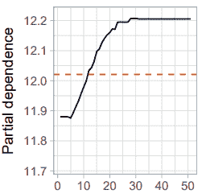
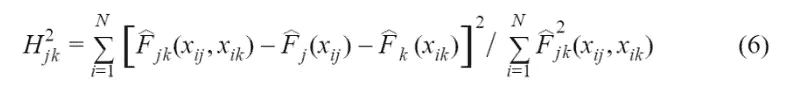
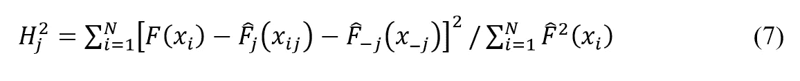
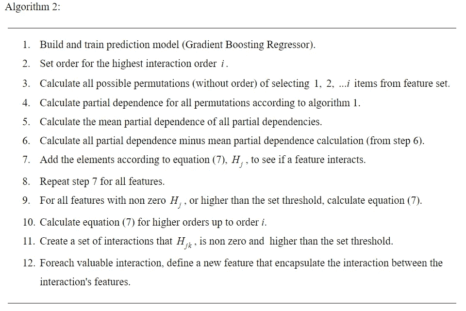

# 优化特征生成

> 原文：<https://towardsdatascience.com/optimizing-feature-generation-dab98a049f2e?source=collection_archive---------9----------------------->

Image by [jimmikehank](https://pixabay.com/users/jimmikehank-2092924/) Sager from [Pixabay](https://pixabay.com/?utm_source=link-attribution&amp;utm_medium=referral&amp;utm_campaign=image&amp;utm_content=2755908)

要素生成是从一个或多个现有要素创建新要素的过程，可能用于统计分析。该过程增加了在模型构建期间可访问的新信息，因此有望产生更准确的模型。在本文中，我描述了如何使用基于 *H* 统计的特征交互检测算法来改进特征生成过程。这篇文章是我在 [Tapreason](https://tapreason.com/) 工作的一部分。

# 动机

在机器学习和模式识别中，特征是正在观察的现象的单个可测量的属性或特征。收集和处理数据可能是一个昂贵且耗时的过程。因此，在模式识别、分类和回归的有效算法中，选择信息丰富的、有区别的和独立的特征是至关重要的一步。在我们生活的信息时代，数据集在实例数量和特征数量上都变得越来越大。拥有数万个或更多要素的数据集已经变得很常见。此外，算法开发人员经常使用一种称为特征生成的过程。特征生成是从一个或多个特征创建新特征的过程，可能用于统计分析。通常，这个过程是向模型中添加新的信息，使其更加准确。当存在特征交互时，特征生成可以提高模型精度。通过添加封装了特征交互的新特征，新信息变得更容易被预测模型(PM) [1]访问。在这篇文章中，我描述了如何通过检测有意义的交互和忽略无意义的交互来使用特征交互检测来改进特征生成过程。

# 方法学

如果作为改变 *xⱼ* 的值的结果的 F(x)的值的差异依赖于 *xₖ* 的值，则函数 F(x)被认为展示了其两个变量 *xⱼ* 和 *xₖ* 之间的相互作用。对于数值变量，这可以表示为:

为了避免在特征生成过程中生成无意义的特征，我们使用 *H* -statistic 来检测特征交互并评估其强度。弗里德曼&波佩斯库[【2】](https://arxiv.org/pdf/0811.1679.pdf)将 *H* 统计量定义为相互作用强度的度量。背后的思想是，如果两个特征 *xⱼ* 和 *xₖ* 不相互作用，则 *F(x)* 对集合*(xⱼ,xₖ)**【fⱼₖ(xⱼ,xₖ)*的偏依赖可以分解为对每个变量的各自偏依赖之和:

*Fⱼ* ( *xⱼ* )是一个函数 *F(x)* 的部分依赖。

*Fⱼₖ(xⱼ,xₖ)* 是联合( *xⱼ和 xₖ)* 部分依赖 *F(x)*

如果*fⱼₖ(xⱼ,xₖ)-fⱼ(xⱼ)-fₖ(xₖ)=0*那么创造出包含 *xⱼ* 和 *xₖ* 的新特征就毫无意义。

如果特征 *xⱼ* 和 *xₖ* 确实相互作用，则另一项应该被添加到等式(1)的左侧，表示相互作用的效果。

此外，如果给定变量 *xⱼ* 不与任何其他特征交互，那么:

这里 F_ *ⱼ* (x_ *ⱼ* )是 *F(x)* 对除 *xⱼ* 以外的所有特征的部分依赖。

如果*fⱼₖ(xⱼ,xₖ)-fⱼ(xⱼ)-f_ⱼ(x_ⱼ)=0*根本没有必要创造涉及 *xⱼ* 的新功能*。*

# 部分依赖

函数 *F(x)* 的部分相关性是一个或多个特征对机器学习模型[【3】](https://statweb.stanford.edu/~jhf/ftp/trebst.pdf)的预测结果的边际效应。给定预测器特征的任何子集 *xₛ* ，由 *s ⊂ {1，2，.。。，n}* ，函数 *F(x)* 对 *xₛ* 的偏相关定义为:

其中 *xₛ* 是子集中变量的一组规定的联合值，期望值超过所有变量的边际(联合)分布 *x_ₛ* 未在 *xₛ* 中表示。p_ₛ(z_ₛ)是 *z* _ *ₛ* 的边际概率密度。等式(2)可以通过以下方式从一组训练数据中进行估计:

其中 zᵢ,_ₛ *(i = 1，2，.。。，n)* 是训练样本中出现的 z_ₛ的值；也就是说，我们平均出模型中所有其他预测因素的影响。在实践中，构造部分依赖关系(3)相当简单。为了简化，让 *zₛ=x₁* 是具有唯一值的感兴趣的预测变量{ *x ₁₁，x ₁₂，。。。，x₁ₖ* }。响应对 *x₁* 的部分依赖性可以通过以下算法 1[【4】](https://journal.r-project.org/archive/2017/RJ-2017-016/RJ-2017-016.pdf)来构建:

*算法 1* :

上述算法可能计算量很大，因为它涉及对训练记录进行 k 次*遍历。幸运的是，该算法可以很容易地并行化，也可以很容易地扩展到两个或更多特征的更大子集。*

部分相关性图显示了一个或两个特征对机器学习模型的预测结果的边际影响。部分相关性图可以显示目标和特征之间的关系是线性的、单调的还是更复杂的。这些图让分析师更容易理解和解释“黑盒”复杂模型。

Figure 1: Monotonically increasing partial dependence plot [[2]](https://arxiv.org/pdf/0811.1679.pdf).

图中的红色虚线代表平均值。

# **H 统计量**

部分相关函数的性质用于构造统计量，以测试各种类型的交互作用效应。从等式(1) + (2)如果在特征 *j* 和*k*之间存在二阶相互作用，并且只有二阶相互作用， *∆Fⱼₖ(xⱼ,xₖ)* 不为零。

*Fⱼ(xⱼ)* 是一个函数的部分依赖 *F(x)* 。

由 Friedman 和 pope scu[【2】](https://arxiv.org/pdf/0811.1679.pdf)引入的 *H 统计量*、 *Hⱼₖ* 测量预测的变化有多少取决于特征的相互作用。 *Fⱼₖ(xⱼ,xₖ)* 未被 *Fⱼ(xⱼ)+Fₖxₖ* 捕获的方差分数范围从 0 到 1，值越大表明交互作用效应越强。对于双向相互作用(二阶),Hⱼₖ₂定义为:

其中 *i=1，2，…，N* 是数据中的观察次数。相互作用强度 *Hⱼₖ* 然后被计算为 *Hⱼₖ=* (H ⱼₖ) ⁻。 *H-* 统计并不局限于双向相互作用，可以推广到任意阶的相互作用效应。类似地，测试指定特征 *xⱼ* 是否与任何其他特征相互作用的统计数据为:

这里 F_ *ⱼ* (x_ *ⱼ* )是 *F(x)* 对除 *xⱼ* 之外的所有特征的部分依赖。

在两个特征*的情况下，xₗ* 和 xₖ*与 xⱼ* 互动。等式(6)和(7)仅用于双向相互作用( *xⱼ,xₖ* )和( *xⱼ,xₗ* )，但是它们可以扩展到三向(三阶)相互作用，包括( *xⱼ,xₗ,xₖ* )。

评估*H-统计量*是昂贵的，因为它在所有数据点上迭代，并且在每个点上，必须评估部分相关性，这又通过所有 *N* 数据点来完成。在最坏的情况下，我们需要对机器学习模型预测函数的 *2N* 个调用来计算双向 *H 统计量* ( *j 对 k，等式 6* 和 *3N* 用于总的 *H 统计量* ( *j 对 all，等式 7* )。为了加速计算，我们可以从 *N* 个数据点进行采样。这具有增加部分相关性估计的方差的缺点，这使得 *H 统计量*不稳定。因此，当使用采样来减少计算负担时，应该采样足够的数据点。

# 使用 H-统计量生成有意义的特征

有效的特征生成不会生成对预测没有贡献的无意义的特征，但仍会增加特征选择的复杂性和计算时间。以下算法(*算法 2* )使用 *H 统计*作为特征交互检测算法，并使用结果作为特征生成过程的输入。因此，特征生成过程将生成更少的无意义特征，并减少计算时间。

[1] Suzanne van den Bosch:“预测分析解决方案中的自动特征生成和选择”，Radboud 大学计算科学学院硕士论文