# 为群体水平预测优化个体水平模型

> 原文：<https://towardsdatascience.com/optimizing-individual-level-models-for-group-level-predictions-a66e675138ff?source=collection_archive---------25----------------------->

## 第一部分——偏倚分析

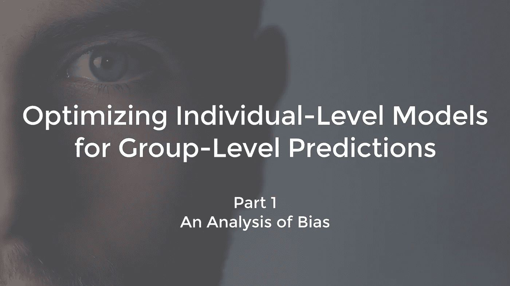

# 介绍

这篇文章的目的是提出我对机器学习(特别是医疗保健)中一个非常普遍但很少解决的问题的一些想法:如何在只给定个体水平数据的情况下，以优化预定损失函数(例如，MAE 或 MSE)的方式构建群体水平的预测？

如果您首先创建一个针对某个损失函数进行优化的个人级模型，然后取预测值的平均值，那么您是否会自动针对群体级的相同损失函数进行优化？事实证明，虽然 MSE 的答案恰好是“是”,但 MAE 的答案却是响亮的“不是”!

在这篇文章中，我解释了为什么在个体层面使用相同损失函数的下意识方法是错误的。

这是一个关于揭开这个问题真正本质的故事。作为这个探索的一部分，我使用了彼得·霍尔的一个有趣的定理，我发现这个定理的证明有点难以理解。作为对社区的服务，在[第 2 部分](https://medium.com/@hilafhasson/optimizing-individual-level-models-for-group-level-predictions-f48f491363f8)中，我将展示该定理的背景故事，并提供一个比他在论文中提供的稍微更自然的证明，并填充原始论文中遗漏的所有关键细节。

这篇文章中看到的所有情节代码都可以在[这个 GitHub repo](https://github.com/lumiata/tech_blog/blob/master/Individual_Model_Optimization/Individual_Model_Blog_Code.ipynb) 中找到。

# 示例和假设

为了使这种探索更容易理解，我将使用一个具体的例子并修正我的假设。

*   *示例*:一家医疗保险公司希望估算下一年雇主团体的人均成本(即团体的总成本除以成员数量)，其中每个雇主团体由一定数量的个人成员组成。
*   *基本假设*:给你训练和测试数据，包括个人层面的数据和成员到团队的映射。训练数据具有由每个人在下一年发生的成本表示的目标值，而测试数据没有目标值。测试数据和训练数据可能具有不同的组。

剩下的工作就是指定在集团层面上与什么“真实值”进行比较。为了说明为什么在个体层面优化与在群体层面优化相同的损失函数是错误的，最简单的方法是使用以下假设:

*   *假设 A* :对于每个组，将其真值设为其成员的平均目标值。

我们稍后还将考虑另一个假设，如果你允许成员的变化，这个假设会更自然地出现。

# 为什么要有一个独立的模型呢？

在组级优化特定损失函数的一种方法是简单地创建优化该损失函数的组级模型，其特征是工程聚合的个体级特征。但是群体的数量大概比个体的数量小得多，所以人们会认为这样的模型会有很大的差异。个人层面和团体层面相结合的方法将是最明智的。

“为什么不用[递归神经网络](https://en.wikipedia.org/wiki/Recurrent_neural_network)？这样，您就可以创建一个使用所有数据的组级模型！”，我听到你哭了。嗯……这将使用所有个体水平的特征，而不是未聚集的目标值，除非使用特殊的损失函数。即使这样，RNN 的是顺序依赖的，而组成员不是！所以让我们继续称之为“实验性的”。

无论哪种方式，你的群体层面的预测只能从做好个体层面的模型中获益。所以让我们开始吧！

# 关于 MAE/MSE 优化的直觉

底线是:为 MSE 优化意味着你在估计平均值；针对 MAE 进行优化意味着您正在估计中值。

这到底是什么意思？设 ***Y*** 为目标值，设 ***X_1，…，X_n*** 为特征。如果你的特征值是 ***X_1=x_1，…，X_n=x_n*** ，那么给定那些特征的目标值 ***Y|X_1=x_1，…，X_n=x_n*** 是一个随机变量，而不是一个常数。换句话说，你的特征值并不能决定目标。例如，如果你正在预测成本，那么完全可以想象两个具有相同特征值的个体具有不同的成本；尽管知道这些特征值确实会改变成本的分布。

如果你是针对 MSE 进行优化，那么在你的模型中插入 ***(x_1，…，x_n)*** 会试图预测 ***E(Y|X_1=x_1，…，X _ n = X _ n)***；然而，如果您正在为 MAE 进行优化，您的模型将尝试预测 ***中值(Y|X_1=x_1，…，X_n=x_n)*** 。

事实上，如果 ***f(x_1，…，x_n)*** 是损失函数为 MSE 的机器学习模型在这些特征值处的模型预测，那么它将试图近似使以下各项最小化的 ***a*** :

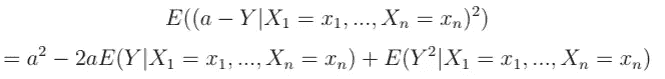

这最后一个表达式是 ***a*** 中具有全局最小值 ***E(Y|X_1=x_1，…，X_n=x_n)*** 的抛物线。

类似地，如果 ***f(x_1，…，x_n)*** 是损失函数为 MAE 的机器学习模型在这些特征值处的模型预测，那么它将尝试近似将以下各项最小化的 ***a*** :

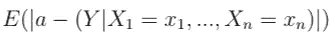

最小化该表达式的 ***a*** 为 ***median(Y|X_1=x_1，…，X_n=x_n)*** 。(要看到这一点，你必须摆弄积分；这是一个简单但令人讨厌的练习。)

技术提示:给定一个事件的随机变量的条件概率，只有当你设定的事件有正概率时才有意义。试图将定义扩展到零概率事件注定是不明确的，除非我们指定一个限制程序；参见[Borel-Kolmogorov 悖论](https://en.wikipedia.org/wiki/Borel%E2%80%93Kolmogorov_paradox)。如果 ***X_i*** 中至少有一个是连续的，那么 ***P(X_1=x_1，…，X_n=x_n)=0*** ，这就暗示 ***Y|X_1=x_1，…，X_n=x_n*** 没有任何意义。(本科教材中常见的定义为 ***Y|X_1=x_1，…，X_n=x_n*** 不是坐标不变的。对于更高级的读者来说:对次∑代数而不是事件进行调节会产生相同的问题，因为最终的随机变量在“几乎确定相等”之前是唯一的，这意味着零概率事件可以是例外。)我们可以也将会通过将特性的值限制为计算机能够表示的值来优雅地避免这个问题。这样，即使是“连续的”变量实际上也是离散的，一切都是定义明确的。

# 问题是

固定一组尺寸为 ***m*** 的，设

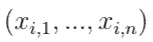

成为第 ***i*** 人的特征。如果我们正在创建一个优化 MSE 的个体水平模型，那么结果的平均值就是

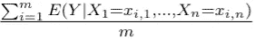

根据期望的线性度，这等于

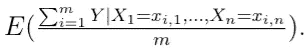

太好了！换句话说，通过在个人层面优化 MSE，您也在团队层面优化 MSE！

现在让我们对梅做同样的分析。如果我们正在创建一个优化 MAE 的个体水平模型，那么结果的集合就是对

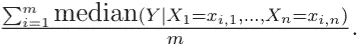

但那是非常非常非常遥远的事

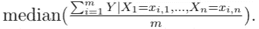

这是一个简单的例子，说明总和的中位数与中位数之和相差甚远，即使随机变量都是独立同分布的:

为了设置这个例子，我将使用比例为 ***200*** 和形状为 ***1*** 的伽玛分布。这个分布看起来是这样的:

(本帖中看到的剧情代码可以在 [this GitHub repo](https://github.com/lumiata/tech_blog/blob/master/Individual_Model_Optimization/Individual_Model_Blog_Code.ipynb) 中找到。)

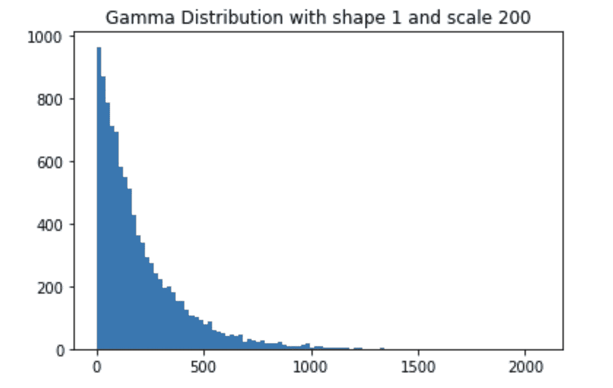

**Figure 1**

现在将 ***X_i*** 作为遵循该分布的 i.i.d。下面是他们的中位数与平均值的中位数的比较:

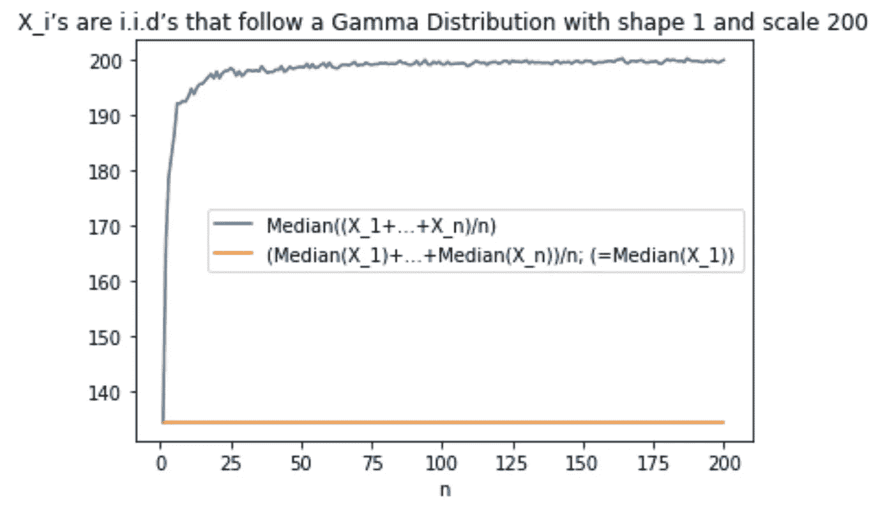

**Figure 2**

你也看到了，这个差距挺大的！

# 对于群体级 MAE，优化个体级 MSE 优于优化个体级 MAE

如果一个群体很大，那么可以合理地假设

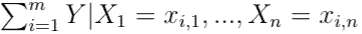

是近似正常的；正态分布的中值就是它的平均值。因此，如果您在个人层面优化 MSE，然后取预测的平均值，您将近似估计大群体的中值！乍一看，这似乎是反直觉的:不仅对于组级 MSE，而且对于组级 MAE，在个体级优化 MSE 都优于在个体级优化 MAE。

但是，我们应该期望对小群体的偏见有多严重呢？(事实将会证明，秘密地关键是使用中心极限定理的误差估计。)

# 彼得·霍尔的一个结果

这激起了我的兴趣。所以我开始寻找关于 i.i.d .总和的中位数的结果。我找到了彼得·霍尔的《关于独立变量和的众数和中位数的极限行为》，在那里他证明了下面的结果。

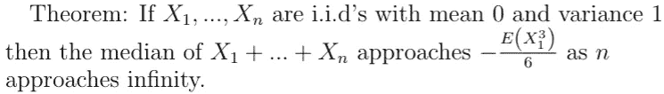

(见本帖第二部分更深入的理解为什么这个定理是真的。)由于 ***X_i*** 都是同分布的，为了便于标注，我们就简单地让 ***X := X_1*** 吧。如果我们不假设***X _ I***s 有均值 ***0*** 和方差 ***1*** 的话，一个快速的回包络计算，还原到归一化的情况下，表明这还原到如下的近似值:

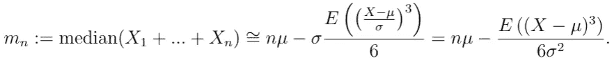

请注意，这是一个渐近结果！为了能够在上面讨论的机器学习环境中使用它，我们必须首先确保这个近似对于小的 ***n*** 是合理的。让我们做一个快速的概念验证:

(本帖中看到的剧情代码可以在[这个 GitHub repo](https://github.com/lumiata/tech_blog/blob/master/Individual_Model_Optimization/Individual_Model_Blog_Code.ipynb) 中找到。)

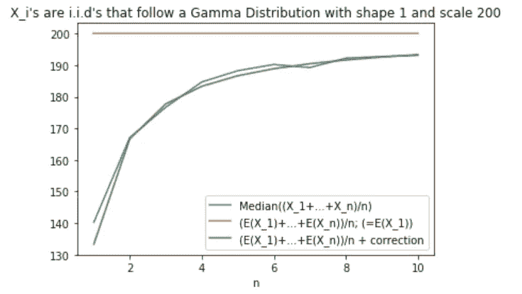

**Figure 3**

这是相当准确的！

# 机器学习环境中的偏差估计

对于每一组，我们将尝试估计

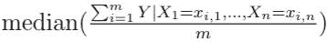

为了那个团体。被加数不是独立同分布的，所以霍尔的结果不能直接应用。为此，我们可以尝试将假设 A 替换为:

*   *假设 B:* 对于每一组，假设其“真值”是其成员*真值的 **m** 个样本重复的均值的期望值。*

(可以说，假设 B 在现实生活中出现得更多。在组级预测中，成员通常不是固定的，但是当前成员的目标值表示未来成员的分布目标值。)

既然目标值是 i.i.d .的平均值(因为采样是重复进行的)，我们可以采用霍尔近似值。固定一个组，设 ***T_1，…，T_m*** 为采样，重复，如假设 b 中所述。 ***T_i*** 现在是 I . I . d,***T:= T _ 1***。我们现在面临的挑战是为每个组逼近***V(T)******E((T-μ))***。这可能很困难，因为我们最想纠正偏差的群体是小群体。

一种简单化的做法是将*估计为***【Y】***，将 ***E((T-μ) )*** 估计为 ***E((Y-E(Y)) )*** 。进而，通过取我们数据中目标值的平均值来估计***【Y】***和 ***E((Y-E(Y)) )*** ，并将这些估计值分别表示为***ˇ***和***ζζζ_ 3***。这些估计是否有效取决于各组之间的差异——它们越相似，偏差校正就越好。无论哪种方式，这些近似值足以获得一个相对清晰的图片，说明一个小组需要有多小，才能使偏差超出你的舒适水平。也就是说，粗略的估计是，如果一个组的大小是 ***m*** ，那么对使用 MSE 训练的单个模型进行平均应该具有大约*

*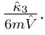*

*对于这个数字大得令人无法忍受的组，我建议格外小心:*和***ζζ_ 3***可能不是足够好的估计，并且可能导致糟糕的偏差校正。我只是建议将这种规模的组标记为需要偏差校正，并根据数据和您想到的特定应用对所需的偏差校正进行更多研究。

(请注意，虽然使用贝叶斯方法使您能够从 ***Y|X_1=x_{i，1}，…，X_n=x_{i，n}*** 的分布中进行采样很有吸引力，但这些方法的普通版本假设 ***Y|X_1=x_{i，1}，…，X_n=x_{i，n}*** 的分布为如果是这样的话，就不会有任何偏差需要校正……这也适用于在神经网络中使用预测时的漏失，根据亚林·加尔和邹斌·加赫拉马尼的工作[,这大致相当于在适当定义的高斯过程设置中对后验样本进行采样——但该设置也假设误差呈正态分布。)](http://proceedings.mlr.press/v48/gal16.pdf)**

***原贴于* [*卢米亚塔*](https://medium.com/lumiata)**

**如果这个帖子引起了你的兴趣，你想用类似的问题挑战自己，Lumiata 正在招聘！请检查 Lumiata 的[打开位置](https://www.lumiata.com/careers.html)。**

**GitHub:[https://github.com/lumiata/tech_blog](https://github.com/lumiata/tech_blog)**

**在 www.lumiata.com[拜访卢米娅塔](http://www.lumiata.com/)，并通过[@卢米娅塔](http://www.twitter.com/lumiata)在推特上关注。**

**在 LinkedIn 上找到卢米娅塔:[www.linkedin.com/company/lumiata](https://www.linkedin.com/company/lumiata/)**

*****引文*** *:***

***1。Hall，P. (1980)关于独立随机变量和的众数和中位数的极限行为。安。概率 8 419–430。***

***2。Gal，y .和 Ghahramani，Z. (2016)辍学作为贝叶斯近似:表示深度学习中的模型不确定性。
ICML。***