# 为群体水平预测优化个体水平模型

> 原文：<https://towardsdatascience.com/optimizing-individual-level-models-for-group-level-predictions-f48f491363f8?source=collection_archive---------31----------------------->

## 第 2 部分——独立同分布变量之和的中位数

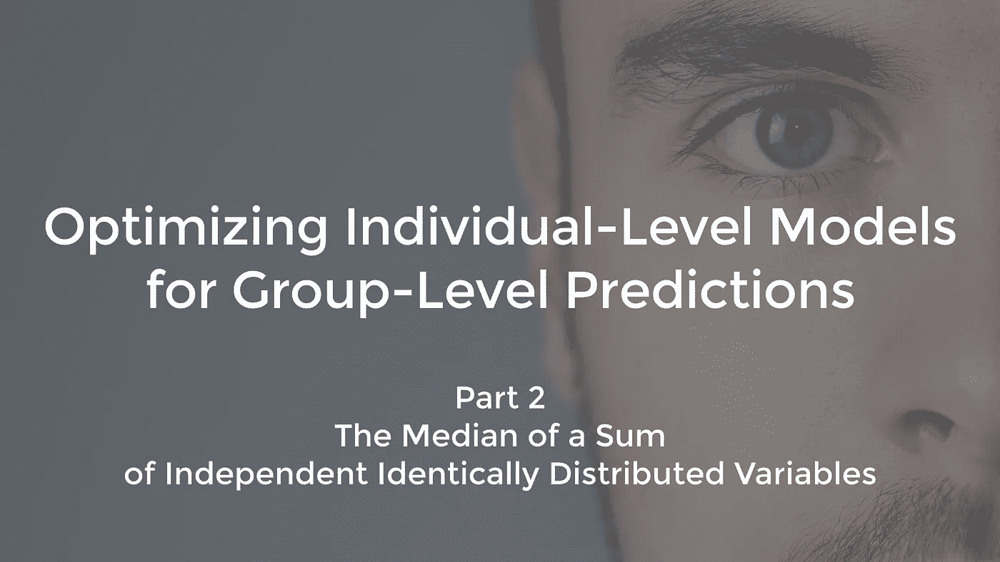

# 介绍

在[第一部分](https://medium.com/@hilafhasson/optimizing-individual-level-models-for-group-level-predictions-a66e675138ff) —偏倚分析中，我探讨了来自个体水平模型的群体水平预测中的偏倚。在那里，我使用了彼得·霍尔的以下定理(“关于独立变量和的众数和中位数的极限行为”):

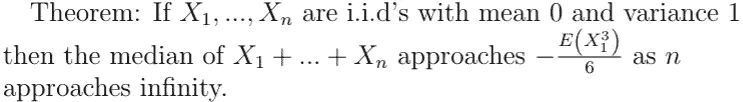

但是为什么会这样呢？我发现霍尔的论文有些难以理解，但非常有趣。作为对社区的一种服务，在这篇文章中，我将尽可能详细地介绍用于证明这一结果的工具，并完整地提供霍尔证明的一个变体。我已经改变了证明中的一些步骤，使证明更加自然，消除了他对 Esseen 定理的依赖，而是直接使用一种称为 Edgeworth expansions(我介绍的)的数学工具来证明他的结果。我还补充了原始证据中缺失的一些关键细节。证明的基本轮廓非常吸引人:用一个中心极限定理的误差估计来证明结果。

# Edgeworth 展开式——中心极限定理的误差估计

证明[中心极限定理](https://en.wikipedia.org/wiki/Central_limit_theorem) (CLT)及其许多变种最简单的方法就是看随机变量的[特征函数](https://en.wikipedia.org/wiki/Characteristic_function_(probability_theory))。随机变量 ***X*** 的特征函数定义为

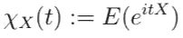

特征函数有用的原因有三:

1.  独立变量和的特征函数是它们各自特征函数的乘积:

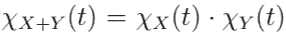

这使得计算变得简单。

2.知道了随机变量的特征函数，就决定了它的分布。其实 ***X*** 的特征函数无非是 ***X*** (如果有)的概率密度函数的[傅里叶变换](https://en.wikipedia.org/wiki/Fourier_transform)，所以这只是傅里叶对偶——傅里叶变换的逆傅里叶变换才是原函数！(注意:由于实数的[群](https://en.wikipedia.org/wiki/Group_(mathematics))与其[对偶群](https://en.wikipedia.org/wiki/Pontryagin_duality#The_dual_group)被认定为“[非自然的](https://en.wikipedia.org/wiki/Natural_transformation#Unnatural_isomorphism)”，在该词的[范畴理论](https://en.wikipedia.org/wiki/Category_theory)意义上，傅立叶对偶遭受多种约定。我们将遵循这样的约定，函数*的傅立叶变换为*

*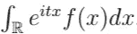*

*而函数 ***f(t)*** 的逆变换是*

*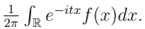*

*按照这个约定， ***X*** 的特征函数的逆变换就是 ***X*** 的 pdf，如果有的话。)*

*3.最后，*

*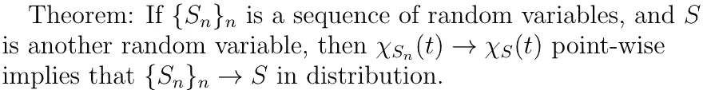*

*这就是[李维连续性定理](https://en.wikipedia.org/wiki/L%C3%A9vy%27s_continuity_theorem)。

CLT 的标准证明完全遵循这种方法。通过先归一化，您可以将 CLT 简化为:*

*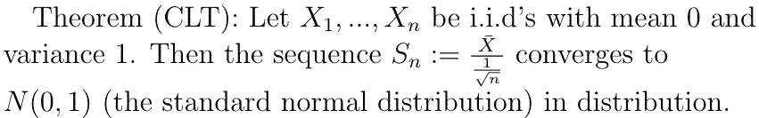*

*有人证明了这一点*

*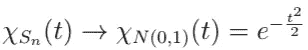*

*就要点而言。

关键的一步是*

*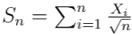*

*因此:*

*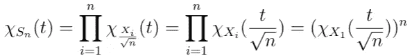*

*，其中最后一步是因为 ***X_i*** 都是同分布的。为了简化符号，让 ***X:=X_1*** 。

显示出*

*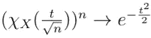*

*逐点相对容易，尽管细节与讨论的其余部分无关。Edgeworth expansions 是霍尔用作激励的数学工具(尽管没有直接使用),其背后的思想是相似的:*

*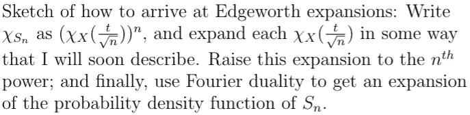*

*具体来说，就是写一个 ***X*** 的特征函数[***Log***的麦克劳林展开](https://en.wikipedia.org/wiki/Taylor_series)，其中 ***Log*** 是 ***log*** 的[主分支](https://en.wikipedia.org/wiki/Principal_branch#Complex_logarithms)，如*

*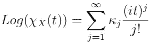*

*对于喜欢给事物命名的人来说，这些 ***κ_j*** 通常被称为 ***X*** 的[累积量。一般来说，累积量没有直观的解释，但前三个有:***【κ_ 1 = E(X)******【κ_ 2 = V(X)******κ_ 3 = E((X—E(X)))***。特别是对于我们: ***κ_1 = 0*** 和 ***κ_2 = 1*** 。

因此 ***X*** 的特征函数的展开式为:](https://en.wikipedia.org/wiki/Cumulant)*

*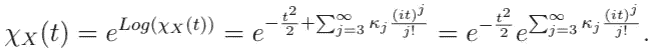*

*把那个插进去*

*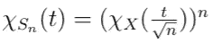*

*然后得到*

*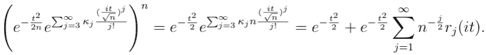*

*这最后一个等式仅仅是利用了***【eˣ】***的麦克劳林展开式；每个 ***r_j*** 都是实系数的多项式 ***3j*** ，如果需要可以计算。

现在剩下的就是应用一个逆傅立叶变换来得到一个 ***S_n.*** 的概率密度的展开式，这是相对容易的——这里有一个技巧:*

*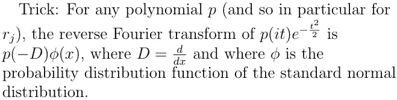*

*(为什么？度 ***0*** 格为标准，单项格通过反复推导度 ***0*** 格而得出；一般情况下遵循单项式的情况。)诀窍继续:推导标准正态分布 ***j*** 倍的概率密度函数实际上很容易计算(通过交换导数和积分)，对于任何 ***j*** 它总是标准正态的 pdf 的一些多项式倍。(以这种方式产生的多项式被称为[埃尔米特多项式](https://en.wikipedia.org/wiki/Hermite_polynomials)，但是确定它们的性质对于我们的目的来说并不重要。)

这一切的底线是:*

*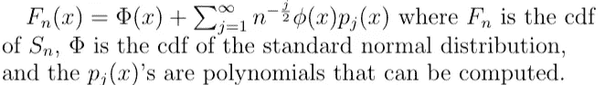*

*所以我们只是得到了一个中心极限定理的误差估计！weeee lll……事实证明，Edgeworth 扩张几乎从不收敛…所以以上是我们讲述的更多关于 Edgeworth 扩张的激励性睡前故事。但事实证明，在极其温和的条件下，Edgeworth 展开式是“渐近展开式”，也就是说对于每个 k:*

*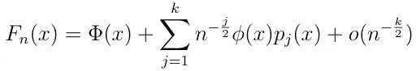*

*只要***【e(|x|^(k+2】)<∞***和 ***X*** 满足称为“克莱姆条件”的条件，这是比具有连续 pdf 更弱的条件。证明这一点需要一点努力，我参考了彼得·霍尔的书“自举和 Edgeworth 展开”，第 2.4 节和第 5 章，以了解细节。*

# *从 Edgeworth 展开式到中位数的近似值*

*在霍尔的论文中，相当于这一整节的短语是“它遵循那个”，没有给出解释。正如你将看到的，这个论点需要一些细微的差别。但是细节确实解决了…！

让:*

*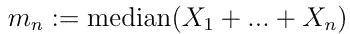*

*因为*

**

*由此可见:*

*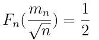*

*让我们把它代入上面的 Edgeworth 展开式:*

*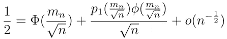*

*请注意，由于标准正态的 pdf 是指数型的，因此的分子*

*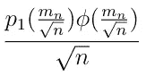*

*是有界的，因此这个分数收敛到 0。这意味着*

**

*因此:*

*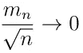*

*(我们最终想证明 ***m_n*** 收敛，但这是证明其余部分所需的第一步。)

现在让我们用麦克劳林展开式:*

*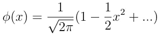*

*它的收敛半径是无穷大。由此可见:*

*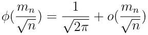*

*可以看出，Edgeworth 展开式中的***P1(x)***项等于 ***-κ_3(x -1)/6*** ，因此:*

*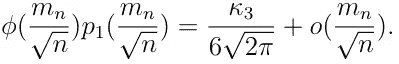*

*特别是:*

*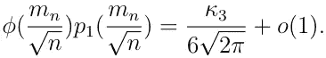*

*因此，我们知道:*

*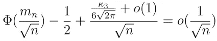*

*其中，乘以 ***n 的平方根*** 后暗示:*

*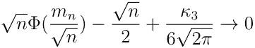*

*我们准备好大开杀戒了。使用 Maclaurin 展开式:*

*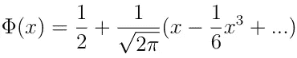*

*我们可以看到:*

*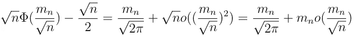*

*特别是:*

*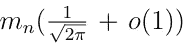*

*因此当 ***n*** 接近无穷大时:*

*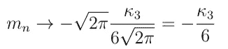*

*我们完事了。*

# *关于非 i.i.d .的霍尔式结果的最后说明*

*可以理解的是，独立但不同分布的随机变量和的中值没有渐近结果。然而，令人惊讶的是，确实存在一种可用于非独立同分布随机变量的 Edgeworth 展开式的变体，它在某种相当复杂的理想定义下是理想的。(见白志东、赵林成《独立随机变量分布函数的 Edgeworth 展开式》。)可以想象的是，可以按照上面的方法从 Edgeworth 展开式到中位数的估计。*

**原贴于* [*卢米亚塔*](https://medium.com/lumiata)*

*如果这个帖子引起了你的兴趣，你想用类似的问题挑战自己，Lumiata 正在招聘！请检查 Lumiata 的[未平仓](https://www.lumiata.com/careers.html)。*

*GitHub:【https://github.com/lumiata/tech_blog *

*在 www.lumiata.com[拜访卢米娅塔](http://www.lumiata.com/)，并通过[@卢米娅塔](http://www.twitter.com/lumiata)在推特上关注。*

*在 LinkedIn 上找到卢米娅塔:[www.linkedin.com/company/lumiata](https://www.linkedin.com/company/lumiata/)*

****引文*** *:**

**1。Hall，P. (1980)关于独立随机变量和的众数和中位数的极限行为。安。概率 8 419–430。**

**2。Hall，P. (1992)自助和 Edgeworth 扩展。纽约施普林格出版社。**

**3。白，赵，李(1984)独立随机变量分布函数的 Edgeworth 展开式。中国科学 291–22。**