# 优化 Jupyter 笔记本:提示、技巧和 nbextensions

> 原文：<https://towardsdatascience.com/optimizing-jupyter-notebook-tips-tricks-and-nbextensions-26d75d502663?source=collection_archive---------8----------------------->


Jupyter 笔记本是一种基于网络的交互式工具，机器学习和数据科学社区经常使用。它们用于快速测试，作为报告工具，甚至作为在线课程中高度复杂的学习材料。

所以在这个博客中，我将列出一些快捷方式、魔法命令和扩展。

# 快捷指令

按`Ctrl+Shift+p`键或点击菜单栏中的小键盘图标，获得命令面板列表

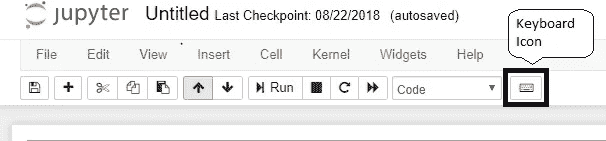

命令和编辑模式下的快捷键:

*   `Shift + Enter`运行当前单元格，选择下图
*   `Ctrl + Enter`运行选定的单元格
*   `Alt + Enter`运行当前单元格，在下面插入
*   `Ctrl + S`保存和检查点

编辑模式下的快捷键:

*   `Esc`进入命令模式
*   `Tab`代码完成或缩进
*   `Shift + Tab`工具提示
*   `Ctrl + ]`缩进
*   `Ctrl + [`德登
*   `Ctrl + A`全选
*   `Ctrl + Z`撤销
*   `Ctrl + Shift + Z`或`Ctrl + Y`重做
*   `Ctrl + Home`转到单元格开始
*   `Ctrl + End`转到单元格末端
*   向左走一个单词
*   `Ctrl + Right`向右走一个字

一旦进入命令模式，按下`H`(帮助)获得键盘快捷键列表:

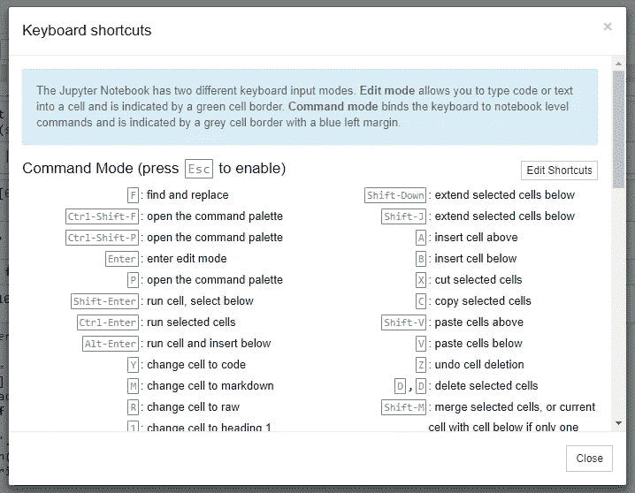

我列出了一些最常用的快捷方式。通过点击`Esc`确保您处于命令模式:

*   用`Up`和`Down`键上下滚动你的单元格。
*   按下`A`或`B`在当前单元格的上方或下方插入一个新单元格。
*   `M`将当前单元格转换为降价单元格。
*   `Y`将当前单元格设置为代码单元格。
*   `X`将剪切选中的单元格
*   `C`将复制选中的单元格
*   `V`将粘贴正在被复制/剪切的单元格
*   `Shift + V`粘贴细胞上方
*   `S`将保存笔记本
*   `F`将查找/替换
*   `O`将切换输出
*   `D + D` ( `D`两次)将删除活动单元格。
*   `Z`将撤消单元格删除。
*   要一次选择多个单元格，按住`Shift`并按下`Up`或`Down`
*   `Shift + Space`将笔记本向上滚动
*   `Space`向下滚动笔记本

选择多个单元格:

*   按下`Shift + M`合并您的选择
*   要拆分光标处的活动单元格，在编辑模式下按`Ctrl + Shift + -`
*   您也可以在单元格左边的空白处单击和`Shift + Click`来选择它们

在笔记本之间复制和粘贴单元格:

*   笔记本 1: —按住 Shift 键选择多个单元格，然后点击`Ctrl+c`进行复制
*   笔记本 2: —按 Esc 键进入命令模式`Ctrl + v`粘贴

使用`! pip install <package>`在当前内核中安装软件包

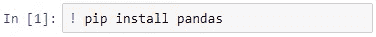

通过在 shell 命令中添加一个`$`符号来使用 Python 变量:

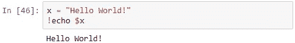

# 魔法命令

魔术命令是显著扩展笔记本电脑功能的快捷方式

共享笔记本中的代码示例:

1.  使用`%pastebin`魔法功能选择单元格范围
2.  Jupyter 给你一个秘密的网址来分享

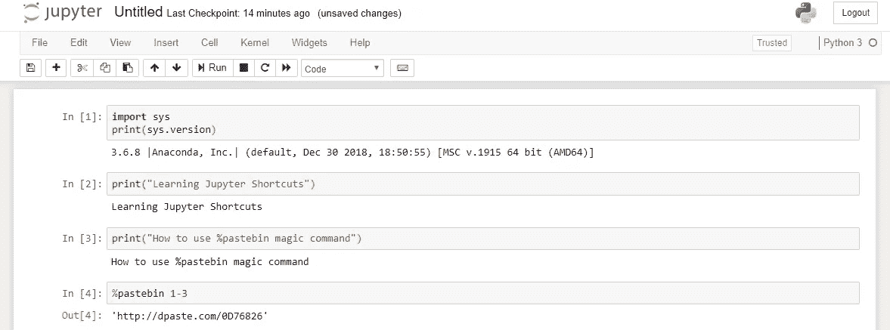

Note- This link gets expired in 7 days

使用`%whos`或`%who_ls`获得已定义变量的列表

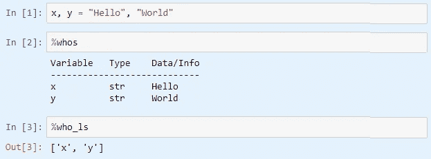

*   `%whos`显示变量类型和一些额外信息:大小、内容等。
*   `%who_ls`仅显示变量名称

在 Jupyter 笔记本中使用外部文件:

*   `%pycat file.py` ➡在传呼机中打开脚本
*   `%load file.py` ➡将脚本插入单元格
*   `%run file.py` ➡运行脚本
*   `%run file.ipynb` ➡经营笔记本
*   `%notebook filename` ➡将当前 IPython 历史导出到笔记本文件

获取、设置或列出环境变量:

*   `%env` ➡lists 所有环境变量
*   `%env var` ➡得到 var 的值
*   `%env var val` ➡为 var 设定值

在 shell 中运行命令:

`%system` ➡使用 shell(主要用于获取当前目录、日期等)

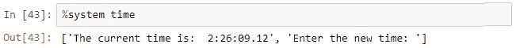

使用`%autosave`将笔记本自动保存到其检查点:

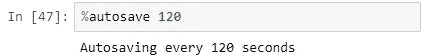

Autosaving every 120 seconds (2 minutes)

执行不同的语言:

*   `%%HTML` ➡执行 HTML 代码

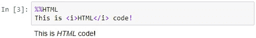

*   `%%perl` ➡在子进程中执行 Perl
*   `%%javascript`或`%%js` ➡来执行 Javascript 代码块
*   `%%python3` ➡用 python3 在子进程中执行代码
*   `%%ruby` ➡执行 Ruby 代码

其他魔法命令:

*   `%history` ➡打印输入历史
*   `%lsmagic` ➡列出当前可用的魔法功能
*   `%magic` ➡打印关于魔法功能系统的信息
*   `%matplotlib` ➡设置 matplotlib 交互工作
*   `%pwd` ➡返回当前工作目录
*   ➡展示了一份快速参考表
*   `%time` ➡时间执行一个 Python 语句或表达式(它既可以用作行魔术，也可以用作单元格魔术)

# nb 扩展

这个扩展的好处是它改变了默认值。

要安装 nbextensions，请在 Anaconda 提示符下执行以下命令:

```
conda install -c conda-forge jupyter_contrib_nbextensions
conda install -c conda-forge jupyter_nbextensions_configurator
```

或者，您也可以使用 pip 安装 nbextensions:

*   `pip install jupyter_contrib_nbextensions`
*   运行`pip show jupyter_contrib_nbextensions`找到笔记本扩展的安装位置
*   运行`jupyter contrib nbextensions install`安装新的扩展

安装完成后，重启 Jupyter 笔记本，您可以观察到一个新标签 *Nbextensions* 添加到菜单中:

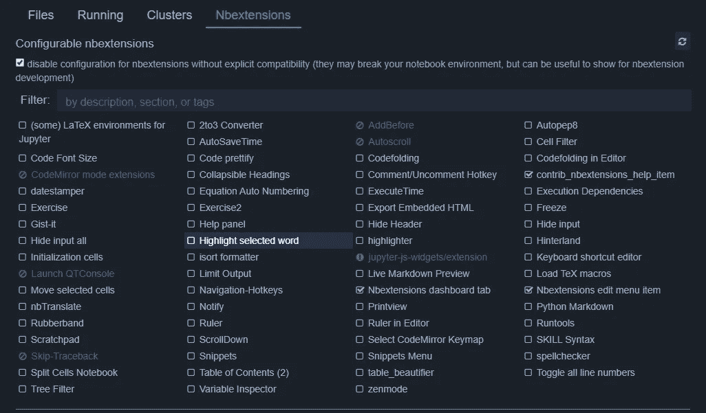

同样的 *nbextension* 也可以位于编辑菜单中:

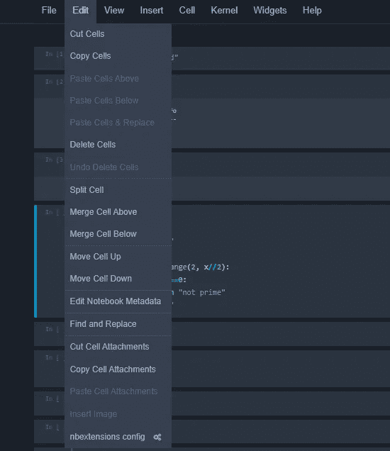

现在，让我们来看几个 nb 扩展:

1.  **腹地** -它为代码单元中的每一次按键启用代码自动完成菜单，而不是仅用 tab 启用它


2.**拆分单元格笔记本** -在 Jupyter 笔记本中启用拆分单元格

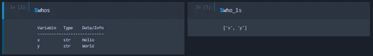

进入命令模式(`Esc`)，使用`Shift + s`将当前单元格切换为拆分单元格或全幅单元格。

3.**目录**-TOC 扩展能够收集所有运行的标题，并在浮动窗口中显示它们，作为侧边栏或导航菜单。该扩展也是可拖动的，可调整大小的，可折叠的，可停靠的，并具有自动编号和唯一的链接 id，以及一个可选的 toc 单元。

4. **Autopep8 -** 使用特定于内核的代码来重新格式化/修饰代码单元格的内容

5.**snippet**-添加一个下拉菜单，将 snippet 单元格插入当前笔记本。

# Jupyter 笔记本主题

我们可以从 Jupyter 笔记本的默认主题转换到黑暗模式。

为此，我们需要安装`jupyterthemes`:

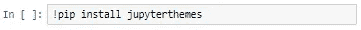

`jt -l`将给出可用主题的列表

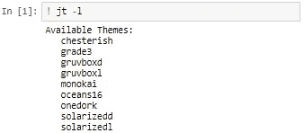

`jt -t <theme name>`会改变主题。让我们试着用*切斯特风格*主题把它改成黑暗模式。

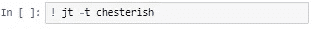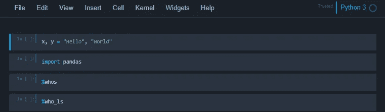

`jt -r`会将其恢复为默认主题

我们还可以用 Jupyter 笔记本做很多我们没有提到的事情。还是留到下一篇博客吧。

# 我的其他博客文章

*   [使用 TensorFlow 建立你的第一个机器学习模型](https://medium.com/@shadab.hussain01/build-your-first-machine-learning-model-using-tensorflow-d61b9b2b7d5e)
*   [不同机器学习算法的用例](https://medium.com/@shadab.hussain01/machine-learning-algorithms-use-cases-72646df1245f)
*   [通过 Visual Studio 开发基础程序激活免费访问 Datacamp、Pulralsight、LinkedIn Learning 等的步骤](https://www.c-sharpcorner.com/blogs/steps-to-activate-free-access-to-datacamp-pulralsight-linkedin-learning-etc-through-visual-studio-dev-essentials-program)
*   [我的 MozFest 经历和第一次演讲](https://medium.com/@shadab.hussain01/tweet-driven-mozfest-storytelling-mozfest-2018-170345534d08)

**疑问？评论？欢迎在评论区留言，也可以在**[**LinkedIn**](https://www.linkedin.com/in/shadabhussain96/)**上关注并联系我。** **如果你喜欢这个博客，可以** [**给我买杯咖啡**](https://www.buymeacoffee.com/shadab) **。**