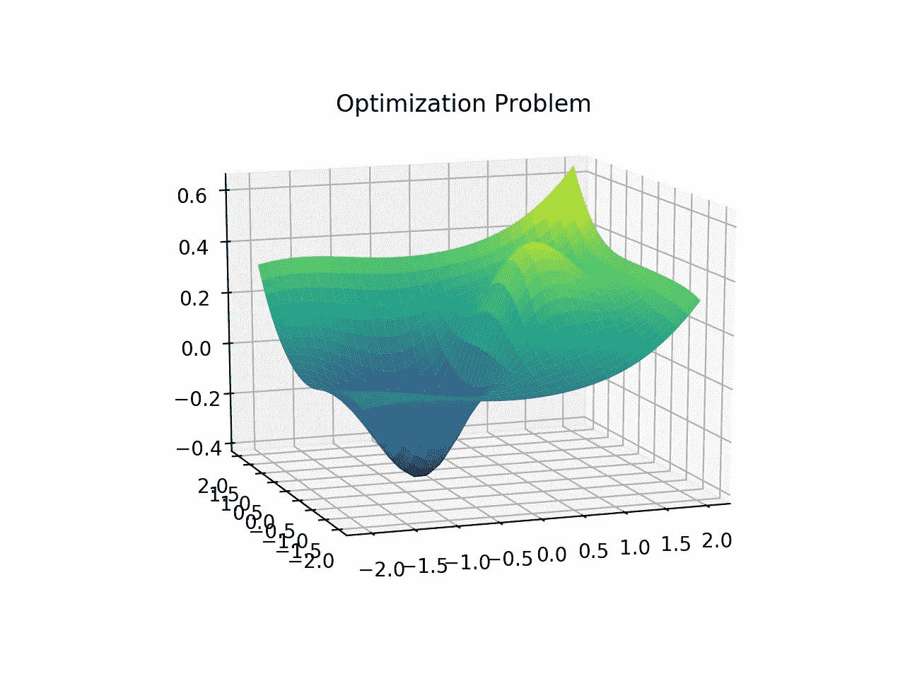
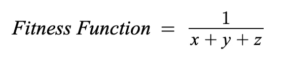

# 优化技术:遗传算法

> 原文：<https://towardsdatascience.com/optimizing-machine-learning-models-with-genetic-algorithms-2a38682a0610?source=collection_archive---------8----------------------->

## 一种自适应且众所周知的优化技术

Photo by [NASA](https://unsplash.com/@nasa?utm_source=unsplash&utm_medium=referral&utm_content=creditCopyText) on [Unsplash](https://unsplash.com/s/photos/technology?utm_source=unsplash&utm_medium=referral&utm_content=creditCopyText)

在复杂的机器学习模型中，性能通常取决于多个输入参数。为了得到最佳模型，必须适当地调整参数。然而，当有多个参数变量时，每个变量的取值范围很宽，每组参数有太多可能的配置需要测试。在这些情况下，应使用优化方法来获得最佳输入参数，而无需花费大量时间来寻找它们。

在上图中，它显示了仅基于两个参数的模型分布。如示例所示，找到曲线的最大值或最小值并不总是一件容易的事情。这就是优化方法和算法在机器学习领域至关重要的原因。

# 遗传算法

最常用的优化策略是遗传算法。遗传算法是基于达尔文的自然选择理论。它相对容易实现，并且算法的设置有很大的灵活性，因此它可以应用于广泛的问题。

## 选择健身功能

首先，必须有一个适应度函数来衡量一组输入参数的表现。从适应度函数得到的具有较高适应度的解将比具有较低适应度的解更好。

> 例如，如果一个解决方案的成本为 x + y + z，那么适应度函数应该尝试最小化成本。这可以通过以下健身功能来实现:

该适应度函数将为每组输入参数生成一个适应度值，并用于评估每组参数的执行情况。

## 产生一个群体

要运行遗传算法，首先从一群个体开始，其中每个个体都是一个解。解决方案由一组基因表示，其中解决方案中的每个基因都是模型中的一个变量。每个解决方案都是随机生成的，并根据适应度函数进行评估，以生成适应度分数。选择一个合适的人口规模是非常重要的。如果群体规模太低，那么就很难探索问题的整个状态空间。如果群体太大，那么将需要很长时间来处理每一代，因为计算适应度和生成每个群体的系统成本将需要指数级的更多时间来处理。

## 亲代选择

接下来，群体经历一个称为**父代选择**的过程，其中最佳解决方案(最适合的个体)将被选择以创建下一代解决方案。有许多方法可以做到这一点，如**健身比例选择(FPS)，基于排名的选择，以及锦标赛选择。**这些方法各有利弊，应根据模型进行选择。

## 交叉

一旦亲本被选中，亲本将经历一个叫做**交叉**的过程。交叉是指两个父母为了创造一个新的解决方案而交叉他们的基因(也称为孩子)。这促进了在问题的状态空间中的**探索**，并且潜在地产生了从未被测试过的新的解决方案。

这是根据解决方案的数据类型以不同方式完成的。对于基因用二进制表示的解，有 *1 点交叉、n 点交叉、*和*均匀交叉*等方法。

对于基因是实值的解决方案，有诸如*单算术交叉*和*全算术交叉*的方法。

此外，对于排列问题(如旅行推销员问题等)，有一些方法，如*部分映射交叉(又名 PMX)、边交叉、顺序 1 交叉*和*循环交叉*。

## 变化

在交叉阶段之后，产生的子代经历一个**突变**阶段。突变是指每个基因都可能根据随机概率发生变化。这允许**利用**,因为子解决方案不会像交叉阶段那样剧烈变化，但仍然能够在其当前解决方案的邻域内探索。

对于二进制解决方案，变异过程相对简单，每个位根据某种变异概率进行切换。

对于实值解，可以根据该变量的一些可接受的范围或者通过添加一些以 0 为中心并且根据一些高斯分布变化的噪声来选择不同的基因。

最后，对于排列问题，主要有四种方法；*插入突变、交换突变、倒位突变、*和*争夺突变*。

## 幸存者选择

一旦创建了儿童群体，下一个阶段就是**幸存者选择**。这一阶段决定了哪些个体可以继续传给下一代。有多种方法可以做到这一点，因为新一代可以从父母和子女中选择。选择每一代幸存者的方法主要有两种，*基于年龄的选择*和*基于适应度的选择(FBS)* 。在 FBS 中，有*精英主义*，其中每个群体中最适合的被选择，还有*天才*，其中每个群体中最不适合的被淘汰。

## 算法重复

一旦选择了新一代，整个过程重复进行，直到算法根据某些收敛标准收敛。在整个算法运行之后，返回所有代中的最佳解决方案。

# 履行

# 结论

遗传算法因其广泛的适用问题而被广泛应用。简单版本的遗传算法相对容易实现，但有更复杂的变化。例如，这些遗传算法可以并行执行，其中整组可调参数可以在并行遗传算法上分开。根据问题的计算量，这些并行 GAs 可以被配置为细粒度的或粗粒度的。算法也可以采用主从方式，从机控制计算，主机控制选择过程。此外，解决方案还可以被配置为在不同的并行遗传算法之间结合不同的拓扑和迁移策略。所有这些变化使得遗传算法具有广泛的灵活性，并且绝对是一个需要了解的重要算法。