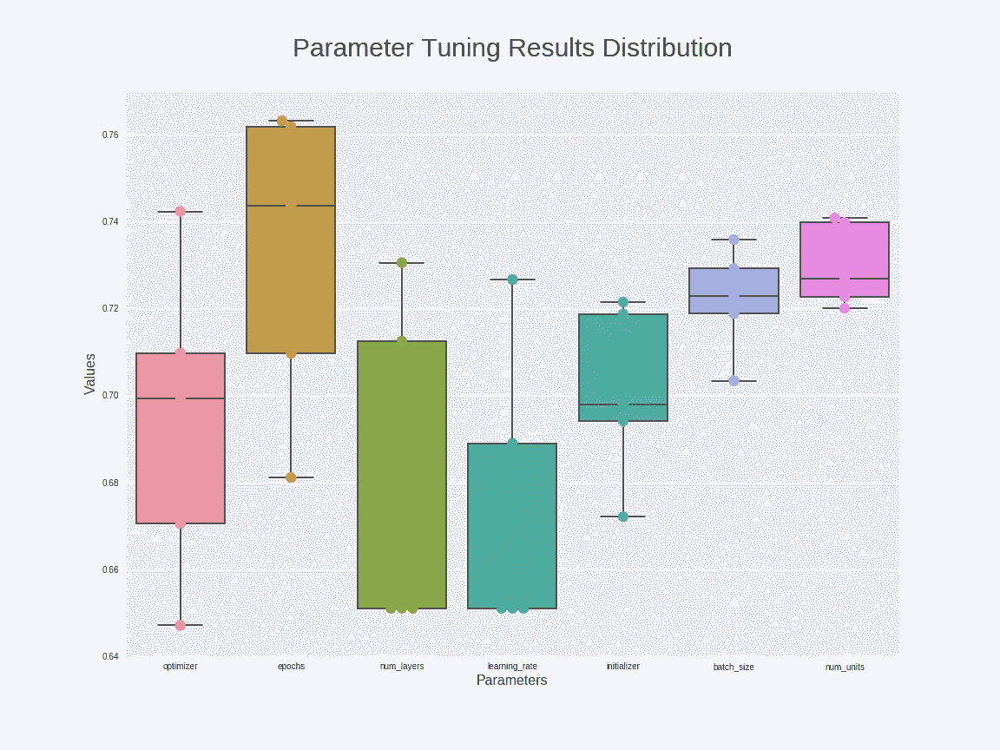
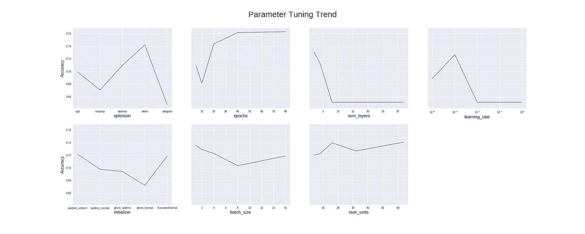
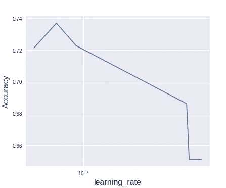
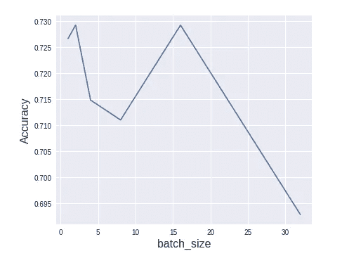
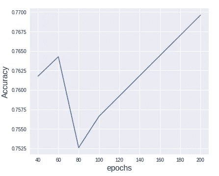

# 优化神经网络——从哪里开始？

> 原文：<https://towardsdatascience.com/optimizing-neural-networks-where-to-start-5a2ed38c8345?source=collection_archive---------4----------------------->

## 通过使用 Google Colab 中的 Keras 构建和调整神经网络来发展直觉


Photo by [Adi Goldstein](https://unsplash.com/photos/f_0t4fYEauU?utm_source=unsplash&utm_medium=referral&utm_content=creditCopyText) on [Unsplash](https://unsplash.com/?utm_source=unsplash&utm_medium=referral&utm_content=creditCopyText)

T 神经网络要调优的参数和超参数(以下都称为参数)非常多，那么从哪里开始呢？

在吴恩达教授的深度学习专业化课程中，他给出了以下指导方针:

*   从*学习率*开始；
*   然后试*隐藏单元数量* s、*小批量尺寸* e 和*动量项*；
*   最后，调整*层数*和*学习率衰减*。

这些都是很好的建议。但是，为了使它们成为我们技能的一部分，我们需要直觉:)为了实现这一点，我用 Python 构建了一个可定制的神经网络类，并进行了一系列实验来验证这些想法。让我们看看！

# 设置环境

我们将在这个项目中使用 [Google Colab](/getting-started-with-tensorflow-in-google-colaboratory-9a97458e1014) ，所以大部分库都已经安装好了。因为我们将训练神经网络，所以使用 GPU 来加速训练是很重要的。

要启用 GPU，只需进入下拉菜单中的“运行时”并选择“更改运行时类型”。然后，您可以将鼠标悬停在右上角的“已连接”上进行验证:


# 获取数据

在本项目中，我们将使用皮马印第安人糖尿病数据集，原因如下:

*   数据集具有挑战性，最高精度结果只有 77%左右，这给了我们做大量模型调整的机会；
*   数据集很小，只有 768 行和 9 列。这使得我们可以更快地训练，从而可以进行 10 重交叉验证，以更好地表示模型性能。

虽然我们可以手动下载数据集，但为了重现性，还是从 Kaggle 下载吧。因为我们需要使用 Kaggle 的 API，所以我们将首先通过访问 Kaggle 上的“我的帐户”页面来创建 API 令牌。这会将一个`kaggle.json`文件下载到您的计算机上。

接下来，我们需要将这个凭证文件上传到 Colab:

```
from google.colab import files
files.upload()
```

然后我们可以安装 Kaggle API 并将凭证文件保存在。kaggle”目录。

```
!pip install -U -q kaggle
!mkdir -p ~/.kaggle
!cp kaggle.json ~/.kaggle/
```

现在我们可以下载数据集了:

```
!kaggle datasets download -d uciml/pima-indians-diabetes-database
```

该数据集将被下载到您当前的工作目录，即 Colab 中的“content”文件夹。由于每次重启 Colab 会话时文件都会被删除，因此将文件保存在 Google Drive 中是个好主意。您只需要使用下面的代码安装驱动器并保存在那里:

```
from google.colab import drive
drive.mount('/content/gdrive')
```

一旦安装完毕，你就可以通过“/content/gdrive”路径直接从 Google Drive 加载数据。当您需要保存绘图文件时，安装 Google Drive 也会派上用场。

# 带有 XGBoost 的基线模型

XGBoost 因其高准确性和高效率而被称为 go-to 算法。让我们试一试！

```
t1 = time()
clf = xgb.XGBClassifier()
cv = StratifiedKFold(n_splits=10, shuffle=True, random_state=seed)
scores = cross_val_score(clf, X, y, cv=cv)
t2 = time()
t = t2 - t1print("Mean Accuracy: {:.2%}, Standard Deviation: {:.2%}".format(scores.mean(), scores.std()))
print("Time taken: {:.2f} seconds".format(t))
```

然后我们得到了 74.88%的准确率，只用了 0.35 秒！如果我们将特征标准化并再次测试，我们将得到 76.31%的结果！这个结果已经非常接近这个数据集上的最新精度。

# 创建模型

为了能够测试不同的模型，我们需要动态创建模型的能力。同时，我们还需要测试模型并提供结果。这两种需求都让我想到了面向对象编程。然后我创建了下面的测试类。我将在另一篇文章中解释这一部分和下一部分的技术细节。

# 自动化测试

因为我们需要测试许多不同的参数组合，并且需要保存结果，所以自动化测试过程很重要。同样，让我展示而不是讲述，因为细节将在后面的帖子中解释:

# 基线神经网络模型

让我们从具有以下默认参数的基线模型开始:

*   输入尺寸=8
*   层数=2
*   数量单位=8
*   激活='relu '
*   activation_out='sigmoid '
*   损失= '二元交叉熵'
*   初始值设定项='random_uniform '
*   优化器='adam '
*   学习率=0.001
*   度量=['准确性']
*   纪元=10
*   batch_size=4
*   one_hot=False

如果我们跑:

```
param_dict_defaults, param_dict = get_defaults(), get_defaults()
accuracy_baseline = run_test(X=X, y=y, param_dict=param_dict_defaults)
```

我们会得到:

```
Finished cross-valiation. Took 1.5 mintues. Mean Accuracy: 71.61%, Standard Deviation: 2.92%
```

还不错，但肯定离 77.7%的顶级成绩差远了。

# 不同参数的重要性

为了理解不同参数对模型调整的影响，让我们一次调整一个参数，同时保持其他参数不变(因此不同于 sklearn 中的 GridSearchCV 等穷举搜索)。运行测试将为我们提供以下结果:



首先，有趣的是，上面的参数调优指南中没有提到的一些参数可能是重要的因素，例如优化器和时期。

第二，学习率确实是最有影响力的参数之一。

第三，对于这个特定的实验(包括参数选择)，似乎层数比隐藏单元的数量更重要。这与上述准则相违背。

下面是调整趋势，可用于查找要调整的范围。



重要的是要注意，这里的测试只是为了提供一些直觉，不应该作为正式的规则。这是由于至少两个原因——一，各种参数及其候选值不一定具有可比性；第二，神经网络中存在天生的随机性，因此，如上图所示的结果可能会改变。

虽然参数值之间的相互作用很可能很重要，即 40 个历元在与非 0.001(例如 0.1)的学习率配对时可能会产生更差的准确性，但我们仍将在此尝试一种简单的方法——组合独立调整的最佳参数值并训练一个模型，这为我们提供了:

```
Finished cross-valiation. Took 49.3 mintues. Mean Accuracy: 78.00%, Standard Deviation: 4.59%
```

哇，这是一个残酷的 50 分钟！虽然我们不能抱怨结果，因为这是最先进的！看起来天真的方法确实有效。

# 参数调谐

现在我们已经看到了参数的相对重要性，是时候调整模型了。因为学习速度是最重要的，所以让我们先解决它。我们将使用下面的代码来生成 6 个介于 0.0001 和 0.01 之间的随机学习率值，因为根据上面的优化趋势可视化，这是最有希望的区域。

```
bases = np.repeat(10, 3)
exponents_1 = -(np.random.rand(3) + 3) 
exponents_2 = -(np.random.rand(3) + 2) learning_rate = np.power(bases, exponents_1).tolist() + np.power(bases, exponents_2).tolist()
```

运行测试后，我们得到了:



这使我们认为 0.0006716184352348816 是最佳学习率。让我们利用这一点，继续用 6 个选项来调整批量大小，因为我们肯定要相信 ng 教授的指导方针，即批量大小是第二重要的参数:)

```
batch_size = [2 ** e for e in range(6)]
```



尽管批量大小为 2 的结果更准确，但是时间成本远远超过了收益，所以我们将采用批量大小为 16 的结果。

在更新了参数字典中的批处理大小值之后，我们现在可以继续调整时期数了。由于训练和测试的时间会随着时期数的增加而增加，所以最好在以后的阶段调整这个参数，以避免长时间的运行。



这给了我们最好的 200 个历元。接下来，让我们构建具有标准化功能的最终模型:

```
run_test(X=X_std, y=y, param_dict=param_dict)
```

这给了我们:

```
Finished cross-valiation. Took 8.3 mintues.
Mean Accuracy: 78.53%, Standard Deviation: 3.64%
```

绝对伟大的结果！所用时间不算太差，虽然比 XGBoost 多了 1422 倍😂

现在，如果我们不调整参数，只标准化特性会怎么样呢？

```
Finished cross-valiation. Took 1.7 mintues. Mean Accuracy: 76.95%, Standard Deviation: 2.88%
```

因此，参数调整的效果似乎有点微不足道，但标准化，即使特征具有零均值和单位方差，对于神经网络模型调整来说是巨大的。

# 摘要

*   学习率是需要调整的最重要的参数，因为它可以产生很大的性能改进，同时不会对训练时间产生负面影响。
*   较小的批量可能会提供更好的结果，但也更耗时！同样，针对更多纪元的训练通常有助于提高准确度，但时间成本也很高。
*   优化器可能是一个需要优化的重要参数。
*   更深更广的神经网络可能并不总是有用的。
*   特征标准化可以极大地提高模型性能，与参数调整相比，这是一项轻而易举的任务。
*   神经网络很棒，但不是万能的。如上所述，训练和调整神经网络模型的时间比非神经网络要多几千倍甚至几百万倍！神经网络最适合计算机视觉和自然语言处理等用例。

你可以在 GitHub 上的[我的项目报告](https://github.com/georgeliu1998/keras_model_tuning)中找到完整的代码。一定要试一试，看看你能得到什么结果！

感谢您的阅读！有什么我可以改进的吗？请在下面告诉我。我们都通过相互学习变得更好！