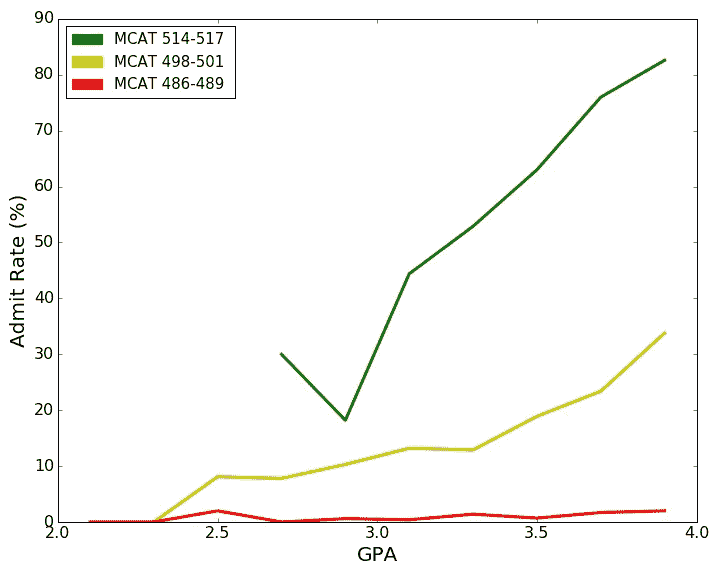
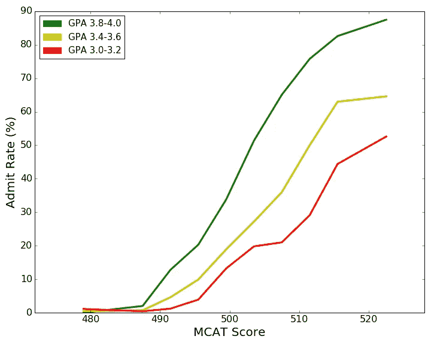
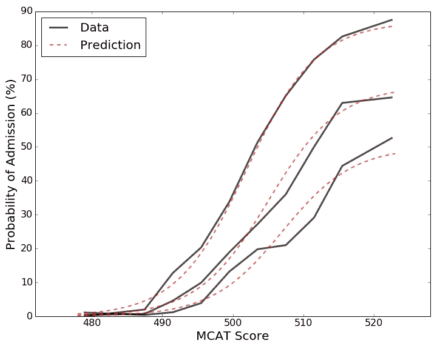
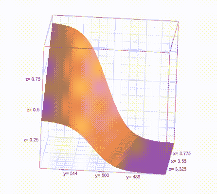
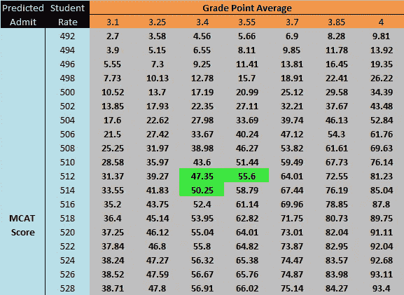
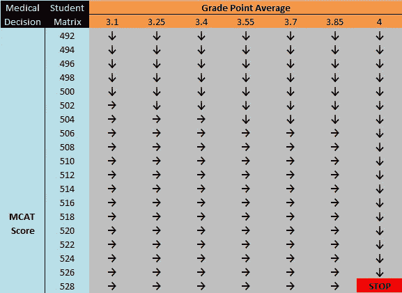
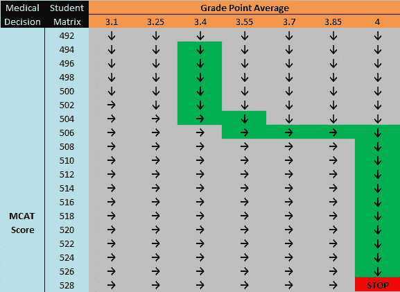
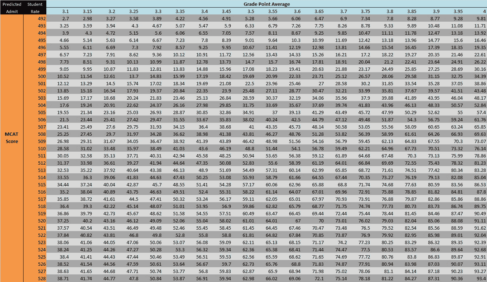

# 优化你被医学院录取的机会

> 原文：<https://towardsdatascience.com/optimizing-your-chances-of-medical-school-admission-5aa75f39fb48?source=collection_archive---------11----------------------->

2016 年，全美共有 27772 名学生申请了医学院。这些学生中，**8883 人**，**录取率 32%** 。但当然，总体录取率并没有太大启发。我们对这篇文章真正感兴趣的数据是关于录取率如何根据 GPA 和 MCAT(医学院入学考试)分数变化的。

我们当然大致知道，在其他条件不变的情况下，更高的 GPA 和/或更高的 MCAT 分数会导致更高的录取机会，但我们想在这里真正了解细节。我们的分析将通过提出一系列问题**进行**:

> **录取率与 MCAT、录取率与 GPA 有什么模式？**
> 
> 给定这些模式，我们能建立一个包罗万象的模型来预测给定 MCAT 和 GPA 的录取率吗？
> 
> **鉴于这种模式，能否为准医学院学生推荐一条优化录取机会的路径？**

为了回答这些问题，我们将使用来自美国医学院协会的数据，该数据给出了 GPA 和 MCAT 分数选择范围的录取率。

# 让我们从简单的开始。基于 MCAT 和 GPA 的录取率如何变化？

我们都期望随着 MCAT 和 GPA 分数的增加，录取机会或录取率也会增加，但是怎么增加呢？*线性？* *二次？或者干脆是别的什么？*

让我们先来看看在 MCAT 保持不变的情况下，由于各年级 GPA 的变化而引起的录取率的变化。请注意， **MCAT 的得分介于 472 和 528 之间，中间值为 500** 。下面，我们将 MCAT 固定为三个范围:*514–517(高)*，*498–501(中)*，*486–489(低)*。对于每个范围，我们绘制了**录取率与 GPA** 的关系图。

> *录取率 vs. GPA 似乎有一个* ***(大致)线性*** *的趋势。*
> 
> ****这种线性关系的斜率随着****MCAT 分数的增加而增加。换句话说，你的 MCAT 分数越高，平均绩点每增加一分，你被录取的机会就越大。这是 GPA 和 MCAT 决定录取率的一些初步证据。**
> 
> ****给定一个足够低的 MCAT 分数，在获得医学院的录取上没有 GPA 可以弥补*** *。也就是说，看看底部的红线，MCAT 在 486 和 489 之间，2.5 比 3.9 的 GPA 给出了大约 3%的录取率。**

*现在让我们转向一个更有趣的趋势，对于一些固定的 GPA 值，录取率与 MCAT 的对比。这里我们把绩点固定在三个水平:*3.8–4.0(高)*，*3.4–3.6(中)*，*3.0–3.2(低)*。请注意，尽管 3.0 的平均绩点被标为*低*，但你应该认为这意味着**相对较低，而不是绝对低**。事实上，如果 MCAT 分数足够高，即使那些平均绩点在低范围的学生也能达到 50%的最高录取率。*

**

> **这个图形最引人注目的地方在于，这些曲线并不遵循线性或二次趋势，而是遵循一种被称为 s 形* *的* ***数学形状。Sigmoids，通常是 S 形曲线，出现在许多其他情况下，也许最流行的是在人口模型。他们描述了一些过程，即* ***缓慢回升*** *(开始时缓慢增长)* ***然后获得动力*** *(中间快速增长)，在* ***之前最后在某一水平封顶*** *(最后缓慢增长)。****

*事实上，它们在我们的上下文中也很有意义！给定一个非常低的 MCAT 分数，增加一点分数在开始会有一点帮助，但不会有太多帮助。一旦你不断提高 MCAT 分数，你**就会获得越来越大的收益**，导致你的录取率越来越快。最后，当你的 MCAT 分数已经相当高的时候，额外增加你的 MCAT 分数并没有多大帮助。*

*还要注意的是，GPA 值越高，sigmoid 形状就越明显。我们还可以看到不同 GPA 水平对乙状结肠的影响，例如，通过查看三个 GPA 等级中 MCAT 最高值的录取率。我们看到对于**低 GPA 曲线，这里的录取率在 50%** 左右，对于**中 GPA 曲线在 60%** 左右，对于**最高 GPA 曲线在 85%** 左右。*

# *酷炫潮流！但是我们能给它们装上模型吗？*

*现在我们对基于 GPA 和 MCAT 的录取率趋势有了一些了解，我们想知道我们能否**用一个(不太复杂的)数学模型**来预测这些趋势的录取率，无论 GPA 和 MCAT 分数的组合如何，都有相当高的准确度。在解决整个问题之前，让我们先看看**从最后一个数字**中预测这些 sigmoids 有多好。*

**

> **在这里，我们从上一节中选取了三条录取率与 MCAT 曲线，* ***(仔细地)选择了一些 s 形曲线来最好地拟合这些数据*** *。s 形拟合用红色虚线表示。回想一下，这三条曲线分别代表* ***高、中、低 GPA 段*** *。我们看到至少* ***对于 GPA 高的波段，我们的预测几乎是提督*** *。当我们到达较低的 GPA 段时，* ***预测没有那么强，但仍然捕捉到数据的动态*** *。**

*利用我们的模型似乎可以很好地预测更高的 GPA 值这一事实，我们将**限制我们对 GPA 为 3.1 或更高的申请人的预测**。我们还**将我们的预测限于 MCAT 分数为 492 或更高的申请人，以减少来自低 MCAT 申请人的噪音**。*

# *完整的模型*

*所有的部分都在这里。但是我们需要把它们放在一起，以创建一个无所不包的模型，根据你的 GPA 和 MCAT 分数，这个模型将给出(希望是准确的)你被美国医学院录取的预测。概括地说，让我们列出这样一个模型需要包括的内容:*

> **给定一些固定的 GPA 值，模型需要为 sigmoidal，以改变 MCAT 分数的值。**
> 
> **给定一些固定的 GPA 值，这种 sigmoid 的性质(斜率、偏移量等。)需要随着 GPA 的变化而变化。**
> 
> **给定 MCAT 分数的某个固定值，对于变化的 GPA 值，模型需要(大致)线性。**
> 
> **该模式将仅限于平均绩点 3.1 或以上，MCAT 分数 492 或以上的申请者。**

*考虑到所有这些规则，并使用数学拟合技术来最小化我们的误差，我们得到了两个相互作用的变量 GPA 和 MCAT 的预测函数。给定我们的预测函数，我们现在可以从有效范围中选择任何一组 GPA 和 MCAT，并绘制相应的**录取比率表面**。*

**

> **这里的* ***x 轴代表 GPA*** *，* ***y 轴代表 MCAT 分数*** *，* ***z 轴代表录取率*** *。**

*结果表明，该模型的**均方根误差(RMSE)约为 3.8%** ，即**平均而言，在所有 GPA 和 MCAT 值中，我们与录取率的真实值**相差 3.8%。不算太坏！*

# *那么一个未来的医学院学生如何使用这个呢？*

*所以我们有一个相当准确的模型来预测只给 GPA 和 MCAT 分数的录取率。一个正在努力优化自己医学院录取机会的学生如何使用这个工具？*

*假设你是一名在校学生，平均绩点为 3.4，MCAT 分数为 512。你的自然问题应该是“我应该花时间提高我的 MCAT 还是我的平均绩点？”毕竟，你一天只有 24 小时。*

*回答这个问题的一个自然的方法是**关注给你最大录取率提升的那个**。如果这似乎是一个奇怪的想法，假设你是一个处于更极端情况下的学生。你是一名平均绩点为 3.96，MCAT 分数为 485 的学生。当你的平均绩点已经很高的时候，把所有的空闲时间都花在考试学习上，试图提高你的平均绩点是没有意义的。考虑到你的 **MCAT 分数低于中位数，如果你不努力的话，可能会严重阻碍你被录取的机会，这尤其没有意义。***

*所以，问题是，我们如何衡量平均绩点的提高和 MCAT 分数的提高带来的录取率提升？*

*我们可以很容易做到这一点，如果我们看看上面的表面，然后**把它当作一种“山”**。也就是说，我们的目标是在那座山上越爬越高，因为这意味着获得越来越高的录取机会。假设你站在那座山上的某个地方，想知道获得一定高度的最佳方法。你可以**通过在 GPA 方向走几步**看看你的录取率会发生什么，然后**当你在 MCAT 方向走几步**看看它会发生什么。*

*当我们说**几步**的时候，我们需要稍微小心一点。我们注意到**的 GPA 范围从 0.0 到 4.0** (长度 4)，而 **MCAT 的范围从 472 到 528** (长度 56)。代替任何关于 GPA 增益与 MCAT 增益相对难度的详细信息，我们做出**简化假设，将 GPA 中的 1 点增益与 MCAT 的 14 点增益相匹配**(因为 56 除以 4 等于 14)。*

*我们在下面显示了 MCAT 和 GPA 的一些区间的**预测录取比率值**的表格，其中相对 GPA 和 MCAT 步长由上面讨论的大约为 14 的**缩放因子确定。***

**

*使用这个表格，假设你的平均绩点是 3.4，MCAT 分数是 512。你最好的行动是什么？嗯，目前你的录取几率是 **47.35%** 。如果你把你的平均绩点提高一点，你被录取的几率会跃升至 55.6%，而把你的 MCAT 提高一点，你的录取几率只会上升至 50.25%。因此，你现在应该专注于你的平均绩点。事实上，这是有道理的，因为你的 MCAT 分数远高于 500 分的中位数，但你的平均绩点仍需要努力。*

*我们可以对表格中的每个单元格进行这种分析，并将该决定简化为一个 ***右箭头*** 、**指示您应该提高您的 GPA** ，或者一个 ***下箭头*、**指示您应该提高您的 MCAT** 。***

*我们得到下面的结果。*

**

*现在假设我们是一个 GPA 为 3.4，MCAT 为 494 的学生。我们可以从初始状态开始**跟随箭头**开辟出一条通往成功**的道路(越来越高的录取率)。***

**

*对于 GPA 和 MCAT 分数的任何组合，我们都可以这样做。只需**从初始状态**开始，**跟随箭头找到通过 GPA-MCAT 空间**的最佳路径。*

*概括一下，*

> ****我们使用原始录取统计数据来捕捉 GPA、MCAT 和录取率之间的趋势****
> 
> ***我们使用这个预测模型，根据未来医学生目前的排名，为他们建议一个行动方案。***

***最后，我们展示了来自预测模型的**更精细的数值表。你可能需要放大！。*****

******

***最后，请注意，如果你查看你的平均绩点和 MCAT，发现这个比例并不高，你就没必要紧张！ *为什么？*因为首先，**这是一个有一定误差的模型(3.8% RMSE)** 。第二，这个**没有考虑课外、性别、种族等其他录取标准。**，同样有影响。因此，与其说这是一个终极预测，不如说是一个基准测试。 ***祝你好运！******

## ***数据集引用***

***[1] [美国医学院申请人和被录取人的 MCAT 和 GPA 表格](https://www.aamc.org/download/321508/data/factstablea23.pdf) (2017)，美国医学院协会***