# 公民数据科学工具与 Python 用于机器学习

> 原文：<https://towardsdatascience.com/oracle-cloud-analytics-vs-python-for-machine-learning-b19309aa3224?source=collection_archive---------17----------------------->

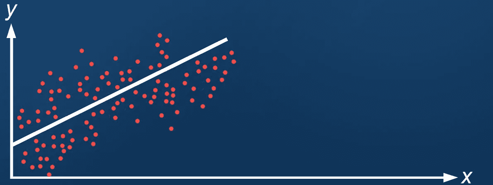

本实验的目的是调查数据科学流程在行业领先的基于云的分析工具中的应用。

实验的目标是评估在不输入代码的情况下，在分析云工具**内完成准确的机器学习实验的可能性。**完成这项任务的能力表明，具有很少或没有编码知识的最终用户能够多么容易地拿起工具，并将机器学习技术应用于他们的数据。

实验试图提供证据来支持或否定以下假设:

*“我相信一个在数据科学和机器学习方面经验很少的用户可以直接在甲骨文的云分析工具 OACS 中创建一个简单的端到端数据科学流程的产品，而无需编写任何复杂的代码，时间只需用 Python 编写代码的一半”*

**在这个实验中，我使用了甲骨文的工具，我并不偏爱这些工具，有很多技术可以达到类似的效果。**

任何最终分析都将直接链接回该语句。

许多行业领先的 BI 软件供应商已经调整了他们的数据可视化工具，以适应利用高级分析和数据科学技术的行业趋势，使客户能够从他们的数据中获得洞察力，这在过去是不可能的。

许多双领导者基于云的产品现在正在寻求“弥合”BI-传统商业智能和 AI-机器学习和高级分析之间的差距。这个实验试图为 OACS 证明这个概念。

# 基线

实验的基线将是用 Python 设计的代码脚本。实验数据集是从一个 [Kaggle 机器学习竞赛](https://www.kaggle.com/c/house-prices-advanced-regression-techniques)中提取的，该竞赛旨在测试数据科学家使用机器学习模型和数据科学技术预测房价的能力。

这里是 Python 中的实验——作为到原始内核的链接。

 [## 基本套索，包括数据准备

### 下载数千个项目的开放数据集+在一个平台上共享项目。探索热门话题，如政府…

www.kaggle.com](https://www.kaggle.com/kenhunt1010/basic-lasso-including-data-prep) 

训练和测试数据集可从 Kaggle 获得。

# 得分

使用 Python 和云分析技术训练的模型将由 Kaggle 独立评分。如需了解有关本次竞赛的更多信息，包括数据描述和细节，请点击[此处](https://www.kaggle.com/c/house-prices-advanced-regression-techniques)。

将使用均方根误差对测试数据集上生成的预测进行评分。

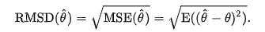

[关于均方根偏差的更多信息](https://en.wikipedia.org/wiki/Root-mean-square_deviation)

# 技术考虑

*   基线用 Python 3.6 编码在 Jupyter 笔记本中。
*   云分析工具是 Oracle 云分析服务 v18。

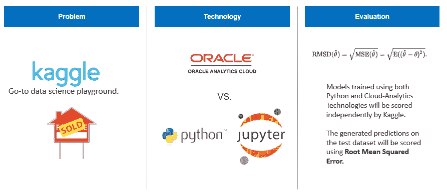

# 该过程

数据科学的流程如下图所示。

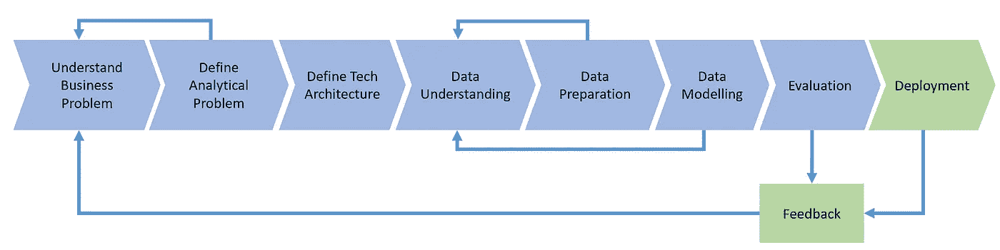

# 数据探索

实验的第一阶段是进行一些分析，以找出更多关于所提供的数据集的信息。

## 相关矩阵

第一步是从整体上理解数据集。一个坚实的起点是创建一个相关性矩阵，以帮助理解指标之间的相关性。

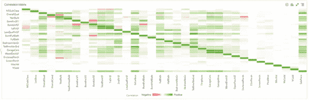

## 识别关系和异常值

接下来，确定高度相关的指标，并绘制成单独的分析图，以便更好地了解它们；关键目标是呈现任何线性关系并识别数据集中的任何异常值。

这里特别有用的一个特性是能够快速选择一个数据点并在散点图中改变它的颜色。这使得突出显示最左边散点图中的异常值(红色)变得很容易。

Oracle DV 的注释特性在这里同样很有帮助，尤其是在以后要展示分析的时候。

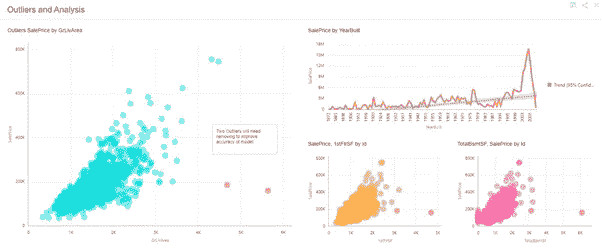

## 询问目标变量

数据科学流程的下一步是了解更多关于我们的目标变量的信息，这非常简单，数据集在 Data Visualiser 中打开，我们的指标被识别出来并右键单击。“解释”被选中。OACS 在这里做了所有艰苦的工作。OACS 潜在的机器学习算法消失了，尽管所有的关系可能是突出的，然后自动呈现一个完整的分析负载，可以询问。

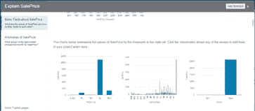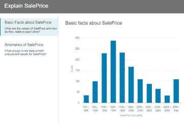

可以选择单个分析，并将其放到 DV 画布上，以便进一步深入研究。

这一功能非常出色，它节省了流程中的大量时间，并且只需单击一个按钮，就可以轻松识别数据集中的模式。

## 目标变量的分布

在进行了由 OACS 自动呈现并添加到画布上的分析后，对图表进行了微小的修改，以改变 X 轴上的粒度，从而更准确地显示目标变量中的数据分布。

*补充说明:在 OACS 找不到一种方法来编码整个数据集的空值标识。在 python 中，我们可以获取一段代码，并编写一个 FOR 循环，在数据集中的所有列上迭代代码。在 OACS，我们可以添加自己的 python 代码，但这与假设相矛盾。*

只需点击几下，最左边的图表(下图)就出现了。从这个可视化中可以清楚地看到，数据是向左倾斜的。通过将 LOG()应用于变量，创建了一个自定义指标，以使图表显示为右侧的图表——一个清晰的(有点)钟形。

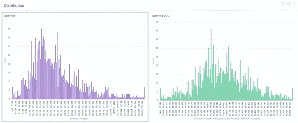

这需要进一步调查。目前，用户需要编写单独的逻辑来识别每一列中的空值。这将花费大量的时间。

# 使用 Oracle 数据流进行数据准备

下一个阶段是准备数据，以便用于训练模型。创建以下数据流是为了对数据执行之前确定的操作。

*   移除先前发现的异常值
*   添加一个可能有用的计算列(总表面积)，该列是通过将数据集中的其他列相加而创建的。
*   将 log()列添加到数据集中(如果在上一步中未完成)
*   删除对预测无用的计数列。

数据集已保存(这里是数据流中的最后一个节点)。也可以在这里更改输出数据集的数据类型。这很有用，因为这意味着我们不需要编写代码来设计这些功能。

当我们在文本和数字之间转换时，空值会自动发生一些事情，需要进一步研究。

# Nulls 和 NAs 的估算器

由于缺乏对列进行迭代的能力，该数据集中的 NAs 没有被单独估算，因为这需要跨每列的单独 case 语句。相反，选择的算法有一个输入函数；这允许用户为分类或连续变量选择估算方法。

这里的限制是用户必须对相同类型的所有列使用相同的 inpute 方法。也就是说，不可能将连续变量 A 中的 NAs 作为平均值，而将连续变量 B 中的 NAs 作为中位数。

# 模型选择和培训

“数值预测”模型类别中有 4 种不同的模型。

*注意:我们可以添加我们自己的包含定制模型的 python 脚本，这个功能将在稍后评估*。

出于本实验的目的，选择了“用于模型训练的线性回归”，这提供了一种套索回归方法，它与作为基线创建的 python 代码相匹配。

OACS 的这一领域需要一些如何选择 ML 模型的知识-如果 OACS 试图真正让每个人都可以使用数据科学，应该有一个帮助链接，其中包含用户如何选择特定模型的见解，或者至少是每个模型或模型组通常擅长/不擅长什么的高级描述。我们训练过的模型被保存了，它位于 OACS 的“机器学习”部分，可以从主页菜单上找到。

# 应用模型

一旦我们有了训练好的模型，我们现在需要将它应用到我们的测试数据集。测试数据集被上传到 OACS 并保存为数据集。然后，我们创建另一个数据流，并在其中选择“应用模型”。选择“应用模型”后，我们会看到一个模型列表，其中填充了我们刚刚训练的模型。我们应用我们的新模型，并选择保存预测的列的名称。

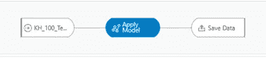

# 整理并提交

我们剩下的数据集只包含一个 ID 和一个提交。

*“我相信一个在数据科学和机器学习方面经验很少的用户可以直接在 Oracle 的云分析工具 OACS 中创建简单的端到端数据科学流程的产品，而无需编写任何复杂的代码，时间只需用 Python 编写代码的一半”*

该图说明了两个线性回归实验的精确度非常接近。Python 代码在准确性上略胜 OACS 一筹，然而 OACS 用的时间却少得多。

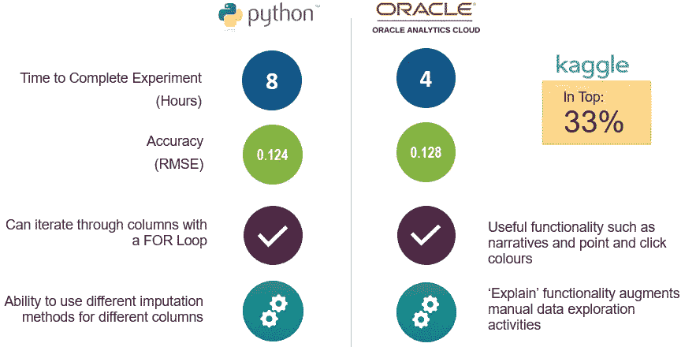

回到假设:

*   没有自定义代码添加到 OACS 创建所需的人工制品
*   不需要机器学习方面的大量培训，用户就可以遵循这些步骤，只需要对通用数据科学流程的工作原理有一个基本的了解，例如，以什么顺序完成任务以及不同的模型做什么。
*   所有工作都直接在 OACS 进行。
*   在 OACS 繁殖只需要不到一半的时间。

我相信这是被证明的，实验是成功的，尽管有一些需要进一步调查的警告。下面列出了这些。

# 进一步的调查

## 在线协作

这与将我们自己的脚本添加到产品中的能力密切相关。PowerBI 有一个很好的平台，用户可以在 R 中创建视觉效果，并在在线社区中共享它们，一旦用户找到了一个在线视觉效果，他们就可以点击将它添加到他们的实例中。类似这样的事情——在线协作和共享代码的能力确实会让这个工具更有吸引力。我想知道**这是甲骨文最近收购 DataScience.com 的原因吗？**

## 将我们自己的脚本添加到 OACS

这项功能需要 Python 和 XML 的工作知识，它当然不适合能力很弱的用户，因此不在实验范围内。该功能要求用户用 python(或 R)定义一个函数，并在上传之前将其放入通用的 XML 包装器中。

非常吸引人的是，改进后的产品不再需要 XML 包装器，这样用户就可以从其他站点获取其他代码，并在 OACS 环境中有效地进行测试。

## 堆叠模型

这似乎是可能的，会需要多个数据流和一些数据集，但没有真正的问题，它可以大大提高模型的准确性和效率。

## 遍历列

如前所述，如果产品可以获取一段简单的 OACS 代码(例如 CASE 语句)，然后在数据集中的每一列或一组选定的列上迭代运行，这将节省大量时间。

## 顺序

实验中提到的所有数据流都可以按顺序放在一起并连续运行，以创建一个“ETL”风格的管道。实验没有触及这一功能。

*原载于 2019 年 5 月 5 日*[*【http://drunkendatascience.com】*](http://drunkendatascience.com/oracle-cloud-analytics-vs-python-for-machine-learning/)*。*