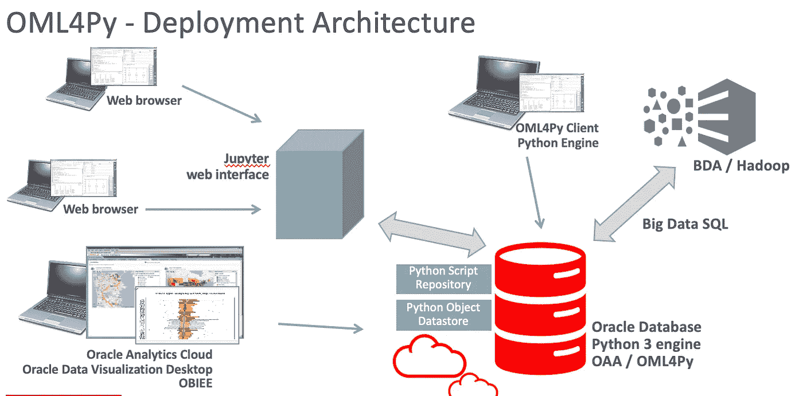

# 面向 Python 的 Oracle 机器学习

> 原文：<https://towardsdatascience.com/oracle-machine-learning-for-python-e335fc0a50e8?source=collection_archive---------12----------------------->

## **oml 4 py**:Oracle 高级分析的 Python 扩展。

# 引言。

这些天，我和我的同事 C. De Bari 正在为客户和合作伙伴安排培训，我们将在培训中讨论 Oracle **针对 Python 的机器学习**。酷，但这是什么？

Oracle DB 很久以来就有一个选项叫做: **Oracle 高级分析**。它是一个选项，让您可以访问许多广泛使用的机器学习算法，并使您能够运行这些算法，而无需将数据从数据库中移出。

有很多算法可用。用于回归、分类、异常检测、聚类、特征提取等的算法。名单很长。

将这些算法作为 Oracle DB 的一部分，不仅可以让您在不将数据从数据库中移出的情况下获得机器学习的能力，以及安全性、效率等方面的所有积极影响，还可以利用底层并行数据库引擎。

到目前为止，唯一可用的接口是:PL/SQL 和 R. **OML4Py** 让您能够调用所有这些算法，其中一些是最近添加的，使用的是现在数据科学中使用最广泛的语言: **Python** 。

OML4Py 将很快作为 Oracle Database 19c 的一部分在内部提供，然后作为 **Oracle Cloud 的一部分。**

# Python 客户端库。

首先，我们可以将 OML4PY 看作一个**客户端库**，您可以在 Python 程序或 Jupyter 笔记本中使用它来调用 Oracle 机器学习算法。

好的一面是，这个库的设计使得那些已经在使用像 Scikit-learn 这样的开源框架的人开始编写 ML 代码变得更加容易。API 非常相似。

使用 OML4PY，您可以:

*   连接到数据库
*   创建 Python 数据帧，它们是 Oracle DB 表的代理对象
*   根据这些表中的数据训练您选择的算法
*   给你的算法打分，提高性能
*   根据新数据进行预测

OML4Py 将通过基于 **cx_Oracle** 的 Python 模块(OML)提供。

# 部署架构。



# 代理对象。

这是一个很好的特点。

如果你在 **scikit-learn** 上学习过 ML，你会意识到很多例子都使用了包装在 Pandas DataFrame 中的数据。 **DataFrame** 是一种表格结构，在许多方面类似于 DB 表，有行和列。您可以使用一行 Python 代码从 csv 文件或 Oracle DB 表中加载 Pandas 数据帧。但是熊猫的数据帧完全保存在内存中。因此，它的大小受到可用内存的限制。

使用 OML4Py，在与 Oracle DB 建立连接之后，您可以轻松地创建一个与 DB 表同步的 **OML 数据框架**。

```
data = oml.sync(table = 'BREASTCANCER')
```

有什么区别？不同的是，“数据”是一个“**代理对象**”。同步调用不会将内存中的数据从数据库中取出。相反，它将 Python 对象连接到 DB 表，对 OML 数据帧对象的所有后续调用都将被翻译成在 DB 内部执行的 SQL 指令。

例如，您可以调用:

```
data.head()
```

其中数据是 OML 数据帧，你会在你的笔记本上看到前 10 行的列表。head 调用被翻译成一个 **SQL SELECT** 语句，只有第一行从 DB 中提取出来并返回给 Python 进程。

从最大似然的观点来看，重要的是你将使用 OML 数据框架作为训练你的最大似然算法的起点，就像你在 scikit-learn 中使用熊猫数据框架一样。

如果需要，您也可以从 OML 数据帧中提取熊猫数据帧，使用:

```
data.pull()
```

这样你就可以使用你已经开发的所有 Python 代码。

# 算法。

受支持的 ML 算法列表相当长且完整。

只是给你一个想法，你可以用:

*   朴素贝叶斯
*   广义线性模型
*   决策图表
*   随机森林
*   支持向量机(线性，高斯)
*   k 均值(聚类)
*   一级 SVM(异常检测)
*   神经网络(目前是密集的)

但是，您不仅有一个很好的 Oracle DB ML 实现的 Python 接口，还有一些重要的特性，如:

*   超参数的自动调谐
*   自动型号选择
*   自动特征提取

换句话说， **AutoML** ，它可以极大地简化你的机器学习模型的调整，并减少为你的商业案例获得正确模型性能所需的时间。

另一个旨在**简化 ML 采用的重要特性**是，许多算法自动处理空值、分类特征编码和特征缩放。在 scikit-learn 中，如果你想获得正确的性能，你必须做所有这些事情写代码。

我已经使用威斯康星乳腺癌数据集对 OML4Py 和 scikit-learn 进行了测试，在所有使用 AutoML 的情况下，我都看到了比 scikit-learn 更好的准确性。我已经达到了相当的准确性，只做特征缩放和准确的超参数选择。有时是一个相当长的过程。

# 还有什么？

此外，使用 OML4PY，您可以轻松地从 DB 加载和存储数据。

但是，最有趣的是名为“**嵌入式执行**的特性。这意味着您还可以编写自己的 Python 代码，例如使用 scikit-learn 算法的函数，将该代码存储在数据库中，并调用该函数将其应用于从数据库中选择的数据。只有几行代码。

这是一个有趣的扩展机制，我将在接下来的几周中对其进行更多的探索。

# 举个例子。

在下面的代码示例中，我展示了如何使用支持向量机创建一个机器学习模型，用于对患者进行分类。该示例基于 Wisconsin 乳腺癌数据集，数据存储在 Oracle DB 表中。

```
import oml
from oml.automl import ModelTuning
from oml import algo
import config

# connection to Oracle DB...
oml.connect(config.USER,config.PWD,
 '(DESCRIPTION=(ADDRESS=(PROTOCOL=TCP)(HOST=localhost)(PORT=1521))(CONNECT_DATA=(service_name=OAA1)))',
 automl=True)
# test if connected
oml.isconnected()

# create an OML dataframe connected to DB table
BREASTCANCER = oml.sync(table = 'BREASTCANCER')

# train, test set split
train_dat, test_dat = BREASTCANCER.split(ratio=(0.8, 0.2), seed=1234)
train_x = train_dat.drop('TARGET')
train_y = train_dat['TARGET']
test_x = test_dat['TARGET']
test_y = test_dat.drop('TARGET')

# I'll be using AutoTuning
at = ModelTuning(mining_function = 'classification', parallel=4)

# search the best algorithm and fit
results = at.run('svm_linear', train_x, train_y, score_metric='accuracy')

tuned_model = results['best_model']

# make the prediction on test set
pred_y = tuned_model.predict(test_x)

test_y_df = test_y.pull()
pred_y_df = pred_y.pull()

# utility function based on sklearn for displaying accuracy, precision, recall, F1 score
myutils.print_metrics(pred_y_df, test_y_df)
```

# 结论。

**OML4PY** 是对 Oracle Advanced Analytics 的扩展，它为您提供了一个与 Oracle DB 机器学习算法的友好易用的 Python 接口。

使用 OML4Py，您可以开发 ML 模型，在 Oracle DB 中运行，编写 Python 代码，这些代码在许多方面类似于您使用 scikit-learn 编写的代码。

但是，除此之外，您还可以使用自动功能选择、自动型号选择和自动调谐等功能。

**它将很快向客户全面推出**，我们正在为意大利的客户和合作伙伴提供一些培训。

我将很快就这个主题写一些更详细的文章。