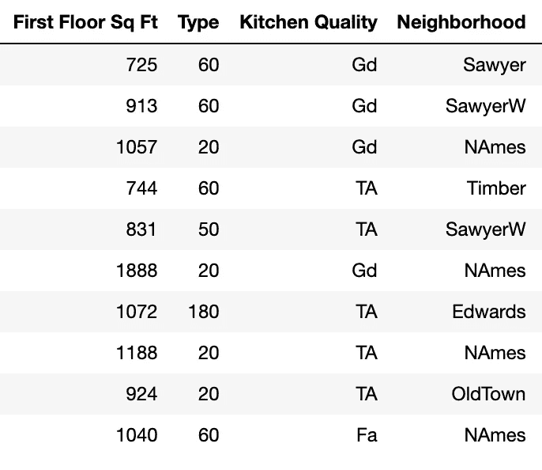
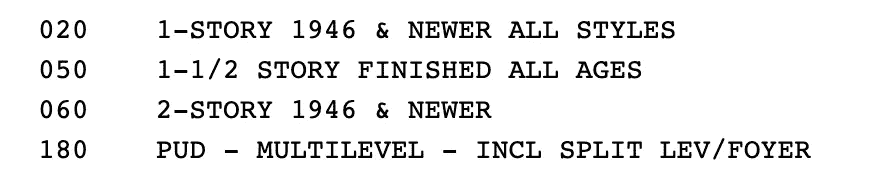
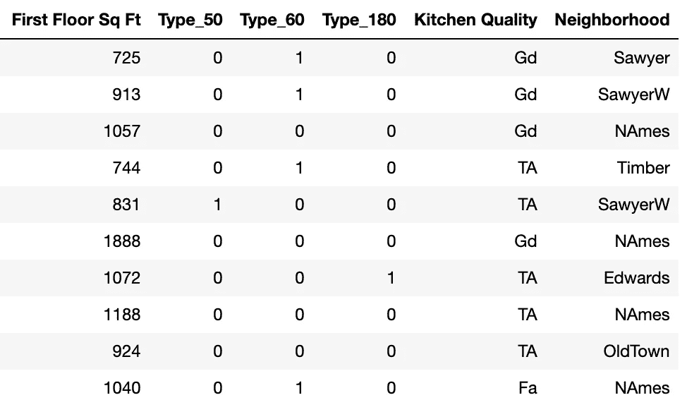
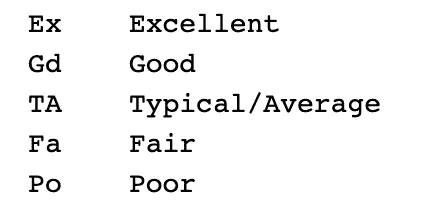
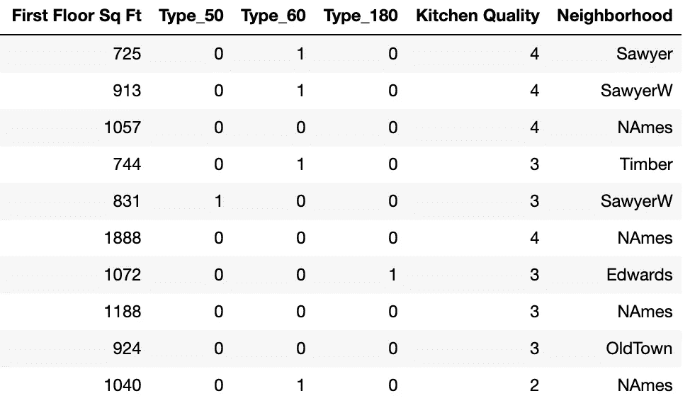
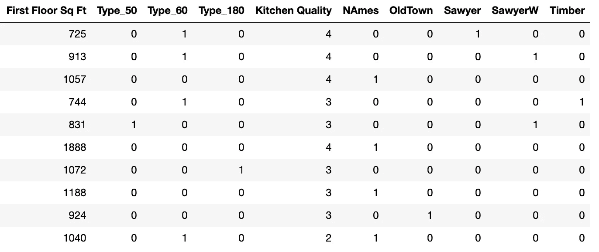

# 序数，名义，…谁在乎？

> 原文：<https://towardsdatascience.com/ordinal-nominal-who-cares-82c867d7b774?source=collection_archive---------33----------------------->

我的表妹是一名高三学生，当我最近见到她时，我问她:“你的课上得怎么样？”她转动着十几岁的眼睛，表达了她对统计课上必须学习的所有词汇的不满。“序数，名义，……谁在乎？”她感叹道。安娜，我告诉你。

数据科学家非常关心序数和名义数据。对于那些没有上过高中统计学课的人，让我们回顾一下:分类数据分为两类——有序数据和名义数据。有序分类数据是具有隐含顺序的非数字信息，例如，从非常不满意到非常满意的调查回答。名词性分类数据是非数字信息，没有任何固有的顺序，例如颜色或状态。

有序数据和名义数据之间的区别在我最近构建预测房价的线性回归模型时极其重要。我为建模准备特征的方式很大程度上取决于数据类型。下面是我的模型中四个特征的子集——一楼面积、住宅类型、厨房质量和社区。

Original dataframe with four variables

为了建立我的线性回归模型，我必须将所有的数据转换成我的模型可以处理的数字信息。但是并不是所有的特征数据都是数字的，所以在这里了解我们的数据类型是必要的。让我们来看看每个特性。

1.  第一层的面积已经是数值了(实际上是连续的数值)，所以这里没有工作要做。
2.  住宅类型看似是数字，其实不是。仔细查看数据字典(如下图)会发现，这些数据是分类的，我们看到的数字只是其他更长标签的代码。使用这些数字不是为了暗示顺序，而是为了缩短本列中每个观察值的标签长度。住所类型的数据类型是名义分类，因为数字代表标签，标签没有特定的顺序。

Data dictionary for type of dwelling

我通过制造假人将这种名义上的分类特征转化为数字信息。如果您注意到原始数据框架中列出了四种住宅类型:20、50、60 和 180。为类型创建虚拟对象会为每个可能的输出创建一个新列，如果属性是特定的类型，则列出 1，如果不是，则列出 0。在带有类型假人的数据框中(如下)，您可以看到第一个住所是类型 60，第五个住所是类型 50。

Dummies created for type

(*在创建虚拟模型的过程中，删除了任意虚拟列。在此数据框架中，开始时有四种住宅类型，但现在只有三个住宅类型的虚拟列。一般来说，如果一列中有 *n* 个输出，那么应该有 *n* -1 个虚拟列。这是数据科学中的常见做法，因为所有信息都以更有效的方式保存。有一个简单的方法来思考这个问题——如果我告诉你今天是工作日，不是星期一、星期二、星期三或星期四，即使我没有明确告诉你，你也会知道今天是星期五。)

3.对于厨房质量，我们看到一系列两个字母的代码。看一下数据字典会给我们更多的信息。

Data dictionary for kitchen quality

将两个字母的代码解释为从差到优的厨房质量的离散描述是合理的。这些标签有顺序的事实意味着在厨房质量特征中有分类序数数据。我没有对这个分类变量使用虚拟变量，而是将从差到优的等级改为从 1 到 5 的等级，如下所示。

Dataframe after kitchen quality transformation

4.要解决的最后一个特征是邻域。邻域没有顺序，所以这是一个名义分类变量。因此，我将创建假人，就像对住宅类型所做的那样。在下面的数据框中，您可以看到这种变化。(同样，删除了一个虚拟列。)

Final dataframe

所以你看，安娜，分类数据的类型——顺序的或名义的——是很重要的，因为它通知了关于将标签转换成数字的决策。现在是时候根据数据建立模型了！