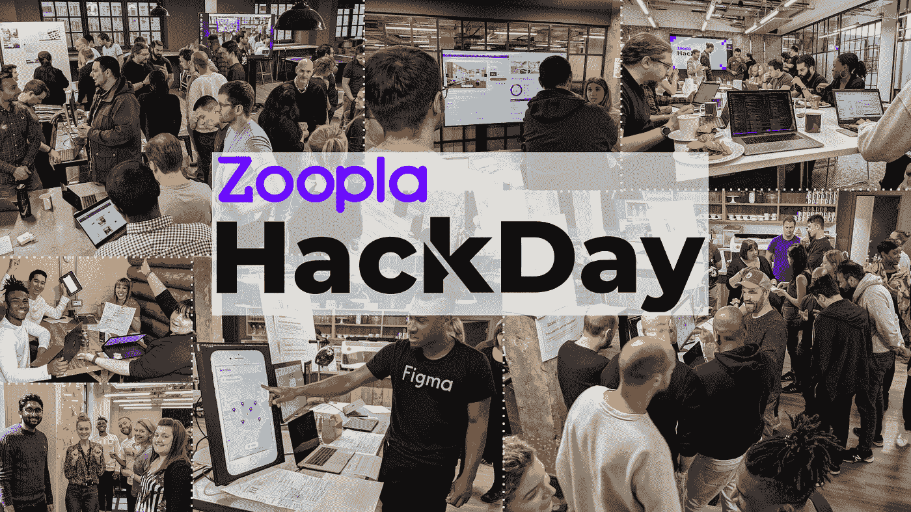
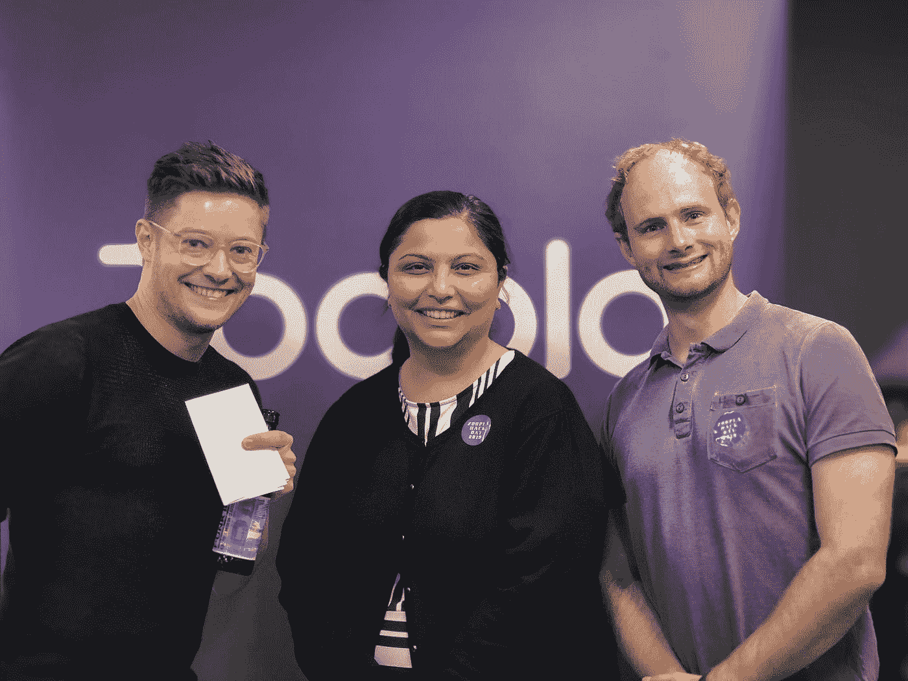
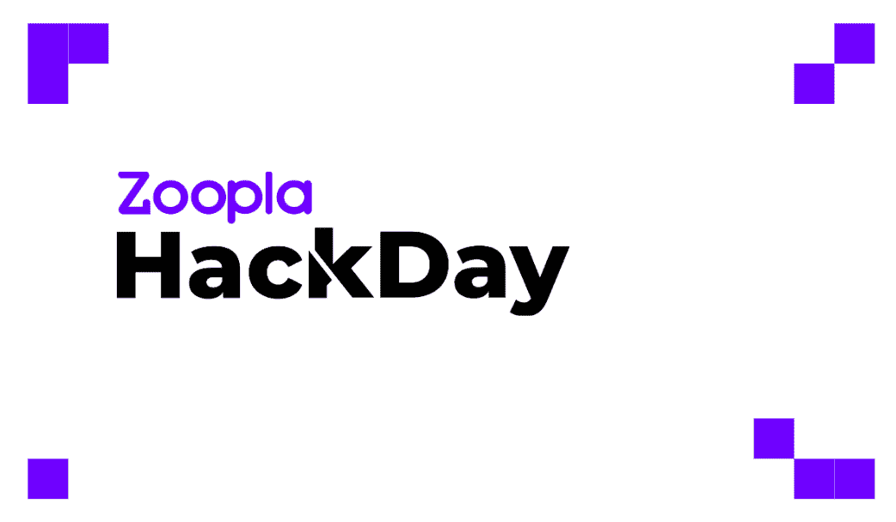
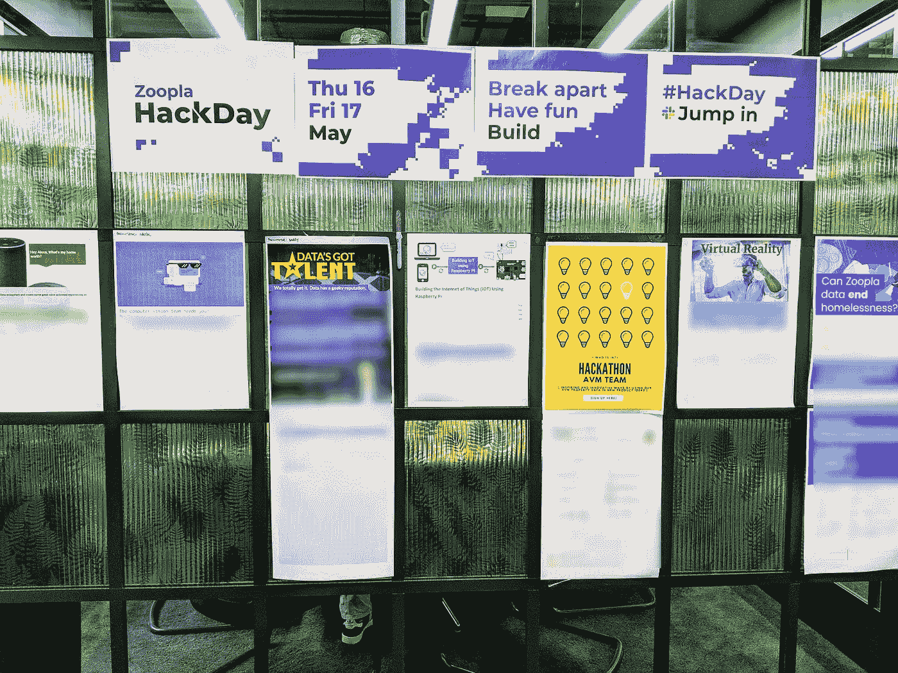
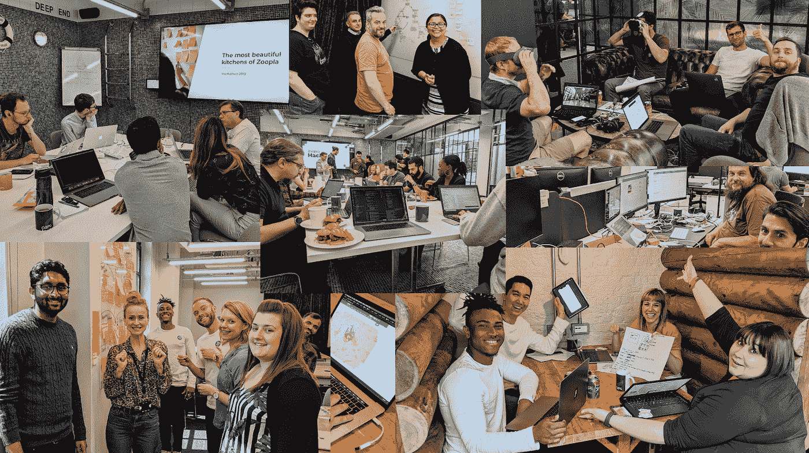
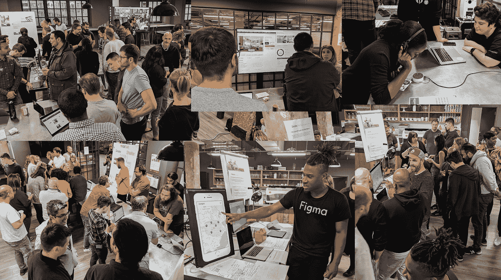
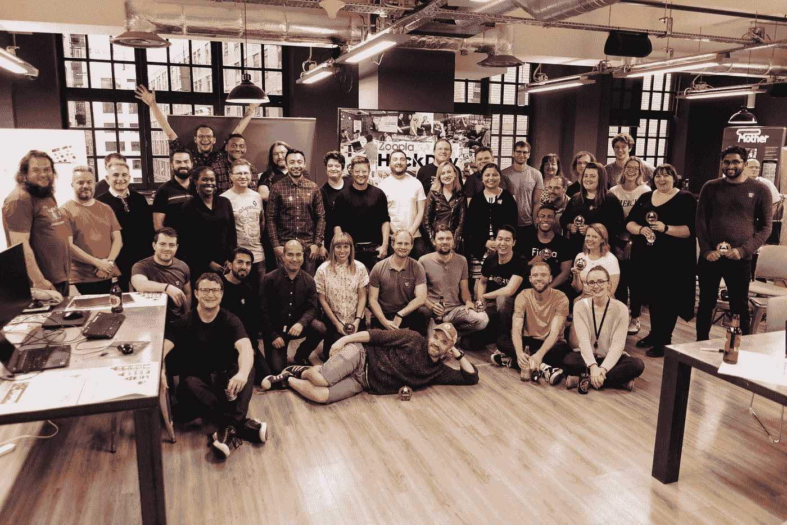
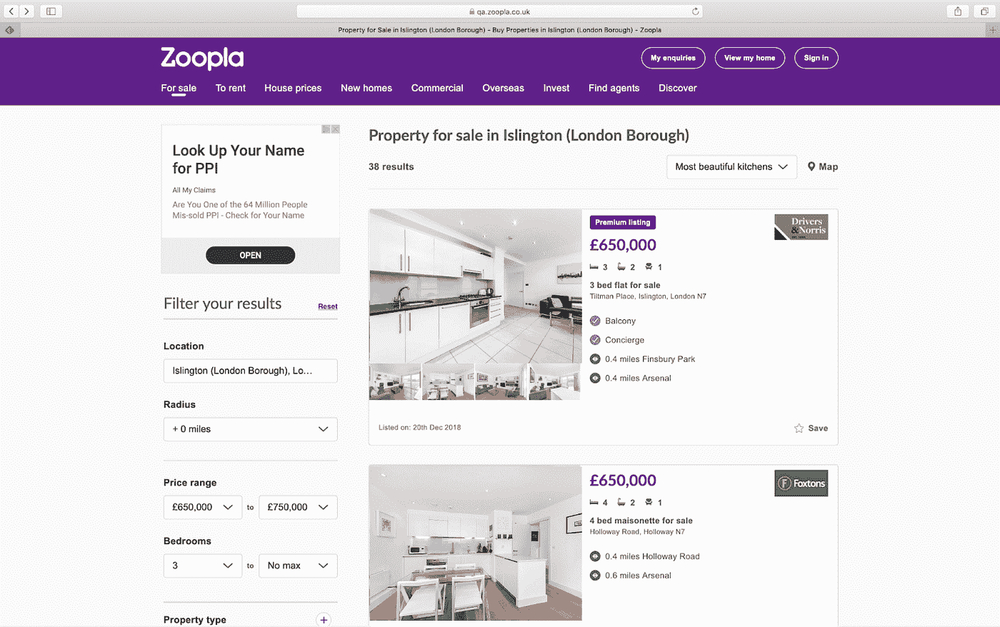
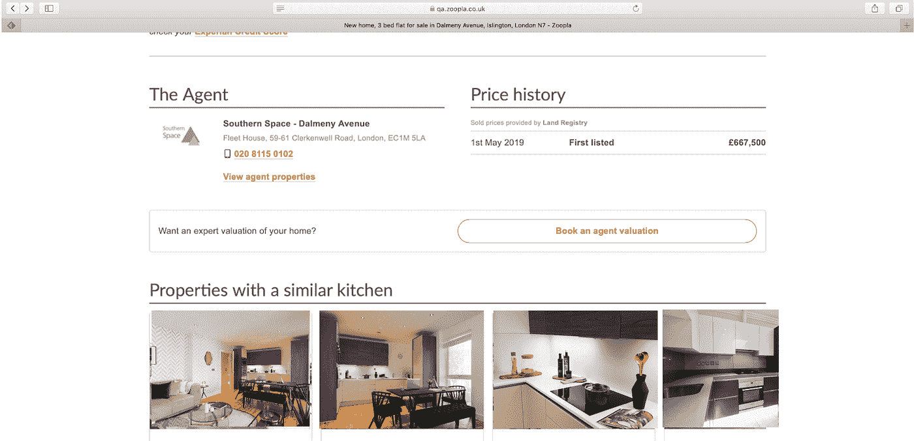

# 组织 Zoopla 黑客日

> 原文：<https://towardsdatascience.com/organising-the-zoopla-hack-days-6d7f25e4e763?source=collection_archive---------14----------------------->

Zoopla 刚刚成功举办了为期两天的黑客马拉松，这一切都始于 3 个人和一个梦想。如果我们有时间研究一些自己的想法，展示 Zoopla 最大的资产——在 Zoopla 工作的人才——的创新潜力，那该多好啊！这是我个人对黑客日组织的看法。

3 people and a dream: from the right [Matthew Chubb](https://www.linkedin.com/in/matthew-chubb/) (Software Engineer), [Jyoti Goyal](https://www.linkedin.com/in/jyoti-goyal/) (Senior Product Manager) and [me](https://www.linkedin.com/in/janteichmann/) (Data Science).

我们必须达到的第一个里程碑是**高层领导的认同**。如果你想从日常工作中抽出整整两个工作日，这对任何公司来说都不是一项微不足道的投资。Zoopla 正朝着成为第一的挑战性目标努力。我们不能只接受黑客马拉松的想法，而是要有一个令人信服的理由让它继续下去。

在一系列的午餐会议上，我们集思广益，讨论是什么激励人们参与黑客日。但同样重要的是，公司希望我们从 2 天的黑客马拉松中获得什么。这引出了一些难题:是否应该有一个主题？我们应该策划多少活动？精心策划的主题选择确实有助于准备和设置，但最初的动机难道不是让创新和创造力远离优先的积压工作吗？

最终，我们同意关注**公司文化**，而不是围绕主题和话题的细节，以获得高层领导的认同。所以我们的黑客马拉松有一个目标:加强 Zoopla 文化！Zoopla 是一个不断增长的业务，我们大多数人在单个产品团队中都非常关注产品。举例来说，在这样的环境中，与其他团队保持联系，让新的新手感觉融入得很好并不容易。但是文化对 Zoopla 来说是非常重要的，文化得到了高层领导的认可，让我们或多或少得到了官方的认可。**文化对于数据科学团队的成功和交付也是至关重要的。**

> 对文化的关注是一个完美的双赢局面！因为文化早餐吃策略。

然而，我们知道我们只是推迟了围绕黑客日主题和话题的必然决定。但随着计划的进行，我们可以选择让 Zoopla 的人提交想法，并找到一个更民主的解决方案。可惜没那么简单。这需要参与，到目前为止没有人听说过我们的黑客马拉松，也没有理由对此感到兴奋。

> 不要低估我们所有人的怀疑精神，尤其是在我们忙碌的时候。

为了增加参与度和成功的机会，黑客马拉松需要专业的身份以及围绕主题和话题的细节。与此同时，我们三个开始意识到组织这次黑客马拉松会有多少工作量。我们必须开始授权。

> 代表，代表，代表！

Heldiney Pereira(UI 设计师)给了我们一些急需的润色:电子邮件模板、徽标和背景。

当我们开始在所有渠道发送黑客日通信时——从面对面的讨论，到站立式收购，电子邮件和 slack 频道——话题和主题的想法开始出现。

事实证明，我们太担心主题的选择和策划了。提交的材料中很快出现了共同的主题，大多数主题都与业务高度相关。在我们花了一些时间对主题进行分组和提炼之后，我们又回到了委派！

我们为每个主题确定了主持人，负责推动该主题的参与，并确定必要的设置和准备工作。如果没有我们热情的主持人的帮助，我们根本无法举办黑客马拉松。

我们把海报和宣传材料放在一起，让人们注册一个主题。这是一个很好的成功指标，用来衡量我们在推动参与度方面的努力。

> 创造持久的兴奋和参与比你想象的更难。

有了这个方法，我们开始组织黑客马拉松的细节，天哪，这是一个做不完的事情的列表:

*   与设施团队合作，为黑客马拉松寻找场地
*   预算规划和批准
*   活动的食物和饮料必须符合饮食要求和 Zoopla 的不使用一次性塑料的政策
*   黑客时代的社交活动
*   黑客马拉松演示
*   奖项、投票和价格
*   出于公关和营销目的的内容捕获
*   如何联系我们的远程办公室
*   获得直线经理的认可和批准，让员工参加
*   批准，以便我们的承包商能够参加

根据反馈，我们决定黑客马拉松项目的**市场风格展示**将是最动态和最吸引人的形式。我们想参加演示，这也是对我们主管时间的最好利用。

> **没有被幻灯片压死！**

不管有多少计划，有很多事情留到最后一分钟，这造成了一些麻烦:我们订购的奖杯不是我们收到的奖杯，修复它确实非常接近。参加黑客日、发布会和颁奖典礼的人数比计划的要多。这导致了一些最后时刻的设置挑战，当人们参加黑客马拉松演讲时，用玩具剪刀剪下了额外的 100 多张投票卡，并且因为团队规模更大而耗尽了奖杯。我们从活动策划的利润规模中学到了宝贵的经验！😄

最后，黑客马拉松取得了巨大的成功，这使得所有的工作都是值得的！

# 数据科学研究的是什么？厨房！

一个由数据科学家、后端和前端工程师组成的跨职能团队开始寻找 Zoopla 最美的厨房。目的是按厨房对 Zoopla 上的房产列表进行排序，并根据厨房的相似性推荐房产。这是一个有趣的话题，既有很大的数据科学挑战，也有很大的商业相关性:厨房很容易成为想买新房的人的绊脚石。

为了提供全功能的概念验证，团队创建了:

*   CNN 对厨房图像进行分类
*   厨房图像的数字指纹
*   提取厨房特征，如镀铬水龙头、抽油烟机等。
*   计算厨房特征之间的 jaccard 相似性和图像指纹之间的余弦相似性，以将它们组合成厨房相似性得分
*   提前对 Zoopla 属性列表进行批量评分，并将标签和评分加载到快速缓存层，该层充当模型的表示层
*   创建一个 API 来查询厨房，并返回相似厨房的属性列表和图像
*   更改 Zoopla 前端，动态显示按照厨房相似性分数排序的厨房和房产列表

之所以能够在短短 **2 天**内实现这一目标，是因为该解决方案建立在我们数据科学团队去年创建的计算机视觉和基础架构基础之上。然而，这并不是一件容易的事**并且为这个项目赢得了**黑客马拉松最聪明黑客奖**。**

**Natalia Koupanou 和 Harpal Sahota 因在 Zoopla 上制作的**数据科学获奖而获得巨大荣誉！**😄**

****

**Jan 是公司数据转型方面的成功思想领袖和顾问，拥有将数据科学大规模应用于商业生产的记录。他最近被 dataIQ 评为英国 100 位最具影响力的数据和分析从业者之一。**

****在 LinkedIn 上连接:**[**https://www.linkedin.com/in/janteichmann/**](https://www.linkedin.com/in/janteichmann/)**

****阅读其他文章:**[【https://medium.com/@jan.teichmann】T21](https://medium.com/@jan.teichmann)**