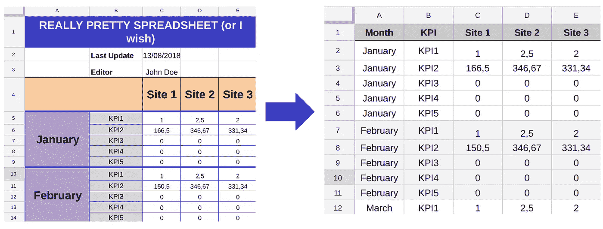
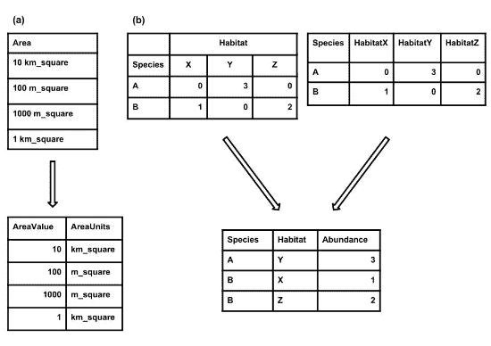
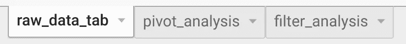
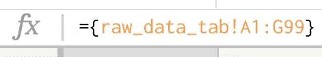
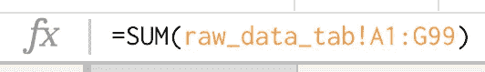
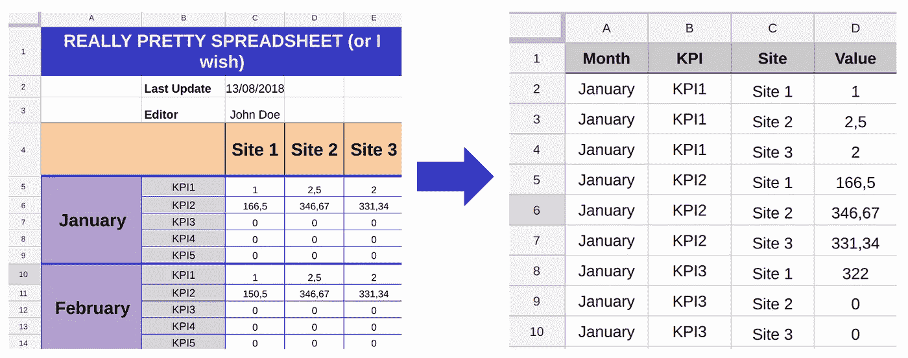
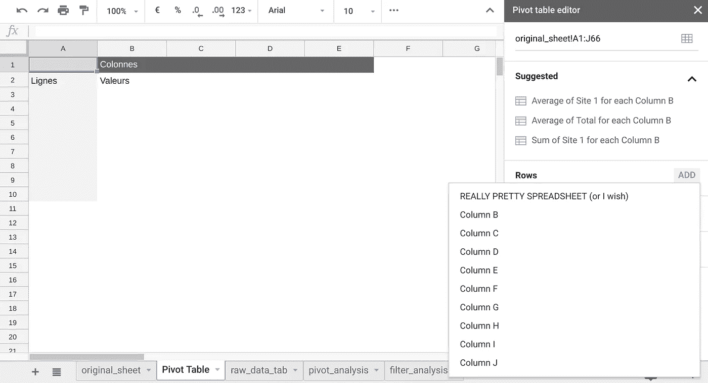
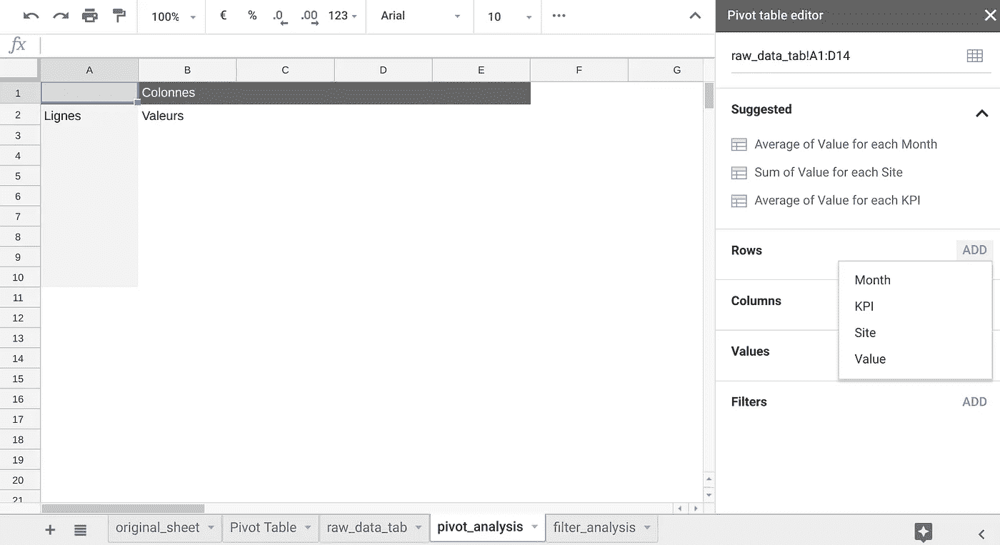
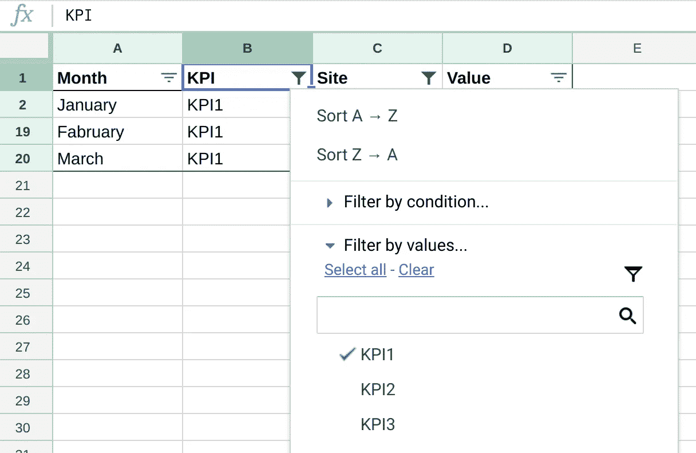

# 组织您的电子表格以进行数据分析和可视化

> 原文：<https://towardsdatascience.com/organize-your-spreadsheets-for-data-analysis-and-visualization-b1985a31523a?source=collection_archive---------18----------------------->

Photo by [Mika Baumeister](https://unsplash.com/@mbaumi?utm_source=medium&utm_medium=referral) on [Unsplash](https://unsplash.com?utm_source=medium&utm_medium=referral)

电子表格软件允许我们分析大量数据，以获得对流程或业务的新见解。我们的硬盘上都有大量充满数据的电子表格，但利用这些数据并不总是那么容易。主要原因是我们经常倾向于组织我们的电子表格来进行*人工*分析。

问题是，计算机和我们人类的思维方式不同。在这篇文章中，我会给你一些最佳实践来组织你的电子表格，以便用你最喜欢的电子表格软件进行数据分析和可视化，或者更好地，用外部工具，如[数据工作室](https://datastudio.google.com/u/0/)。

# 维度和指标

Dimensions and Metrics (ruler by monkik on FlatIcon)

重要的是要明白，任何数据都可以分为*维度*和*指标。*

*度量* **衡量**，嗯，事情。指标始终是数字，可以使用 sum、average 等公式进行汇总。你有时也会碰到术语*事实*或*度量*，它们是同义词*。*

*维度*用于**描述**你的度量标准。维度可以是任何类型的数据，但通常是日期或一些文本(例如，颜色等属性，性别等类别)。).你有时也会碰到术语*段*。

*维度值*，维度包含的数据，是一个类别的名称、描述或其他特征(如颜色维度:红、蓝、黄)。

好的电子表格设计是关于以一种方式存储你的维度和指标，这种方式将允许容易地过滤和透视你的维度，并且容易地聚集你的指标。

# 取消打印您的电子表格

在研究如何存储数据之前，让我们先来看看电子表格的组织。通过自动化工具进行数据分析的设计不同于将一些图表分享给你最喜欢的市场部同事。

Step 1 : unpretty your spreadsheets

*   移除合并的单元格:合并的单元格不能在 pivot 中使用，并且不受外部工具的支持
*   删除多行标题
*   删除标题、格式、文件版本、日期和作者(使用[文件历史和版本](https://support.google.com/docs/answer/190843?co=GENIE.Platform%3DDesktop&hl=en)

# 凌乱的数据

现在让我们来看看存储数据的方式:

*   每行必须代表一个**未聚合的**度量
*   每个单元格只能包含一个维度或度量值
*   每列必须有唯一的名称

Step 2 : Untidy your data (credit : Ethan P. White et al. in Ideas in Ecology and Evolution)

我们也很自然地倾向于存储已经转换的数据，因为这对我们正在做的事情来说是有意义的，或者它使我们免于一些重复的数据。然而，充分利用你的数据的关键是以最简单的方式存储未经处理的数据，也就是说不经过处理。

如果你不确定这是什么意思，只要记住*使用一个* ***每种尺寸和公制*只使用一个** *列。*

在上面的例子中， *HabitatX* 、 *HabitatY* 和 *HabitatZ* 是同一维度的维度值:它们必须存储在同一列中。他们测量的东西，丰度，也必须存储在同一列中。在 unpivot 之后，我们能够在栖息地维度上进行过滤和透视，并聚合丰度指标，这在原始格式中是不可能的。

# 将源数据与分析分开

Step 3 : separate data from analysis

您应该在一个选项卡中保持原始源数据不变，然后在一个或几个其他选项卡中查看和分析原始数据。要从另一个选项卡导入数据，请使用以下 import 语句:

Import data from another tab

或者在公式中:

Import data from another tab in a formula

# 包裹

按照这些步骤，下面是我的示例表的转换:

当使用 pivot 函数时，我们会从这种透视维度是由隐含的列字母命名的情况中脱离出来:

这个更有意义的情况:

请注意自动化建议现在变得更有意义，以及我们如何在不同的选项卡中从分析中分离原始数据。

我们现在还能够按站点和 KPI 维度进行筛选和汇总，这在以前是不可能的:

更进一步，现在可以使用 Data Studio 等数据可视化工具对数据进行分析或公开。

## 感谢阅读！如果你喜欢这篇文章，不要犹豫，分享它。

我每天都在学习，如果我有任何错误，请随时纠正我，并在评论区添加您的建议。