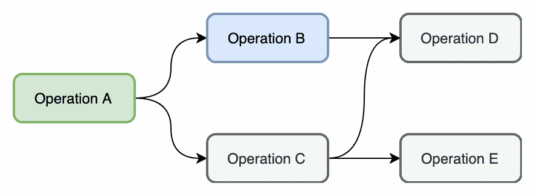

# 使用 PLynx 组织数据科学实验

> 原文：<https://towardsdatascience.com/organizing-data-driven-experiments-with-plynx-a3cc3301b981?source=collection_archive---------18----------------------->

## “构建可再现数据科学工作流的简单方法”


持续改进、促进创新解决方案和理解复杂领域是数据科学家今天面临的挑战的重要组成部分。除此之外，他们还要处理各种工程问题，从数据收集和转换到部署和监控。工程师和数据科学家开发了各种工具和框架，以解决以可重复的方式进行数据实验的核心挑战。

事实证明，笔记本非常适合一次性分析。另一方面，在生产方面，他们有无数的缺陷。笔记本通常不可复制，不鼓励重用相同的代码，不支持开箱即用的并行化，不能很好地与版本控制工具一起工作，等等。与工程师类似，数据科学家设法使用现有的工具和良好的实践，如 Makefiles。他们描述计算图形，其中每一步都是一个脚本。用户仍然负责许多工程细节，比如云中的并行执行或者存储和访问数据。

其他数据科学家采用了通常数据工程师会使用的工具。例如，Apache Airflow 是一个非常流行的构建数据管道的框架。不幸的是，数据科学并不总是以同样的方式工作。高度可靠的执行没有尝试不同实验的灵活性和能力重要。在数据科学中使用可靠的数据管道可以带来增量改进，但是通常从其他活动中获得的好处要多得多，例如集成新的数据源或使用额外的工作流。


This is a machine learning pipeline in PLynx. Users can create their own experiments in UI as well in python using API. You can try this demo at [plynx.com](https://plynx.com).

## **数据科学家应该做什么样的好平台？**

一个构造良好的平台将数据科学家从工程和组织复杂性中抽象出来，如数据访问、容器化、分布式处理、自动故障转移和其他高级计算机科学概念。除了抽象之外，平台还将支持实验基础设施、自动化监控和警报、提供自动缩放，以及实现实验的可视化、调试输出和结果。

PLynx 的灵感来自几个非常成功的内部平台。

以太是微软在 Bing 团队开发的。我不能再多说什么了。[微软首席执行官 Floydhub)](https://news.ycombinator.com/item?id=13660111)说道:

> 相关性收益的成功和快速增长在很大程度上归功于一种叫做 AEther 的新工具的引入(除了改进 ML 技术和雇佣顶尖人才之外)。AEther 是一个构建和运行数据工作流的实验平台。它允许数据科学家以大规模并行的方式构建复杂的工作流和实验，同时抽象出所有的工程问题。我每天都用它，并且非常喜欢它。AEther 团队声称，它将研究人员和工程师的实验生产率提高了近 100 倍。即使是现在，当我问在其他公司工作的前 Bing 数据科学家他们在微软工作期间最怀念什么时，AEther 几乎总是在前三个答案中。

PLynx 的另一个灵感来源是 Yandex 开发的一个通用计算平台，名为 Nirvana。它的建立是出于为各种团队和需求扩展内部 ML 平台的需要。

# 实验

PLynx 中的实验表现为计算 ***图*** 。图表定义了实验的拓扑结构。单个操作的 ***输入*** 是其他操作的 ***输出*** 或称为文件的资源。PLynx 负责存储和访问工件，并以并行方式编排运行的作业，将它们从用户手中抽象出来。



The order of Operations is similar to Makefiles. In this example PLynx can execute Operation B and Operation C since their dependancies have completed. The results of Operations are cached and stored for reusability purpose by default.

你可以重用别人的成功实验，克隆它，在自己的实验中重用。它倾向于增加协作和对现有工具和算法的了解。随着时间的推移，随时可用的操作和子图池在不断增长。它鼓励人们以更加模块化和参数化的方式创建工作流，重用现有的解决方案。通过这种方式，他们不必多次重新发明现有的解决方案，并且可以利用缓存结果和分布式计算的优势。

您可以使用编辑器或 python API 从头开始创建图表。这是一个简单的拖放界面，用户将依赖关系定义为操作之间的数据。或者，用户可以选择使用 python API 来创建图形拓扑。使用 API 可能有多种原因:

*   实际上，生产工作流倾向于转移到 API，而 UI 通常用于监控和实验目的。
*   您希望使用各种超参数进行多个实验，这些超参数更容易在脚本中定义，而不是在 UI 中定义。
*   实验的拓扑取决于超参数。
*   您希望在 python 脚本中保留图形的结构，以便能够将其存储在现有的版本控制框架中。
*   您可能希望定期或基于外部事件(如新数据可用)运行图表。

无论是哪种情况，在 PLynx 中都没有对错之分。实验的 UI 和 API 表示是相同的。


Example of a running experiment from the demo.

# 文件和操作

***文件*** 和 ***操作*** 是 PLynx 中的基本构建模块。用户使用 bash、python 脚本或其他插件定义自己的操作。


PLynx 主要是一个编排平台。它按照拓扑顺序执行操作。调度程序跟踪它们的状态和更新。当一个操作准备好被执行时，调度程序会把它放在全局队列中，一个工作人员将在那里提取它。

每个操作都处理抽象为文件的输入。输入有它们的类型，比如通用的*文件*、 *json* 、 *csv 文件*，或者更抽象的*目录(遮光罩下存储为 zip 文件)*、*云资源(存储为 json)* 或者其他。在实践中，为了方便和鼓励良好的实践，定义类型是很重要的。其他用户需要看到您的操作消耗和产生了什么。输入也可以是可选的或是列表。每个输入有两个参数:`min`和`max`，都默认为`1`。如果`min == 0`，那么输入是可选的。如果`max < 0`那么操作可以消耗无限数量的文件。

***参数*** 不构成图形的结构。用户定义自己的参数或使用系统参数。比如你可能需要`number of iterations`、`commit hash`、`activation function`等等。这些参数的值在很多编程语言中都很熟悉，比如*整数*、*字符串*、*枚举*、*整数列表*等。此时，在系统参数中，支持以下参数:

*   `cmd: Code` —将要执行的代码。目前支持`bash`和`python`脚本。
*   `cacheable: Bool` —确定操作是否可缓存。例如，`sort`运算是确定性的，给定一定的输入会产生相同的输出。另一方面，Bash 命令`date`是不确定的。
*   `_timeout: Int` —执行操作所需的最长时间(分钟)。如果超时，工作人员将停止操作。

除了 ***输出*** 之外，操作以 ***日志*** 的形式产生非常重要的信息。用户可以查看`stdout`、`stderr`、`worker`等标准日志。实时日志也是可用的，给比你`flush`他们及时。

# 操作执行

让我们来看看操作定义。您可以创建新操作，也可以从现有操作克隆。用户添加或删除自定义输入、参数和输出。不要忘记指定类型。


主要参数叫做`cmd`。它定义了操作的整个执行过程。来自 ***自定义属性*** 块的“基本节点”将解释输入、输出和参数。基本节点是插件。目前支持`bash_jinja2`、`command`和`python`插件，但它们可以扩展。

*   `python` node 将输入、输出和参数视为 python 对象。
*   `bash_jinja2`将使用 *jinja2* 模板*框架替换`cmd`参数中的所有内容。*
*   `command`将使用环境变量。

如果您不确定工人将如何解释操作，请点击“ ***预览*** ”按钮。

让我们看一个例子。我们希望创建一个操作来克隆一个 git 存储库，将其重置为给定的提交散列，并构建它。最后它会生成一个类型为“*可执行文件*的文件，这样我们就可以在其他操作中使用它。我们将使用`bash_jinja2`插件:

```
# stop execution of the script if one of the command failedset -e# create a custom directory and clone a git repo thereexport DIRECTORY=directorygit clone {{ param['repo'] }} $DIRECTORY# cd to the directory and reset it to a certain commitcd $DIRECTORYgit reset --hard {{ param['commit'] }}# execute “command”, such as “make” or “bazel build”bash -c '({{ param["command"] }})'# copy resulting artifact to a path PLynx expects to see the outputcp {{ param["artifact"] }} {{ output["exec"] }}
```

这个脚本本身在 bash 中是不可执行的。这就是为什么 PLynx ***Worker*** 和`bash_jinja2`会照顾占位符:

```
# stop execution of the script if one of the command failedset -e# create a custom directory and clone a git repo thereexport DIRECTORY=directorygit clone https://github.com/mbcrawfo/GenericMakefile.git $DIRECTORY# cd to the directory and reset it to a certain commitcd $DIRECTORYgit reset --hard d1ea112# execute “command”, such as “make” or “bazel build”bash -c '(cd cpp && make)'# copy resulting artifact to a path PLynx expects to see the outputcp cpp/bin/release/hello /tmp/7640dee8-4b87-11e9-b0b6-42010a8a0002/o_exec
```

这个脚本是一个有效的 bash 脚本。PLynx 还将负责下载输入和上传输出到存储器。

执行操作的工作线程的算法如下:

*   轮询 ***主*** 直到它给工人分配新任务。
*   创建一个临时目录，将其设置为工作目录
*   准备输入:下载输入，将它们保存在工作目录中
*   创建一个 bash 或 python 脚本，并用适当的名称和值替换占位符。
*   执行脚本。
*   上传输出和最终日志。

注意，一些输入和输出类型是可以抽象的。例如:

*   `Type == Directory`。PLynx 将创建输入和输出目录(与文件相对)。
*   `Type == Cloud Storage`。在这种情况下，文件本身是一个引用云目录的 *json* (路径在 *s3* 或 *google storage* )。如果你想得到路径本身而不是 json，使用 T2。

# 应用和优势

PLynx 是用于分布式计算的高级域无关平台。它不受特定应用的限制，可以扩展到面向自定义数据的工作流和实验。下面是一些成功应用的例子:

*   机器学习:数据准备、转换和实验管理。PLynx 以一种有组织和可重复的方式，在准备的任何步骤中加速测试新想法。由于框架的分布式本质，您不会受到单个运行实验的限制。您也可以随时重新运行整个实验。
*   不断地重新训练模型。跟踪整个培训流程并能够随时重现非常重要。
*   用新数据重新训练模型。随着新数据的出现，用户只需点击两下鼠标就可以重新训练现有模型。
*   同时进行多项实验。数据科学家可以在有想法的时候马上进行实验。
*   重用现有的操作和子图。自然，组织中的人需要相同的功能、过滤器、聚合器、转换、度量等等。随着时间的推移，操作池变得非常有表现力，数据科学家不再使用现有解决方案重复他们的工作。
*   追踪实验。数据科学家经常回顾他们成功的实验，看看哪些想法行之有效。
*   协作。像分布式计算、缓存、重用操作和监控工具这样的好特性鼓励人们使用单一平台。每个实验都被跟踪。
*   比较不同的算法。PLynx 在改进你的模型方面非常有用，尤其是有一个基线。
*   特别数据分析。用户可以重用现有操作来过滤、采样、连接和聚合大数据，而无需工程工作。根据您的基础设施，您可以使用抽象的操作来编写查询，这些操作将处理数据，而不考虑存储。例如`join`、`filter`或`map`是可以在 SQL、MongoDB、BigQuery 等中完成的抽象。
*   不需要领域专家来管理整个管道。非专业人员可以重新运行现有的。
*   图表形式的实验很好解释。它可以被非专家或者其他团队的人使用。

# 包扎

PLynx 是一个开源平台，用于管理面向数据的工作流和实验。其核心特点是:

*   可重复的实验。
*   实验史。
*   编辑器和监控工具。
*   分布式计算。
*   从用户那里提取技术细节。
*   操作和图形的可重用性。

PLynx 是一个开源项目，你可以在[https://github.com/khaxis/plynx](https://github.com/khaxis/plynx)找到代码。