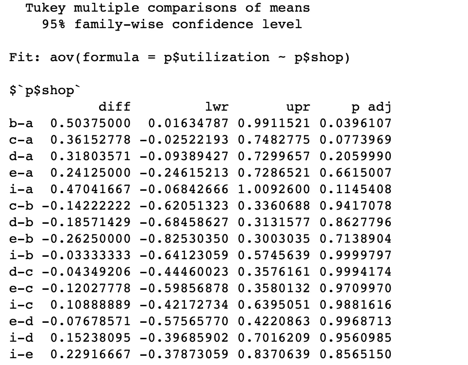

# 我的组织分析使用 R

> 原文：<https://towardsdatascience.com/organiztional-analysis-using-r-d4cb9ae531f5?source=collection_archive---------22----------------------->


我在一家维修店工作，该店使用 SAP 软件管理我们的维修零件、维修工作单和员工生产力。我对该软件的商业智能(BI)方面不感兴趣，所以我通过 csv 文件将我的数据上传到 [Microsoft Azure 笔记本](https://notebooks.azure.com)中，并使用带有 r 的简单算法执行我的分析。我的目标是从整体上观察组织。我从 SAP 软件中提取数据，分析直接人工和利用率，以了解整个组织的差异。现在有很多建立我的数据，所以它绝不是一个神奇的黑盒子。我正在使我的数据清理和收集过程变得更加干净。当我到了可以发布这个过程的时候，你可以在媒体上查看它。在那之前，让我们回到没有分析的轨道上来。

我将一步一步地完成我的过程。首先，我将数据存入一个 csv 文件。我得先清理一下数据。要关注我，请点击超链接进入 [github](https://github.com/chris-kehl/direct_labor_utilization_report) 并检索我的文件。有一个自述文件、一个. pynb 文件和一个包含我的数据的 csv 文件。

你可以使用 rStudio，R via terminal，Azure Notebooks，或者任何你想部署 R 编程语言的方式。我现在使用 Azure 笔记本，这对我来说是新的，我正在利用免费使用的优势。我们手头的第一件事是上传数据。您将在 github 资源库中找到 csv 文件“edited_dl_July19.csv”。

```
p = read.csv("edited_dl_July19.csv")
```

接下来，我们将使用 head 命令查看文件的一部分。

```
head(p)
```


是的，一切看起来都很好。如果我们愿意，我们可以查看单个数据，但我喜欢查看具体的工作领域。我工作的维修车间分成几个部分。我把它们命名为 a 店、b 店、c 店、d 店、e 店和 I 店。每个单独的商店都有自己的主管，并在设施内发挥特殊作用。我寻找的是直接人工率和各商店的利用率。

接下来，我必须查看 R 正在查看什么类型的数据，并在必要时进行更改。

```
*# must use factor R thinks this is a integer*
class(p$shop)
class(p$utilization)
```

r 说商店是一个因素，利用率是数字。这就是我想要的，所以我们；我同意。在下面的代码中，我将通过运行方差分析来开始形成我的分析。方差分析也称为 ANOVA。ANOVA 是比较三个或更多变量组的平均值的规定方法。在我们进行分析时，我们会查看的零假设，以了解我们的观察结果是否存在显著的统计差异。在分析目标时间时，我们使用方差分析的 f 检验。我们查看与 f 检验相关的概率(p 值),以确定它是否大于阈值，对于 95%的置信水平，阈值≤ 0.05。

```
*# using block as a factor*
p1=aov(p$utilization ~ p$shop)# separate line or cell to summarize p1
summary(p1)
```


看这个我的 P 值小于 0.05，所以用数据有一定的统计学意义。为了进一步分析数据，我们知道数据中有问题。为了进一步分析这些数据，我使用了 TukeyHSD 命令，即 Tukey 的测试、Tukey 方法、Tukey 的诚实显著性测试或 Tukey 的 HSD 测试。从 Tukey 的 HSD 测试中检索的数据是单步多重比较程序和统计测试。在此分析中，它与 ANOVA 结合使用，以找出彼此显著不同的平均值。方差分析测试告诉我们，我们检索的日期有显著差异。Tukey 的 HSD 测试将向我们展示数据中出现差异的地方。

```
TukeyHSD(p1) 
```



我们来看看我们的直接劳动力比较，我们来看看 b-a 之间的显著性，它的 p 值小于 0.05，所以数据中有显著差异。我用这个来看商店是否在同一层。当我们看我们的视觉化图像时，我们可以看到不同之处。

接下来是利用率，我对利用率的操作与对直接人工的操作相同，只需将名称改为 Utilization，并将 p1 改为 p2。

```
p2=aov(p$direct_labor~p$shop)# I put this in a separate cell or line
summary(p2)
```


再次查看 p 值，数据中有统计学意义。

```
TukeyHSD(p2)
```


看看 c-a p 值和 c-d，肯定有什么事情发生了。

现在是可视化数据的时候了。对于这种分析，我发现箱线图是显示差异的最佳可视化工具。

```
boxplot(direct_labor ~ shop, data=p, main="Direct Labor July19", xlab="Shop", ylab="Direct Labor Hours")
```


```
boxplot(utilization ~ shop, data=p, main="Utilization July19", xlab="Shop", ylab="Utilization(percent)")
```


当我做分析的时候，我着眼于直接劳动的意义。我要看的是我们每个月在实际设备上实际工作了多少小时。如果我们看一下我们的直接人工箱线图，我们会发现 a 的平均工作时间不到 40 小时，也就是 35 小时。异常值表明某人实际上有 70 个直接人工小时。所以我们看一下直接人工和利用率图，看看有什么不同。这是组织中的专家能够分析数据并找出差异所在的地方。注:对于该组织，目标是利用率达到或超过 85%，目标是 90%。直接人工的目标是 55%或以上。

分析显示了子商店之间的统计差异。经过进一步调查，发现这是 7 月份。几个雇员出去度假了。此外，并不是所有的员工都在一天结束时正确填写他们的考勤单。由于未正确填写工时单，工时被计入工作单，从而缩短了可记录的直接人工工时。在我看来，这是一个很好的管理工具，可以评估和预测完成一项任务所需的工时。