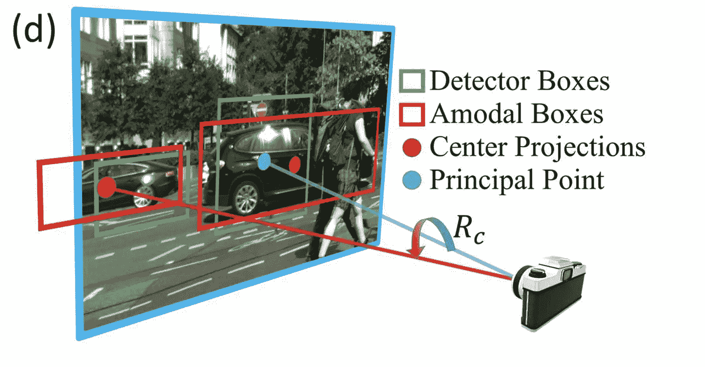

# 单目三维物体检测中的方向估计

> 原文：<https://towardsdatascience.com/orientation-estimation-in-monocular-3d-object-detection-f850ace91411?source=collection_archive---------8----------------------->

单目三维目标检测的任务是在 2D RGB 图像中围绕目标绘制三维定向包围盒。由于降低成本和增加模块化冗余的潜在前景，这项任务吸引了自动驾驶行业的大量兴趣。利用单个 2D 输入进行 3D 推理的任务是非常具有挑战性的，而对车辆方位的估计是实现这一重要任务的重要一步。

2D vs 3D object detection ([source](https://arxiv.org/pdf/1612.00496.pdf))

在单目 3D 对象检测中，文献中不断出现的一个重要概念是以自我为中心和以他人为中心的方向之间的差异。我最近向我的许多同事解释了这种差异，我认为这是一个写一篇关于这一点的简短博客的好时机。

请注意，这篇文章主要关注自动驾驶中的 3D 方向概念。如果你想知道定向回归的最新方法，请阅读我之前关于[多模态目标回归](https://medium.com/analytics-vidhya/anchors-and-multi-bin-loss-for-multi-modal-target-regression-647ea1974617)的帖子，特别是关于定向回归的。

## **以自我为中心 vs 以他人为中心**

自我中心和他者中心的概念来自于[人类空间认知领域](https://link.springer.com/chapter/10.1007/3-540-69342-4_1)。然而，在自动驾驶的感知环境中，这些概念非常具体:自我中心取向意味着相对于摄像机的取向，而异中心取向是相对于物体的取向(*即*，除自我车辆之外的车辆)。

**车辆的自我中心定向**有时被称为**全局定向**(或在 KITTI 中绕 Y 轴的旋转，如下所述)，因为参考帧是相对于自我车辆的摄像机坐标系的，并且当感兴趣的物体从一个车辆移动到另一个车辆时不会改变。**偏心方位**有时被称为**局部方位**或**观察角度**，因为参考框架随着感兴趣的对象而变化。对于每个物体，都有一个同心坐标系，并且同心坐标系中的一个轴与从相机发射到物体的光线对齐。

为了说明这个简单的想法，论文 FQNet ( [用于单目 3D 物体检测的深度拟合度评分网络](https://arxiv.org/pdf/1904.12681.pdf)，CVPR 2019)有一个很好的说明。

> 在(a)中，汽车的全局方向都面向右侧，但是当汽车从左侧移动到右侧时，局部方向和外观会发生变化。在(b)中，汽车的全局方向不同，但是相机坐标中的局部方向和外观保持不变。

Same egocentric orientation and allocentric orientation ([source](https://arxiv.org/pdf/1904.12681.pdf))

显而易见，单目图像中物体的外观只取决于局部方向，我们只能根据外观回归汽车的局部方向。另一个很好的例子来自 Deep3DBox 论文([使用深度学习和几何的 3D 边界框估计](https://arxiv.org/pdf/1612.00496.pdf)，CVPR 2017)。

A passing-by car has constant ego-centric orientation but changing allocentric orientation ([source](https://arxiv.org/pdf/1612.00496.pdf))

裁剪图像中的汽车旋转，而 3D 世界中的汽车方向是恒定的-沿着直线车道线。仅从左边的图像补丁，几乎不可能告诉汽车的全球方向。**汽车在整个图像中的背景对于推断全球方位至关重要。**另一方面，单独从图像补片可以完全恢复局部方向。

注意，按照 KITTI 的惯例，假设零滚转和零俯仰，方向简化为简单的偏航。因此，上述两种方位也被称为**全局偏航**和**局部偏航**。

## 将局部偏航转换为全局偏航

为了使用局部偏航来计算全局偏航，我们需要知道相机和物体之间的射线方向，这可以使用 2D 图像中物体的位置来计算。转换是一个简单的加法，如下图所示。

Global orientation θ and local orientation θ_l ([source](https://arxiv.org/pdf/1612.00496.pdf))

光线方向的角度可以使用边界框位置的关键点和相机的相机特性(主点和焦距)来获得。请注意，选择 2D 边界框的关键点有不同的选择。一些受欢迎的选择是:

*   探测器盒的中心(可能被截断)
*   模型框的中心(对于遮挡或截断的对象，具有猜测的扩展)
*   3D 边界框在图像上的投影(可从激光雷达 3D 边界框地面实况获得)
*   2D 包围盒的底部中心(通常假设在地面上)

底线是，除非车辆确实在附近或者被严重截断或遮挡，否则上述方法将产生大约 1 到 2 度的角度估计。

Estimation of ray angle ([source](http://openaccess.thecvf.com/content_cvpr_2018/papers/Kundu_3D-RCNN_Instance-Level_3D_CVPR_2018_paper.pdf))

## 凯蒂怎么说？

 [## bostondiditeam/kitti

### KITTI VISION 基准套件:对象基准# # Andreas Geiger Philip Lenz Raquel urta sun # # Karlsruhe…

github.com](https://github.com/bostondiditeam/kitti/blob/master/resources/devkit_object/readme.txt) 

KITTI 数据集的 2D 对象检测地面真相为每个边界框提供了两个角度:

*   α:物体的观察角度，范围[-π..pi]
*   rotation_y:在相机坐标[-pi]中绕 Y 轴旋转 ry..pi]

上述两个角度分别对应于局部(偏心)偏航和全局(自我中心)偏航。这些值似乎来自基于激光雷达数据的 3D 边界框地面实况。这使得在 2D 图像上执行角度估计变得容易。

KITTI 有一个关于方向估计的官方度量:**平均方向相似度(AOS)** ，一个介于 0 和 1 之间的值，1 代表完美预测。我不会在这里详述度量标准，但它与平均精度的概念非常相似，细节可以在【KITTI 的原始论文中找到。

Definition of AOS

在文献中还有另一个由 [3D RCNN](http://openaccess.thecvf.com/content_cvpr_2018/papers/Kundu_3D-RCNN_Instance-Level_3D_CVPR_2018_paper.pdf) 推广的度量，平均角度误差(AAE)，定义如下。

Definition of AAE

## 外卖食品

*   有可能从局部图像补片估计局部(绕中心)方向(偏航)。
*   不可能从局部图像块估计全局(以自我为中心的)方向(偏航)。
*   利用相机固有的(主点、焦距)和图像块的全局信息，可以将局部方向转换为全局方向。
*   视点方向的回归是深度学习中最难的回归问题之一。参考我之前关于[多模态目标回归](https://medium.com/analytics-vidhya/anchors-and-multi-bin-loss-for-multi-modal-target-regression-647ea1974617)的帖子。

我很快会写一篇关于单目 3D 物体检测的评论。敬请期待！