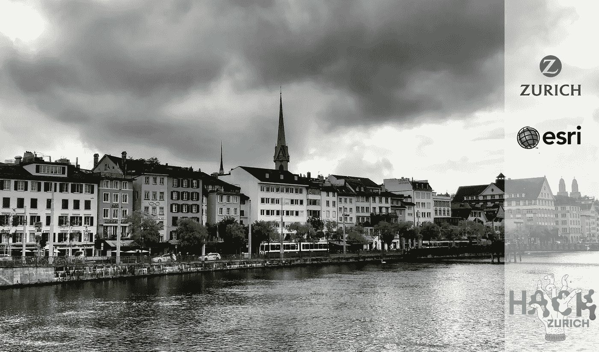
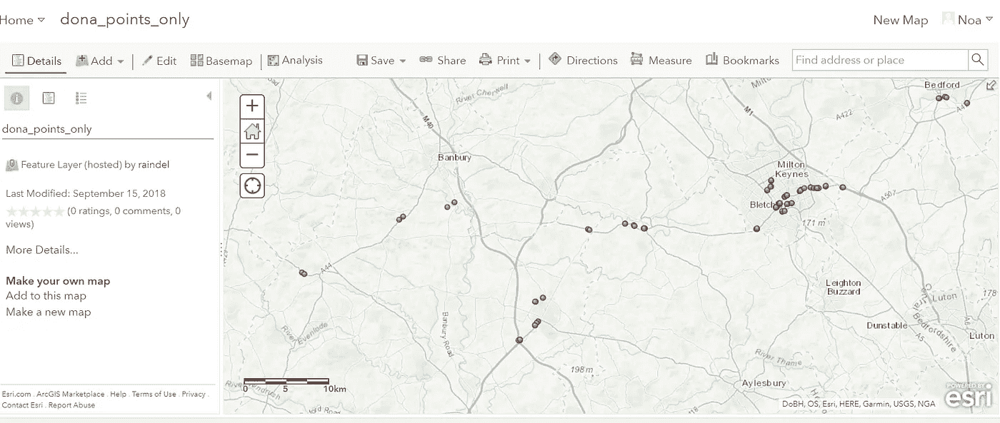
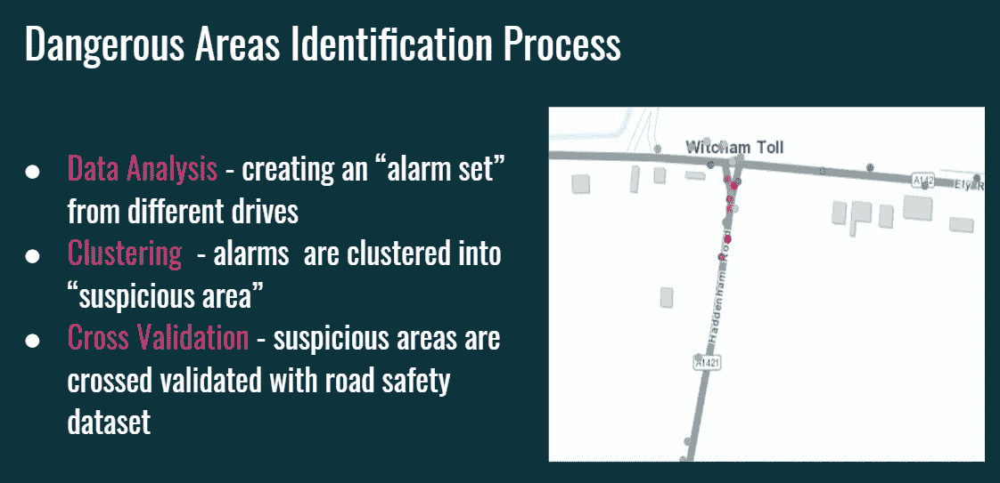
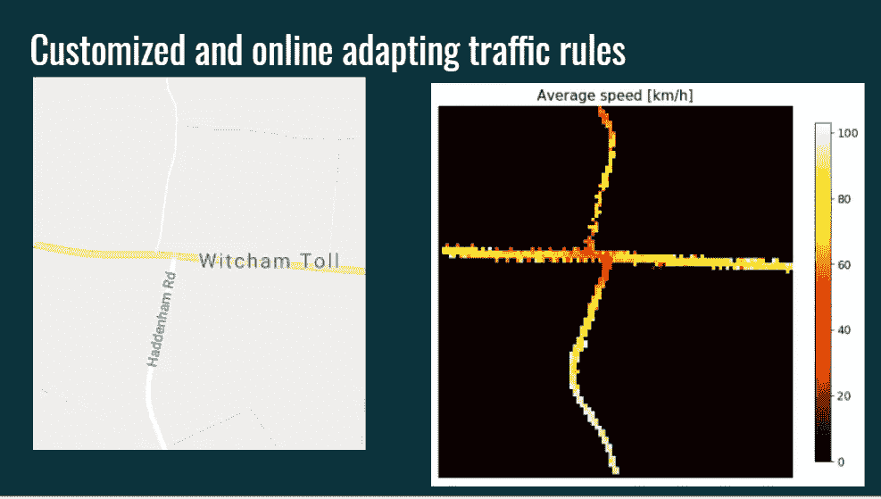

# 我们的 HackZurich 冒险——数据如何拯救道路上的生命

> 原文：<https://towardsdatascience.com/our-hackzurich-adventure-how-data-can-save-lives-on-the-roads-2a2e27fbf915?source=collection_archive---------28----------------------->

现代世界不断提供刺激和干扰。我们的智能手机让我们保持联系，我们无时无刻不想同时处理多项任务，甚至在开车的时候！
这是一个严重的问题，对道路安全和司机的生命构成很大威胁。需要降低风险。但是怎么做呢？这是我们的团队在 Hack-Zurich 上面临的挑战。

Picture credit: Dafna Mordechai

# 千禧一代在行动——接受挑战！

去年九月，我参加了欧洲最大的黑客马拉松 [HackZurich](https://www.facebook.com/hackzurich/) 。来自世界各地的数百名工程师聚集在一起，进行了 40 个小时的编码、吃比萨饼和不眠不休。黑客马拉松提供了 16 个不同的编码挑战。我们的团队 *"* ***安全事宜*** *"* ，选择应对由 [Esri](https://www.esri.com/en-us/home) 和[苏黎世保险](https://www.zurich.com/)提供的“千禧一代在移动”挑战。任务很明确——使用地理空间数据拯救道路上的生命。在这篇文章中，我将描述我们的数据驱动解决方案，它带领我们赢得了挑战。

## 数据数据数据

我们获得了 **Brightbox Millennials 数据集，**，其中包含了 1000 多名千禧一代司机的出行信息。使用安装在汽车上的专用硬件收集信息，每隔几秒钟对数据进行采样。
下面是主要特征: *trip-ID，时间戳，城市，国家，车辆年份，年龄，经度，纬度，里程，速度，发动机转速*。

## 我们的解决方案—全面降低风险

我们的目标是全面降低风险；一方面，我们想处理基础设施因素，并提醒当局注意危险区域。 另一方面，我们希望解决人为因素，并实时生成 ***个性化警报*** 以帮助驾驶员，无论他们何时处于危险之中。

# 危险区域分类

第一项任务是确定危险区域，但我们如何定义危险区域呢？直觉是**我们可以从驾驶员**的*行为*中了解该区域的风险水平。我们可以寻找危险或异常的驾驶员行为，如果我们确定了危险行为发生频率高的特定区域，我们可以将该区域归类为危险区域。为了验证我们的直觉，结果必须得到验证。因此，流程是:定义危险行为，扫描危险区域，并验证结果。

## 从信息到知识

我们决定关注的特性是*时间戳、经度、纬度、*和*速度。*下图中，每个点都是一个数据样本。颜色代表速度，根据采样的经纬度定位圆点。虽然这是旅行的一个很好的可视化，但如果没有进一步的处理，数据就有些琐碎了。

The speed displayed on Esri’s GIS mapping software, for a single driver in a single trip and at a specific area.

由于原始数据不能告诉我们太多关于驾驶员行为的信息，我们用我们作为驾驶员的知识来定义什么是危险行为。我们检查了两个连续的数据样本——如果速度下降了 75%或更多，这个位置就被标记为警报。在下图中，你可以看到单个驾驶员的“警报集”，显示在 [Esri 的 GIS 制图软件](https://www.esri.com/en-us/home)上。

An alarm-set of a single driver displayed on Esri’s GIS mapping software.

## 从知识到智慧

现在，当我们绘制了警报后，下一步是对警报进行聚类。如果一个集群跨越了一个阈值，该区域就被分类为危险区域。
下图显示了发生在一个交叉点上的一组警报。地图上的每个点都是一个警报，颜色区分司机。你可以看到一些司机在这个位置有两个警报，不一定来自同一个行程。

## 直觉好，验证更好！

我们希望验证我们的解决方案，所以我们使用了另一个数据集，即 2016 年的[车祸数据。我们确实发现在我们的过程中识别为危险的区域和有事故记录的区域之间有很好的相关性。由于时间不够，这是手动完成的，而不是自动完成的。](https://www.kaggle.com/bluehorseshoe/uk-2016-road-safety-data/data)

Dangerous areas identification process.

使用这种方法，数据科学家可以测试不同的警报标准，甚至可以将其中一些标准组合起来，然后测试不同的警报聚类阈值，以产生更好的结果。

# 采取行动—现场演示

## 赋予当局价值

上面描述的区域分类过程是基于这样的假设，即大多数驾驶员在大多数乘坐中负责任地驾驶，并且以适合道路的方式驾驶。在这种假设下，突然刹车可能是由于与道路条件或驾驶员的视野等有关的原因造成的。当局可以得到一份被归类为危险区域的列表，并检查道路——有什么可以降低事故风险的吗？交通法适合视野吗？道路上的标志是否干净可见？

## 为司机创造价值

从司机的角度来看，最终目标是创建一个警报系统，根据该地区的风险水平，实时向司机发出音频通知。
使用分类过程的另一种方式是仅在特定驾驶员的数据上运行，产生一组基于驾驶员驾驶模式的**个性化风险区域**。
此时，当我们同时拥有危险区域、一般危险区域和个性化危险区域时，我们可以使用它们来为每个区域指定安全级别，并在进入该区域前发出“危险区域”音频警报。通过考虑诸如车速、天气、一天中的时间等其他变量，可以更好地调整警报。
**希望定期使用为驾驶员和道路量身定制的系统，可以提高对道路不断变化的状况的认识，并帮助驾驶员采取更负责任的驾驶习惯。**

**虽然演示看起来像一个移动应用程序，但我们的愿景是将该解决方案嵌入到汽车中。我们不想定义一个解决方案，它本身是另一个分散注意力的原因。**

# **我们能利用这些数据做更多的事情吗？是的，我们可以！**

**还可以用这些数据做些什么来降低危险区域的风险？
速度是直接从汽车上采样的，而不是从坐标和时间戳中推导出来的，这一事实非常有力。这些信息使我们能够创建一个危险区域道路平均速度的热图。
在下图中，你可以看到这样的热图，仅基于千禧一代的数据集，没有任何其他绘图工具。与真实地图相比，您可以看到道路的描绘有多精确。这种对道路的进一步分析可以对驾驶员和当局有所帮助。**

****从当局的角度来看**，有了这种工具，交通管制可以更有经验地进行，依靠数据，并导致交通法规的优化。例如，道路交通当局可以根据该区域的实际驾驶模式来调整限制速度，而不是依赖于用于设置速度限制的试探法。**

**检查下图中的交叉点:当从南方进入交叉点时，热点图上的颜色从黄色变为红色。即*平均*速度从大约 80 Km/h 下降到小于大约 40k m/h。
限制路口前的速度，或添加指示前方有路口的标志，这是两种可能的解决方案，可以让驾驶员安全减速，并防止突然刹车。**

****

**Heatmap of the average speed at a specific junction.**

****从驾驶员的角度来看**，该信息可以集成到上述的警报系统中，并给出另一种类型的警报。汽车的当前速度可以实时与热图进行比较，如果平均速度和当前速度之间的差异超过阈值，司机将收到音频“高速”警报。这种警报将在驾驶员能够感觉到威胁之前发出潜在危险的信号，并有望防止事故发生。**

**请注意，速度阈值是可以根据各种因素(例如当前天气、道路上的临时建筑)或其他个人因素(例如驾驶员的年龄、驾驶员的驾驶经验或驾驶员对道路的熟悉程度(根据驾驶历史记录))动态改变的变量。**

## **我很好奇…**

**当我们创建我们的 hackathon pitch 演示时，在本文的图和地图中看到的 Witcham 附近的交叉点是随机选择的。这不是一个有重大警报的路口。尽管如此，当我写这篇博文时，我还是很好奇想看看实际的道路。**

****

**An image of the junction, taken from Google Maps.**

**查看谷歌地图[上的路口](https://www.google.com/maps/@52.386029,0.1487165,3a,75y,186.88h,70.01t/data=!3m7!1e1!3m5!1sPDr9QI-u2VLTGQZVX5axwA!2e0!6s%2F%2Fgeo1.ggpht.com%2Fcbk%3Fpanoid%3DPDr9QI-u2VLTGQZVX5axwA%26output%3Dthumbnail%26cb_client%3Dmaps_sv.tactile.gps%26thumb%3D2%26w%3D203%26h%3D100%26yaw%3D91.873344%26pitch%3D0%26thumbfov%3D100!7i13312!8i6656)显示一条开放的道路，尽头是一个三叉路口。限制限速的标志就在十字路口。这可能是在交叉口和标志可见的地方遇到中断，而不是更慢地进入交叉口的原因。**

# **完成的事项**

**我们的解决方案提出了一种使用简单且可访问的数据(如汽车 GPS 坐标和速度)来分类和分析危险区域的方法。该过程为当局提供了有价值的信息，当局可以利用这些信息来改善道路基础设施和优化交通法规。这对司机也很有帮助，因为他们可以根据这些信息实时获得个性化的音频警报。总而言之，这种解决方案是一种预防潜在事故和提高驾驶技能的整体方法。**

## **简短的讨论**

**值得注意的是，数据集缺少关于 Driver-ID 的信息。当几个不同的司机使用同一辆车时，一次特定的旅行不能归因于一个而不是另一个。从技术上来说，旅行与交通工具有关，而与司机无关。
这些信息对我们的解决方案至关重要，因为警报是个性化的，是根据驾驶员的驾驶模式为他们量身定制的。尽管假设这些信息可以从数据中推断出来是合理的，但是面对黑客马拉松时间有限的事实，我们决定不这么做。此外，我们认为这种类型的信息应该是可靠的，因此可以明确地收集，而且做起来相当简单。
当驾驶员第一次使用该系统，并且没有关于其驾驶模式的足够数据时，这种识别是必不可少的。如果我们想要向系统添加配置文件，例如新的驾驶员配置文件，由于缺乏驾驶经验，警报阈值可能会降低，则也需要此信息。**

# **安全事关我们**

**这个项目是数据科学家 [Adi Goldenberg](https://www.linkedin.com/in/adi-goldenberg-63570b64/) 、高级软件工程师 [Dafna Mordechai](https://www.linkedin.com/in/dafna-mordechai-6b241b69/?originalSubdomain=il) 、算法开发人员 [Noa Raindel](https://www.linkedin.com/in/noa-raindel-9478a660/) 和数据科学研究员 [Ortal Ashkenazi](https://www.linkedin.com/in/ortal-ashkenazi/) 通力合作的结果。
在这篇由苏黎士保险公司创新经理林文撰写的[精彩文章](https://www.zurich.com/en/knowledge/articles/2018/10/return-of-the-hack)中，你可以找到关于我们项目的更多信息。**

# **HackZurich —接受挑战！**

**在最后一次 [HackZurich](https://twitter.com/hackzurich?lang=en) 活动上，有来自 60 多个国家的 5500 多份申请！听起来很有趣？**保存日期:**hack Zurich 2019(9 月 27 日至 29 日)的申请将于 6 月 7 日开放。**

** [## 哈克苏黎世

### 保存日期:hack Zurich(9 月 27 日至 29 日)的申请将于 6 月 7 日开放！

www.facebook.co](https://www.facebook.com/hackzurich/photos/p.2259379274105963/2259379274105963/?type=1&theater)**