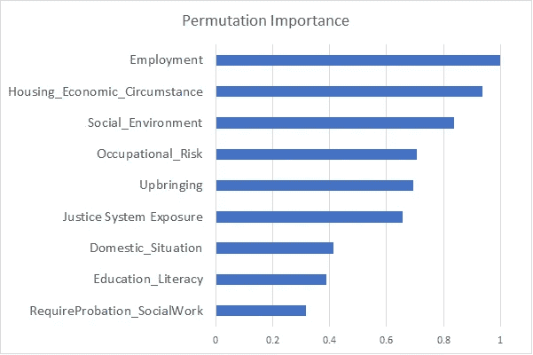
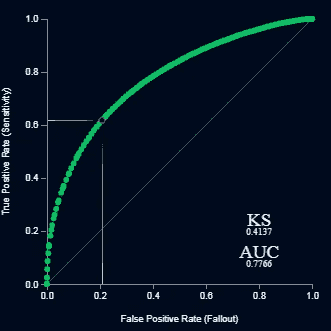
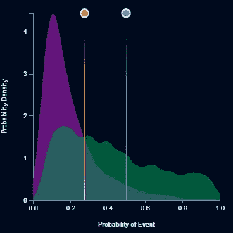
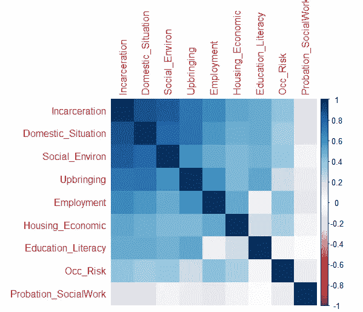
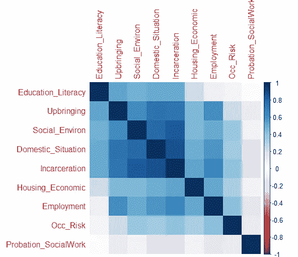
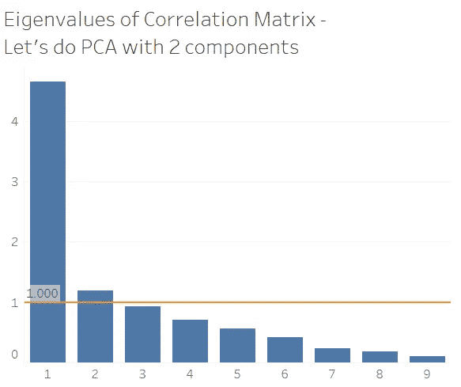
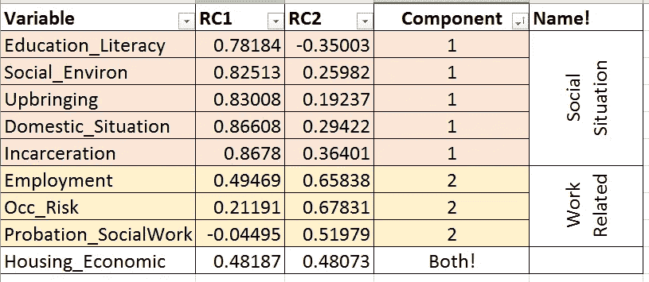
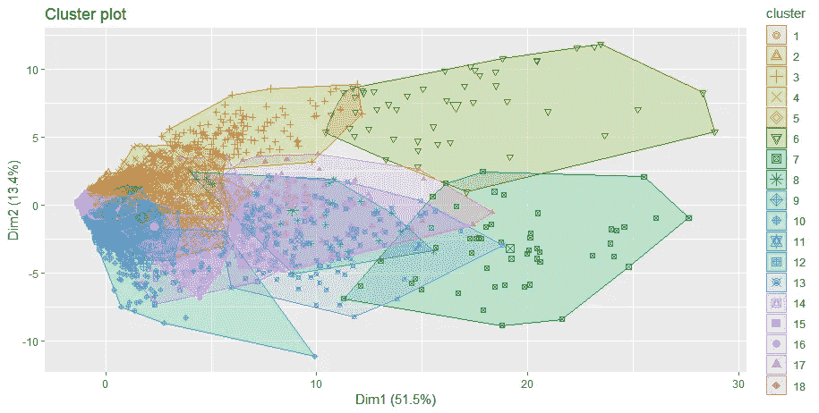
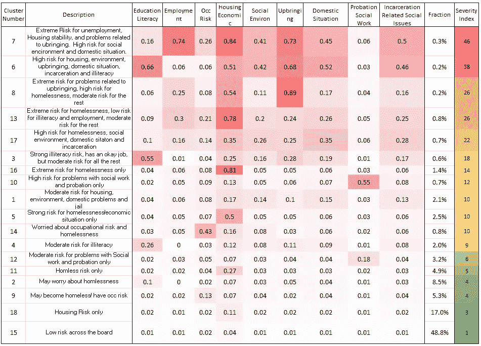

# 我们的社会决定因素角色

> 原文：<https://towardsdatascience.com/our-social-determinants-personas-353399250ed4?source=collection_archive---------18----------------------->

## 或者我们如何利用社会决定风险群体和一些奇特的数据科学建立一个超越行业的再入院模型。

*数据科学@HF*

**社会决定因素分数重要吗？**

[上次](/predicting-the-social-determinants-of-health-6e1fade435cc)我们写了使用机器学习来推断成员的社交需求的能力，以及验证我们方法的方式。在这里，我想谈谈我们构建的九个不同风险分值的分析值。在医疗保健领域，一个人病得有多严重的近似值是一个[病人出院后回到医院](https://www.cms.gov/medicare/medicare-fee-for-service-payment/acuteinpatientpps/readmissions-reduction-program.html)。从医疗和政策的角度来看，这一点的重要性不能被夸大。因此，当我们在 *analytics@hf* 上构建模型特征时，我们开发的一个有用的启发是“X 预测再入院吗？”亲爱的读者，很高兴你问了这个问题。它实际上创造了一个

击败文献的再入院模型

我们建立了一个[击败文献的](https://www.ncbi.nlm.nih.gov/pmc/articles/PMC4932323/)模型，仅用我们的社会决定因素人物角色…我们用[数据机器人](https://medium.com/neobbe/datarobot-23286a2730d2)在 20 分钟内完成了它。在这里，它是 xgBoosted 树的 glm 集成，具有早期停止、一些异常检测、具有 gini 重要性的随机森林、Vowpal 阶段式多项式特征分类器(但这并不重要)。多亏了数据机器人，我们在 20 分钟内完成了分析！

Permutation importance for our model — economics and issues regarding the justice system matter a lot for readmissions

Pretty good differentiation

除了漂亮的图表，关键是我甚至不需要其他功能来创建一个令人敬畏的重新接纳模型。事实上，当我添加我的 800 多列建模资产(我应该在上面写一篇博客)时，auc 攀升到 0.80，这绝对是值得做的工作，但是数据科学项目经理应该记住努力与回报。

我们的 9 个风险分数告诉了我们什么？

大概两件事。让我们看看相关矩阵:

We see a lot of the factors loading strongly on the first principal component..but clearly one isn’t enough

用眼睛做 PCA 的一个技巧，不要告诉你的统计老师，是根据特征值的角度来排序你的相关矩阵。

I see two clusters kind of, okay fine let’s look at the skree plot

Looks like 2 it is

使用 R 的 [Psych](https://cran.r-project.org/web/packages/psych/psych.pdf) 包的 PCA 函数中的标准正交变换，我们试图找出这 9 个分数背后的潜在因素。

我们发现了什么？我们看到两个真正的差异驱动因素(93%的差异由两个因素解释)。你可以提出一个案例，我们应该强制三个因素，给定住房环境负荷，两者相等，但我们没有得到更多的方差解释这样做。所以我们称潜在因素为 **'** [**'社会情境’**](http://thenationshealth.aphapublications.org/content/46/7/1.3)和 **'** [**与工作相关。**](https://www.rwjf.org/en/library/research/2012/12/how-does-employment--or-unemployment--affect-health-.html)**’**和它们说起来合乎逻辑。接下来，我们将使用组件分数来节省成本。

**我们能为社会风险创建一个角色视图吗？**

让我们用一个客户细分类型的分析来结束这个探索，只针对社会分数。根据[差距统计](https://stat.ethz.ch/R-manual/R-devel/library/cluster/html/clusGap.html)方法，我们的数据中应该有 18 个集群(9 列 140 万行)。所以我对风险分数进行了 k-means 运算，并根据他们的风险分数总和写下了各组的名字。我还创建了一个严重性分数，以便业务部门可以知道优先考虑哪个群体，使用这些描述来连接社交服务，如 [SNAP](https://www.fns.usda.gov/snap/supplemental-nutrition-assistance-program-snap) 、 [PATH](https://www.benefits.gov/benefit/728) 或食品仓库。我们目前正在使用这些分数来帮助我们的护理管理者通过一个名为 [NowPow](http://: http://www.nowpow.com/) 的社交联系平台将会员与这些类型的资源联系起来。

Here’s a far too confusing view of our clusters, nonetheless, it’s the chart everyone shows :)

Here’s an easier to digest view of the clusters with some simplistic name scheme. I also developed a rank order severity based on the average risk score per group, for prioritization

这是我们可以与决策者和临床医生分享的事情，以帮助他们优先考虑哪些成员需要哪种类型的社会支持。我们的大多数成员在大多数分数上都是低风险的。最终目标是清晰地了解风险水平、干预评分和推荐计划，以帮助会员获得有助于他们过上更健康、更安全和更稳定生活的服务。

**包装完毕**

因此，我们了解到两件事，通过将社会风险评分纳入健康结果模型，可以获得行业领先的预测结果。在描述社会风险时，我们有两到三个潜在因素，我们可以用它们来创建人物角色，以便进行更有针对性的干预。

最后要讨论的一件事…为什么大家[不就这么做](https://medium.com/@steve_prewitt/building-an-advanced-analytics-capability-8f65b455ff6d)？我会在以后的文章中写更多，但是为了创建所有这些，我使用了 Python、R、Tableau、Excel、DataRobot 和最重要的 snipping 工具。没有完美的方案，也没有一种美味的汤，只要尽可能快、尽可能有说服力地完成工作就行了。在经济学家的边际曲线上交易的两个变量(速度和故事的完整性);你作为分析师的价值在于你在曲线上的位置。