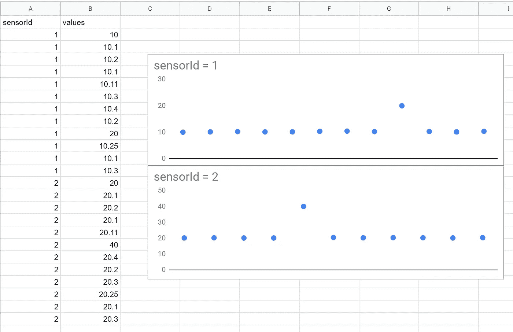
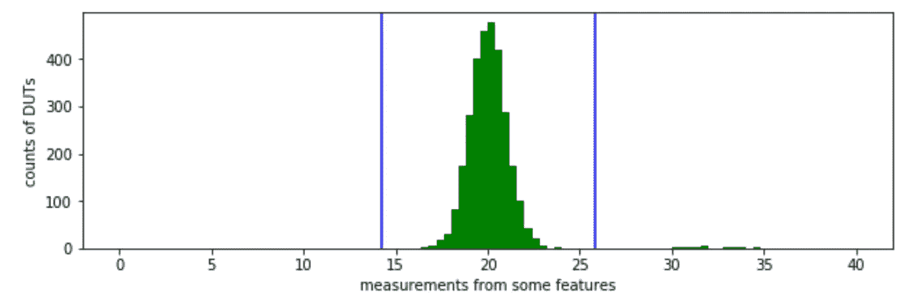
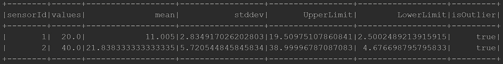
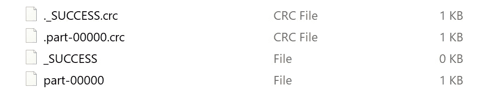
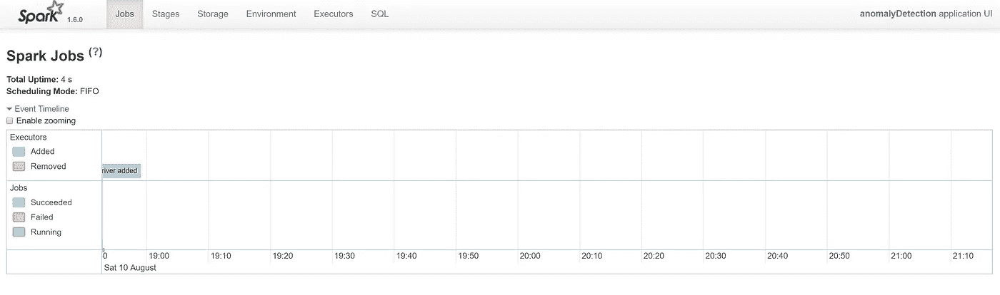

# 离群点检测:Spark ETL 教程

> 原文：<https://towardsdatascience.com/outlier-detection-an-etl-tutorial-with-spark-f4197eb84a7b?source=collection_archive---------9----------------------->


工业 4.0 框架的一部分是确保制造商对他们在工厂车间的机器有更多的可见性。这也是工业 4.0 与物联网紧密结合的原因。物联网允许从安装在生产设备中的传感器收集大规模实时数据。然而，仅有好的数据收集代理是不够的。我们需要一种自动化的方式从大量的数据流中提取、分析和总结信息，因为人类不可能手动完成这些工作。在大数据术语中，这个过程通常被称为 [ETL](https://en.wikipedia.org/wiki/Extract,_transform,_load) (提取-转换-加载)。

今天，我们将讨论一个我个人认为在行业中有用的算法家族:异常值检测。想法是从数据流中发现任何异常测量，并向领域专家(如过程工程师)突出显示它们。我将在 [Spark](https://spark.apache.org/) 中分享一个基本异常检测算法的实现。我本来可以用 python 的 pandas-dataframe 做同样的教程，但不幸的是，一旦我们处理大数据集(其大小远远大于内存空间)，后者就不再合适了。

在这篇文章中，我将使用 [scala](https://www.scala-lang.org/) 作为我选择的编程语言。我个人在为生产写代码的时候喜欢用 scala。Python 写起来更快，因此对原型开发很有用。然而，它缺乏静态类型可能会使事情更难调试。另一方面，scala 更类似于 Java，尽管不那么冗长(它也运行在 JVM 上)。但是让我们把这个赞成和反对的辩论留到另一个会议。

这是我使用的一个简单的虚拟数据集。假设我们有来自 2 个传感器的数据流。我们如何自动捕捉下面出现的两个异常点？



Dataset

## 离群点检测

我们使用的模型找到了在符合观察数据的分布下出现概率低的值的区域。我们假设传感器本质上是单峰高斯型的。这样，我们就可以计算出两个阈值，这两个阈值与分布的平均值相差 6σ。


视觉上，阈值以这种方式拟合。任何高于上限(约 25)或低于下限(约 15)的测量值都被视为异常值。



The Upper and Lower Outlier Thresholds

现在，为了在 Spark 中实现这一点，我们首先导入所有的库依赖项。

```
**import** org.apache.spark.sql.{Column, SQLContext}
**import** org.apache.spark.{SparkConf, SparkContext}
**import** org.apache.spark.sql.types._
**import** org.apache.spark.sql.functions._
```

我们需要用一个主函数将所有的函数包装在一个对象中(这可能会让你想起 Java)。我们实际上可以用不同的风格来写，看起来更像一个脚本。Scala 有一个名为 REPL 的解释器，允许程序员逐行执行代码。然而，在生产中，以这种方式组织事情是有好处的。

```
*/**
  * Sample Anomaly Detection with Spark
  */* **object** AnomalyDetection {
    **def** main(args: Array[String]): Unit = {
      // the rest of the functions go here
    }
}
```

现在，如果你在 Windows 中运行 spark，你可能会遇到一些异常，说程序无法找到 winutil 二进制文件。在这种情况下，您需要下载 winutils.exe([这个](https://jaceklaskowski.gitbooks.io/mastering-apache-spark/spark-tips-and-tricks-running-spark-windows.html)是如何做的)并在您的代码中设置以下系统属性。

```
System.*setProperty*("hadoop.home.dir", "C:/winutil/")
```

接下来，我们需要配置 spark、sparkContext 和 sqlContext。如果我们将 [HBase](https://hbase.apache.org/) (一个 NoSQL 数据库)与 [ZooKeeper](https://zookeeper.apache.org/) 一起使用，我们将需要配置 *spark.hbase.host* 参数来指向相应的主机地址。

```
*/** Configure Spark */* **val** conf = **new** SparkConf()
  .setAppName("anomalyDetection")
  .setMaster("local[8]")
conf.set("spark.hbase.host", "zookeeper.default.svc.cluster.local")

**val** sc = **new** SparkContext(conf)
sc.setLogLevel("WARN")
**val** sqlContext = **new** SQLContext(sc)
```

## 提取

我们现在假设我们的数据是 csv 格式的。它也被保存在一个名为 *test.csv* 的文件中。我们首先明确指定数据模式。注意，在生产中，数据也可以从数据库和消息代理(例如 MQTT、Kafka 等)获得。

```
*/** read csv */* **val** customSchema = StructType(*Array*(
  *StructField*("sensorId", StringType, **true**),
  *StructField*("values", DoubleType, **true**))
)
```

然后，我们将 csv 文件读入 Spark 数据帧。这里我们可以看到只有两列:sensorId 和值。

```
// load dataset
**val** df = sqlContext.read
  .format("com.databricks.spark.csv")
  .option("header", "true")
  .schema(customSchema)
  .load("test.csv")
df.printSchema()
```

> root
> |—sensorId:string(nullable = true)
> |—values:double(nullable = true)

## 改变

我们希望计算每个 sensorID 的分布轮廓，特别是异常值的上限和下限。为此，我们需要按 sensorId 对数据帧进行分组，然后相应地汇总每个传感器数据的平均值和标准差。然后，我们可以创建 2 个新列，每个异常阈值一列。

```
// calculate statistics
**val** statsDF = df
  .groupBy("sensorId")
  .agg(*mean*("values").as("mean"), *stddev*("values").as("stddev"))
  .withColumn("UpperLimit", *col*("mean") + *col*("stddev")*3)
  .withColumn("LowerLimit", *col*("mean") - *col*("stddev")*3)
statsDF.printSchema()
```

> root
> |—sensorId:string(nullable = true)
> |—mean:double(nullable = true)
> |—stddev:double(nullable = false)
> |—upper limit:double(nullable = true)
> |—lower limit:double(nullable = true)

我们现在想找出原始数据帧中哪些传感器读数是异常的。由于信息存在于两个不同的数据帧中，我们需要使用 sensorId 列作为公共索引来连接它们。

```
// join the two dataframe
**val** joinDF = df.join(statsDF, usingColumns = *Seq*("sensorId"))
```

最后，我们可以过滤值超出离群阈值范围的行。瞧吧！我们设法捕捉到了两个异常点。

```
// outlierDetection
**val** detectOutlier = (values: Column, UpperLimit: Column, LowerLimit: Column) => {
  // outliers are points lying below LowerLimit or above upperLimit
  (values < LowerLimit) or (values > UpperLimit)
}
**val** outlierDF = joinDF
  .withColumn("isOutlier", detectOutlier(*col*("values"), *col*("UpperLimit"), *col*("LowerLimit")))
  .filter(*col*("isOutlier"))outlierDF.show()
```



Anomalous Rows

## 负荷

(可选)我们还可以将输出数据帧写入另一个表(或 csv 文件)以供进一步处理。这就完成了整个 ETL 过程。

```
outlierDF
  .repartition(1)
  .write.format("com.databricks.spark.csv")
  .save("result")
```

上面的方法输出一个名为 *result* 的文件夹，里面有以下文件。通常情况下，数据会被分割成多个 CSV(每个 CSV 都有不同的零件名称)。但是，由于我们已经将数据帧重新分区为 1，所有数据都收集到一个分区(或文件)中。



最后一步是关闭 sparkContext。

```
// close sparkContext
sc.stop()
```

# 排除故障

Spark 附带了一个 web 界面(默认情况下在 4040 端口),可以用来查看 ETL 过程是如何运行的。我发现这很有用，尤其是在识别瓶颈功能方面。



Example of Spark Web Interface in localhost:4040

# 结论

我们已经看到了一个典型的带有 Spark 的 ETL 管道是如何工作的，使用异常检测作为主要的转换过程。请注意，这里使用的一些程序不适合生产。例如，不鼓励 CSV 输入和输出。通常我们会使用 Hadoop 分布式文件系统(HDFS)。后者也可以包装在数据库下，例如 HBase。尽管如此，主要的编程范式保持不变。