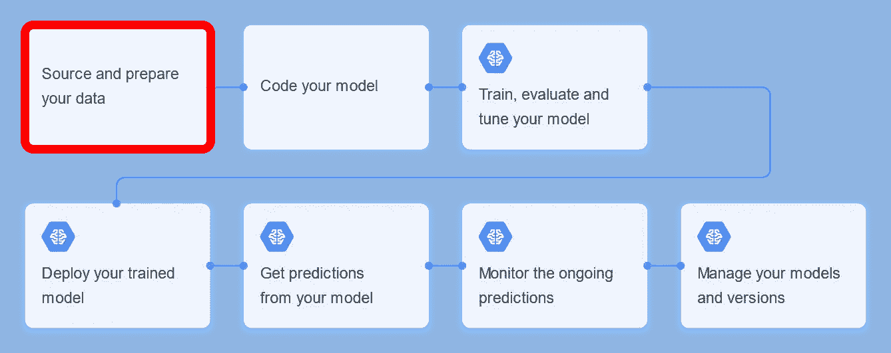
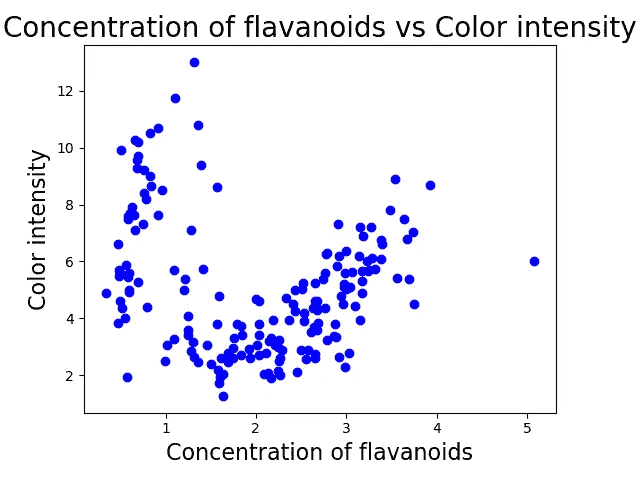
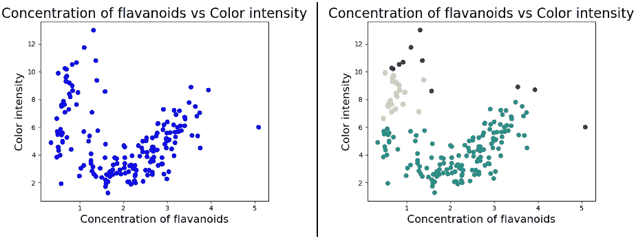
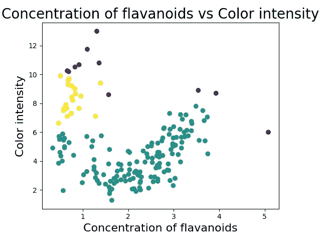

# Python 中 2D 特征空间的离群点检测

> 原文：<https://towardsdatascience.com/outlier-detection-python-cd22e6a12098?source=collection_archive---------7----------------------->

Image by [MasterTux](https://pixabay.com/users/MasterTux-470906/?utm_source=link-attribution&utm_medium=referral&utm_campaign=image&utm_content=1200533) from [Pixabay](https://pixabay.com/?utm_source=link-attribution&utm_medium=referral&utm_campaign=image&utm_content=1200533)

## 如何使用绘图和聚类技术检测异常值以分析两个特征的相关性

A 在鼓起你所有的勇气开始一个机器学习项目之后，你首先要想的是**如何**和**其中**到实际上**开始**。下图显示了典型的[机器学习工作流程](https://cloud.google.com/ml-engine/docs/ml-solutions-overview)。每个机器学习项目的最开始是收集和准备必要的数据，以便能够由那些花哨的算法处理，如[神经网络](/how-to-build-your-own-neural-network-from-scratch-in-python-68998a08e4f6)或[支持向量机](/support-vector-machine-introduction-to-machine-learning-algorithms-934a444fca47)。

“[ML Workflow](https://cloud.google.com/ml-engine/docs/ml-solutions-overview)” by [Google Cloud](https://cloud.google.com/) is licensed under [CC BY 4.0](https://creativecommons.org/licenses/by/4.0/)

除了为您的源数据集或工程使用的要素创建一些时髦的第一可视化，您还想检测您的数据集中是否有任何偷偷摸摸的异常值。

本文提供了一个**逐步指导** **如何检测两个特征(也称为属性或变量)之间的依赖关系中的异常值**，也称为**二维特征空间。**

# 异常值检测—让我们开始吧！

这个项目是在 IDE PyCharm 中用项目解释器 **Python 3.7** 开发的。但是，您可以在任何其他环境或笔记本中自由应用该代码！完整的项目可以在 [**这里找到**](https://github.com/JOPloume/outlier-detection-2D-feature-space) 。

# #1 —可视化特征空间。

第一步是引入一些我们正在处理的特征空间的视觉效果。这个项目利用了与框架 [scikit learn](https://scikit-learn.org/stable/index.html) 一起提供的 *wine 数据集*。

“[Drunk Amy Schumer](https://giphy.com/gifs/amy-schumer-E3L5goMMSoAAo)” by [BuzzFeed](https://www.buzzfeed.com/) on [GIPHY](https://giphy.com/)

我们可能不像艾米·舒默那样喜欢葡萄酒，但我们仍然认为葡萄酒是一个非常美味的研究对象。我们将检验的 2D 特征空间是类黄酮(一类代谢物)的**浓度和葡萄酒的**颜色强度**之间的相关性。**

**以下代码提供了 2D 特征空间的初始可视化。**

First visualization of the 2D feature space dependency

厉害！现在我们对正在处理的依赖性有了第一次“感觉”。

# #2 —聚类数据点。

在我们的第一次可视化中，我们可能已经看到了一些聚类和异常值，但是为了给我们的直觉提供更多的统计基础，我们借助了聚类算法。 **DBSCAN** *(基于密度的带噪声应用空间聚类)*是一种常用于离群点检测的聚类算法。在这里，如果一个数据实例不属于任何集群，那么它被认为是离群值。

> DBSCAN 算法需要两个参数—**ε**，其指定点应该彼此多接近才能被认为是聚类的一部分；和 **minPts** ，它指定一个点应该有多少个邻居被包含到一个聚类中。”— [**阿利图卡**](https://github.com/alitouka)

通过调整模型的参数 epsilon 和 minPts(在 Python: min_samples 中)，我们揭示了特征空间中一些不错的聚类。

**以下代码聚类了 2D 特征空间。**

# 将特征空间的第一可视化与聚类可视化进行比较

哦，是的，我们终于发现他们了！

“[Under Arrest Flirt](https://giphy.com/gifs/angietribecatbs-l41YiwLaLdnOFRWlq)” by [Angie Tribeca](https://giphy.com/angietribecatbs/) on [GIPHY](https://giphy.com/)

# 这些紫色的小点就是我们正在寻找的**异常值**！

Clusters of the 2D feature space

# #3 —计算异常值。

哇！！现在我们知道**的确**在黄酮类化合物的**浓度和葡萄酒**颜色强度**的相关性中存在异常值，yaaay(顺便说一句，我仍然不知道黄酮类化合物是什么)。就差最后一步了…**

**以下代码计算 2D 特征空间的异常值。**

这段代码计算并最终在一个单独的 [**CSV 文件**](https://github.com/JOPloume/outlier-detection-2D-feature-space/blob/master/datasets/dbscan-outliers.csv) 中打印出数据集的 11 个异常值。

这份**离群点检测的逐步指南**是我在关于人在回路计算的论文项目中创建的，这是一种将人类与机器智能相结合的方法。敬请期待！

“[Done Looney Tunes](https://giphy.com/gifs/the-end-thats-all-folks-lD76yTC5zxZPG)” by [Heck Yeah Reaction GIFs](https://heckyeahreactiongifs.tumblr.com/) on [GIPHY](https://giphy.com/)

[1]谷歌云，[机器学习工作流程](https://cloud.google.com/ml-engine/docs/ml-solutions-overview) (2019)

[2] M. Ester，H.-P. Kriegel，J. Sander，X. Xu，[一种基于密度的聚类发现算法](https://dl-acm-org.proxy.lnu.se/citation.cfm?id=3001507)(1996)1996 年第二届知识发现与数据挖掘国际会议论文集