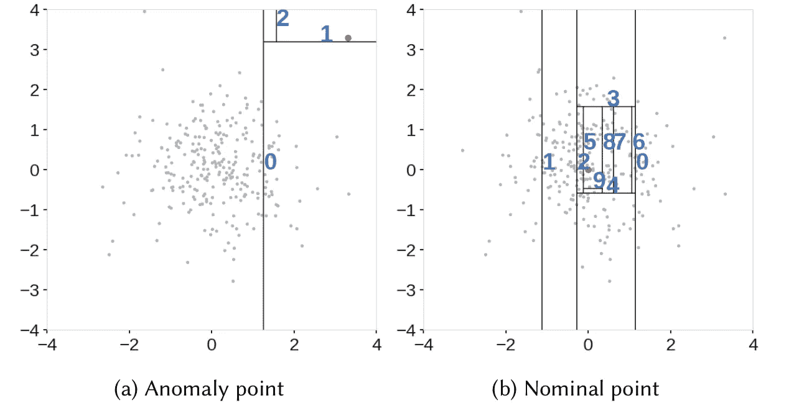
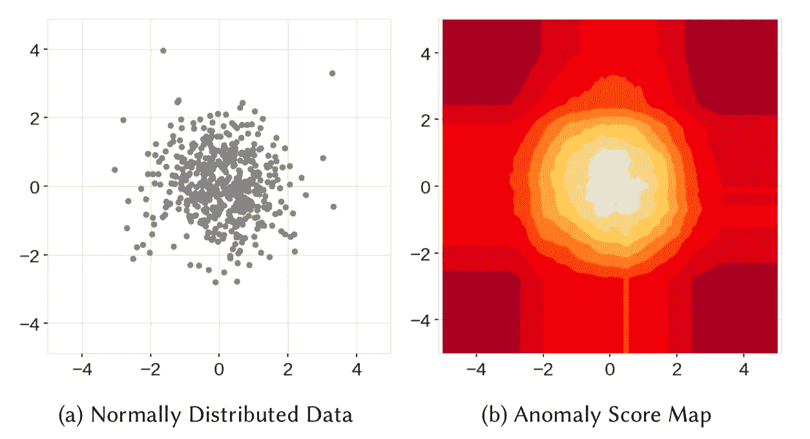
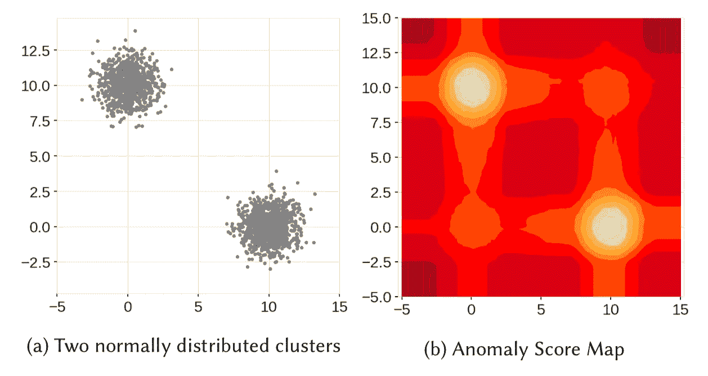
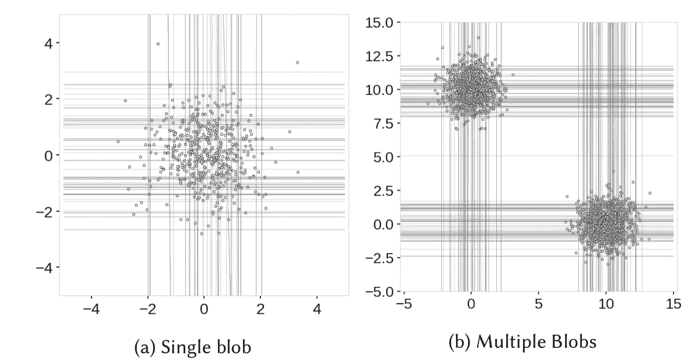
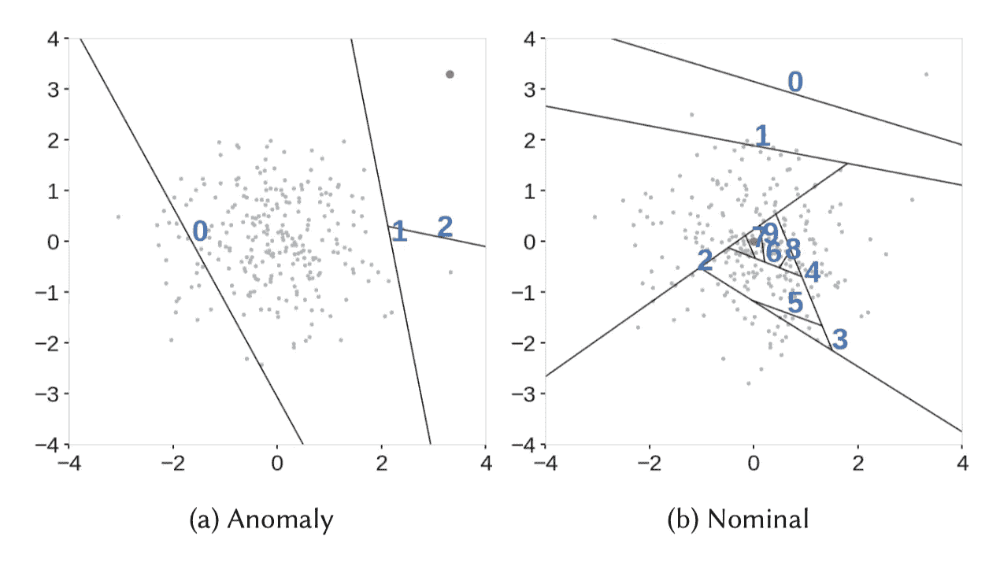
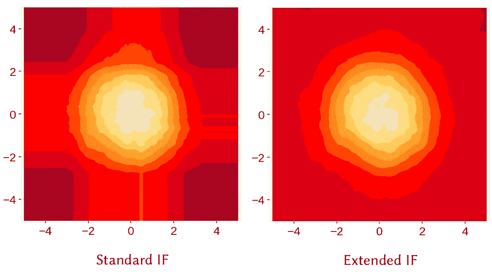
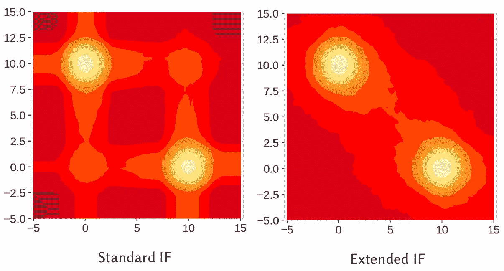
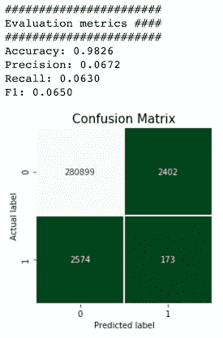
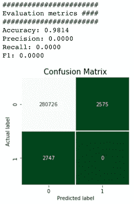

# 基于扩展隔离森林的离群点检测

> 原文：<https://towardsdatascience.com/outlier-detection-with-extended-isolation-forest-1e248a3fe97b?source=collection_archive---------1----------------------->

## 了解流行的离群点检测算法的最新改进

在我关于异常检测的第一篇文章发表半年后，它的一位读者让我注意到隔离森林算法最近有了改进，即扩展隔离森林(EIF ),它解决了原始方法的主要缺点。在这篇文章中，我简要回顾了最初的中频算法，描述了它的潜在问题以及 EIF 是如何处理的。最后，我将展示一个 Python 示例，展示如何使用这两种算法并比较它们的性能。

# 1.隔离森林

隔离森林算法利用了异常观测值很少并且与“正常”观测值显著不同的事实。该森林是在决策树的基础上构建的，每棵树都可以访问训练数据的子样本。为了在树中创建分支，首先选择一个随机特征。然后，为该特征选择一个随机分割值(在最小值和最大值之间)。如果给定的观察值具有该特征的较低值，则所选的观察值遵循左分支，否则遵循右分支。这个过程一直持续到孤立一个点或达到指定的最大深度。

Partitioning algorithm. Source: [1]

原则上，异常值比常规观测值更少出现，并且在值方面与常规观测值不同(在特征空间中，它们离常规观测值更远)。这就是为什么通过使用这种随机划分，它们应该被识别为更靠近树的根(更短的平均路径长度，即，观察在树中从根到终端节点必须经过的边的数量)，需要更少的分裂。

异常分数是根据森林中的所有树木以及点在这些树木中到达的深度创建的。

# 2.隔离森林的问题

我认为理解这个问题的最好方法是把它看作一个例子。

Motivation for EIF. Source: [1]

在左图中，我们可以看到从多元正态分布中采样的数据。直觉上，我们假设分配给观察值的异常值将从分布[0，0]的中心点径向增加。然而，正如右图所示，事实显然并非如此。此外，还有得分较低的矩形伪影，例如 x 轴上 0 点和 1 点之间的垂直伪影。

让我们继续第二个例子。这里我们看到两个斑点集中在点[0，10]和[10，0]。通过检查右图，我们不仅看到了之前出现的伪像，还看到了两个重影簇(大约在[0，0]和[10，10])。

Motivation for EIF. Source: [1]

这种特殊行为的原因源于隔离林的决策边界要么是垂直的，要么是水平的(随机特征的随机值)，如下图所示，作者绘制了 IF 在训练阶段生成的分支切割。我们看到分支倾向于聚集在大多数点所在的地方。但是由于线只能平行于轴，所以存在包含许多分支切割和仅一些或单个观察值的区域，这导致一些观察值的不正确异常分数。一个例子可能是围绕[3，0](许多分支切割)和[3，3](很少切割)的点。

Branch cuts generated during the training of IF. Source: [1]

# 3.扩展隔离林

对隔离林缺陷的分析得出结论，该问题仅由水平/垂直分支切割引起。扩展随机森林以稍微不同的方式解决了这个问题。不是选择一个随机特征，然后在它选择的数据范围内选择随机值:

*   分支切割的随机坡度
*   从训练数据的可用值范围中选择的随机截距

这些术语(斜率/截距)是您最有可能从简单线性回归( *y = ax + b* )中回忆起来的。让我们来看一个直观的例子！从下图中，我们可以看到与原始 IF 算法的主要区别- >不平行于轴的切割。

EIF Partitioning algorithm. Source: [1]

扩展的随机森林很好地推广到更高维度，这里我们处理的不是直线而是超平面。为了更深入地研究 N 维一般化，请参考[1]中一个非常平易近人的解释。

让我们通过观察由 IF/EIF 产生的异常分数图中的差异来总结理论解释。在下面的图像中，我们看到异常分数从数据集群呈放射状扩散，并且没有可见的伪影/重影集群。

EIF 捕捉到的一个额外特征是直接位于两个集群之间的较高异常分数区域(在那里它们有点联系)。这个区域可以被认为是接近“正常的”,因为它与两个集群都很接近，但是分数更高，因为它远离集中的群组。

# 4.Python 中的示例

## 数据

在这个简短的练习中，我使用了从[这里](http://odds.cs.stonybrook.edu/forestcovercovertype-dataset/)下载的森林覆盖数据集。数据集包含 286048 个观测值和 10 个要素。观察值被标记，所以我们知道哪些是异常的(0.9%的观察值是异常的)。

比较的另一个方面可以是速度，因为[1]的作者指出，在扩展隔离森林中速度没有(显著)下降。

## `sklearn`中的隔离林

在所有型号中，我将尝试使用相同的设置，即:

*   森林中的树木数量= 100
*   为估计每棵树抽取的最大样本数= 256
*   我预先知道数据集中有 0.9%的异常，我将使用这个百分比来选择最高的异常分数

森林能够正确识别数据集中 8.7%的异常。

Performance of sklearn’s IF

## `eif`中的隔离林

通过设置`ExtensionLevel`为 0，我估计一个正常的隔离森林。关于这个实现的一些话。首先，到目前为止，还没有为模型设置随机状态的方法，所以多次运行它可能会产生不同的结果。另外,`eif`实现没有那么多参数需要配置。

另一件事是，该模型预测异常得分，但不会自动识别哪些观察值被视为异常值。为了识别异常，我对异常分数进行排序，并检索分数最高的 0.9%的观察值的指数。

Performance of eif’s IF

这种隔离林实现的性能比`sklearn`的要差。它只能捕获数据集中 6.3%的异常。此外，由于每次运行该模型时缺少随机状态，性能会发生变化。

## `eif`的扩展隔离森林

这部分非常类似于香草隔离林案例(`eif`实现)，不同之处在于`ExtensionLevel`。为了在完全扩展的级别上工作，我将级别设置为 9(维数- 1)。

从结果中可以看出，该模型未能识别数据集中的单个异常。不幸的是，我对此没有任何解释，如果有人知道这个问题可能是什么，请在评论中告诉我，我会更新这个帖子。

Performance of EIF

# 结论

扩展隔离森林算法当然很有趣，值得进一步探索。它很容易地克服了原始模型在一组人工示例上的局限性，然而，当在真实数据集上实现它时，似乎存在某种问题。更重要的是，当前的`eif`实现几乎和`sklearn`一样快。在我的 MacBook Pro 上，`sklearn` IF 花了 14 秒来训练，而`eif`实现花了大约 10 分钟。

我真的希望该算法将得到进一步改进，并将成为识别异常的良好工具。

您可以在我的 [GitHub](https://github.com/erykml/medium_articles/blob/master/Machine%20Learning/extended_isolation_forest_example.ipynb) 上找到本文使用的代码。一如既往，我们欢迎任何建设性的反馈。你可以在[推特](https://twitter.com/erykml1?source=post_page---------------------------)或评论中联系我。

喜欢这篇文章吗？成为一个媒介成员，通过无限制的阅读继续学习。如果你使用[这个链接](https://eryk-lewinson.medium.com/membership)成为会员，你将支持我，而不需要额外的费用。提前感谢，再见！

# 参考

[1] [扩展隔离林](https://arxiv.org/abs/1811.02141)