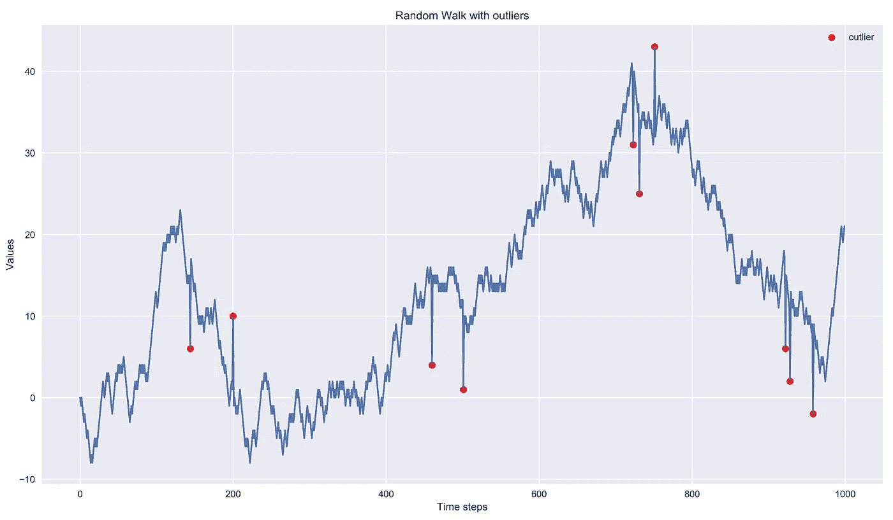
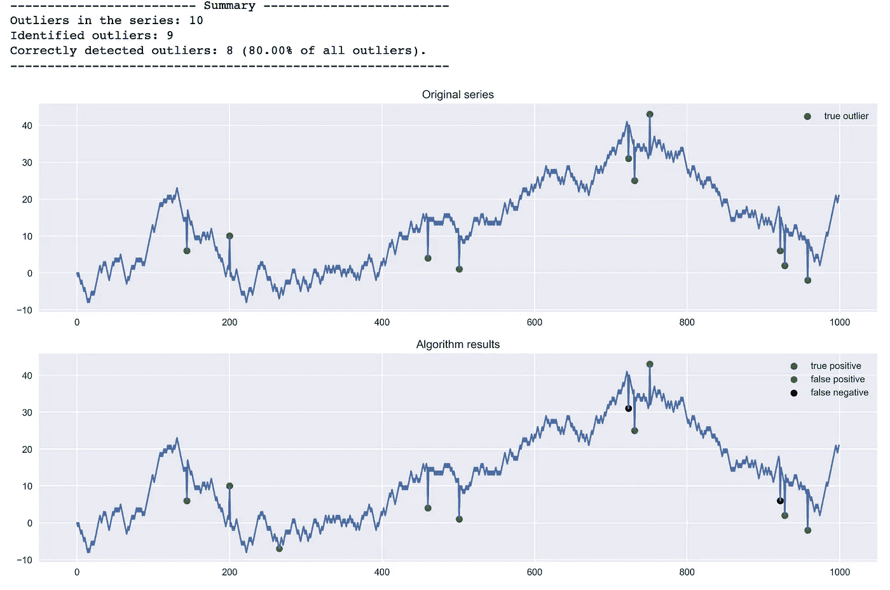
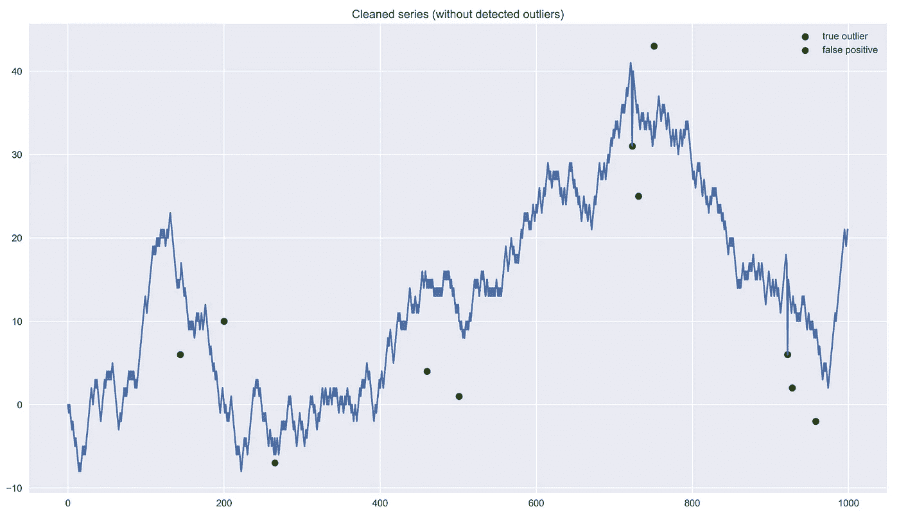
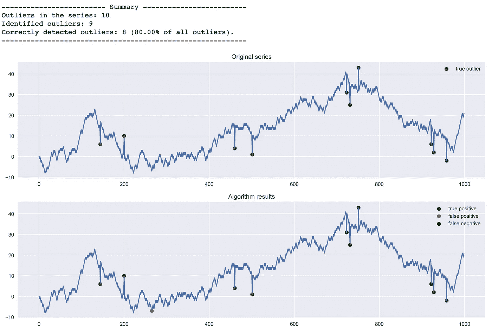

# 基于 Hampel 滤波器的异常检测

> 原文：<https://towardsdatascience.com/outlier-detection-with-hampel-filter-85ddf523c73d?source=collection_archive---------6----------------------->


Source: [pixabay](https://pixabay.com/photos/lemon-citrus-fruit-juicy-acid-3303842/)

## 如何用 Python 从头开始实现 Hampel 过滤器

最近，我偶然发现了一种新的(对我来说)异常值检测算法 Hampel 过滤器。在这篇短文中，我想描述一下它是如何工作的，以及如何在实践中使用它。据我所知，没有包含该算法的 Python 库，所以我们将使用两种不同的方法(`for-loop`和`pandas`)从头实现它。最终，我们将会看到在执行速度方面，哪一个的表现更好。

**更新** : Hampel 过滤器在`sktime`实现，你可以在[这里](https://www.sktime.org/en/latest/api_reference/auto_generated/sktime.transformations.series.outlier_detection.HampelFilter.html?highlight=hampel)找到更多关于它的信息。

# 汉佩尔过滤器

让我们从一个快速的理论介绍开始。描述该算法的在线资源并不多(甚至维基百科上也没有页面)，但它足够简单，可以快速理解其中的逻辑。还有，我在文末放了一些参考资料。

Hampel 过滤器的目标是识别和替换给定系列中的异常值。它使用一个可配置宽度的滑动窗口来浏览数据。对于每个窗口(给定观察和`2 window_size`周围元素，每侧`window_size`，我们计算中值和标准偏差，表示为[中值绝对偏差](https://en.wikipedia.org/wiki/Median_absolute_deviation)。

为了使 MAD 成为标准偏差的一致估计量，我们必须将其乘以一个常数比例因子 *k* 。该因子取决于分布，对于高斯分布，该因子约为 1.4826。

如果考虑的观察值与窗口中值的差异超过 *x* 标准偏差，我们将其视为异常值并用中值代替。

Hampel 滤波器有两个可配置的参数:

*   滑动窗口的大小
*   识别异常值的标准偏差的数量

我们根据用例选择这两个参数。较高的标准差阈值使过滤器更宽容，较低的标准差阈值将更多的点识别为异常值。将阈值设置为 0 对应于 John Tukey 的中值滤波器。

由于过滤器使用滑动窗口，因此将其用于时间序列数据最有意义，其中数据的顺序由时间决定。

# Python 实现

## 导入库

第一步是导入所需的库。

```
import matplotlib.pyplot as plt
import warnings
import pandas as pd
import numpy as np
```

## 有异常值的随机游走

在实现算法之前，我们使用[随机漫步](https://en.wikipedia.org/wiki/Random_walk)创建一个人工数据集。我们定义了一个函数，它接受异常值的百分比作为参数，并通过一个常数乘数随机缩放一些随机游走增量。

使用该函数，我们生成人工数据，并将其绘制如下，以及引入的异常值。

```
rw, outlier_ind = random_walk_with_outliers(0, 1000, 0.01)plt.plot(np.arange(len(rw)), rw)
plt.scatter(outlier_ind, rw[outlier_ind], c='r', label='outlier')
plt.title('Random Walk with outliers')
plt.xlabel('Time steps')
plt.ylabel('Values')
plt.legend();
```



## 评估结果

我们还需要定义一个函数来评估异常值检测算法的结果。为此，我们将绘制实际与检测到的异常值，并返回一个简短的性能总结。

## Hampel 滤波器实现

1.  `**for-loop**` **实现**

我们从 Hampel 滤波器的`for-loop`实现开始。我们基于来自`pracma` R 包的代码。

我们在 RW 系列上运行算法。我们选择了窗口大小 10，但是这应该根据最佳性能的经验来确定。

```
res, detected_outliers = hampel_filter_forloop(rw, 10)
```

我们使用之前定义的帮助函数来评估结果。

```
tp, fp, fn = evaluate_detection(rw, outlier_ind, detected_outliers)
```



Evaluation of the for-loop implementation

在图中，我们可以看到，该算法正确识别了 8 个(10 个中的)异常值，将一个观察值误认为异常值(红点)并遗漏了 2 个异常值(黑点)。也许通过调整窗口大小可以获得更好的性能。然而，这对于练习的目的来说已经足够了。

我们还绘制了转换后的序列，其中异常值被窗口中值所取代。

```
plt.plot(np.arange(len(res)), res);
plt.scatter(outlier_ind, rw[outlier_ind], c='g', label='true outlier')
plt.scatter(fp, rw[fp], c='r', label='false positive')
plt.title('Cleaned series (without detected outliers)')
plt.legend();
```



Transformed series (removed outliers)

2.`**pandas**` **实现**

对于`pandas`的实现，我们使用了`pd.Series`和 lambda 函数的`rolling`方法。

在`rolling`方法中，我们指定两倍的窗口大小并使用居中，因此所考虑的观察在`2 * window_size + 1`窗口的中间。在运行算法之前，我们将 RW 从`np.ndarray`转换为`pd.Series`。

```
rw_series = pd.Series(rw)
res, detected_outliers = hampel_filter_pandas(rw_series, 10)
tp, fp, fn = evaluate_detection(rw, outlier_ind, detected_outliers)
```



Evaluation of the pandas implementation

两种方法的结果是相同的，这总是一个好现象:)

## 性能比较

此时，我们从执行速度的角度对这两个实现进行测试。我们预计`pandas`会运行得更快。

首先，我们测试`for-loop`实现:

```
%%timeit
res, detected_outliers = hampel_filter_forloop(rw, 10)# 67.9 ms ± 990 µs per loop (mean ± std. dev. of 7 runs, 10 loops each)
```

然后，我们对`pandas`实现运行类比测试:

```
%%timeit
res, detected_outliers = hampel_filter_pandas(rw_series, 10)# 76.1 ms ± 4.37 ms per loop (mean ± std. dev. of 7 runs, 10 loops each)
```

我们看到`pandas`实现变得更慢。要测试的一个假设是，对于更大的系列，`pandas`实现会更快。这就是为什么我们也将随机漫步系列的长度增加到 100000，并再次测试性能。

```
rw, outlier_ind = random_walk_with_outliers(0, 10 ** 5, 0.01)
rw_series = pd.Series(rw)
```

准备好数据后，我们开始测试性能:

```
%%timeit
res, detected_outliers = hampel_filter_forloop(rw, 10)
# 6.75 s ± 203 ms per loop (mean ± std. dev. of 7 runs, 1 loop each)%%timeit
res, detected_outliers = hampel_filter_pandas(rw_series, 10)
# 6.76 s ± 30.4 ms per loop (mean ± std. dev. of 7 runs, 1 loop each)
```

事实证明，现在他们获得了相当的性能，而`pandas`实现提供了更稳定的性能(更低的标准偏差)。

## 奖励:用`numba`增加循环的速度

作为奖励，我们探索了用`numba`加速基于 for 循环的代码的可能性。`numba`是一个将 Python 代码翻译成优化的机器代码的库。考虑到转换代码的可能性，`numba`可以让某些用 Python 编写的算法接近 c 语言的速度。

关于`numba`最好的部分是(如果可能的话)在编码方面，速度提升的代价非常小。我们需要导入这个库，并在我们想要翻译成机器码的函数之前添加`[@jit](http://twitter.com/jit)`装饰器。

`nopython`参数表明我们是希望`numba`使用纯机器代码还是在必要时使用一些 Python 代码。理想情况下，只要`numba`没有返回错误，这应该总是设置为`true`。

下面我们测试执行速度。

```
%%timeit
res, detected_outliers = hampel_filter_forloop_numba(rw, 10)
# 108 ms ± 1.8 ms per loop (mean ± std. dev. of 7 runs, 1 loop each)
```

与实施`pandas`的 6.76 秒相比，这只需要 108 毫秒！这是一个大约 63 倍的大规模加速！

# 结论

总之，在本文中，我们解释了 Hampel 过滤器如何在异常值检测方面工作，以及如何在 Python 中实现它。我们还从执行速度的角度比较了这些实现。

考虑 Hampel 滤波器的缺点也是有好处的:

*   它在序列的开始和结束时检测异常值有问题——当窗口不完整时(即使在一侧),该函数不会检测到可能的异常值
*   当离群值在窗口范围内彼此接近时，它很难检测到离群值

一如既往，我们欢迎任何建设性的反馈。你可以在推特上或评论中联系我。你可以在我的 [GitHub](https://github.com/erykml/medium_articles/blob/master/Machine%20Learning/outlier_detection_hampel_filter.ipynb) 上找到本文使用的代码。

喜欢这篇文章吗？成为一个媒介成员，通过无限制的阅读继续学习。如果你使用[这个链接](https://eryk-lewinson.medium.com/membership)成为会员，你将支持我，而不需要额外的费用。提前感谢，再见！

# 参考

*   Hampel F. R .,“影响曲线及其在稳健估计中的作用”，美国统计协会杂志，69，382–393，1974 年
*   刘、韩聪、西里沙、。"在线异常检测和数据清理."计算机和化学工程。第 28 卷，2004 年 3 月，第 1635-1647 页
*   苏梅拉，朱卡。"中值滤波相当于排序."2014