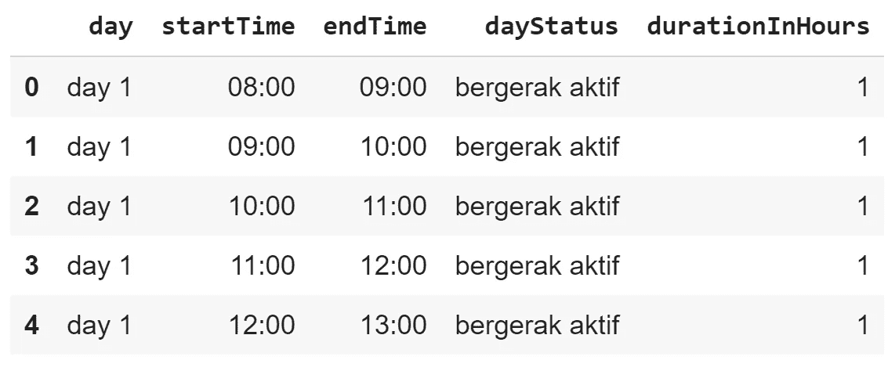
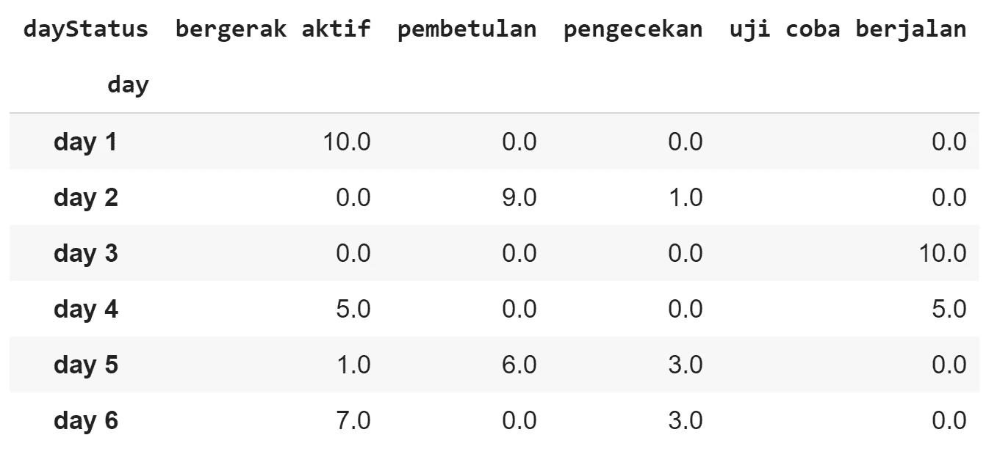
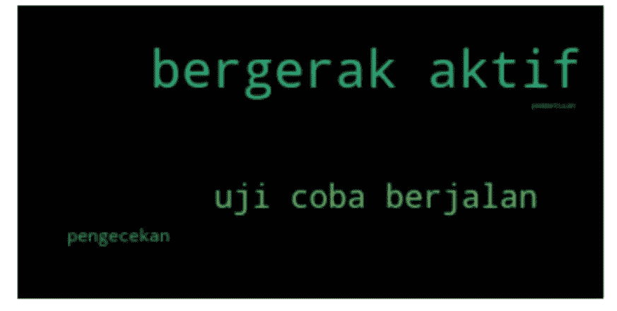
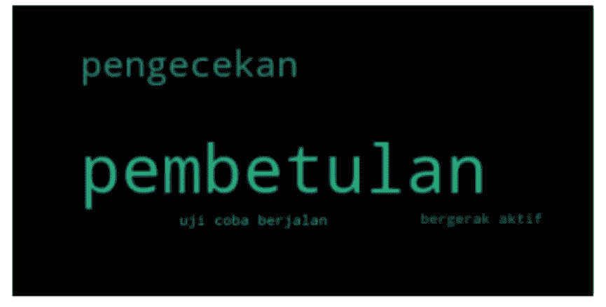

# 整体设备有效性和主题建模

> 原文：<https://towardsdatascience.com/overall-equipment-effectiveness-and-topic-modeling-bb467177217f?source=collection_archive---------38----------------------->

在制造业中，我们一直在寻找优化生产线运作的方法。我们希望在保持高产量的同时增加产量。为了衡量当前系统的生产效率，我们可以使用[总体设备效率(OEE)](https://en.wikipedia.org/wiki/Overall_equipment_effectiveness) 指数。OEE 涵盖三个方面:可用性、性能和质量。在这篇文章中，我将重点关注可用性，并通过一个示例用例。

假设我们从某个特定设备获得了 6 天的运行日志文件。设备每天使用 10 个小时。我们的目标是找出是否有问题的日子。唯一的问题是日志状态是用外语写的(假设[合同制造商](https://en.wikipedia.org/wiki/Contract_manufacturer)在印尼)。

```
import matplotlib.pyplot as plt
import pandas as pd# suppose the data is stored in a pandas dataframe called df
df.head()
```



Sample Dataset

有许多方法可以分析这种事务性数据。在这里，我将重点介绍一种叫做主题建模的特殊技术。基本思想是首先将每一行(或每一天)视为一个状态包(类似于[的单词包](https://en.wikipedia.org/wiki/Bag-of-words_model))。

```
statusDF = pd.pivot_table(df, index="day", columns="dayStatus", values="durationInHours", aggfunc='sum')
statusDF.fillna(0, inplace=True)
statusDF
```



Bag of Status Dataframe

然后，我们可以使用主题建模来发现这 6 天的日志是否可以聚集成一个更小的数据子集。每个集群将被分配一个名称(或主题),理想情况下，其中的数据将具有一个通用的状态配置文件。这类似于自然语言处理中的主题建模，其中某些单词与某些主题高度相关。

我们将使用一个简单的主题建模算法，称为[非负矩阵分解](https://en.wikipedia.org/wiki/Non-negative_matrix_factorization) (NMF)。我将在另一篇文章中讨论算法的细节。

NMF 的棘手之处在于，我们需要事先决定隐藏主题的数量。在这种情况下，我们任意选择它们为 2。

```
from sklearn.decomposition import NMF
model = NMF(n_components=2, init='random', random_state=1)plt.figure(figsize=(8, 5))W = np.around(model.fit_transform(statusDF), 1)
plt.subplot(1, 2, 1)
plt.imshow(W)
plt.title("matrix W")
plt.yticks(np.arange(len(statusDF.index.values)), statusDF.index.values)
H = np.around(model.components_, 1)plt.subplot(1, 2, 2)
plt.xticks(np.arange(len(statusDF.columns.values)), statusDF.columns.values, rotation='90')
plt.colorbar(pad=0.1)
plt.imshow(H)
plt.title("matrix H")plt.show()
```


Results of Non-negative Matrix Factorization

NMF 试图将状态矩阵包分解成矩阵 W 和矩阵 h 的乘积。这是在对每个状态的实际含义没有语义理解的情况下完成的(即不需要翻译)。

## 矩阵 W

矩阵 W 可以解释为日期和主题之间的映射。从上面的结果中，我们可以看到第 1、3、4 和 6 天都来自主题 0，具有不同程度的置信度(用方框颜色标记)。同时，第 2 天和第 5 天来自主题 1。这说明有两组天。问题是，这两者的区别是什么？答案就在矩阵 h 里。

## 矩阵 H

矩阵 H 是主题和状态之间的映射。例如，主题 0 与两种状态相关联:“bergerak aktif”和“uji coba berjalan”。另一方面，主题 1 带有“pembetulan”和“pengecekan”。在这一点上，拥有一个能够解释状态的领域专家将会非常有用。快速访问您最喜欢的翻译引擎会发现，“bergerak aktif”和“uji coba berjalan”表示积极地移动，而“pembetulan”和“pengecekan”则与修复/调试活动有关。

原来，主题 1 与维护相关，而主题 0 是高可用性。因此，我们可以强调，第 2 天和第 5 天发生的事情似乎促使了维护，最终损害了机器的 OEE 分数。

我们也可以用词云来形象化矩阵 H。每个字的大小对应于矩阵值。

```
from wordcloud import WordClouddef printWordCloud(text):
  # Create and generate a word cloud image:
  wc = WordCloud(relative_scaling=0.6, prefer_horizontal=1)
  wc.generate_from_frequencies(text)# Display the generated image:
  plt.imshow(wc, interpolation='bilinear')
  plt.axis("off")
  plt.show()

# Topic 0
text0 = dict(zip(statusDF.columns.values, H[0]+1e-99)) # replace 0 value  with a small weight
printWordCloud(text0)
# Topic 1
text1 = dict(zip(statusDF.columns.values, H[1]+1e-99))
printWordCloud(text1)
```



Topic 0



Topic 1

# **结论**

我们已经展示了主题建模可以用来识别具有相似状态(列)的日期(行)。在领域专家的帮助下，我们可以解释每个主题的含义，并随后决定哪个主题需要立即关注。