# 用 Mask-RCNN 克服实例分割过程中的过拟合

> 原文：<https://towardsdatascience.com/overcome-overfitting-during-instance-segmentation-with-mask-rcnn-32db91f400bc?source=collection_archive---------3----------------------->

## 仅在 1，349 幅带注释的图像上训练 Mask-RCNN

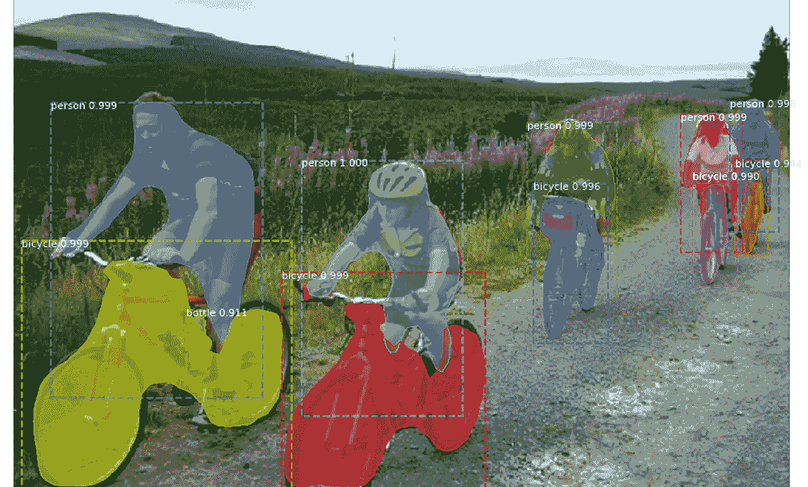

Not bad for a model trained on such a tiny dataset :)

# 介绍

计算机视觉的进步拥有许多有前途的应用，如自动驾驶汽车或医疗诊断。在这些任务中，我们依靠机器识别物体的能力。

我们经常看到的与物体识别相关的任务有**四个**:分类定位、物体检测、语义分割、实例分割。

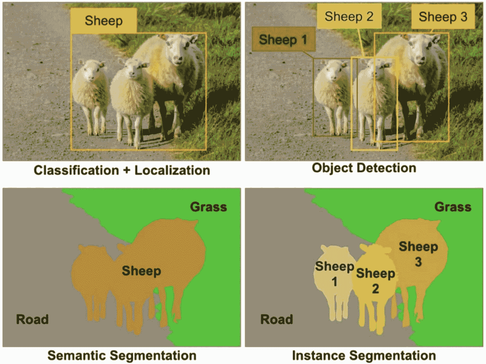

[https://www.oreilly.com/ideas/introducing-capsule-networks?cmp=tw-data-na-article-ainy18_thea](https://www.oreilly.com/ideas/introducing-capsule-networks?cmp=tw-data-na-article-ainy18_thea)

在**分类和定位**中，我们感兴趣的是给图像中的物体分配类别标签，并在物体周围绘制一个包围盒。在该任务中，要检测的对象的数量是**固定的**。

**物体检测**不同于分类和定位，因为在这里，我们不预先假设图像中物体的数量。我们从一组固定的对象类别开始，我们的目标是分配类别标签，并在每次这些类别中的对象出现在图像中时绘制边界框**。**

在**语义分割**中，我们给**每个图像像素**分配一个类标签:所有属于草的像素都标为“草”，属于羊的标为“羊”。例如，值得注意的是，这项任务并不能区分两只羊。

我们在这个任务中的任务是**实例分割**，它建立在对象检测和语义分割的基础上。与对象检测一样，我们的目标是标记和定位预定义类别中对象的所有实例。然而，我们不是为检测到的对象生成边界框，而是进一步识别哪些像素属于该对象，就像在语义分割中一样。语义分割的不同之处在于，实例分割为每个对象实例绘制一个**单独的掩码**，而语义分割将为同一类的所有实例使用相同的掩码

在本文中，我们将在一个微型 Pascal VOC 数据集上训练一个实例分割模型，只有 1349 张图像用于训练，100 张图像用于测试。这里的主要挑战将是在不使用外部数据的情况下防止模型过度拟合。

你可以在 [Github](https://github.com/kayoyin/tiny-instance-segmentation) 上找到所使用的数据集以及完整的训练和推理管道。

# 数据处理

注释是 COCO 格式的，所以我们可以使用来自 **pycocotools** 的函数来检索类标签和掩码。在这个数据集中，总共有 **20** 个类别。

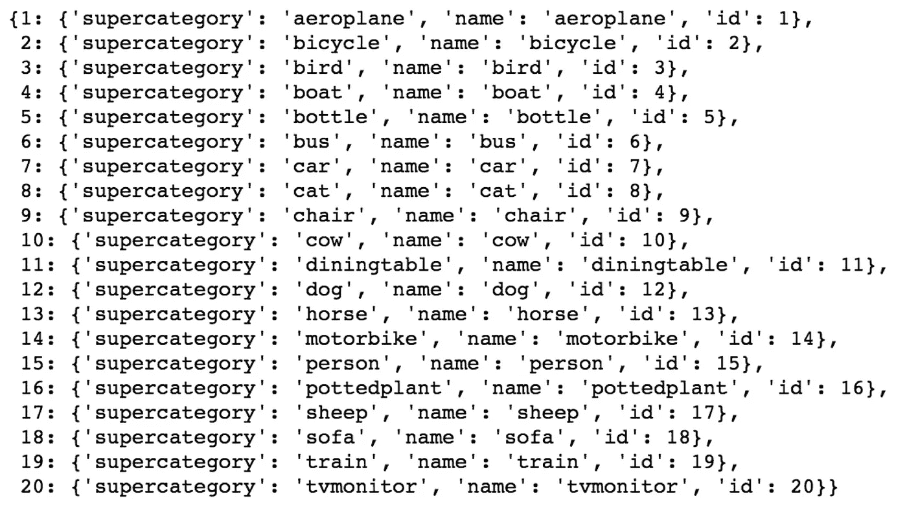

以下是训练图像和相关遮罩的一些可视化效果。遮罩的不同阴影表示同一对象类别的几个实例的单独遮罩。

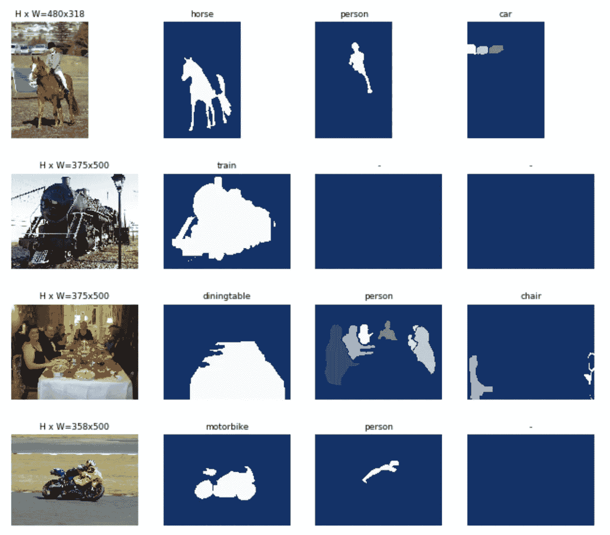

这些图像具有不同的大小和长宽比，因此在将图像输入模型之前，我们**调整**每张图像的尺寸为 **500x500** 。当图像尺寸小于 500 时，我们放大图像，使最大的边长为 500，并根据需要添加零填充以获得正方形图像。

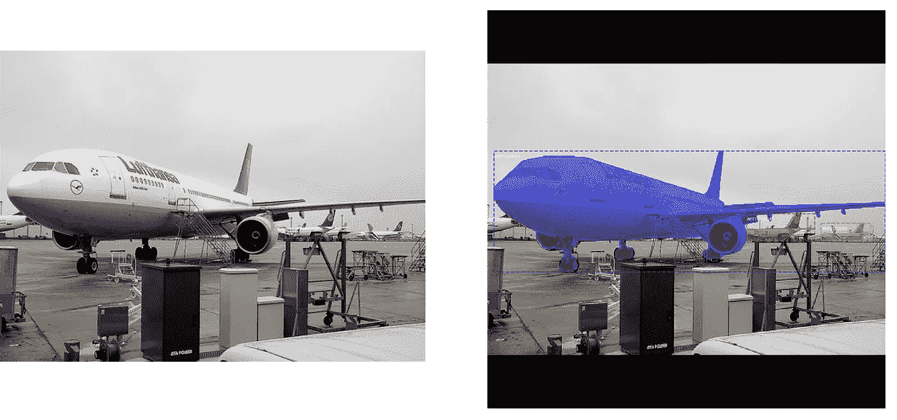

Example input before (left) and after resizing with the associated annotations (right)

为了让模型更好地泛化，尤其是在像这样的有限数据集上，**数据扩充**是克服过度拟合的关键。对于每个图像，以概率 0.5 执行水平翻转，将图像随机裁剪为原始尺寸的 0.9 到 1 倍之间的比例，以概率 0.5 执行具有随机标准偏差的高斯模糊，以 0.75 到 1.5 之间的比例调整对比度，以 0.8 到 1.2 之间的比例调整亮度，并且还应用一系列随机仿射变换，例如缩放、平移、旋转和剪切。

# 掩模-RCNN

我们将使用 matterport 的 Mask-RCNN 的[实现](https://github.com/matterport/Mask_RCNN)进行训练。虽然很诱人，但我们将**而不是**使用他们为 COCO 女士预先训练的权重来展示我们如何仅使用 1，349 张训练图像就可以获得良好的结果。

Mask-RCNN 于 2017 年在 [Mask-RCNN 论文](https://arxiv.org/abs/1703.06870)中提出，是同一作者对**fast-RCNN**的扩展。fast-RCNN 广泛用于对象检测，其中模型在检测到的对象周围生成边界框。Mask-RCNN 更进一步，生成对象**屏蔽**。

我将在下面提供一个模型架构的快速概述，matterport 发表了一篇很棒的[文章](https://engineering.matterport.com/splash-of-color-instance-segmentation-with-mask-r-cnn-and-tensorflow-7c761e238b46)，详细介绍了他们的模型实现。

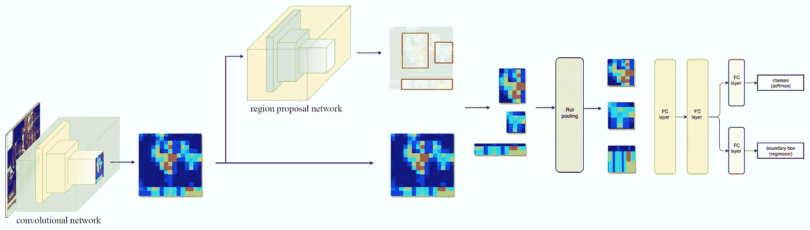

[https://medium.com/@jonathan_hui/image-segmentation-with-mask-r-cnn-ebe6d793272](https://medium.com/@jonathan_hui/image-segmentation-with-mask-r-cnn-ebe6d793272)

首先，我们使用一个**主干**模型从输入图像中提取相关特征。这里，我们使用 T21 架构作为主干。图像从形状张量(500，500，3)转换成形状特征图(32，32，2048)。

先前获得的特征然后被输入到**区域提议网络** (RPN)。RPN 扫描特征图的区域，称为**锚**，并试图确定包含对象的区域。这些锚具有不同的尺寸和纵横比。RPN 为每个锚点分配一个锚点类别:前景(正锚点)或背景(负锚点)。中性主播是不影响训练的主播。

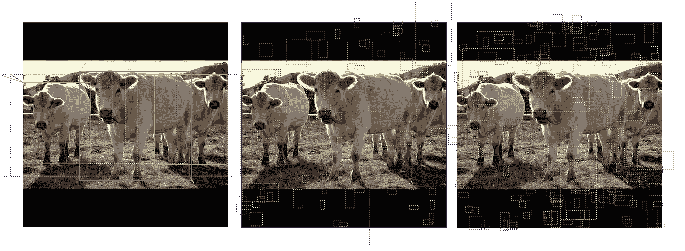

Positive anchors (left), neutral anchors (center), negative anchors (right)

一个**提议**层然后挑选最有可能包含一个对象的锚，并**提炼**锚框以更紧密地适应对象。当太多锚点重叠时，仅保留前景分数最高的锚点(**非最大抑制**)。这样，我们就获得了感兴趣的区域**(ROI)。**

**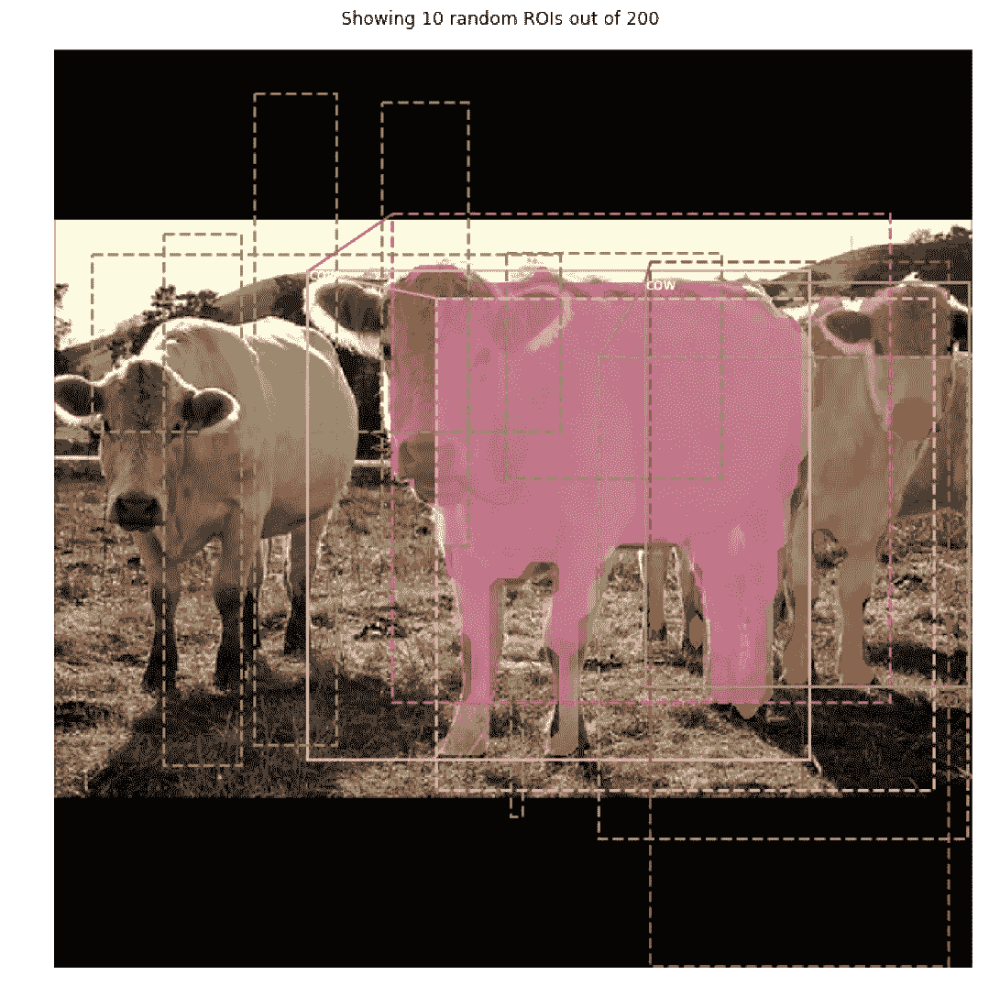**

**对于包含由 ROI **分类器**选择的对象的每个区域，该模型然后生成 28×28 个掩模。在训练期间，地面真实遮罩被缩小以利用预测遮罩计算损失，并且在推断期间，生成的遮罩被放大到 ROI 边界框大小。**

# **迁移学习**

**更快更好地训练模型的关键是**迁移学习**，尤其是在数据有限的情况下。Imagenet 数据集是一个巨大的自然图像库，类似于我们的图像。因此，我们可以将 Resnet101 主干模型的权重初始化为在 Imagenet 上预先训练的权重。这将提高我们获得的特征地图的准确性，并因此提高整个模型的准确性。**

****

**[ImageNet sample images](https://www.researchgate.net/figure/Examples-in-the-ImageNet-dataset_fig7_314646236)**

**为了微调预先在 Imagenet 上训练的模型，我们首先只训练**模型** **头部**。然后，我们训练从 ResNet **阶段 4 到剩余时期的**的层。这个训练方案也有助于**将** **过拟合**最小化。我们可以允许自己冻结并且从不微调第一层，因为我们可以重用模型学习的权重来从自然图像中提取特征。**

# **结果和检测管道可视化**

**训练 20 个时期的模型头部，以及 25 个额外时期的其余选定模型层，允许我们在测试集 **0 上获得地图分数。53650** 。以下是随机选择的测试图像上模型输出的一些可视化效果:**

**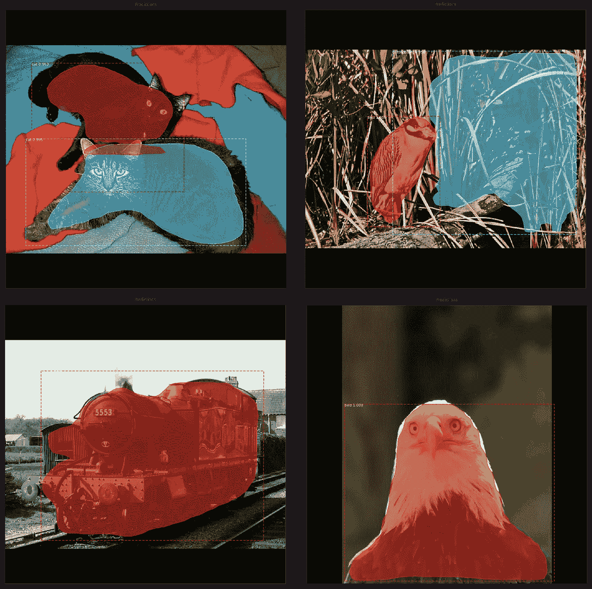**

**我们还可以可视化算法不同步骤的输出。下面，我们有边界框细化前的得分排名靠前的锚点。**

**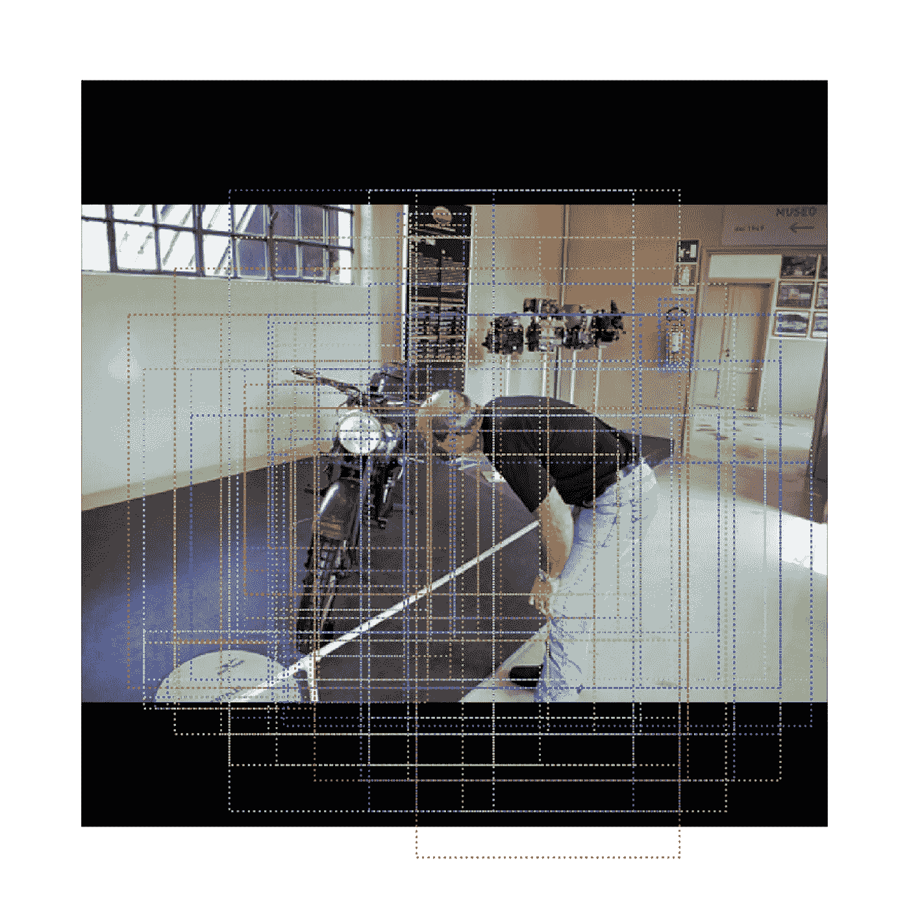**

**接下来，在边界框细化和非最大值抑制之后，我们有了输出锚点。这些建议然后被输入分类网络。请注意，在这一点上，我们有一些框紧密地绑定了一些对象，如标志，它们不属于我们已经定义的对象类别。**

**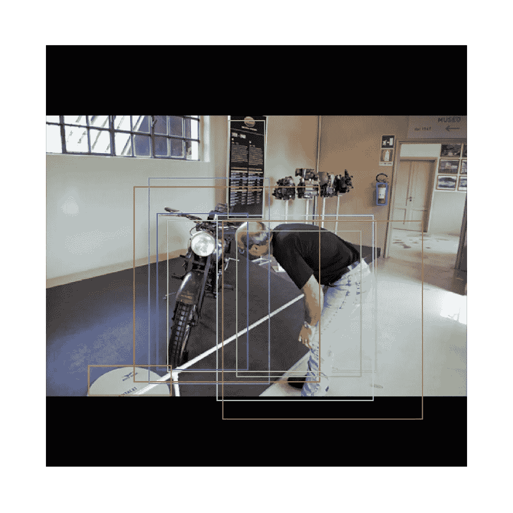**

**分类网络运行该提议以确定肯定检测，生成类别概率和边界框回归。**

**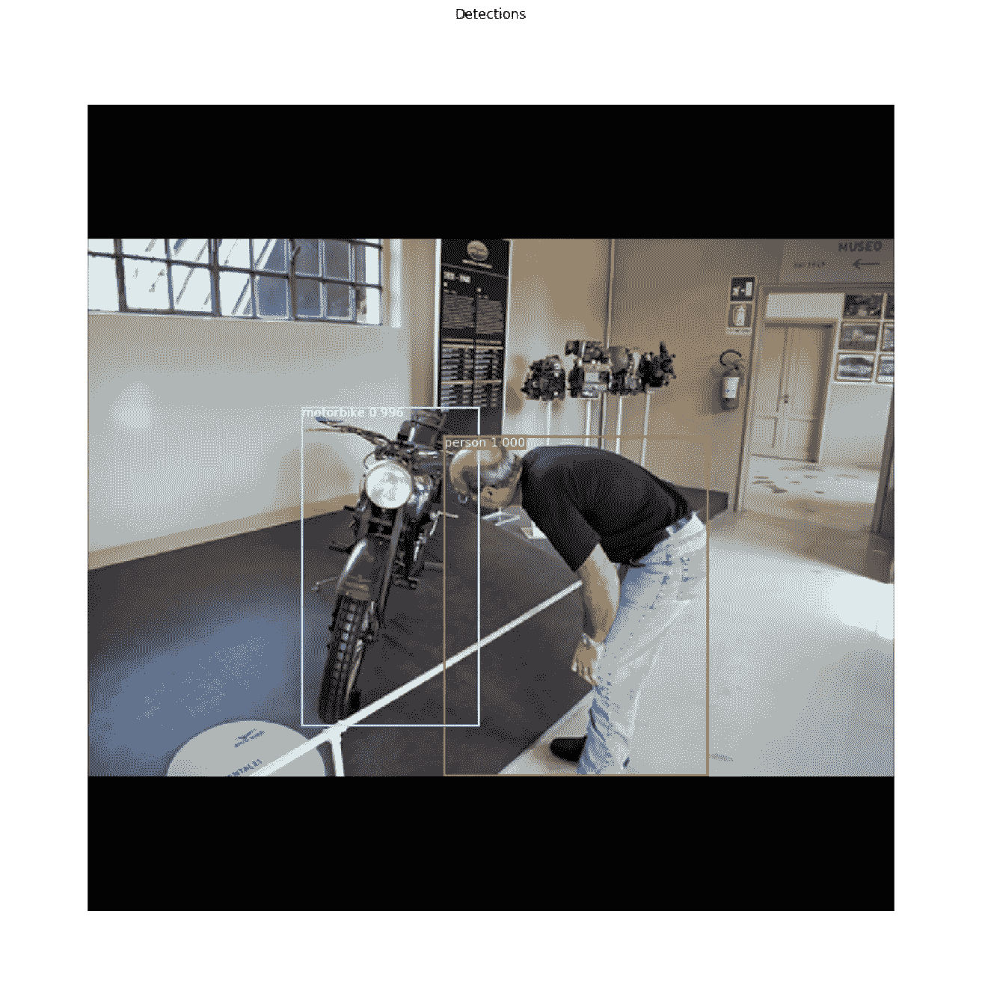**

**在获得边界框并对它们进行细化之后，实例分割模型为每个检测到的对象生成遮罩。在训练期间，遮罩是软遮罩(具有浮点像素值)并且大小为 28×28。**

**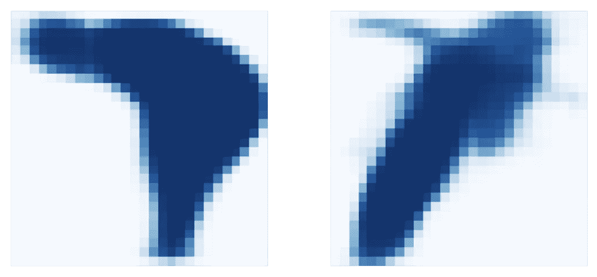**

**最后，预测的遮罩被重新缩放到边界框尺寸，我们可以将它们覆盖在原始图像上，以可视化最终输出。**

**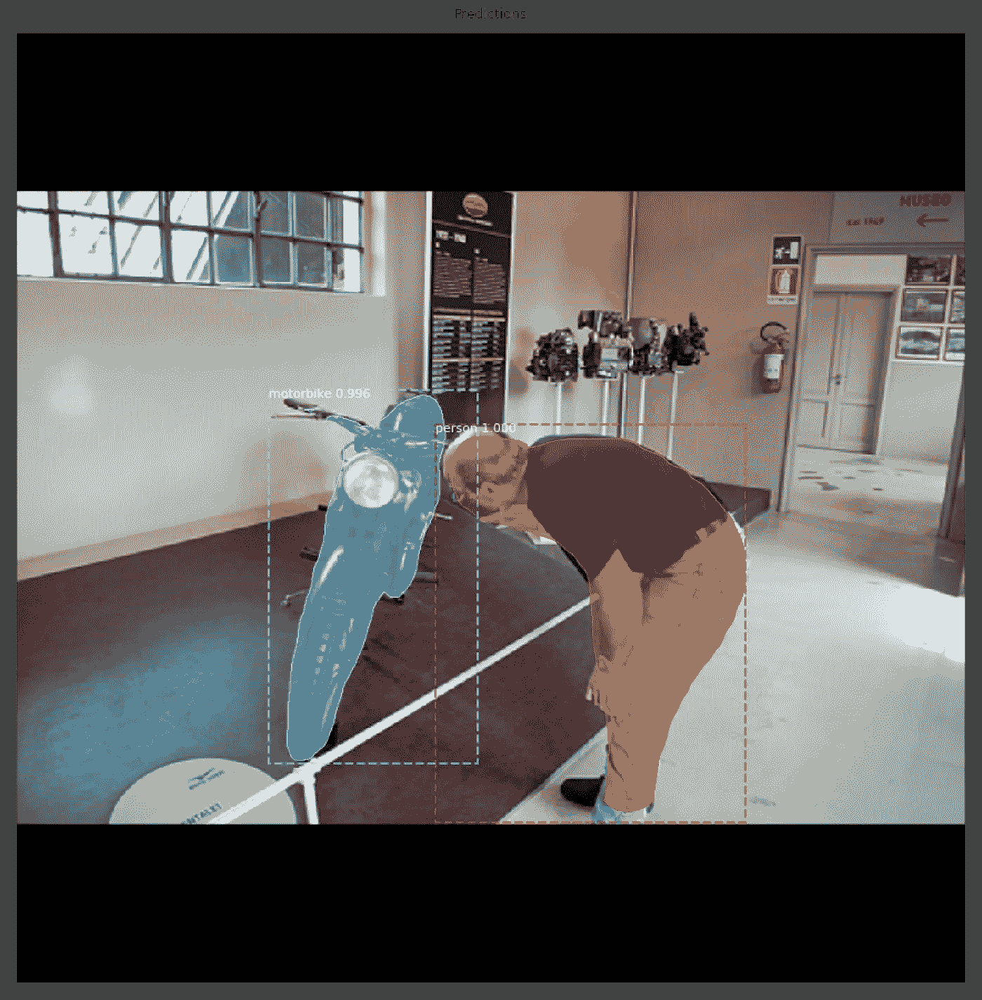**

**感谢阅读这篇文章，我希望你喜欢！**

**还有许多其他最先进的架构[例如分割，您也可以尝试，如果您在这个小小的 COCO 数据集上尝试了这些架构，请告诉我:)](https://paperswithcode.com/task/instance-segmentation)**

**您可能还想了解我如何在 3859 张灰度图像上训练 ResNet 分类器，从而在我的课堂 Kaggle 挑战赛中获得第二名:**

** [## 利用有限数据进行 Kaggle 图像分类的最新成功技术

### 关于如何防止模型在小数据集上过度拟合但仍能进行准确分类的教程

towardsdatascience.com](/latest-winning-techniques-for-kaggle-image-classification-with-limited-data-5259e7736327)**