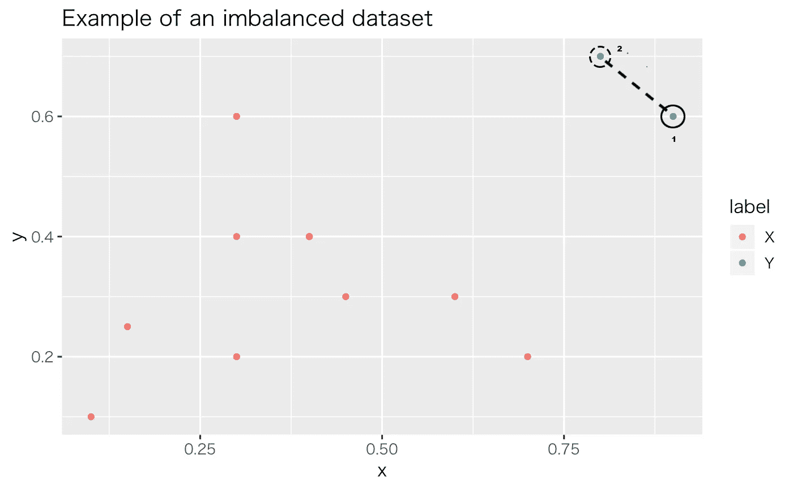
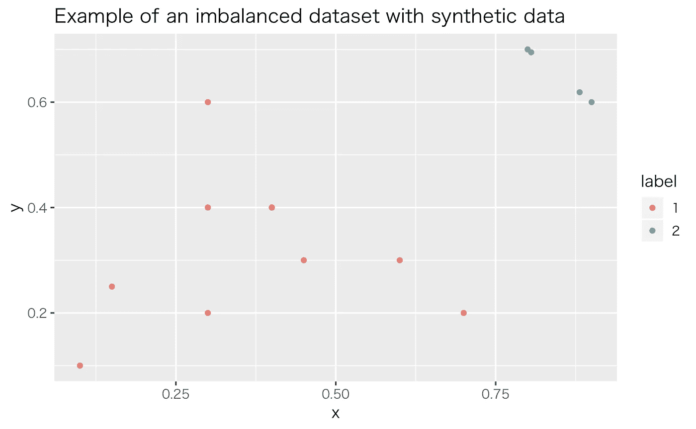
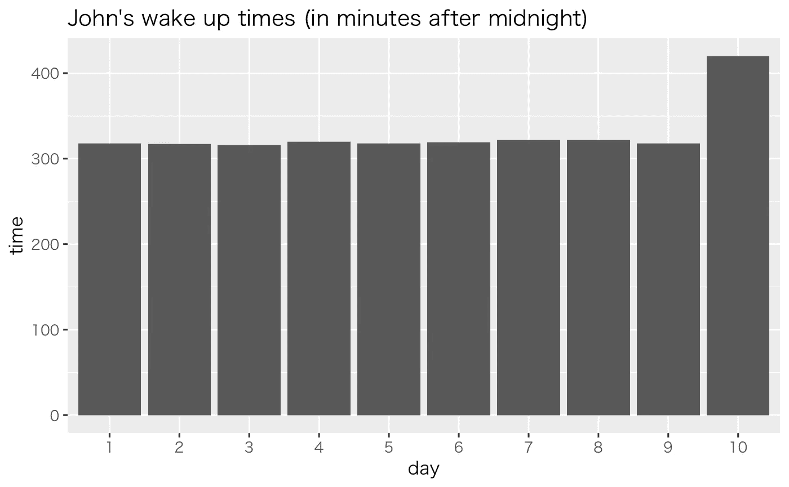
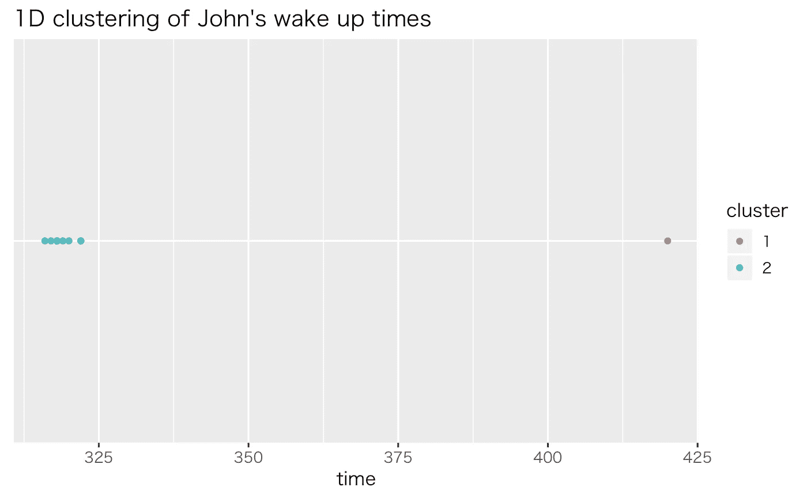

# 设计欺诈检测系统时克服挑战

> 原文：<https://towardsdatascience.com/overcoming-challenges-when-designing-a-fraud-detection-system-29e33bcb43d2?source=collection_archive---------12----------------------->

## 关于如何对我们的数据进行过采样，以及选择正确的模型和指标，可以改善我们的预测系统

人工智能领域的最新进展为大量智能和个性化的欺诈检测方法打开了大门。曾经需要大量人工劳动的领域，现在是经历了机器学习进步的众多领域之一。尽管如此，重要的是要注意到，这种技术像任何其他技术一样，并不完美，容易出现问题，因此个人、企业和服务提供基于预测技术的解决方案来检测欺诈性交易，我们必须后退一步，考虑可能出现的挑战。

我相信可以肯定地说，大多数交易都是非欺诈性的。虽然这很好，但它也造成了欺诈检测领域最重要和最普遍的问题:不平衡的数据。数据是机器学习预测模型中最重要的组成部分，不平衡的数据集(在本例中是主要由非欺诈记录组成的数据集)可能会导致预测系统无法正确了解欺诈交易。在这种情况下，直接的解决办法是获取更多的数据；然而，在实践中，这要么昂贵、耗时，要么几乎不可能。幸运的是，一些程序和算法有助于解决不平衡数据集的问题。

过采样和欠采样技术允许我们修改数据集的类分布。顾名思义，过采样是一种用于创建类似于原始数据集的合成数据的过程，而欠采样的目标则相反，去除数据；值得注意的是，在实践中，过采样比欠采样更常见，这就是为什么你可能听说过前者多于后者。

最流行的过采样算法是*合成少数过采样技术*或 **SMOTE** 。SMOTE 是一种算法，它依靠*最近邻*的概念来创建其合成数据。例如，在下图中，我们有一个由 12 个观测值和两个连续特征组成的不平衡数据集，`x`和`y`。在这 12 次观察中，10 次属于`X`类，其余两次属于`Y`。SMOTE 所做的是从代表性不足的数据中选择一个样本，对于每个点，它都计算其 K 个最近邻——为了简单起见，让我们假设它的`K=1`。然后，它获取数据点与其最近邻居之间的向量，并将其乘以 0 到 1 之间的随机值，从而产生新的向量“a”。该向量是我们新的合成数据点。

The nearest neighbor of point number 1, is point number 2 and vice-versa, thus, the newly synthetic data point is to be created somewhere along the dotted line

Dataset enhanced with synthetic data

以下要点显示了如何在 r 中执行 SMOTE。

我想提出的第二个概念是预测系统的选择。首先，我们可能会认为，一个监督学习系统将一个行为分类为欺诈与否将是解决这类问题的最合适的方法。虽然这听起来很有吸引力，但需要注意的是，有时这还不够，异常检测和无监督学习等其他领域可以帮助找到那些可能代表欺诈的嘈杂和异常点。

异常检测是数据挖掘的一个领域，它处理异常和罕见事件(也称为离群值)的发现，这些事件偏离了被认为是正常的事件。在基本层面上，这些检测方法在统计上更加密集，因为它们更紧密地处理分布的主题以及数据点与分布的差异程度。例如，定义为`UF = Q3 + (1.5 * IQR)`和`LF = Q1 — (1.5 * IQR)`的*上下内栅栏*等方程(其中 IQR 是四分位数范围)是用于创建屏障的众多技术之一，该屏障将数据分为正常数据和异常数据。

Cute outlier. Image by [Hans Braxmeier](https://pixabay.com/users/Hans-2/?utm_source=link-attribution&utm_medium=referral&utm_campaign=image&utm_content=375639) from [Pixabay](https://pixabay.com/?utm_source=link-attribution&utm_medium=referral&utm_campaign=image&utm_content=375639)

让我们用一个现实而愚蠢的例子来解释这一点。想象一下，有一个叫约翰的家伙，他是一个早起的人，经常在早上 5:30 左右醒来(一个真正的冠军)，然而，昨晚当约翰庆祝他的 32 岁生日时，他有点太开心了，第二天早上 6 点就醒来了(对此感到很糟糕)。这个“6 am”代表我们数据集中的一个异常。

下图代表了约翰最后的十个起床时间，我们可以看到最后一个似乎是不合适的。正确地说，我们可以说这个点远远落在其他九个时间的分布上；三西格玛或标准偏差规则，一个用于检测异常值的规则，显示了这一点。如果没有第 10 次，平均值和标准差将是 318.89 和 2.09(如果我们将时间计算为 12 点后的分钟数)。然而，第 10 次(6 am，或 420)远远超出了平均值加上三倍标准差的范围(318.89 + (2.09 * 3) = 325.16)，表明时间确实是一个异常。

On the 10th day, John had a rough wake up

无监督学习，尤其是聚类，也可以用于检测数据集中的异常和有噪声的内容。这种机器学习算法在这样的假设下工作，即相似的观察结果倾向于被分组在相同的簇下，而有噪声的观察结果则不会。回到约翰和他奇妙的睡眠模式，如果我们使用 *k-means* 和`k=2`对他的数据进行聚类，我们可以观察到异常点如何落入自己的聚类中。

The lonely red point on the right represents an anomaly, a point that is dissimilar to the rest of the dataset

最后，性能指标的选择在训练我们的系统时起着重要的作用。如果数据集不平衡，像准确度这样的标准分数就没有多大用处。例如，假设只有 2%的测试数据集内容是真实的欺诈交易。如果该模型将所有这些情况分类为非欺诈性的，则准确率将为 98%；一个很好的数字，但在这种情况下微不足道。更适合这个用例的一些指标是*精度*、*召回*和*科恩的卡帕系数*。此外，我们正在优化的错误类型，即*假阳性*或*假阴性*，也非常重要。在某些情况下，我们应该倾向于使用较高的假阳性率来换取较低的假阴性分数，反之亦然。

打击欺诈、诈骗和垃圾邮件活动的需求将一直存在。即使最近在人工智能领域取得了所有的进步和突破，在我们解决问题的探索过程中也会遇到一些困难。在本文中，我谈到了其中的三个困难:缺乏平衡的数据集、预测系统的选择和合适的评估指标的选择，并提供了一些指针和选项，以提高我们预测和检测的质量。

我的 GitHub 上提供了用于生成图片的代码。

 [## juandes/欺诈-挑战-附录

### 在 GitHub 上创建一个帐户，为 juandes/fraud-challenges-appendix 的开发做出贡献。

github.com](https://github.com/juandes/fraud-challenges-appendix) 

感谢阅读。

 [## 胡安·德迪奥斯·桑托斯(@ jdiosantos)|推特

### 胡安·德迪奥斯·桑托斯的最新推文(@ jdiossantos)。机器学习/数据工程师。还有，口袋妖怪大师，还有…

twitter.com](https://twitter.com/jdiossantos)