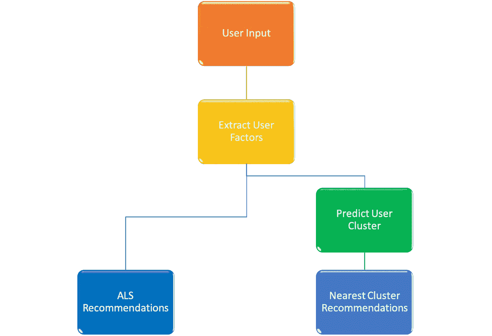
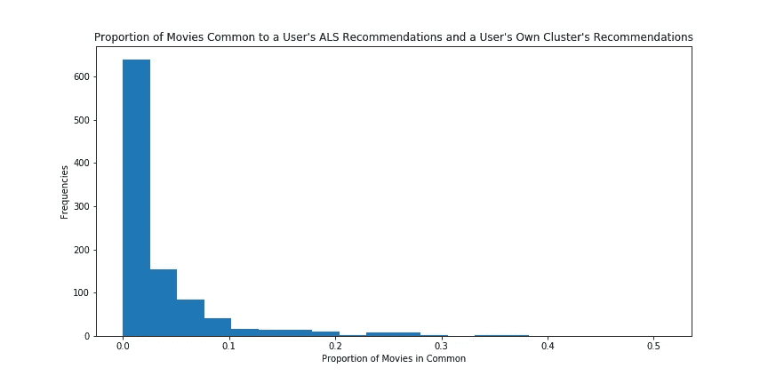
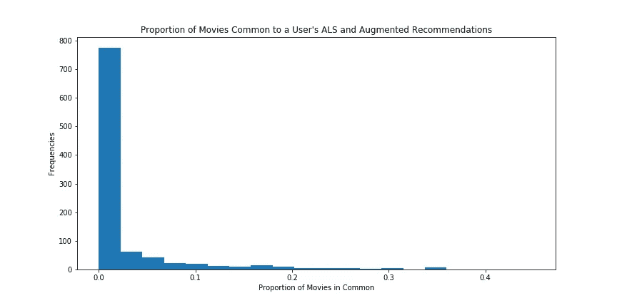

# 克服推荐系统中的回音室(使用电影评级)

> 原文：<https://towardsdatascience.com/overcoming-echo-chambers-in-recommendation-systems-using-movie-ratings-3686f50fc053?source=collection_archive---------24----------------------->

以下帖子的代码可以在 [GitHub](https://github.com/DRyanMiller/Overcoming-Echo-Chambers-in-Recommendation-Systems/blob/master/README.md) 上找到。

# 介绍

自动推荐系统已经成为日常在线生活的一部分。无论是亚马逊推荐产品，脸书推荐新闻文章，还是网飞推荐电影，我们经常与推荐系统进行互动，以使消费者和企业都受益。这些系统的缺点是，随着时间的推移，它们可能会限制推荐项目的多样性，因为它们缩小了用户偏好的范围。这一过程产生了回音室(只接触像你一样的其他人的建议)、反馈循环(强化你记录的偏好的建议)和过滤气泡(只接触与你过去喜欢的项目相似的建议)。这些现象导致用户只能看到强化他们自己的偏见或购买模式的推荐。

下面的帖子描述了我构建的一个系统，它根据与用户不同但又不太不同的其他人的偏好提供额外的推荐。这些额外的推荐是通过基于从评级矩阵的交替最小二乘(ALS)分解获得的潜在用户因素对用户进行聚类来识别的。一旦分类被创建，每个分类的最高评级项目(基于分类质心)被识别。每个聚类中排名最高的项目形成了可以从中提取推荐的项目集。从最接近用户聚类的两个聚类中提取用户的推荐。完整的系统向用户提供了两组建议。第一组来自传统的 ALS 模型，第二组来自增强模型。

# 商业理解

自动推荐系统在拥有在线业务的企业中很常见。它们被用来推荐产品、新闻文章，甚至是食谱。这些系统旨在通过推荐消费者可能会喜欢的新产品来增加消费者的参与和购买。一种用于产生推荐的常见方法是协同过滤，其基于请求推荐的消费者和其他消费者的组合偏好来产生推荐。随着额外偏好的记录，协同过滤(CF)做出好的推荐(即，消费者会喜欢的推荐)的能力提高了。协同过滤的一个限制是，随着时间的推移，推荐的范围变得越来越窄，导致回音室、反馈循环和过滤气泡。

回音室、反馈回路和过滤泡沫的负面影响在社会和经济上都可以感受到。从社会角度来看，这些影响限制了对不同和相反思想的接触，导致了一个更加分裂和分化的社会。从经济上来说，这些影响限制了消费者接触的产品种类，限制了企业增加产品需求的潜力。

# 数据理解和准备

该项目利用了 [MovieLens](https://grouplens.org/datasets/movielens/) 数据集(哈珀&康斯坦，2015)。MovieLens 数据集是一个开源数据集，包含 283，228 个用户对 58，098 部电影的 27，753，444 个电影评级。评级为五星级别，范围从 0.5 星到 5 星，增量为 0.5 星。评分包括从 1995 年 1 月 9 日到 2018 年 9 月 26 日的数据，用于至少有 1 个电影评分的随机用户样本。一个附加文件包含关于电影的数据，包括它们的标题、发行年份和类型。MovieLens 使用许可证禁止在没有单独许可的情况下重新分发数据，但可以通过上述链接从许可证所有者处免费下载。

为了准备用于分析的评分数据，我删除了评分少于 10 分的用户和评分少于 5 分的电影。处理后的数据集包含 243，658 个独立用户的 27，510，397 个评级和 28，755 部电影。电影数据被处理以产生两个新的数据集。第一个仅包含评分超过 50 的电影。这些“收视率最高”的电影被用作所有推荐的基础。这样做是为了确保推荐仅包含来自大量用户的具有高平均评级的电影，从而防止仅来自少数用户的具有高平均评级的电影扭曲推荐集。第二个包含评分最高的前 100 部电影(基于平均评分)。前 100 部电影用于为新用户随机选择电影进行评级。这样做是为了确保向用户呈现熟悉的电影以供评价。

使用 Amazon Web Services(AWS)Elastic MapReduce(EMR)拟合 ALS 模型(见下文)后，需要进一步的数据处理。ALS 模型的用户和项目因子输出被保存为文件集(MapReduce 过程的一个功能)。要在 AWS EMR 之外使用用户和项目因素，需要将每组文件合并成一个 csv 文件。此外，必须对用户因素进行调整，以便在聚类算法中使用。

# 建模

Augmented Recommendation Process Model

上图概述了增强推荐系统生成推荐所遵循的流程。在整个过程中，增强推荐系统利用三种机器学习算法来产生电影推荐:替代最小二乘法(ALS)、KMeans 和梯度增强机器。以下解释了该过程如何工作以及机器学习算法如何在该过程中发挥作用。

在提出建议之前，ALS 和 KMeans 算法用于生成用户和项目因素(ALS ),然后使用 ALS 模型中的用户因素将用户分组(KMeans)。为了生成用户和项目因素，使用 AWS EMR 聚类将 ALS 模型拟合到已处理的评级数据。

然后，处理后的 ALS 因子被输入到 AWS 集群上的 KMeans 算法中，以确定集群的最佳数量。然后利用来自 KMeans 模型的误差来寻找最佳的聚类数。

然后，在本地计算机上重新运行 KMeans 算法，为评级数据集中的所有用户生成预测分类，并为每个分类生成分类质心。然后使用由 KMeans 模型预测的聚类来训练梯度增强机器。最后，计算聚类质心之间的距离并保存以备后用。

一旦这些模型被训练，推荐的过程就从用户给十部电影排序开始。使用在周、威尔金森、施雷伯和潘(未注明)中描述的过程，将这些排名与来自 ALS 的项目因子相结合，以预测处理的数据集中所有电影的用户评级。用户评价最高的电影成为 ALS 推荐。

为了生成增强的推荐，使用上面生成的用户因子和经过训练的梯度增强机器将用户分类到一个聚类中。然后，从最接近用户预测聚类的两个聚类中的最高评级电影中提取增强推荐。推荐是通过从这两个群集中的每一个中的 100 部最高评级的电影中随机选择电影来生成的。总共提供了十个推荐，六个来自最近的聚类，四个来自下一个最近的聚类。从每个聚类提供的推荐数量被加权，使得随着聚类之间的距离增加(即，聚类之间的差异增加)，较少的推荐被贡献给最终的推荐列表。

# 估价

使用四个度量来评估增强的推荐模型。下面描述了每个指标和模型的性能。通过将这些指标应用于 MovieLens 数据集的 1000 个用户的随机样本来评估增强模型的性能。

**第一个指标**

第一个指标查看用户的前 100 条 ALS 建议(基于预测的用户评级)和用户群的前 100 条建议(基于群质心的评级)。ALS 推荐的电影在群集推荐中的比例应该很高。高比例表示用户的聚类代表用户的电影偏好。

Histogram of Proportion of Common Movies Between ALS Recommendations and User’s Cluster Recommendations

该模型在此指标上的表现不如预期。如上图所示，在大多数样本中，不到 10%的 ALS 推荐电影是由用户群推荐的。这可能是使用聚类质心来识别推荐的结果。识别每个聚类中最高评级电影的不同方法(例如，聚类中用户的平均评级)可以产生更好的结果。

**第二个指标**

第二个度量查看用户的前 100 个 ALS 推荐(基于预测的用户评级)和来自增强模型的前 100 个推荐(基于最接近用户聚类的两个聚类的聚类质心的评级)。在增强模型推荐中也发现的 ALS 推荐电影的比例应该很小。低比例表示来自增强模型的推荐不同于由 ALS 模型产生的推荐。

Histogram of Proportion of Common Movies Between ALS Recommendations and Augmented Recommendations

根据这一指标，模型表现符合预期。如上图所示，对于大多数样本，不到 10%的 ALS 推荐电影也是由增强模型推荐的。

**第三个度量**

第三个度量利用电影之间的距离(基于 ALS 项目因子)来评估来自增强模型的电影在质量上不同于来自 ALS 模型的电影的程度。对于此指标，将为样本中的每个用户计算 ALS 模型中前 100 部电影之间的均方距离(不包括电影与其自身之间的距离)。同样，为样本中的每个用户计算前 100 部 ALS 电影中的每一部与来自增强模型的每一部顶级电影之间的均方距离。使用 t-检验来测试样本的这些均方距离之间的差异。负的且具有统计显著性的 t 统计量指示两组推荐之间的平均差异大于 ALS 推荐内的平均差异，因此，来自增强模型的电影在质量上不同于来自 ALS 模型的电影。

不出所料，ALS 建议与补充建议在质量上有所不同(t 统计= -66.2，p = 0.000)。

**第四个度量**

最终的度量评估增强模型推荐的电影是否与 ALS 推荐的电影在质量上有太大的不同。该度量测试两个差异之间的差异:ALS 推荐和增强模型的推荐之间的差异，以及 ALS 推荐和来自离用户聚类最远的两个聚类的推荐之间的差异。这些差异的计算方式与上述第三个指标相同。差异中的差异使用 t 检验进行检验。正的且具有统计显著性的 t 统计表明 ALS 建议和来自最远聚类的建议之间的差异大于 ALS 建议和增强模型建议之间的距离。更大的距离是增强模型推荐与 ALS 推荐没有太大不同的证据，因为最远聚类推荐的电影差别更大。

正如所预期的，与从最远的聚类生成的推荐相比，增强的推荐与 ALS 推荐的差异更小(t 统计 5.5，p = 0.000)

# 后续步骤

未来的工作可以通过以下方式改进该项目:

1.  通过结合更复杂的算法特征(例如，时间分量)来增强 ALS 模型，
2.  通过参数调整提高梯度推进机器分类的性能，
3.  通过改变从聚类中生成电影推荐的方式来提高增强推荐模型的性能，以及
4.  将增强的推荐功能部署为 web 应用。

# 参考

F.麦克斯韦·哈珀和约瑟夫·a·康斯坦。2015.电影镜头数据集:历史和背景。ACM 交互式智能系统汇刊(TiiS) 5，4，第 19 篇(2015 年 12 月)，19 页。http://dx.doi.org/10.1145/2827872。

Zhou, Y., Wilkinson, D., Schreiber, R. & Pan, R. (n.d.). Large-scale Parallel Collaborative Filtering for the Netflix Prize. Retrieved from [https://endymecy.gitbooks.io/spark-ml-source-analysis/content/推荐/papers/Large-scale%20Parallel%20Collaborative%20Filtering%20the%20Netflix%20Prize.pdf](https://endymecy.gitbooks.io/spark-ml-source-analysis/content/%E6%8E%A8%E8%8D%90/papers/Large-scale%20Parallel%20Collaborative%20Filtering%20the%20Netflix%20Prize.pdf).