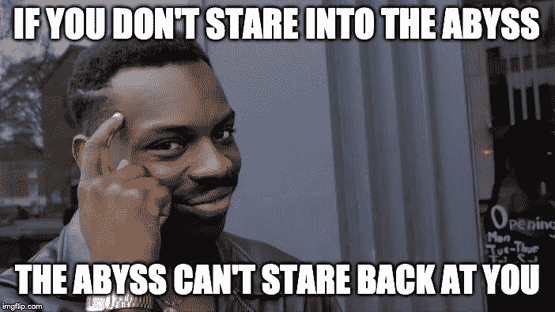
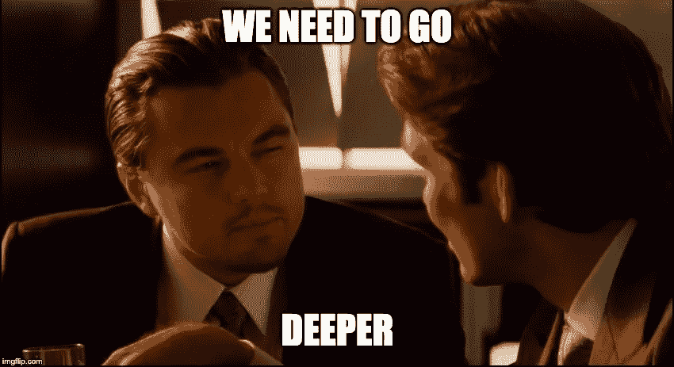

# 克服你对研究论文的恐惧

> 原文：<https://towardsdatascience.com/overcoming-your-fear-of-research-papers-41a95fc3a804?source=collection_archive---------20----------------------->

Source: [https://www.pexels.com/](https://www.pexels.com/)

实话实说吧——研究论文很吓人。在机器学习领域，阅读一篇研究论文会感觉像是凝视着一个单词密集、公式复杂的深渊。很容易看到深渊，并认为它太难克服。然而，学会如何从研究论文中提取信息至关重要。机器学习领域发展如此之快，以至于经常只有通过阅读论文才能跟上时代的步伐。我的希望是帮助你发展一些技巧和策略，以便不感到不知所措。

Source: [https://imgflip.com/memegenerator](https://imgflip.com/memegenerator)

# 开始时要宽，不要深

选择一篇研究论文，并决定无论如何都要征服它，这可能很有诱惑力。然而，我发现当开始时，这会导致精疲力尽和绝望。几周后，你会发现自己似乎没有取得什么进展，并认为自己不适合这项任务。

相反，我会建议从略读许多研究论文开始。这个过程的目标是开始适应论文的写作方式。论文几乎总是遵循类似的流程:开头是摘要，介绍和背景研究，中间往往是对研究贡献的详细描述，结尾是实验结果和结论，并提出了下一步的建议。

首先，我会查看一系列精选的论文，如[令人敬畏的深度学习论文](https://github.com/terryum/awesome-deep-learning-papers)(注意: [Arxiv Sanity](http://www.arxiv-sanity.com/) 也是一个查找论文的好地方)。令人敬畏的深度学习论文列表不再保留，但它仍然是熟悉深度学习领域关键研究论文的一个很好的起点。从挑选看起来有趣的研究论文开始，做以下事情:

*   阅读整个摘要。
*   跳过方程式，但阅读数字。这可能是深度学习独有的，但几乎总是有伟大的人物概述了拟议的架构。
*   查看实验结果部分的表格。
*   看结论。

整个过程应该不到 10 分钟，给你一个像样的论文摘要。你应该理解这篇论文试图完成的内容(摘要)、方法论的高层次思想(图)、它实际上工作得如何(表)，以及缺点和潜在的后续步骤(结论)。

你不会对这种方法的工作原理有很深的理解，但是没关系——目标是广泛覆盖论文。所以拿起下一张纸，重复这个过程。

以这种方式读了 10 到 20 篇论文后，我发现神奇的事情开始发生了。你不仅开始觉得拿起一篇研究论文并提取关键点很舒服，而且你也开始发展一个知识网络。你开始明白不同的想法是如何联系在一起的，以及哪些想法会不断浮现。例如，如果你正在阅读最近的 NLP 论文，你会开始意识到变形金刚风靡一时，一种新的艺术形式正以令人难以置信的速度出版。

这个知识网络非常有价值，因为下次你浏览一篇论文时，你会看到这项研究是如何与你读过的其他论文联系起来的。例如，您可能会读到(摘自 [XLNet](https://arxiv.org/abs/1906.08237) 摘要)

> 然而，依赖于用屏蔽破坏输入，BERT 忽略了屏蔽位置之间的相关性，并且遭受预训练-微调差异。根据这些优点和缺点，我们提出了 XLNet，一种广义自回归预训练方法，它(1)通过最大化因子分解顺序的所有排列的期望似然性来实现学习双向上下文，以及(2)由于其自回归公式，克服了 BERT 的限制。

你自己想想:好吧——是的，在高层次上，这是有道理的，因为我记得在[伯特](https://arxiv.org/pdf/1810.04805.pdf)论文的数字中读到过一些关于掩蔽头寸的内容。只需几分钟，您就会明白 XLNet 的贡献之一是做了比屏蔽令牌更好的事情。你的知识面很浅，但足以增加你的知识网络。由于略读只需要几分钟，它还可以让你的知识网络保持最新的研究，即使是在快速发展的领域，如机器学习。

Source: [https://imgflip.com/memegenerator](https://imgflip.com/memegenerator)

# 深入

一旦你略读了几篇论文，你就应该开始对不断出现的关键主题有所感觉。例如，在 NLP 中，一个关键主题是变压器。以我的经验来看，关键主题非常罕见，当你发现一个时，值得花时间去深入了解它(注意:你应该通过浏览大多数论文为自己赢得很多时间)。我的深入策略如下:

*   **从头开始。**例如，如果你决定你真的需要理解 BERT，你可能会发现 BERT 中使用的概念你并不完全理解。通过浏览参考文献，试着追溯这些概念的起源。对于变形金刚，你需要理解注意力，这可能会带你去看[注意力是你所需要的全部](https://arxiv.org/abs/1706.03762)这篇论文。
*   利用博客。事实证明，大多数研究论文并不是真的为了理解而写的(至少不是大多数人写的)。幸运的是，许多了不起的人花时间清晰地描述了困难的概念。例如，检查出这个[惊人的写在变压器上](http://jalammar.github.io/illustrated-transformer/)从注意是你所需要的。在 Google、Medium、Reddit 上搜索这些资源，无论你在哪里，它们都能帮你节省时间。
*   **把它编码起来。**对我来说，我发现一旦我能编写一些东西，我就能很好地理解它的实现。如果你在深度学习领域，我会强烈推荐 PyTorch，因为我经常发现你几乎可以直接从论文中的文字转换成 PyTorch 代码。哈佛大学的一个小组甚至为《你所需要的只是关注》做了这个。
*   **教吧。至此，你已经对这篇论文有了很好的理解，我强烈建议你将你所学到的东西传授给别人。你可以写一篇博客，向同事展示你学到的东西，甚至在当地的聚会上做一次演讲。教学将迫使你巩固和澄清你所学到的东西，同时也帮助他人。**

这个过程需要时间和耐心。不要被这样的事实所欺骗，研究论文只有 5-10 页长，你可以在一个小时内读完所有的单词。一篇研究论文是大量努力和时间的浓缩版——通常由一群人完成。不要期望在一天内掌握这些概念。相反，专注于投入理解的工作。例如，你可以设定一个目标，每天花 30 分钟更好地理解文章。不要强调整个过程需要多长时间。只要继续努力，你会发现自己在另一边拥有更多的知识。

这篇文章可以在[这里](https://learningwithdata.com/posts/tylerfolkman/overcoming-your-fear-of-research-papers-41a95fc3a804/)找到。