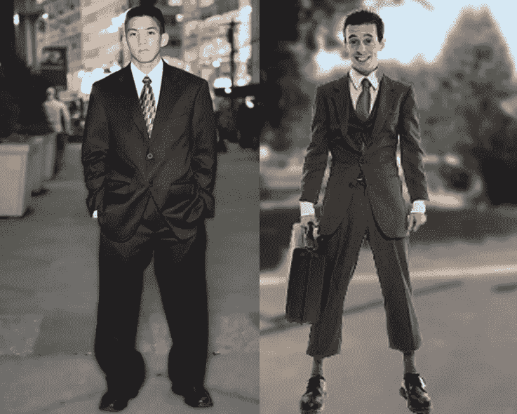
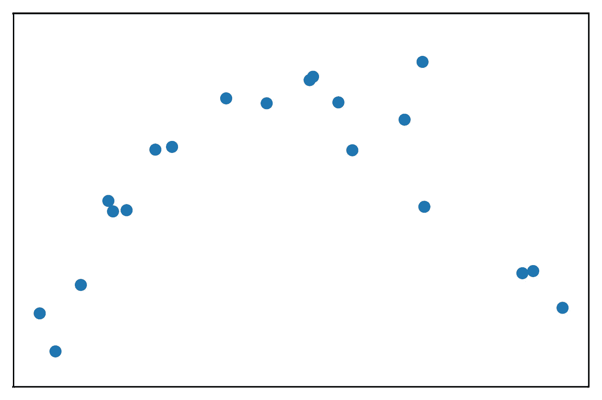
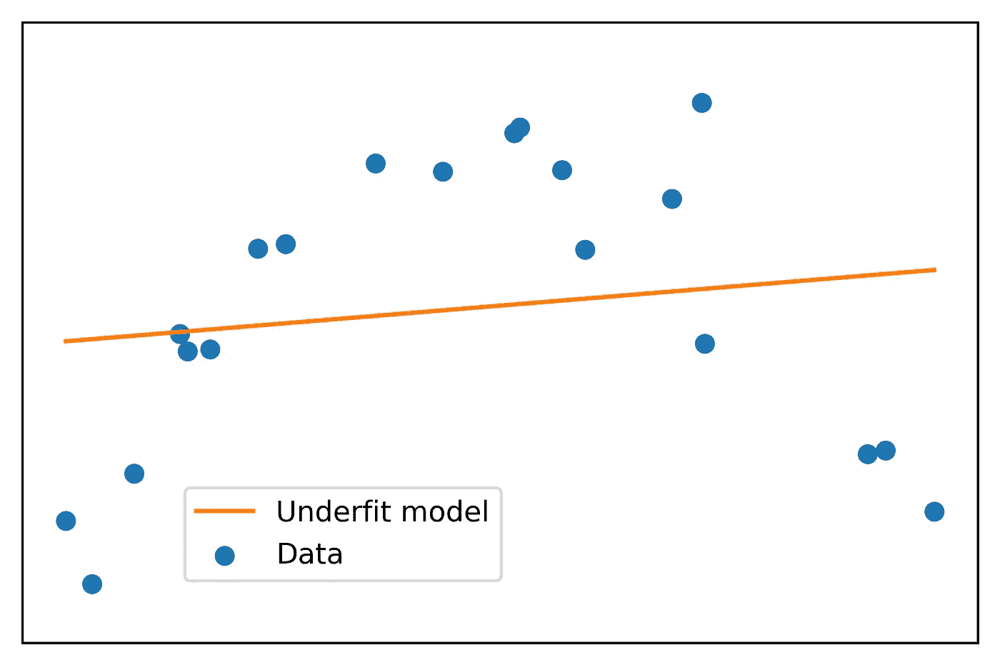
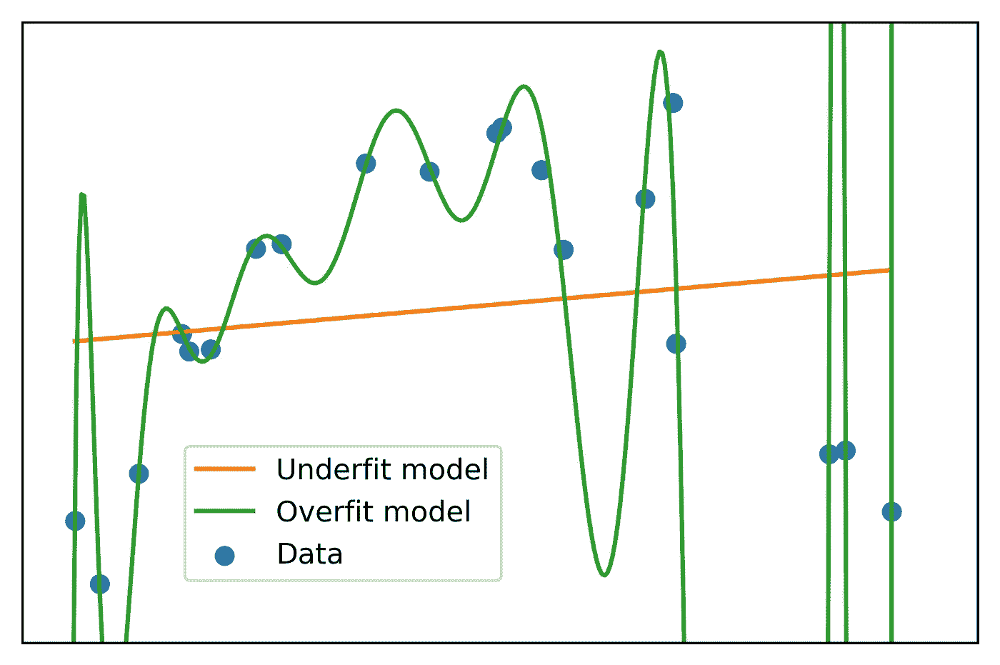
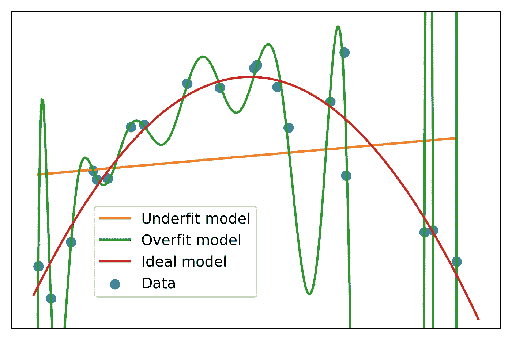
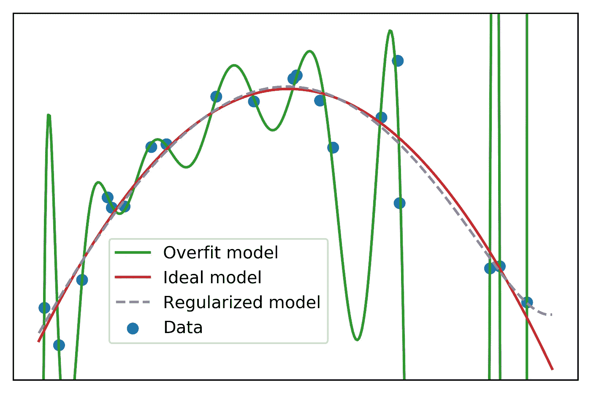

# 过度拟合、欠拟合和偏差-方差权衡

> 原文：<https://towardsdatascience.com/overfitting-underfitting-and-the-bias-variance-tradeoff-83b42fb11efb?source=collection_archive---------11----------------------->

## 通过 Python、numpy 和 scikit-learn 中的一个工作示例来学习这些基本的机器学习概念



Image by [The Strategy Guy](http://thestrategyguysite.com/strategic-business-planning/does-your-strategic-plan-fit-you/)

过拟合、欠拟合和偏差-方差权衡是机器学习中的基本概念。如果用于拟合模型的训练数据的性能明显好于模型训练过程中测试集的性能，则模型是**过拟合**。例如，训练数据的预测误差可能明显小于测试数据的预测误差。比较这两个数据集之间的模型性能指标是为了训练和测试而拆分数据的主要原因之一。通过这种方式，可以评估模型对新的、未知数据的预测能力。

当一个模型过度拟合训练数据时，它被称为具有**高方差**。考虑这一点的一种方式是，无论训练数据中存在什么样的可变性，模型都已经很好地“学习”了这一点。事实上，太好了。具有高方差的模型很可能已经学习了训练集中的噪声。噪声由数据特征(自变量)和响应(因变量)中的随机波动或偏离真实值组成。噪声会模糊特征和响应变量之间的真实关系。几乎所有真实世界的数据都是有噪声的。

如果在训练集中有随机噪声，那么在测试集中也可能有随机噪声。但是随机波动的具体值会和训练集的不同，因为毕竟噪声是随机的。该模型无法预测测试集的新的、看不见的数据的波动。这就是过度拟合模型的测试性能低于训练性能的原因。

在下列情况下，过度拟合的可能性更大:

*   相对于样本(观察)的数量，有大量的特征可用。特征越多，发现特征和响应之间虚假关系的机会就越大。
*   使用复杂的模型，例如深度决策树或神经网络。像这样的模型有效地设计了它们自己的特征，并且有机会开发关于特征和响应之间关系的更复杂的假设，使得过度拟合更有可能。

在光谱的另一端，如果模型没有很好地拟合训练数据，这被称为**欠拟合**，并且该模型被称为具有**高偏差**。在这种情况下，就所使用的模型的特征或类型而言，模型可能不够复杂。

让我们通过将多项式模型拟合到 Python 中的合成数据，来检查欠拟合、过拟合以及介于两者之间的理想状态的具体示例。下面的代码可以在 Jupyter 笔记本中运行，以生成此处显示的结果和图表。

```
*#Import packages* import numpy **as** np *#numerical computation* import matplotlib.pyplot **as** plt *#plotting package
#Next line helps with rendering plots* **%**matplotlib inline
import matplotlib **as** mpl *#additional plotting functionality*
```

# 多项式模型的欠拟合和过拟合

首先，我们创建合成数据。我们:

*   在区间[0，11]上随机选择 20 个点。这包括 0，但不包括 11。我们还对它们进行排序，使它们按顺序排列，这将有助于您创建一个线图(这里我们只做一个散点图)。
*   对它们进行二次变换，并添加一些噪声:*y*=(-*x*+2)(*x*-9)+ϵ，其中ϵ是均值为 0、标准差为 3 的正态分布噪声

然后我们做一个数据散点图。

```
np**.**random**.**seed(seed**=**9)
n_points **=** 20
x **=** np**.**random**.**uniform(0, 11, n_points)
x **=** np**.**sort(x)
y **=** (**-**x**+**2) ***** (x**-**9) **+** np**.**random**.**normal(0, 3, n_points)mpl**.**rcParams['figure.dpi'] **=** 400
plt**.**scatter(x, y)
plt**.**xticks([])
plt**.**yticks([])
plt**.**ylim([**-**20, 20])
```



这看起来像抛物线的形状，正如对 *x* 的二次变换所预期的那样。然而，我们可以看到，事实上并不是所有的点都完美地位于抛物线上。

在我们的合成示例中，我们知道**数据生成过程**:响应变量 *y* 是特征 *x* 的二次变换。一般来说，在建立机器学习模型时，数据生成过程是未知的。取而代之的是，提出几个候选特征，提出一个模型，并探索这些特征和这个模型如何解释数据。

在这种情况下，我们可能会绘制数据，观察明显的二次关系，并使用二次模型。然而，为了说明**欠拟合模型**，这些数据的线性模型看起来像什么？

我们可以用 numpy 的`polyfit`拟合一个 1 次多项式模型，换句话说，一个线性模型:

```
lin_fit **=** np**.**polyfit(x, y, 1)
lin_fit>>array([ 0.44464616, -0.61869372])
```

这就产生了这些数据的最佳拟合线的斜率和截距。我们把它画出来，看看它是什么样子。我们可以使用拟合线性模型得到的斜率和截距来计算要素的线性变换，再次使用 numpy，这次是使用`polyval`函数。我们称之为“欠拟合模型”。

```
cmap **=** mpl**.**cm**.**get_cmap('tab10')plt**.**scatter(x, y, label**=**'Data', color**=**cmap(0))
plt**.**plot(x, np**.**polyval(lin_fit, x), label**=**'Underfit model', color**=**cmap(1))plt**.**legend(loc**=**[0.17, 0.1])
plt**.**xticks([])
plt**.**yticks([])
plt**.**ylim([**-**20, 20])
```



看起来不太合适，不是吗！

现在让我们想象我们有许多可用的特性，那就是 *x* 的多项式变换，具体来说就是 *x* 、 *x* 、… *x* ⁵.相对于我们拥有的样本数量(20)，这将是大量的特征。同样，在“现实生活”中，我们可能不会考虑具有所有这些特征的模型，因为通过观察我们可以看到，二次模型或二次多项式可能就足够了。然而，确定理想的特征并不总是那么简单。我们的示例用来展示当我们非常清楚地使用太多特性时会发生什么。

让我们做一个 15 次多项式拟合:

```
high_poly_fit **=** np**.**polyfit(x, y, 15)
high_poly_fit>>array([ 1.04191511e-05, -7.58239114e-04,  2.48264043e-02, -4.83550912e-01,
        6.24182399e+00, -5.63097621e+01,  3.64815913e+02, -1.71732868e+03,
        5.87515347e+03, -1.44598953e+04,  2.50562989e+04, -2.94672314e+04,
        2.21483755e+04, -9.60766525e+03,  1.99634019e+03, -1.43201982e+02])
```

这些是这个模型中从 1 到 15 的所有幂的系数，以及截距。请注意系数的标度差异很大:一些接近于零，而另一些则相当大(绝对值)。让我们也画出这个模型。首先，我们在我们的 *x* 值范围内生成大量均匀分布的点，这样我们不仅可以看到用于模型训练的特定值的模型，还可以看到中间值的模型。

```
plt**.**scatter(x, y, label**=**'Data', color**=**cmap(0))
plt**.**plot(x, np**.**polyval(lin_fit, x), label**=**'Underfit model', color**=**cmap(1))curve_x **=** np**.**linspace(0,11,333)plt**.**plot(curve_x, np**.**polyval(high_poly_fit, curve_x),
         label**=**'Overfit model', color**=**cmap(2))plt**.**legend(loc**=**[0.17, 0.1])
plt**.**xticks([])
plt**.**yticks([])
plt**.**ylim([**-**20, 20])
```



这是一个经典的过度拟合案例。过度拟合模型几乎完美地通过了所有的训练数据。然而，很容易看出，对于介于两者之间的值，过拟合模型看起来不像是数据生成过程的真实表示。相反，过拟合模型已经适应了训练数据的噪声。这符合上面给出的高方差的定义。

在最后一张图中，您可以看到高方差的另一种定义:输入 *x* 的小变化会导致输出 *y* 的大变化。输入和输出变化之间的这种关系是人们谈论机器学习模型差异的另一种方式。

您还可以想象，如果我们使用相同的二次函数*y*=(*x*+2)(*x*-9)生成一个新的、更大的合成数据集，但是根据我们上面使用的相同分布添加新的随机生成的噪声，然后随机采样 20 个点并拟合高次多项式，则最终的模型看起来会有很大不同。它将几乎完美地通过这些新的噪声点，并且 15 次多项式的系数将非常不同，从而允许这种情况发生。对 20 个点的不同样本重复这一过程，将继续导致高度可变的系数估计。换句话说，用于模型训练的数据样本之间的系数会有很大的差异。这是高方差模型的另一种定义。

使用我们的合成数据，因为在这种情况下我们知道数据生成过程，我们可以看到二次多项式拟合与欠拟合和过拟合模型相比看起来如何。

```
plt**.**scatter(x, y, label**=**'Data', color**=**cmap(0))
plt**.**plot(x, np**.**polyval(lin_fit, x), label**=**'Underfit model', color**=**cmap(1))
plt**.**plot(curve_x, np**.**polyval(high_poly_fit, curve_x),
         label**=**'Overfit model', color**=**cmap(2))plt**.**plot(curve_x, np**.**polyval(np**.**polyfit(x, y, 2), curve_x),
         label**=**'Ideal model', color**=**cmap(3))plt**.**legend(loc**=**[0.17, 0.1])
plt**.**xticks([])
plt**.**yticks([])
plt**.**ylim([**-**20, 20])
```



这还差不多。但是，在现实世界中，当我们不使用虚构的数据，并且不知道数据生成过程时，我们该怎么办呢？有许多机器学习技术来处理过度拟合。其中最受欢迎的是正规化。

# 岭回归正则化

为了展示正则化如何减少过度拟合，我们将使用 scikit-learn 包。首先，我们需要手动创建多项式要素。虽然上面我们只需告诉 numpy 对数据拟合 15 次多项式，但这里我们需要手动创建特征 *x* 、 *x* 、… *x* ⁵，然后拟合线性模型以找到它们的系数。Scikit-learn 使使用`PolynomialFeatures`创建多项式特征变得容易。我们只是说，我们想要 15 度的多项式特性，没有偏差特性(截距)，然后通过我们的数组整形为一列。

```
from sklearn.preprocessing import PolynomialFeatures
poly **=** PolynomialFeatures(degree**=**15, include_bias**=**False)
poly_features **=** poly**.**fit_transform(x**.**reshape(**-**1, 1))
poly_features**.**shape>>(20, 15)
```

我们得到 15 列，其中第一列是 *x* ，第二列是 *x* 等等。现在我们需要确定这些多项式特征的系数。上面，我们通过使用 numpy 来找到为训练数据提供最佳拟合的系数。然而，我们看到这导致了过度拟合模型。这里，我们将把这些数据传递给用于**岭回归**的例程，这是一种**正则化回归**。这里不详细介绍，正则化回归的工作原理是找到最适合数据*的系数，同时限制系数的大小*。

这样做的效果是对数据的拟合稍差，换句话说，模型具有更高的偏差。但是，目标是避免拟合随机噪声，从而消除高方差问题。因此，我们希望用一些方差换取一些偏差，以获得信号而非噪声的模型。

我们将使用 scikit-learn 中的`Ridge`类来进行岭回归。

```
from sklearn.linear_model import Ridgeridge **=** Ridge(alpha**=**0.001, fit_intercept**=**True, normalize**=**True,
                        copy_X**=**True, max_iter**=**None, tol**=**0.001,
                        random_state**=**1)
```

在实例化`Ridge`类时，有许多选项需要设置。很重要的一个就是`alpha`。这控制了应用正则化的程度；换句话说，系数幅度受到多大程度的惩罚，并保持接近于零。我们将使用我已经找到的`alpha`的值，只是为了说明正则化的效果。一般来说，选择`alpha`的程序是通过检查验证集的模型性能或使用交叉验证程序来系统地评估一系列值，以确定哪一个值有望在未知测试集上提供最佳性能。`alpha`是一个模型**超参数**，这将是超参数**调整**的过程。

我们为`Ridge`指定的其他选项表明我们想要拟合截距(因为我们在生成`PolynomialFeatures`时没有包括截距)，在模型拟合之前将特征归一化到相同的比例，这是必要的，因为系数将以相同的方式受到惩罚，以及其他一些选项。我在这里掩饰这些细节，尽管你可以参考 scikit-learn 文档，以及我的[书](https://www.amazon.com/Data-Science-Projects-Python-scikit-learn/dp/1838551026)，以获得关于正则化以及超参数调整的更多信息。

现在，我们继续使用多项式特征和响应变量来拟合岭回归。

```
ridge**.**fit(poly_features, y)>>Ridge(alpha=0.001, copy_X=True, fit_intercept=True, max_iter=None,
   normalize=True, random_state=1, solver='auto', tol=0.001)
```

与上面通过用 numpy 拟合多项式得到的值相比，拟合系数的值看起来像什么？

```
ridge**.**coef_>>array([ 8.98768521e+00, -5.14275445e-01, -3.95480123e-02, -1.10685070e-03,
        4.49790120e-05,  8.58383048e-06,  6.74724995e-07,  3.02757058e-08,
       -3.81325130e-10, -2.54650509e-10, -3.25677313e-11, -2.66208560e-12,
       -1.05898398e-13,  1.22711353e-14,  3.90035611e-15])
```

我们可以看到，与多项式拟合相比，正则化回归的系数值相对较小。这就是正则化的工作方式:将系数值“缩小”到零。由于这个原因，正则化也可以被称为**收缩**。

让我们在上面使用的大量均匀分布的点`curve_x`上获得预测值`y_pred`，用于绘图。首先，我们需要为所有这些点生成多项式特征。

```
poly_features_curve **=** poly**.**fit_transform(curve_x**.**reshape(**-**1, 1))
y_pred **=** ridge**.**predict(poly_features_curve)
```

我们将从图中移除欠拟合模型，并添加正则化模型。

```
plt**.**scatter(x, y, label**=**'Data', color**=**cmap(0))
plt**.**plot(curve_x, np**.**polyval(high_poly_fit, curve_x),
         label**=**'Overfit model', color**=**cmap(2))
plt**.**plot(curve_x, np**.**polyval(np**.**polyfit(x, y, 2), curve_x),
         label**=**'Ideal model', color**=**cmap(3))plt**.**plot(curve_x, y_pred,
         label**=**'Regularized model',color**=**cmap(4), linestyle**=**'--')plt**.**legend(loc**=**[0.17, 0.1])
plt**.**xticks([])
plt**.**yticks([])
plt**.**ylim([**-**20, 20])
```



正则化模型看起来类似于理想模型。这表明，即使我们不知道数据生成过程，正如我们在现实世界的预测建模工作中通常不知道的那样，当大量候选特征可用时，我们仍然可以使用正则化来减少过度拟合的影响。

但是，请注意，正则化模型不应用于外推。我们可以看到，正则化模型开始向图的右侧增加。应该怀疑这种增加，因为在训练数据中没有任何东西表明这是可以预期的。这是一个普遍观点的例子，即不推荐在训练数据范围之外外推模型预测。

# 正则化对模型测试性能的影响

用方差换取偏差的目标是提高模型在未知测试数据上的性能。让我们以生成训练数据的相同方式生成一些测试数据，看看我们是否达到了这个目标。我们重复上面用于生成 *x* 和*y*=(*x*+2)(*x*−9)+ϵ的过程，但是使用不同的随机种子。这导致相同间隔上的不同点 *x* 和来自相同分布的不同随机噪声ϵ，为响应变量 *y* 创建新值，但是来自相同的数据生成过程。

```
np**.**random**.**seed(seed**=**4)
n_points **=** 20
x_test **=** np**.**random**.**uniform(0, 11, n_points)
x_test **=** np**.**sort(x_test)
y_test **=** (**-**x_test**+**2) ***** (x_test**-**9) **+** np**.**random**.**normal(0, 3, n_points)
```

我们还将定义一个 lambda 函数，以均方根误差(RMSE)来衡量预测误差。

```
RMSE **=** **lambda** y, y_pred: np**.**sqrt(np**.**mean((y**-**y_pred)******2))
```

我们的第一个模型(拟合训练数据的多项式)的 RMSE 是什么？

```
y_train_pred **=** np**.**polyval(high_poly_fit, x)
RMSE(y, y_train_pred)>>1.858235982416223
```

新生成的测试数据的 RMSE 如何？

```
y_test_pred **=** np**.**polyval(high_poly_fit, x_test)
RMSE(y_test, y_test_pred)>>9811.219078261804
```

测试误差远大于该模型的训练误差，这是过度拟合的明显迹象。正则化模型比较怎么样？

```
y_train_pred **=** ridge**.**predict(poly_features)
RMSE(y, y_train_pred)>>3.235497045896461poly_features_test **=** poly**.**fit_transform(x_test**.**reshape(**-**1, 1))
y_test_pred **=** ridge**.**predict(poly_features_test)
RMSE(y_test, y_test_pred)>>3.5175193708774946
```

虽然正则化模型比多项式拟合具有稍高的训练误差(较高的偏差)，但是测试误差得到了极大的改善。这显示了如何利用偏差-方差权衡来提高模型预测能力。

# 结论

这篇文章通过 Python 和 scikit-learn 中的一个示例说明了过拟合、欠拟合和偏差-方差权衡的概念。它扩展了我的书*使用 Python 的数据科学项目:使用 Python、pandas 和 scikit-learn 的成功数据科学项目的案例研究方法*中的一个部分。要更深入地解释正则化如何工作，如何使用交叉验证进行超参数选择，以及这些和其他机器学习技术的实践，请查看这本书，您可以在[亚马逊](https://www.amazon.com/Data-Science-Projects-Python-valuable/dp/1838551026/)上找到，这里有 Q & A 和勘误表。

这里是关于偏差和方差的一些最终想法。

**偏差和方差的统计定义**:这篇文章关注了偏差和方差的直观机器学习定义。还有更正式的统计定义。参见[本文档](https://ocw.mit.edu/courses/sloan-school-of-management/15-097-prediction-machine-learning-and-statistics-spring-2012/lecture-notes/MIT15_097S12_lec04.pdf)中对方差分解偏差的数学表达式的推导，以及[Hastie 等人的统计学习要素](https://web.stanford.edu/~hastie/ElemStatLearn/)中关于偏差-方差分解和权衡的更多讨论。

**用更多数据应对高方差**:在他的 Coursera 课程[机器学习](https://www.coursera.org/learn/machine-learning/lecture/XcNcz/data-for-machine-learning)中，吴恩达指出，根据大数据基本原理，在一个非常大的数据集上进行训练可以是一种有效的方法来对抗过度拟合。这个想法是，有了足够的训练数据，训练和测试误差之间的差异应该很小，这意味着方差减少。这种基本原理有一个潜在的假设，即特征包含足够的信息来对响应变量进行准确的预测。否则，模型将遭受高偏差(高训练误差)，因此低方差将是一个有争议的问题。

**一点点过度拟合可能不是问题**:测试集上的模型性能通常比训练集上的稍低。我们在上面的正则化模型中看到了这一点。从技术上讲，这里至少有一点过度拟合。然而，这并不重要，因为最好的模型通常被认为是测试分数最高的模型。

*原载于 2019 年 5 月 19 日*[*https://www.steveklosterman.com*](https://www.steveklosterman.com/over-under/)*。*