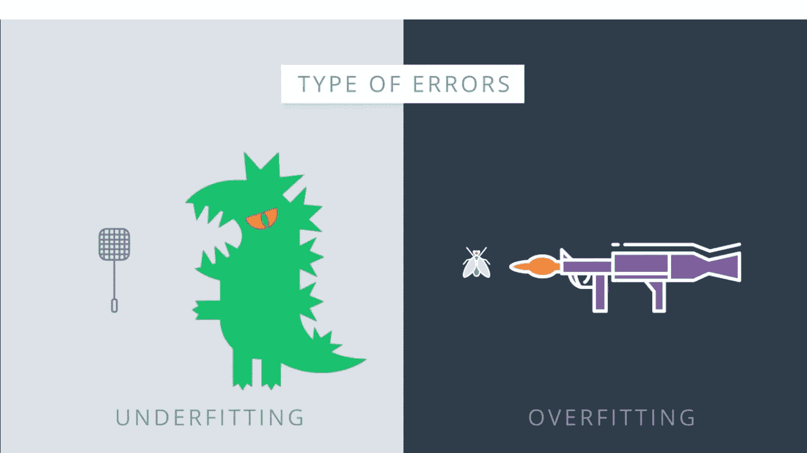
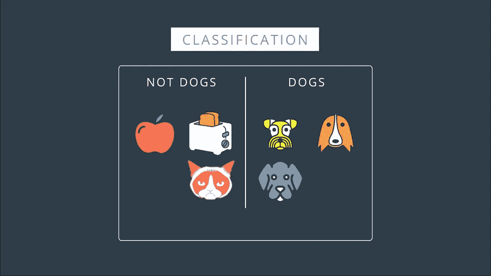
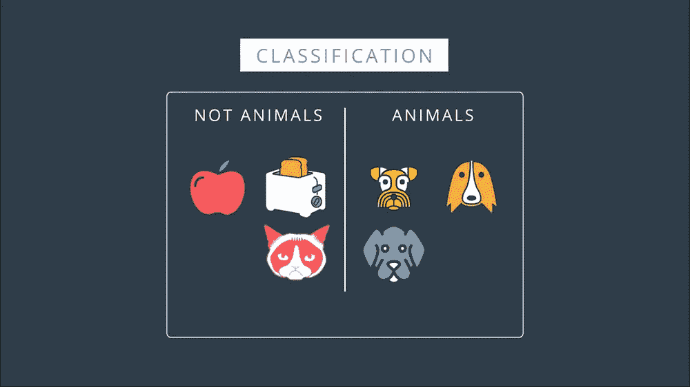
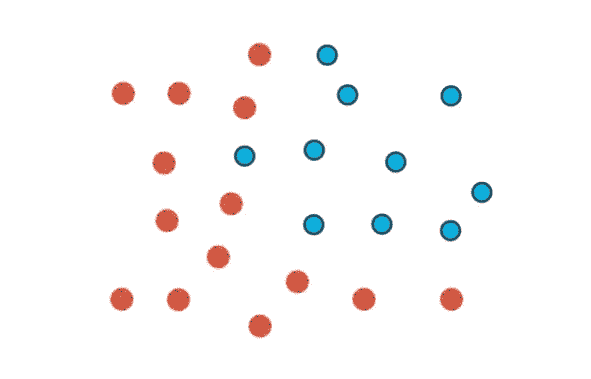
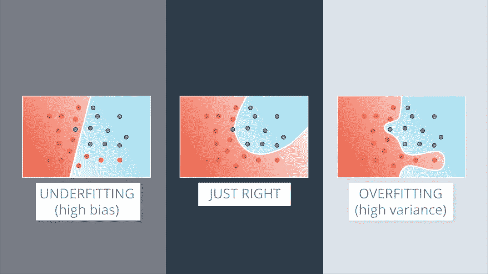
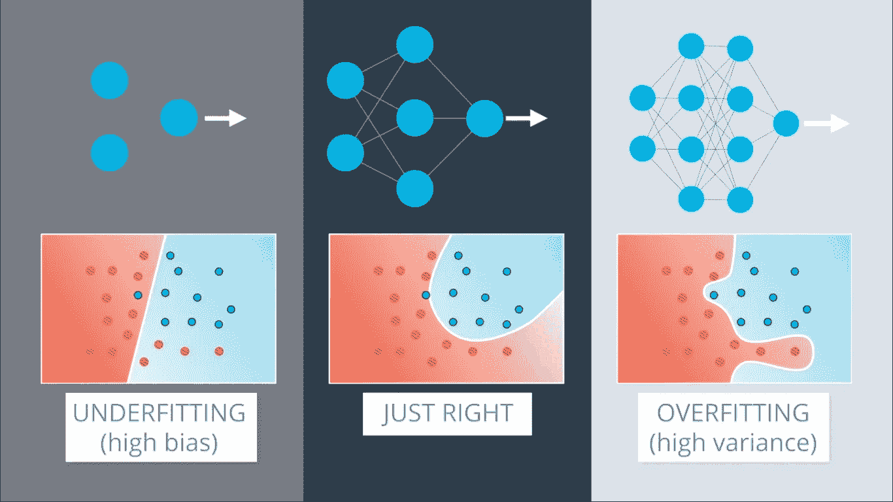
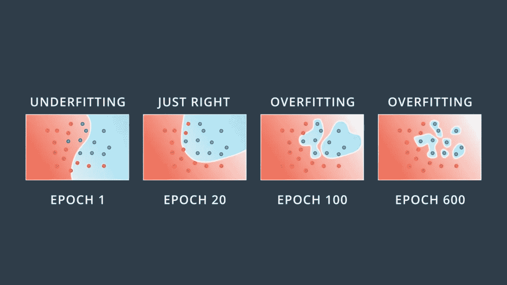
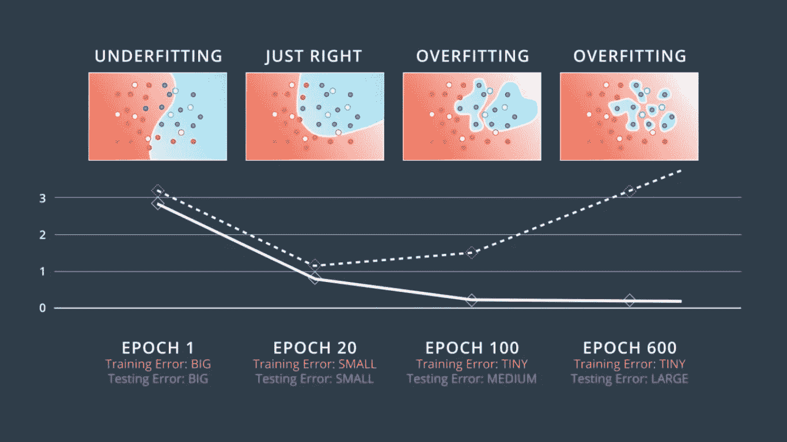
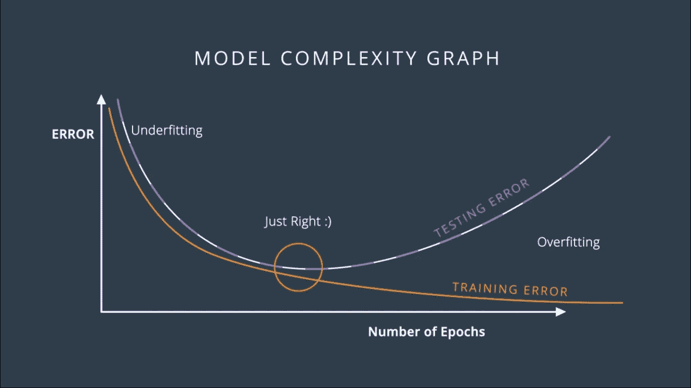

# 神经网络中的过拟合与欠拟合以及错误率与复杂性图的比较

> 原文：<https://towardsdatascience.com/overfitting-vs-underfitting-ddc80c2fc00d?source=collection_archive---------7----------------------->

## **机器学习，Inside AI，深度学习**

## 理解过度拟合和欠拟合的例子和解决方案，以防止它使用早期停止！

> ！！！克服过度拟合和欠拟合的头痛

在生活中，一个人会犯两种错误。一种是尝试用苍蝇拍杀死哥斯拉。另一个是试图用火箭筒打死一只苍蝇。想用苍蝇拍打死哥斯拉有什么问题？我们把问题过于简单化了。我们正在尝试一个过于简单的解决方案，但行不通。在机器学习中，这叫做 ***欠拟合*** 。

Godzilla with Flyswatter (Underfitting) or Fly with Bazooka (Overfitting)

用火箭筒打死一只苍蝇有什么问题？它过于复杂，当我们可以使用更简单的解决方案时，它会导致糟糕的解决方案和额外的复杂性。在机器学习中，这叫做 ***过拟合*** 。

让我们看看过度拟合和欠拟合在分类问题中是如何发生的。假设我们有以下数据，我们需要对其进行分类。那么，在这里，什么规则会起作用呢？看起来是个简单的问题，对吗？

Dogs vs Not Dogs (Underfitting) — Very Common

右边的是狗，而左边的不是狗。现在，如果我们使用下面的规则呢？我们说右边的是动物，左边的绝不是动物。这个解决方案不太好，对吧？有什么问题？太简单了。它甚至没有得到完整的数据集。看到了吗？它把这只猫分类错了，因为猫是一种动物。这是不合适的。这就像试图用苍蝇拍杀死哥斯拉。有时，我们称之为 ***偏差引起的误差*** 。

Dog specified with Color — Very Specific (Overfitting)

那么，下面的规则呢？我们说右边的是黄色、橙色或灰色的狗，左边的是除了黄色、橙色或灰色以外的任何颜色的狗。从技术上讲，这是正确的，因为它正确地对数据进行了分类。有一种感觉是，我们说得太具体了，因为只说狗而不说狗就已经完成了工作。但是这个问题比较概念化吧？这里怎么能看出问题呢？一种方法是引入一个测试集。如果我们的测试集是这条狗，那么我们会想象一个好的分类器会把它和其他狗放在右边。但是这个分类器会把它放在左边，因为狗不是黄色、橙色或灰色的。所以，正如我们所说，这里的问题是分类器太具体了。它能很好地拟合数据，但不能一概而论。这太合身了。这就像试图用火箭筒打死一只苍蝇。有时，我们会将过度拟合称为由于方差 导致的 ***误差。***

我喜欢描绘欠适应和过适应的方式是在准备考试的时候。吃不饱，就像学习不够，不及格。好的模式就像学习好，考试好。过度配合就像我们不去学习，而是一个字一个字地背整本教材。我们也许能背诵课本上的任何问题，但我们不能正确地概括和回答考试中的问题。

Data | Red — Negative and Blue — Positive

但是现在，让我们看看这在神经网络中会是什么样子。让我们假设这个数据，同样，蓝色的点标记为正，红色的点标记为负。

Comparison of Underfitting graph vs Perfect Graph vs Overfitting Graph

这里，我们有三只小熊。在中间，我们有一个很好的模型，它很好地拟合了数据。在左边，我们有一个模型，因为它太简单了。它试图用直线拟合数据，但数据比直线更复杂。在右边，我们有一个过度拟合的模型，因为它试图用过于复杂的曲线来拟合数据。请注意，右边的模型与数据非常吻合，因为它不会出错，而中间的模型会出错。但是我们可以看到中间的模型大概会概括的更好。中间的模型将这一点视为噪声，而右边的模型被它弄糊涂了，试图把它喂得太好。

Comparison in terms of Neural Network Architecture

现在中间的模型可能会是一个神经网络，它的架构有点复杂，就像这个一样。左边的这个可能是一个过于简单的架构。例如，由于模型是线性的，因此整个神经网络只有一个指导器。右边的模型可能是一个高度复杂的神经网络，其层数和权重超过了我们的需要。现在有个坏消息。为神经网络找到合适的架构真的很难。我们总是会以像左边这样过于简单的架构或者像右边这样过于复杂的架构结束。

Kids Problem while purchasing Pants 🤣🤣🤣

现在的问题是，我们该怎么办？这就像试着穿上一条裤子。如果我们找不到我们的尺寸，我们是买大一点的裤子还是小一点的裤子？好吧，看起来穿稍微大一点的裤子，然后试着买一条腰带或者其他能让裤子更合身的东西，也没那么糟糕，这就是我们要做的。我们会在过于复杂的模型上犯错误，然后我们会应用某些技术来防止过度拟合。

Training with Different Epoch

那么，让我们从上次停止的地方开始，也就是说，我们有一个复杂的网络体系结构，它可能比我们需要的更复杂，但我们需要接受它。那么，我们来看看训练的过程。我们从她第一个时期的随机权重开始，我们得到了这样一个模型，它犯了很多错误。

现在，当我们训练时，假设 20 个时代，我们得到了一个相当好的模型。但是，假设我们继续进行 100 个纪元，我们会得到更好地符合数据的东西，但是我们可以看到这开始过度拟合。如果我们追求更多，比如说 600 个时代，那么这个模型就非常不合适了。

我们可以看到蓝色区域几乎是围绕着蓝色点的一堆圆圈。这非常符合训练数据，但它会可怕地泛化。想象在蓝色区域有一个新的蓝点。这个点最有可能被归类为红色，除非它非常接近蓝色点。

Error Comparision

所以，让我们试着通过添加一个测试集来评估这些模型，比如这些点。让我们画出每个时期的训练集和测试集中的误差图。对于第一个时期，由于模型是完全随机的，因此它严重地错误分类了训练集和测试集。因此，训练误差和测试误差都很大。

我们可以把它们画在这里。对于 20 epoch，我们有一个更好的模型，它非常适合训练数据，并且在测试集中表现也很好。因此，这两个误差都相对较小，我们将把它们画在这里。

对于 100 纪元，我们看到我们开始过度适应。该模型与数据非常吻合，但它开始在测试数据中出错。我们意识到训练误差在不断减小，但是测试误差开始增加，所以我们把它们画在这里。

现在，对于 600 年代来说，我们严重过剩。我们可以看到，训练误差非常小，因为数据非常适合训练集，但模型在测试数据中犯了大量错误。因此，测试误差很大。我们把它们画在这里。

现在，我们绘制连接训练和测试误差的曲线。因此，在这个图中，很明显，当我们停止欠拟合并开始过拟合时，训练曲线总是在下降，因为随着我们训练模型，我们对训练数据的拟合越来越好。由于模型不精确，在欠拟合时测试误差较大。然后它随着模型的推广而减少，直到它到达一个 ***最小点——金发女孩点*** 。最后，一旦我们通过了那个点，模型又开始过度拟合，因为它停止概括，而只是开始记忆训练数据。这个图叫做模型 ***复杂度图*** 。

Model Complexity Graph

在 Y 轴上，我们可以测量误差，在 X 轴上，我们可以测量模型的复杂性。在这种情况下，它是历元的数量。正如你所看到的，在左边我们有很高的测试和训练误差，所以我们不适合。在右边，我们有一个高测试误差和低训练误差，所以我们过度拟合。在中间的某个地方，我们有我们的快乐金发点。所以，这决定了我们将要使用的历元数。

总之，我们要做的是，下降，直到测试误差停止下降并开始增加。那一刻，我们停下来。这种算法被称为 ***提前停止*** ，被广泛用于训练神经网络。

参考资料:

[1] Udacity 深度学习课程—过度适应与欠适应视频

[2] Udacity 深度学习课程——提前停止视频

请访问我的网站:【http://www.khushpatel.com】