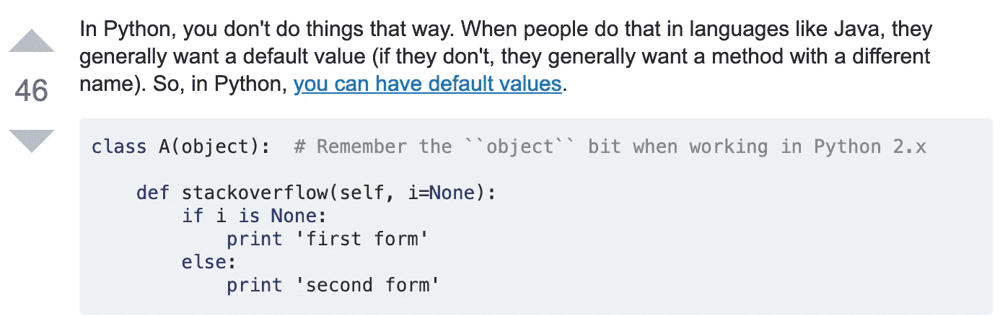

# Python 中的重载运算符

> 原文：<https://towardsdatascience.com/overloading-operators-in-python-2e24da0d36d7?source=collection_archive---------20----------------------->

**…还有一点关于一般的超载(但我会尽量不超载你)**

在学习 Python 编程的过程中，我们大多数人都在相对较早的时候遇到了运算符重载背后的概念。但是，像 Python(和其他语言)的大多数方面一样；就这一点而言，几乎是任何事情)，学习重载操作符必然与其他概念联系在一起，这既扩大了主题的范围，又在某种程度上混淆了我们个人学习曲线的路线。考虑到这一点，我将尽量不扯入太多学习 Python 的其他领域——然而，一些面向对象编程很自然地与之相关；虽然我想把重点放在重载*操作符*上，但是重载*函数*这个更广泛、更复杂的话题至少也值得一提。

在编程的上下文中，重载指的是**函数**或**操作符**根据传递给函数的参数或操作符作用的操作数以不同方式**运行的能力。在 Python 中，*操作符*重载(也称为“操作符特别多态性”)尤其是一种“语法糖”形式，它能够以强大而方便的方式将操作符的操作指定为特定类型的中缀表达式。换句话说，操作符重载**赋予操作符超出其预定义操作含义的扩展含义。****

Operator Overload examples for + and *

Python 中经典的运算符重载示例是加号，它是一个二元(即两个操作数)运算符，不仅将一对数字相加，还将一对列表或字符串连接起来。星号同样被重载，不仅作为数字的乘数，还作为列表或字符串的重复操作符。比较运算符(如>、==或！=)表现出类似的行为；然而，对于所有这些重载操作符，我们作为 Python 用户在考虑类型检查时应该稍微小心一些。正如麻省理工学院的 John Guttag 教授提醒我们的那样，“Python 中的类型检查不如其他一些编程语言(如 Java)中的强，但在 Python 3 中比在 Python 2 中要好。例如，什么是< should mean when it is used to compare two strings or two numbers. But what should the value of *‘4’<3*就很清楚了？Python 2 *的设计者相当武断地决定它应该是 False，因为所有数值都应该小于 str 类型的所有值。*Python 3 和大多数其他现代语言的设计者认为，既然这样的表达式没有明显的意义，它们应该生成一条错误消息。”[2]

这很好，但是如果一个操作符作为操作数用于一个或多个用户定义的数据类型(例如，来自一个创建的类),该怎么办呢？在这种情况下——比方说，试图添加一对(x，y)坐标，如此处所示——编译器将抛出一个错误，因为它不知道如何添加这两个对象。而且，虽然重载**只能在 Python 中现有的操作符上完成，但是**有一些操作符，以及每个操作符调用的相应的魔法方法；使用这些相应的方法，我们可以创建/访问/编辑它们的内部工作方式(见文章末尾)。

就像这个快速发展的领域中的其他术语一样，对于如何称呼它们似乎没有达成共识——它们通常被称为“魔法方法”——之所以称为“魔法”，是因为它们没有被直接调用——这似乎是最接近标准的，也许是因为替代的“特殊方法”听起来，嗯，不是那么特殊。有些人预示着一个更有趣的名字——“dunder methods”，作为“双下划线方法”(即“dunder-init-dunder”)的简写。总之，它们是一种特殊类型的方法，并且**不**只限于与操作符相关联的方法(例如 *__init__()* 或 *__call__()* )。其实有[不少。](https://docs.python.org/3/reference/datamodel.html#special-method-names)

随便说个题外话——*印刷*有自己关联的魔法， *__str__()* 。如果我们只使用一个 *__init__()* 来打印普通的 Point 类，我们将得到上面所示的不太用户友好的输出。

将 *__str__()* 方法添加到 Point 类中可以解决这个问题。有趣的是， *format()* 也调用了与 *print()* 相同的 *__str__()* 方法。

A simple * overloading example using our cohort’s nickname (3x like the Thundercats, Schnarf Schnarf)

事实证明，在学习 Python 时，使用(x，y)坐标遍历重载、方法和其他 Python 概念的例子是一种常见的实践，可能是因为我们可以用像坐标点这样数学上熟悉的东西来创建自己的类。由此，可以为用户定义的类创建许多有用的神奇方法，并使用它们来重载运算符。

运算符重载的一个值得注意的方面是每个操作数相对于其运算符的*位置。以小于操作符<为例——它为第一个(或左/前)操作数调用 *__lt__()* 方法。换句话说，**这个表达 *x < y* 是 *x.__lt__(y)*** 的简写；如果第一个操作数是用户定义的类，它需要有自己对应的 *__lt__()* 方法，才能使用<。这看起来可能有点麻烦，但实际上它为设计一个类增加了一些便利的灵活性，因为我们可以定制任何操作符的函数为一个类做什么。“除了为编写使用<的中缀表达式提供语法上的便利，”Guttag 教授指出，“这种重载提供了对使用 *__lt__()* 定义的任何多态方法的自动访问。**内置方法 sort 就是这样一种方法。**【②】*

鉴于第一个和第二个操作数的这种区别，Python 还为我们提供了一组*反向*方法，比如 *__radd__()、__rsub__()、__rmul__()* 等等。请记住，只有当左操作数不支持相应的操作*和*时，才会调用这些反向方法。操作数属于不同的类型。一个叫 Rhomboid 的 Pythonista redditor 解释得比我更好，所以我谦恭地遵从他的观点:

> ***有人能给我简单解释一下 __radd__ 吗？我看了文档，我不理解它。***

h/t to Rhomboid for the elucidating explanation

not like this.

like this.

最后一个警告——虽然我们拥有这种灵活性很棒，但我们应该记住操作者的初衷。比如 len()一般理解为用来返回一个序列的长度；所以重载这个方法需要返回一个整数(否则会返回一个 TypeError)。

…现在让我们来短暂地探索一下超载*功能*的更广阔、更汹涌的水域。根据维基百科，这属于“用不同的实现创建多个同名函数的能力。”函数可能因其参数的 arity 或类型而有所不同。这个概念在其他语言(C++，Java)中更有用，但并不真正符合 Pythonic 的“做事方式”，正如 stackoverflow 上的一些人所指出的:

## 如何在 Python 中使用方法重载？

…在这个问题上还有一个有用的线索:

one more relevant question…

…and reply

显然，Python 以不同的方式处理这种情况。也就是说，阅读方法重载帮助我理解了一个重要的 Pythonic 概念:多态性。这被定义为对不同的底层形式利用相同的接口的能力，例如[数据类型](https://www.digitalocean.com/community/tutorials/understanding-data-types-in-python-3)或[类](https://www.digitalocean.com/community/tutorials/how-to-construct-classes-and-define-objects-in-python-3)。多态是 Python 中类的一个特征，因为它允许在许多类或子类中使用通常命名的方法，这进一步使函数能够使用属于*一个*类的对象，就像它使用属于*另一个*类的对象一样，完全不需要知道不同类之间的区别。[3] .这允许*鸭类型化，*动态类型化的一个特例，它使用多态性的特征(包括*后期绑定*和*动态分派*)来评估对象类型。

从这里开始，这一切都变成了单个对多个，静态对动态的分派，这超出了我目前的理解水平。所以我暂时先放一放。

来源:

[1][https://stack abuse . com/overloading-functions-and-operators-in-python/](https://stackabuse.com/overloading-functions-and-operators-in-python/)

[2]约翰·古塔格..使用 Python 的计算和编程介绍(麻省理工学院出版社)。麻省理工学院出版社。Kindle 版。

[3][https://www . digital ocean . com/community/tutorials/how-to-apply-polymorphism-to-classes-in-python-3](https://www.digitalocean.com/community/tutorials/how-to-apply-polymorphism-to-classes-in-python-3)

【4】*(标题图片)*[https://www . osgpaintball . com/event/operation-霸王-场景-彩弹/](https://www.osgpaintball.com/event/operation-overlord-scenario-paintball/)

[https://www . Reddit . com/r/learn python/comments/3c vgpi/can _ someone _ explain _ radd _ to _ me _ in _ simple _ terms _ I/](https://www.reddit.com/r/learnpython/comments/3cvgpi/can_someone_explain_radd_to_me_in_simple_terms_i/)

 [## python 类特殊方法或神奇方法列表——微型棱锥体

### python 类特殊方法或神奇方法的列表。神奇的功能允许我们覆盖或添加默认的…

micropyramid.com](https://micropyramid.com/blog/python-special-class-methods-or-magic-methods/)  [## Python 运算符重载

### Python 中什么是运算符重载？Python 运算符适用于内置类。但是同一个操作员表现…

www.programiz.com](https://www.programiz.com/python-programming/operator-overloading)  [## Python 教程:魔术方法

### 所谓的魔法方法与巫术无关。您已经在我们的前几章中看到了它们…

www.python-course.eu](https://www.python-course.eu/python3_magic_methods.php)  [## Python 中的重载函数和运算符

### 什么是超载？在编程的上下文中，重载指的是一个函数或一个操作符…

stackabuse.com](https://stackabuse.com/overloading-functions-and-operators-in-python/)  [## 运算符重载

### 在计算机程序设计中，操作符重载，有时称为操作符特别多态，是…

en.wikipedia.org](https://en.wikipedia.org/wiki/Operator_overloading)  [## Python 操作符重载和 Python 魔术方法

### 在本 Python 教程中，我们将讨论 Python 运算符重载，运算符重载的例子…

数据-天赋.培训](https://data-flair.training/blogs/python-operator-overloading/)  [## 自定义 Python 类中的运算符和函数重载——真正的 Python

### 您可能想知道同一个内置操作符或函数如何为不同的对象显示不同的行为…

realpython.com](https://realpython.com/operator-function-overloading/)  [## 如何在 Python 中使用方法重载？

### 我正在尝试用 Python 实现方法重载:class A:def stack overflow(self):print ' first method ' def…

stackoverflow.com](https://stackoverflow.com/questions/10202938/how-do-i-use-method-overloading-in-python)  [## Python 函数重载

### 我知道 Python 不支持方法重载，但是我遇到了一个问题，我似乎无法用…

stackoverflow.com](https://stackoverflow.com/questions/6434482/python-function-overloading)  [## Python 中的函数重载

### 最近在 Practo 的一次谈话中，我发现有些人抱怨说，我们没有……

medium.com](https://medium.com/practo-engineering/function-overloading-in-python-94a8b10d1e08) 

*免责声明:错误、曲解、滥用概念和想法都是我的，并且只属于我。*