# 【概述】:让集成学习变得简单

> 原文：<https://towardsdatascience.com/overview-ensemble-learning-made-simple-d4ac0d13cb96?source=collection_archive---------21----------------------->

[Source](https://www.xiaomitoday.com/ask-these-questions-before-buying-a-mobile-phone-as-a-gift/)

当你想购买一部手机的时候，你会直接走到商店然后在网上转然后挑选任何一部手机吗？最常见的做法是浏览互联网上的评论，比较不同的型号，规格，功能和价格。你可能会向你的同伴询问购买建议，并以结论结束。总的来说，你没有直接得出结论，而是考虑了其他来源的选择。

在本文中，我将向您介绍机器学习中的一种称为“集成学习”的技术，以及使用这种技术的算法。

## 内容列表

1.  ***多样的算法***
2.  ***不同实例上每个预测器的算法相同***
3.  ***相同的算法对不同的特性集&实例***
4.  ***升压***
5.  ***堆叠***

集成模型的思想是训练多个模型，每个模型的目标是预测或分类一组结果。

集成学习背后的主要原理是将弱学习者分组在一起以形成一个强学习者。

> 集成学习:集成是一组被训练并用于预测的预测器
> 
> **集成算法**:集成算法的目标是将几个基础估计器的预测与给定的学习算法结合起来，以提高单个估计器的鲁棒性

用训练数据的子集训练一组决策树。使用个别树的预测，预测得到最大值的类。一些投票。这样的决策树集合——**随机森林**。

集成学习方法通常区分如下

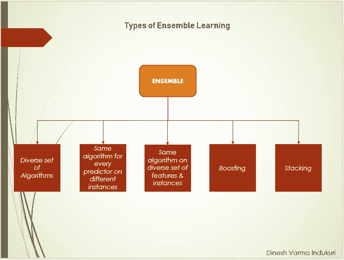

## **集成学习的类型**

a.)一套多样的 ***算法***

基于我们的目标(回归/分类),我们选择一组不同的模型，训练它们，汇总这些模型的结果并得出结论。这是使用投票分类器完成的。

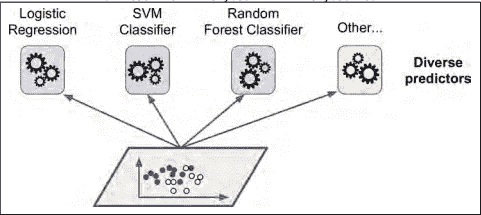

Source: Hands-on machine learning with sci-kit-learn and tensorflow

*硬投票分类器:*聚合各个分类器的预测，预测得到票数最多的类。只有当分类器相互独立时，集成才能比单个低性能分类器表现更好。但是他们接受了相同的数据训练

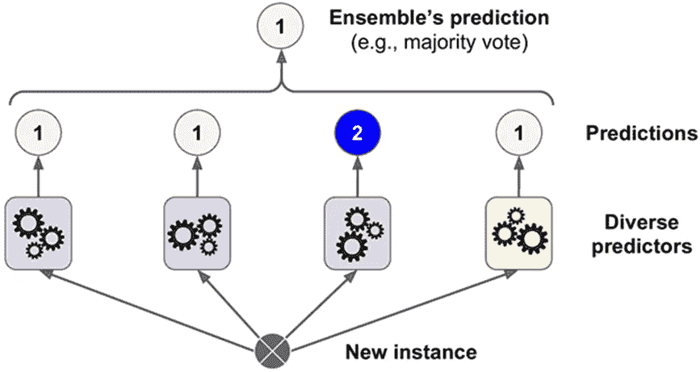

Source: Hands-on machine learning with sci-kit-learn and tensorflow

*软投票分类器*:如果所有分类器都能够估计类的概率(predict_proba()方法)，那么预测具有最高类概率的类，在单个分类器上平均。软投票通常比硬投票表现更好。软投票考虑每个分类器的确定程度

现在让我们试着用一种简单的方式来理解这一点。

举例:假设你有 3 个分类器(1，2，3)，两个类(A，B)，经过训练，你在预测单个点的类。

**硬投票**

*预测*:

分类器 1 预测类别 A

分类器 2 预测 B 类

分类器 3 预测 B 类

2/3 分类器预测 B 类，所以**B 类是集成决策**。

**软投票**

*预测*(与之前的例子相同，但现在是根据概率。此处仅显示 A 类，因为问题是二进制的):

分类器 1 以 99%的概率预测类别 A

分类器 2 以 49%的概率预测类别 A

分类器 3 以 49%的概率预测类别 A

跨分类器属于 A 类的平均概率为(99 + 49 + 49) / 3 = 65.67%。因此，**A 类是系综决策**。

## **b.)** ***不同情况下每个预测器的算法相同***

到目前为止，我们已经看到了在相同实例上训练的不同算法。现在让我们看看如何使用不同的实例使用相同的算法进行分类。

如果样本选择是通过替换- ***装袋*** (引导汇总)完成的

如果样品选择完成而没有替换— ***粘贴***

只有 bagging 允许为同一个预测器对训练实例进行多次采样

一旦模型被训练，集合将聚集来自所有模型的预测。

聚集-模式:分类

聚合-平均值:回归

聚合减少了偏倚和方差。

在 Sci-Learn 中，为了执行 bagging，我们使用 BaggingClassifier():如果基本分类器有 predict_proba()方法，则自动执行软投票。

Bagging —较高的偏差，低方差结果。首选整体装袋

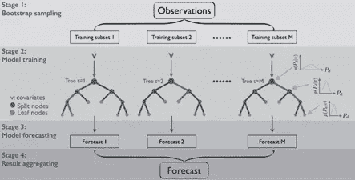

## c.) ***同一算法上的一组多样特性&实例***

到目前为止，我们已经看到使用采样数据训练模型。现在是时候根据所选的特性训练模型了。

***随机面片和随机子空间***

在 Bagging 分类器()中，用于实例采样和特征采样的参数如下

实例采样— max_samples，引导

要素采样-最大要素，引导要素

采样训练实例和特征— ***随机补丁方法***

保留所有训练实例(即 bootstrap=False 和 max_sam ples=1.0)但采样特征(即 bootstrap_features=True 和/或 max_features 小于 1.0)称为 ***随机子空间方法***

## d.)助推

提升是一种集成技术，它试图从多个弱分类器中创建一个强分类器。这是一个循序渐进的过程，每个后续模型都试图修复其前一个模型的错误。

AdaBoost(自适应增强)，梯度增强。

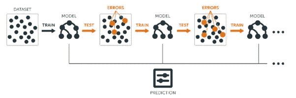

***AdaBoost****:*在每个模型预测的最后，我们最终提高了错误分类实例的权重，以便下一个模型对它们做得更好，等等。顺序学习的一个主要缺点是该过程不能并行化，因为预测器可以一个接一个地训练。如果 AdaBoost 集成过拟合训练集，则减少估计器的数量或调整基本估计器

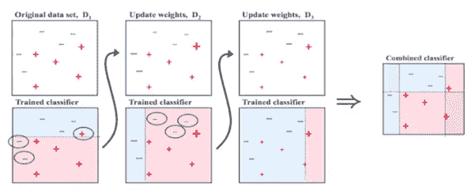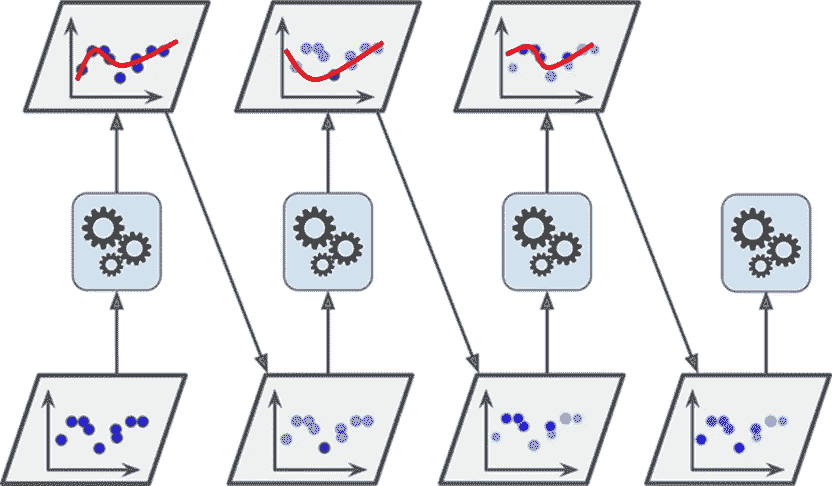

Source: Hands-on machine learning with sci-kit-learn and tensorflow

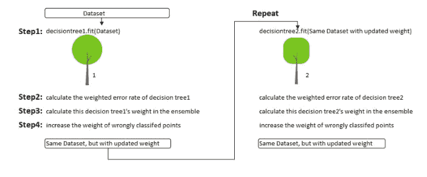

AdaBoost 通过将(每棵树的)权重相加乘以(每棵树的)预测来进行新的预测。显然，权重较高的树将有更大的权力来影响最终决策

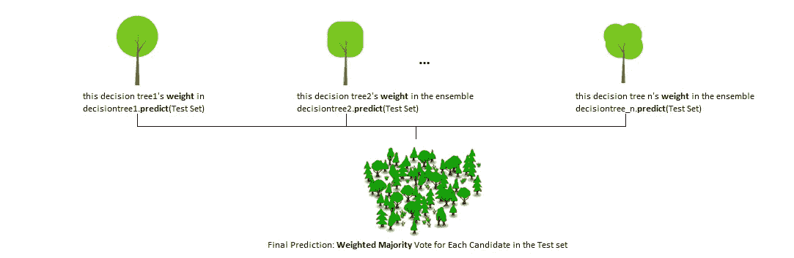

***【GBM】***

梯度增强直接从误差——残差中学习，而不是更新数据点的权重。

下面是梯度推进决策树(GBDT)的 Python 代码

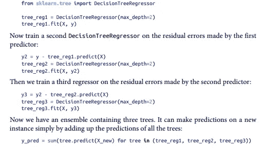

Source: Hands-on machine learning with sci-kit-learn and tensorflow

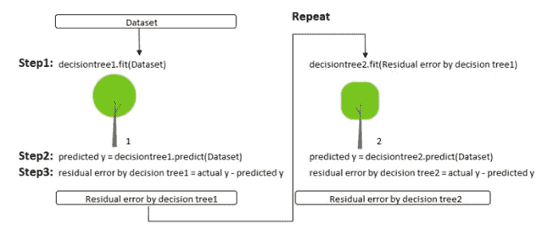

梯度推进通过简单地将(所有树的)预测相加来进行新的预测

## e.)堆叠(**堆叠概括**

堆叠背后的主要思想是，与其使用琐碎的函数(如硬投票)来聚合集合中所有预测者的预测，不如我们训练一个模型来执行这种聚合。

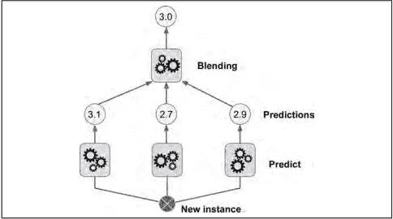

集成对新实例执行回归任务。底部三个预测器中的每一个都预测不同的值(3.1、2.7 和 2.9)，然后最终预测器(称为混合器或元学习器)将这些预测作为输入，并做出最终预测(3.0)

**结论:**

总的来说，集成学习是一种用于提高模型预测能力/估计准确性的强大技术。

请在下面留下任何评论、问题或建议。

谢谢大家！

快乐学习！