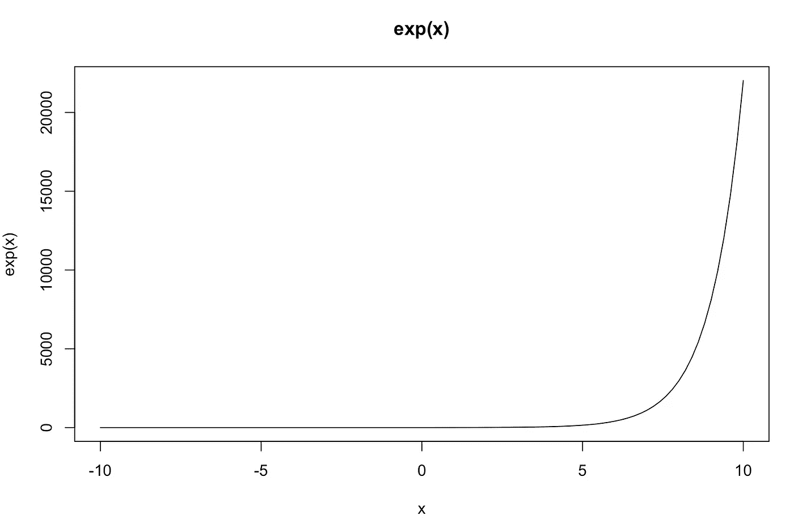
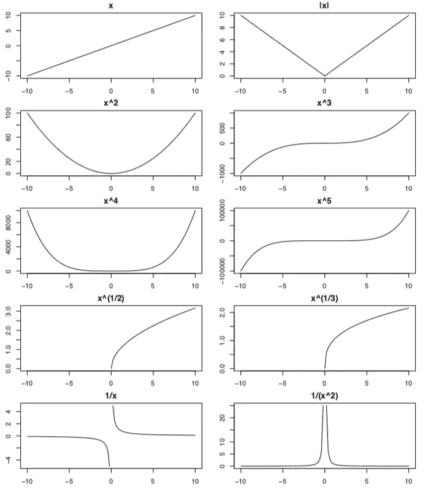
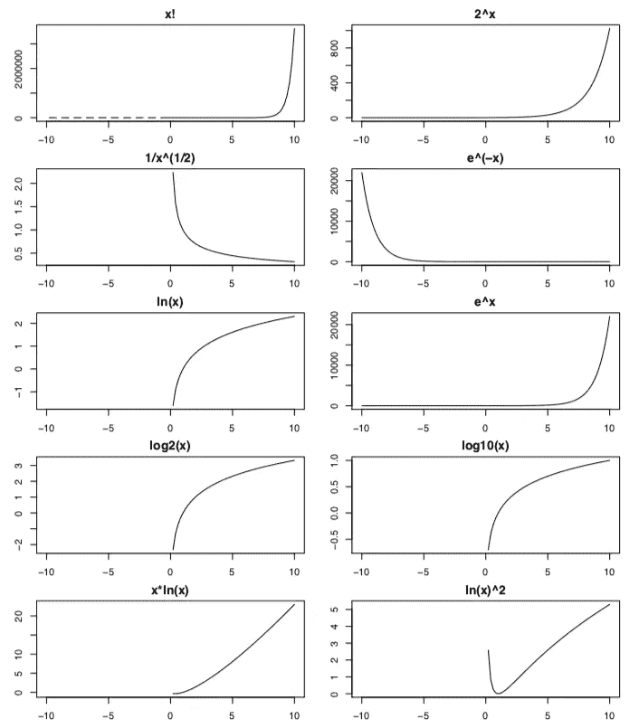
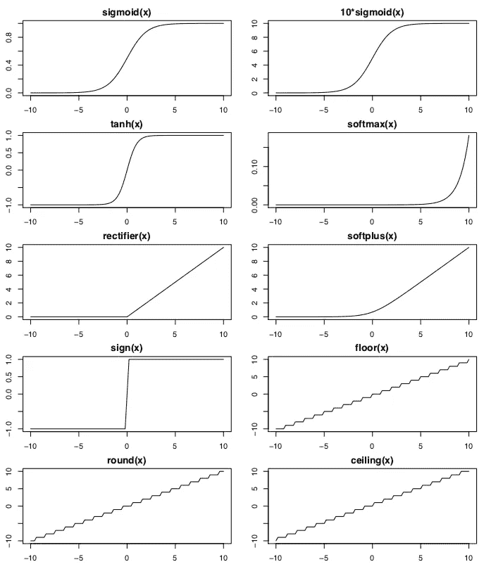
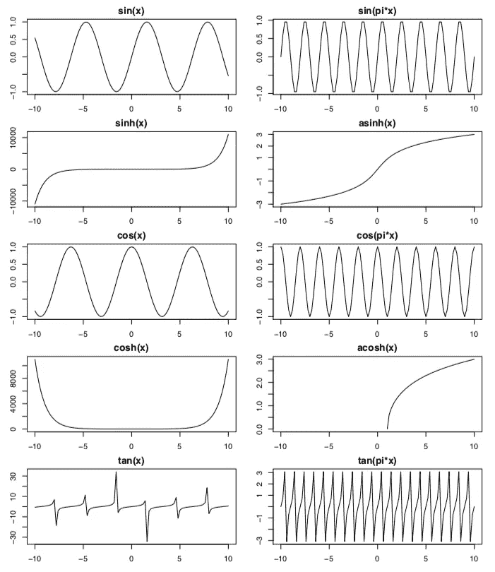

# R 中 40 个数学函数概述

> 原文：<https://towardsdatascience.com/overview-of-40-mathematical-functions-in-r-4b4e138685ff?source=collection_archive---------9----------------------->


Photo by [Simone Venturini](https://www.pexels.com/@simoun?utm_content=attributionCopyText&utm_medium=referral&utm_source=pexels) from [Pexels](https://www.pexels.com/photo/telescope-overlooking-mountains-2564854/?utm_content=attributionCopyText&utm_medium=referral&utm_source=pexels)

你是否发现自己在寻找`tanh, sigmoid, softmax, ReLU` 函数或其他数学函数的样子？即使你实际上应该知道，因为你几天前就已经查过了？那么，你来对地方了！

# 这个概述是关于什么的？

对于一个定量领域的任何人来说，知道这些函数都是非常有用的。很多时候，我们迷失在求导、积分等细节中。但是我们往往会忘记所有不同函数的物理意义以及它们之间的相互比较:一个函数实际上是什么样子的？

因此，我对想到的最常见的 40 个数学函数做了一个简单的概述。我使用 R 中的`curve`函数以精简、简单的方式绘制了它们，并按照逻辑上有用的顺序组装它们。

# 如何创造这些情节？

创造这样的情节非常容易。让我们从一个例子开始:

```
curve(exp(x), from = -10, to = 10, main = "exp(x)")
```



打开 [RStudio](https://www.rstudio.com/products/rstudio/download/) 后，你真正需要做的就是把上面那行代码放到你的控制台里运行。你不需要任何图书馆。这不是很好吗？

提供您想要作为第一参数绘图的功能，例如`exp(x)`、`x^3`或`3*x+5`。您可以快速实现 sigmoid 函数`1/(1+exp(-x))`、tanh 函数`tanh(x)`、softmax 函数`exp(x)/sum(exp(x))`或 ReLU 函数`pmax(0, x)`等功能。

在那之后，你需要做的就是指定 x 的值，你要为这些值绘制函数 f(x)。您可以通过设置参数`from`和`to`来完成此操作。我选择绘制从-10 到+10 的所有函数。当然，你也可以选择用`main`指定一个标题。

# 给我看看 40 个数学函数！

您可以在下面的图中看到显示的函数。共有 4 个部分，每个部分有 10 个功能。通过在 RStudio 中运行它们，可以用相应的 Github Gists 创建所有的部分。

**第一节**



Functions 1–10

**第二节**



Functions 11–20

**第三节**



Functions 21–30

**第四节**



Functions 31–40

# 参考

请在 Github 上找到源代码:

*   点击下载 PDF
*   下载 R Markdown(在 [RStudio](https://www.rstudio.com/products/rstudio/download/) 中创建 PDF)[这里](https://github.com/juliuskittler/blog/blob/master/function_plots/Function_Plots.Rmd)。

**如果需要增加功能，期待您的反馈！提前多谢了。**