# 工业用自动化库综述

> 原文：<https://towardsdatascience.com/overview-of-automl-from-pycon-jp-2019-c8996954692f?source=collection_archive---------15----------------------->

## PyCon JP 2019 的**自动化机器学习**技术和库的简要总结

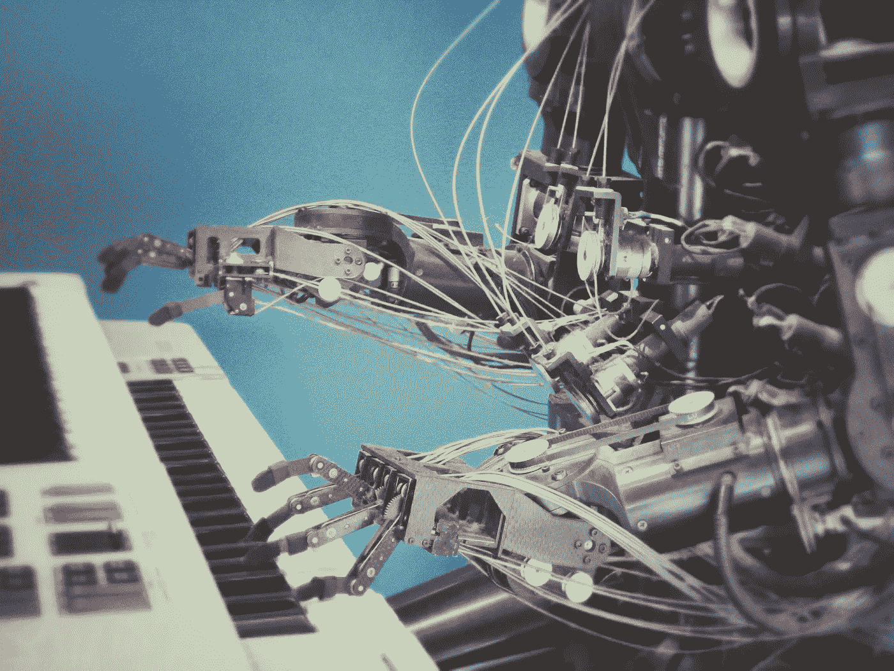

Photo by [Franck V.](https://unsplash.com/@franckinjapan?utm_source=unsplash&utm_medium=referral&utm_content=creditCopyText) on [Unsplash](https://unsplash.com/search/photos/automation?utm_source=unsplash&utm_medium=referral&utm_content=creditCopyText)

[PyCon JP 2019](https://pycon.jp/2019/) 于 2019/9/16~ 2019/9/17 举办，为期两天。我会发布一些我感兴趣的讲座的帖子。

作为一名 NLP 工程师，很高兴看到一些关于机器学习的讲座。这篇文章是来自[柴田正史](https://twitter.com/c_bata_)的汽车演讲的简短英文摘要。你可以在这里找到日文的幻灯片。

# 自动化水平

Jeff Dean 在 2019 年 ICML 车展上做了一个关于 AutoML 的[演讲，他将自动化分为 5 个级别](https://slideslive.com/38917526/an-overview-of-googles-work-on-automl-and-future-directions)

1.  手工预测者，什么都不学。
2.  手工特色，学会预测。自动化超参数优化(HPO)工具，如 Hyperopt、Optuna、SMAC3、scikit-optimize 等。
3.  手工算法，端到端地学习特征和预测。HPO +一些工具像 featuretools，tsfresh，boruta 等。
4.  手工什么都没有。端到端地学习算法、特征和预测。自动化算法(模型)选择工具，如 Auto-sklearn、TPOT、H2O、auto_ml、MLBox 等。

# 自动 Hpyerparametter 优化的两种方法

广泛使用的优化方法有两种，一种是**贝叶斯** **优化**方法，它将**根据过去的结果**搜索未知的参数范围。一些算法如 TPE，SMAC，GP-EL 等。

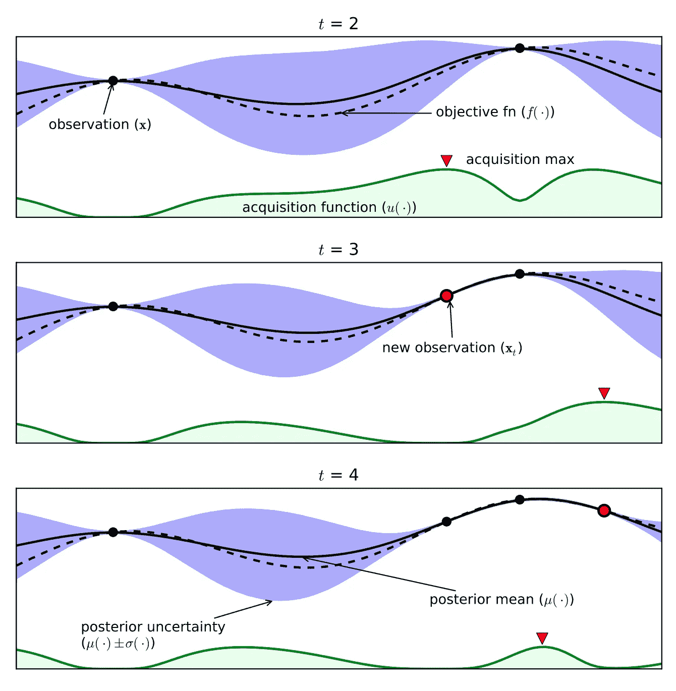

[An example of using Bayesian optimization on a toy 1D design problem](https://arxiv.org/pdf/1012.2599.pdf)

另一个是**在训练过程中停止学习路径，更有效地搜索参数**。一些算法像连续减半，超带等等。

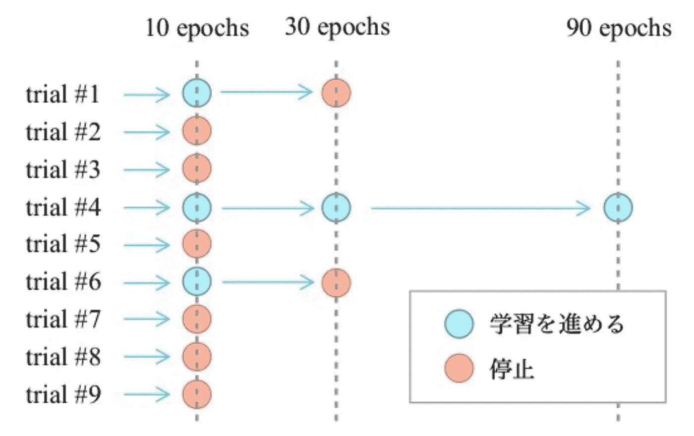

[paper1](https://arxiv.org/pdf/1810.05934.pdf) and [paper2](https://arxiv.org/pdf/1502.07943.pdf)

蓝点表示训练将继续，红点表示训练将停止。

# 自动图书馆

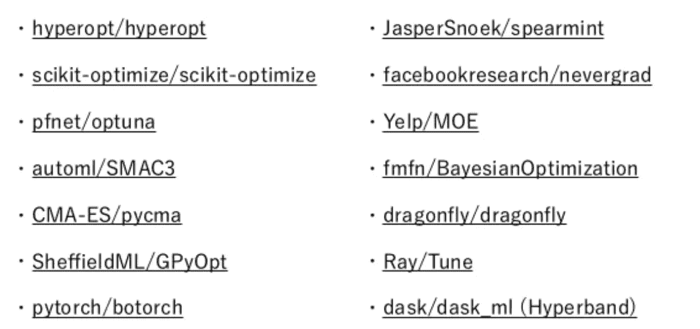

我们可以将这些库分为以下两类。

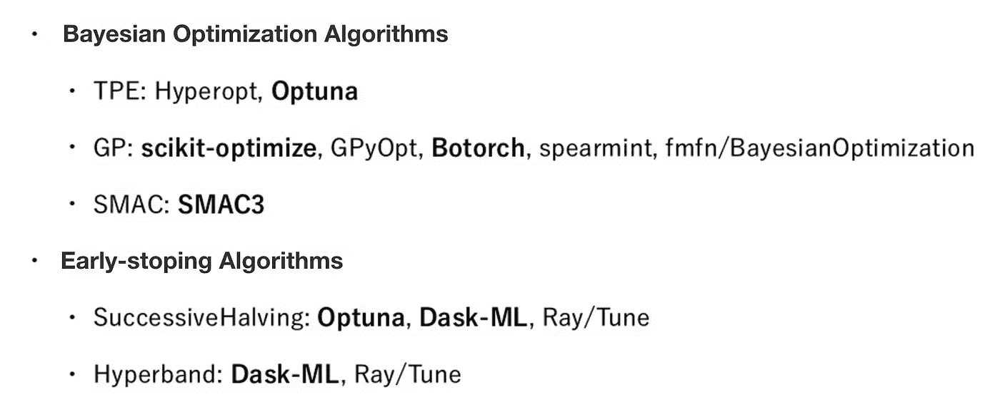

考虑到质量和开发速度，推荐两个库， **Optuna 和 scikit-optimize。**

# 自动化特征工程

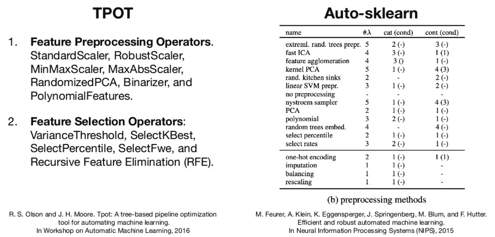

还有一件事是 TPOT 和 Auto-sklearn 做不到的。因此，我们将特征工程分为两类，特征生成和特征选择。

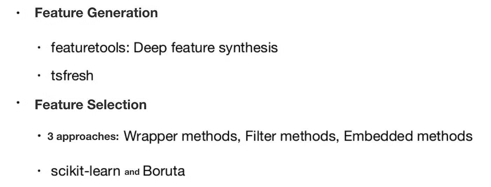

# 自动算法(模型)选择

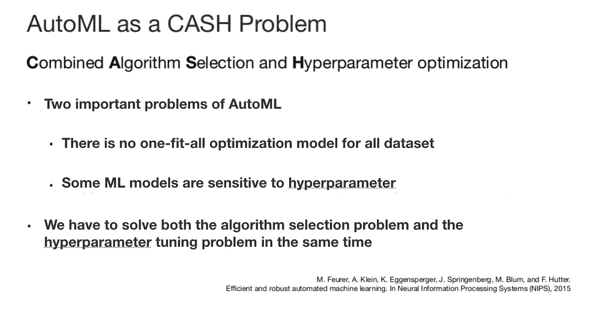

Optuna 可以一起解决现金。

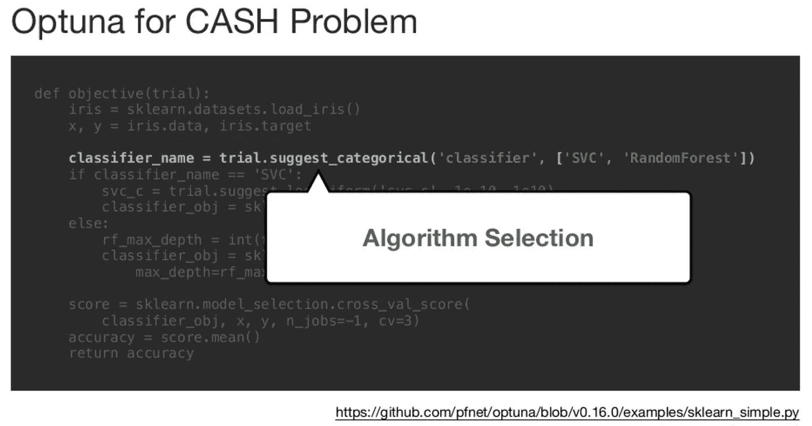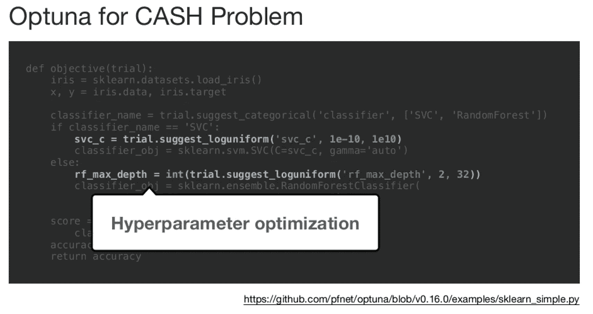

自动算法选择比较。

*   自动 sklearn
*   TPOT
*   h2o-3
*   自动 _ 毫升
*   MLBox

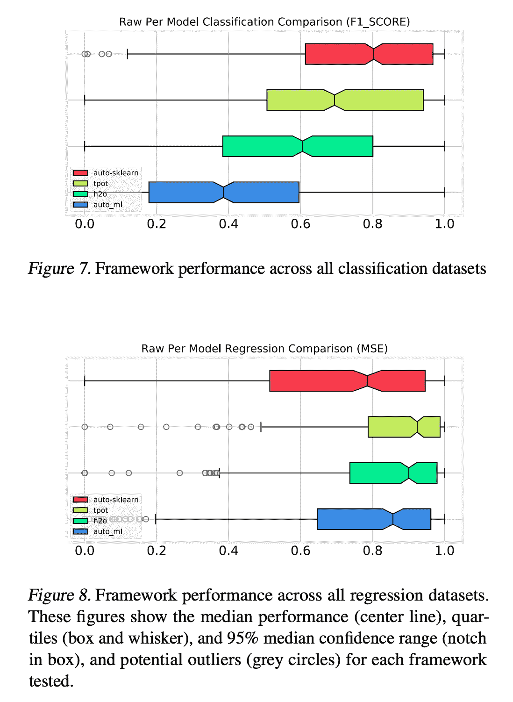

[paper link](https://arxiv.org/pdf/1808.06492.pdf)

不同任务的推荐选择。

*   回归任务:自动 sklearn(基于贝叶斯)
*   分类任务:TPOT(基于遗传算法)

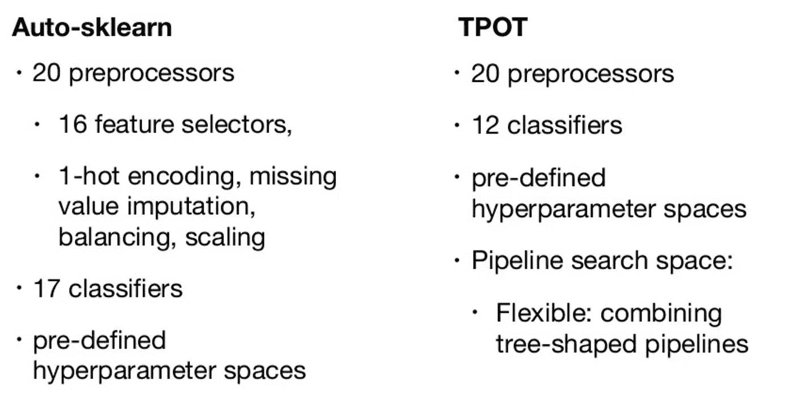

# 自动神经结构搜索

即使是自动神经架构搜索在学术界也是一个非常热门的话题，但是在工业界还没有得到广泛的应用。

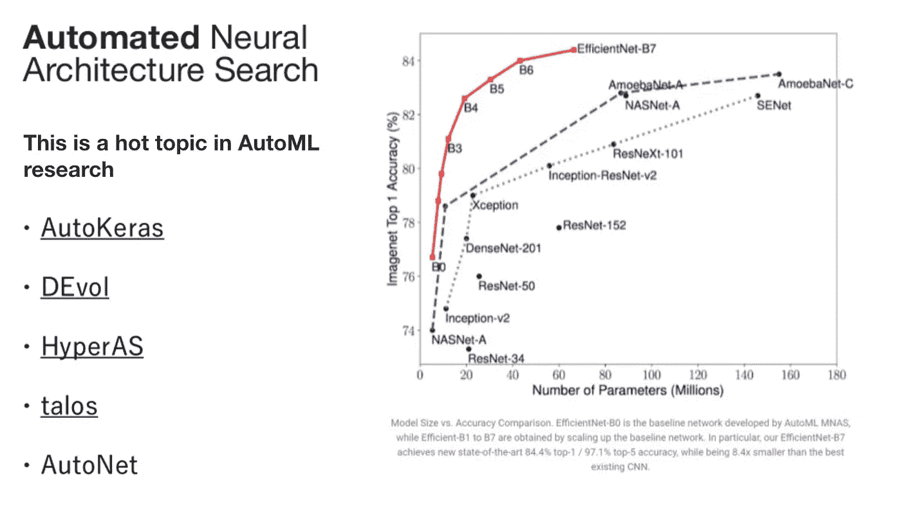

> ***查看我的其他帖子*** [***中***](https://medium.com/@bramblexu) ***同*** [***一个分类查看***](https://bramblexu.com/posts/eb7bd472/) ***！
> GitHub:***[***bramble Xu***](https://github.com/BrambleXu) ***LinkedIn:***[***徐亮***](https://www.linkedin.com/in/xu-liang-99356891/) ***博客:***[***bramble Xu***](https://bramblexu.com)

# 参考

*   [https://www . slide share . net/c-bata/pythonautoml-at-pyconjp-2019](https://www.slideshare.net/c-bata/pythonautoml-at-pyconjp-2019)
*   [https://arxiv.org/pdf/1012.2599.pdf](https://arxiv.org/pdf/1012.2599.pdf)
*   [https://arxiv.org/pdf/1810.05934.pdf](https://arxiv.org/pdf/1810.05934.pdf)
*   [https://arxiv.org/pdf/1502.07943.pdf](https://arxiv.org/pdf/1502.07943.pdf)
*   [https://arxiv.org/pdf/1808.06492.pdf](https://arxiv.org/pdf/1808.06492.pdf)