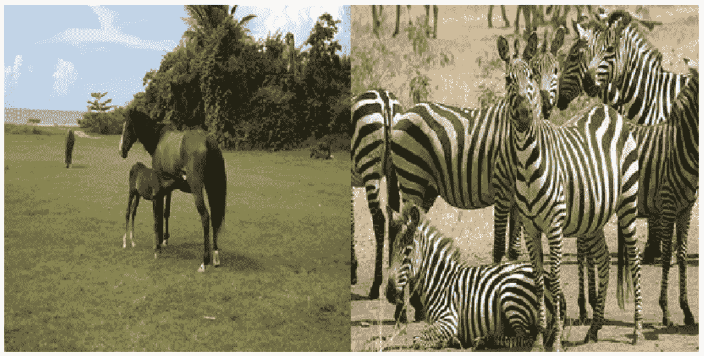
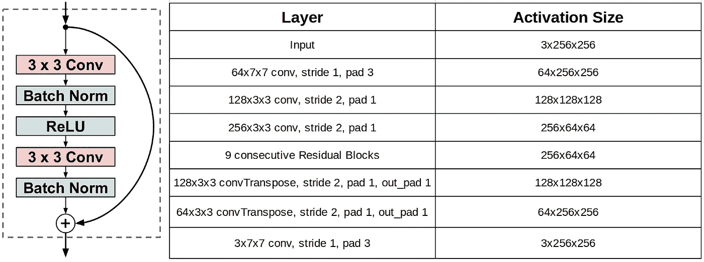
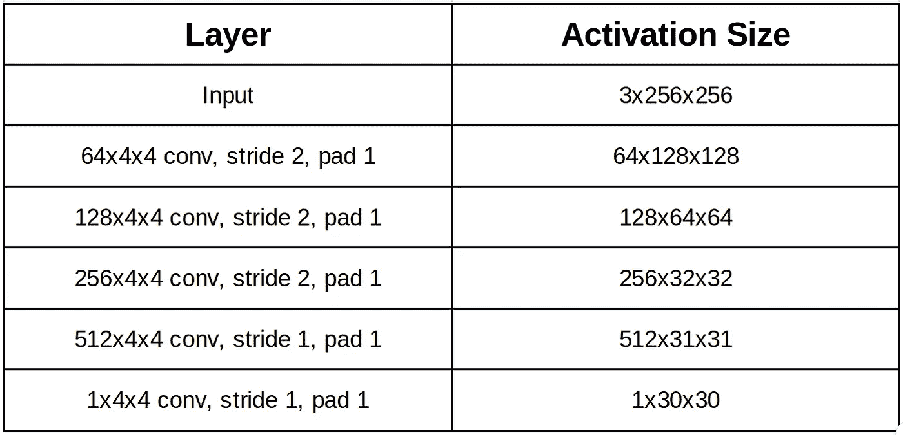
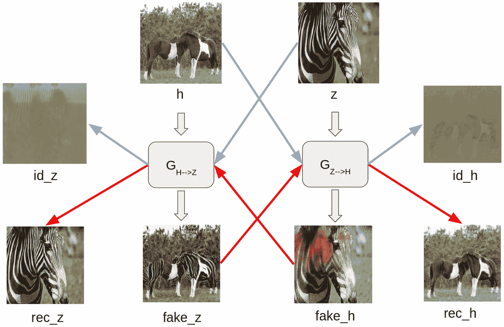
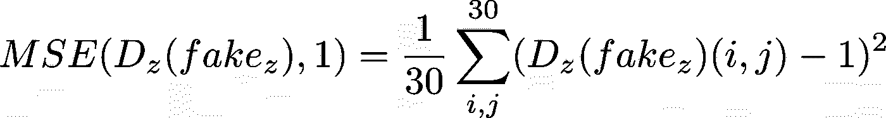
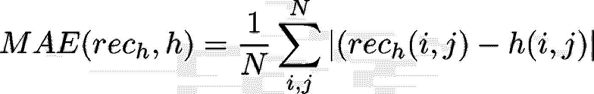
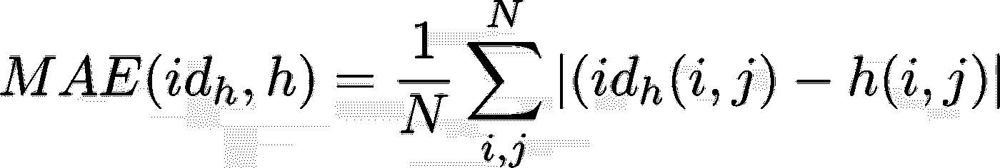
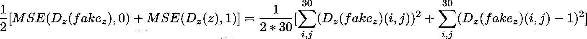
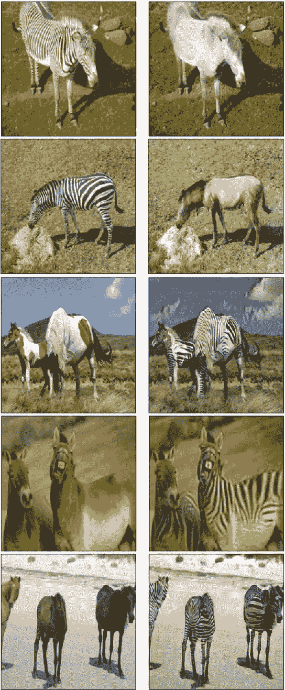
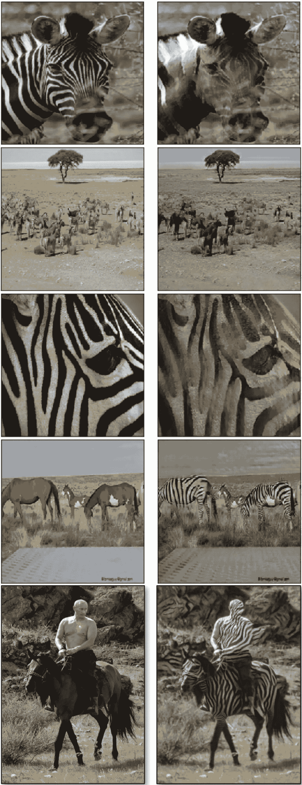

# CycleGAN 架构和培训概述。

> 原文：<https://towardsdatascience.com/overview-of-cyclegan-architecture-and-training-afee31612a2f?source=collection_archive---------12----------------------->

# 0.介绍

生成对抗模型由两个神经网络组成:一个生成器和一个鉴别器。一个 [CycleGAN](https://arxiv.org/abs/1703.10593) 由 2 个 GAN 组成，总共有 2 个发生器和 2 个鉴别器。

给定两组不同的图像，例如马和斑马，一个生成器将马转换成斑马，另一个生成器将斑马转换成马。在训练阶段，鉴别器在这里检查生成器计算出的图像是真是假。通过这个过程，生成器可以随着各自鉴别器的反馈而变得更好。在 CycleGAN 的情况下，一个发电机从另一个发电机获得额外的反馈。这种反馈确保由生成器生成图像是循环一致的，这意味着在图像上连续应用两个生成器应该产生相似的图像。

训练一个 CycleGAN 非常方便的一点是，我们不需要标记它的训练样本(数据是不成对的)。

# 1.数据

CycleGAN 的一个训练样本由马的随机图片和斑马的随机图片构成。

# 2.模型

两个生成器都具有以下架构(除了规范层和激活层) :

Residual Block on the left, all convolutional layer inside it have 256 filters, stride 2 and padding 1.

生成器将大小为 256x256 的图像作为输入，对其进行下采样，然后将其上采样回 256x256，从而创建生成的图像。

至于鉴别器，它们具有以下架构(规范和激活层除外):

鉴别器将大小为 256x256 的图像作为输入，并输出大小为 30x30 的张量。

输出张量的每个神经元(值)保存输入图像的 70×70 区域的分类结果。通常，GANs 的鉴别器输出一个值来指示输入图像的分类结果。通过返回大小为 30x30 的张量，鉴别器检查输入图像的每个 70x70 区域(这些区域相互重叠)是真实的还是虚假的。这样做相当于手动选择这些 70x70 区域中的每一个，并让鉴别器反复检查它们。最后整幅图像的分类结果是 30×30 个值的分类结果的平均值。

# 3.培养

生成器和鉴别器都使用 Adam 解算器(默认参数)进行优化，它们都具有相同的学习速率(2e-4)，并且批处理大小被选择为 1(这意味着这里不能使用批处理规范化，而是使用实例规范化)。

generated images are from a CycleGAN trained during 30 epochs.

G *{H- > Z* }是将马图像转换成斑马图像的生成器，G *{Z- > H* }是将斑马图像转换成马图像的生成器。

给定一个训练样本( *h，z* )，这就是该样本如何更新 CycleGAN 的权重。

*   从 *h，* G *{H- > Z* }生成*假 _z* 一个假斑马图像。从 *z，*G*{ H->Z*}*生成 *id_z* 应该与*Z*相同*
*   *从 *z，* G *{Z- >* H}生成 *fake_h* 一个假马图像。从 *h，*G*{ Z->*H }*生成应该与 *h.* 相同的 *id_h***
*   **从 *fake_z* ，G *{Z- >* H}生成 *rec_h* 一个与 *h* 相似的 *h* 的重建图像。**
*   **从 *fake_h* ，G *{H- > Z* }生成 *rec_z* 一个应该类似于 *z* 的重构图像。**

**然后，通过最小化跟随损失来更新发电机的权重。在 G *{H- > Z* }的情况下，可以写成:**

****

**where D_z(fake_z)(i,j) is the scalar value at coordinate (i,j) of D_z output tensor.**

*   ***D_z* ( *fake_z* )和 *1* 之间的均方误差(MSE)。即[原图](https://arxiv.org/pdf/1703.10593.pdf)中的最小二乘损失。 *D_z* 是与 G *{H- > Z* }关联的鉴别器，如果输入—*fake _ Z*—看起来像一个真正的斑马 else *0* 时，它输出 *1* 。**

****

**pixel to pixel absolute difference of the two images.**

*   ***rec_h* 和 *h* 之间的平均绝对误差(MAE)。即[原纸中的循环一致性损失。这个损失被赋予了很大的重要性，并且更新了 10 倍于 MSE 损失的发电机权重。](https://arxiv.org/pdf/1703.10593.pdf)**

****

**pixel to pixel absolute difference of the two images.**

*   ***id_h* 和 *h* 之间的平均绝对误差(MAE)。即[原文](https://arxiv.org/pdf/1703.10593.pdf)中的身份丧失。没有必要包括这种损失，但它通常有助于获得更好的结果。**

**然后，通过最小化跟随损失来更新鉴别器的权重。在 *D_z* 的情况下，可以写成:**

****

*   ***D_z* ( *fake_z* )与 *0* 之间均方误差(MSE)的一半加上 *D_z* ( *z* )与 *1* 之间 MSE 的一半。**

**鉴别器的损耗减半。这样做相当于使用 MSE 在每次更新生成器权重两次时更新鉴别器权重一次。**

# **4.结果**

**复制这些结果的代码可以从 [colab 笔记本](https://colab.research.google.com/gist/feiwu77777/3de4782dc9fbc3efa5d9131a48d8dfdc/cyclegan.ipynb)中获得。**

**然后，CycleGAN 被训练 200 个周期。在前 100 个时期，学习速率固定为 2e-4，在后 100 个时期，学习速率从 2e-4 到 2e-6 线性退火。下面显示了一些生成的图像。**

**通常有非常好的结果(左:原始图像，右:生成的图像) :**

****

**original images / generated images**

**但也有失败的情况(左:原始图像，右:生成的图像) :**

****