# 用于深度学习的图嵌入

> 原文：<https://towardsdatascience.com/overview-of-deep-learning-on-graph-embeddings-4305c10ad4a4?source=collection_archive---------0----------------------->

## 图形学习和几何深度学习—第 1 部分

> 一定要看一篇 [**几何深度学习概述**](/what-is-geometric-deep-learning-b2adb662d91d) 和[**先决条件**](/graph-theory-and-deep-learning-know-hows-6556b0e9891b) 熟悉机器学习这个小众领域。
> 
> 关注 [**我的推特**](https://twitter.com/FlawnsonTong) 加入 [**几何深度学习子编辑**](https://www.reddit.com/r/GeometricDeepLearning/) 获取空间最新更新。

这里有很多方法可以将机器学习应用于图表。最简单的方法之一是将图表转换成更容易理解的 ML 格式。

图形嵌入是一种方法，用于将节点、边及其特征转换到向量空间(较低的维度)**中，同时最大限度地保留图形结构和信息等属性。图表很复杂，因为它们在规模、特性和主题方面会有所不同。**

一个分子可以被表示为一个小的、稀疏的、静态的图，而一个社会网络可以被表示为一个大的、密集的、动态的图。最终，这使得很难找到一个银弹嵌入方法。每种方法在不同的数据集上的性能各不相同，但它们是深度学习中使用最广泛的方法。

图形是这个系列的主要焦点，但是如果 3D 成像应用更适合你，那么我推荐[Gradient](https://thegradient.pub/beyond-the-pixel-plane-sensing-and-learning-in-3d/)的这篇精彩文章。

# 嵌入图网络

如果我们将嵌入视为向低维的转换，嵌入方法本身就不是一种神经网络模型。相反，它们是一种在**图形预处理中使用的算法，目的是将图形转换成可计算的格式。这是因为图形类型的数据本质上是离散的。**

> **机器学习算法针对连续数据进行调整，因此为什么嵌入总是针对连续向量空间。**

正如最近的工作所显示的，有多种方法可以嵌入图，每种方法都有不同的粒度级别。嵌入可以在节点级、子图级执行，或者通过像图遍历这样的策略来执行。这些是一些最受欢迎的方法。

## [**深走—** 佩罗齐等人](https://arxiv.org/pdf/1403.6652.pdf)

Deepwalk 并不是这类方法中的第一个，但与其他图形学习方法相比，它是第一个被广泛用作基准的方法之一。Deepwalk 属于使用遍历的图形嵌入技术家族，遍历是图论中的一个概念，它通过从一个节点移动到另一个节点来实现图形的**遍历，只要它们连接到一个公共边。**

如果用任意的表示向量来表示图中的每个节点，就可以遍历图。可以通过在矩阵中彼此相邻地排列节点表示向量来聚集该遍历的步骤。然后，你可以将表示图形的矩阵输入到一个递归神经网络中。基本上，您可以使用图遍历的截断步长作为 RNN 的输入。这类似于句子中单词向量的组合方式。

DeepWalk 采用的方法是使用以下等式完成一系列随机行走:

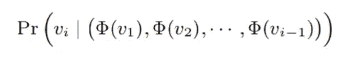

目标是估计观察到节点 ***vi*** 的可能性，给定在随机行走中到目前为止访问的所有先前节点，其中 ***Pr()*** 是概率，φ是表示与图中每个节点 **v** 相关联的潜在表示的映射函数。

潜在的表现是神经网络的输入。神经网络基于行走过程中遇到哪些节点以及遇到这些节点的频率，可以对节点特征或分类进行预测。

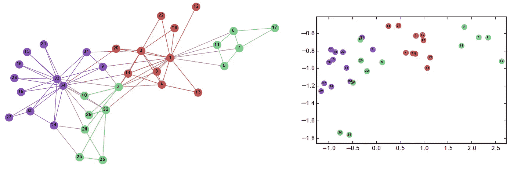

The original graph and it’s embedding (Courtesy of the DeepWalk research team)

用于进行预测的方法是 **skip-gram** ，就像 Word2vec 架构中的文本一样。DeepWalk 不是沿着文本语料库运行，而是沿着图运行来学习嵌入。该模型可以采用目标节点来预测它的“上下文”，在图的情况下，这意味着它的连通性、结构角色和节点特征。

尽管 DeepWalk 的得分为 **O(|V|)** *，*相对高效，但这种方法是**直推式**，这意味着每当添加新节点时，模型都必须重新训练以嵌入新节点并从中学习。

## [**Node2vec — Grover 等人**](https://cs.stanford.edu/people/jure/pubs/node2vec-kdd16.pdf)

你听说过 Word2vec 现在准备… Node2vec

比较流行的图学习方法之一，Node2vec 是最早尝试从图结构化数据进行学习的深度学习方法之一。直觉类似于 DeepWalk 的直觉:

> 如果你把图中的每个节点像句子中的单词一样嵌入，神经网络可以学习每个节点的表示。

Node2vec 和 DeepWalk 之间的区别很微妙，但是很重要。Node2vec 具有一个行走偏差变量α，它由 *p* 和 *q* 参数化。参数 *p* 优先考虑广度优先搜索(BFS)过程，而参数 *q* 优先考虑深度优先搜索(DFS)过程。因此，下一步去哪里的决定受到概率 1/ *p* 或 1/*q*的影响

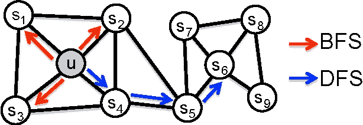

Both BFS and DFS are common algorithms in CS and graph theory (Courtesy of Semantic Scholar)

正如可视化所暗示的， **BFS 是学习局部邻居的理想选择，而 DFS 更适合学习全局变量。** Node2vec 可以根据任务在两个优先级之间切换。这意味着给定一个图，Node2vec 可以根据参数值返回不同的结果。按照 DeepWalk，Node2vec 还获取 walks 的潜在嵌入，并将其作为神经网络的输入来对节点进行分类。

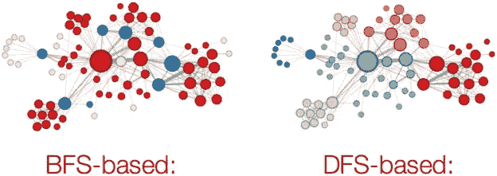

BFS vs DFS (Courtesy of SNAP Stanford)

实验证明 **BFS 更擅长根据结构角色(枢纽、桥梁、离群点等)进行分类。)而 DFS 返回一个更加社区驱动的分类方案。**

Node2vec 是斯坦福大学 SNAP 研究小组致力于图形分析的众多图形学习项目之一。他们的许多作品是几何深度学习许多重大进展的起源。

## [graph 2 vec——纳拉亚南等人](https://arxiv.org/abs/1707.05005)

对 node2vec 变体的修改，graph2vec 本质上学习嵌入图的子图。doc2vec 中使用的一个等式证明了这一点，它是一个密切相关的变体，也是本文的灵感来源。

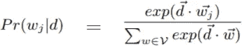

用通俗的英语来说，这个等式可以写成:单词( **wj** )出现在上下文给定文档( **d** )中的概率等于文档嵌入矩阵( ***d~*** )的指数乘以单词嵌入矩阵( ***w~j*** 是从文档中采样的)，除以文档嵌入矩阵的所有指数之和乘以文档中每个单词的单词嵌入矩阵

用 word2vec 来类比，**如果一个文档是由句子组成的(句子又是由单词组成的)，那么一个图是由子图组成的(子图又是由节点组成的)。**

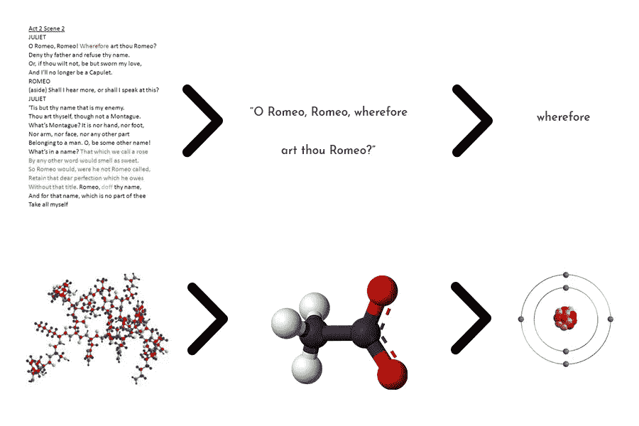

Everything is made of smaller things

这些预定的子图具有由用户指定的设定数量的边。同样，是潜在的子图嵌入被传递到神经网络中用于分类。

## **【结构化深度网络嵌入】——王等**

与以前的嵌入技术不同，SDNE 不使用随机行走。相反，它试图从两个不同的指标中学习:

*   **一阶接近度:**如果两个节点共享一条边，则认为它们是相似的(成对相似)
*   **二阶接近度:**如果两个节点共享许多相邻节点，则认为它们是相似的

最终目标是捕捉高度非线性的结构。这是通过使用**深度自动编码器(半监督)来保持一阶(监督)和二阶(非监督)网络接近度来实现的。**

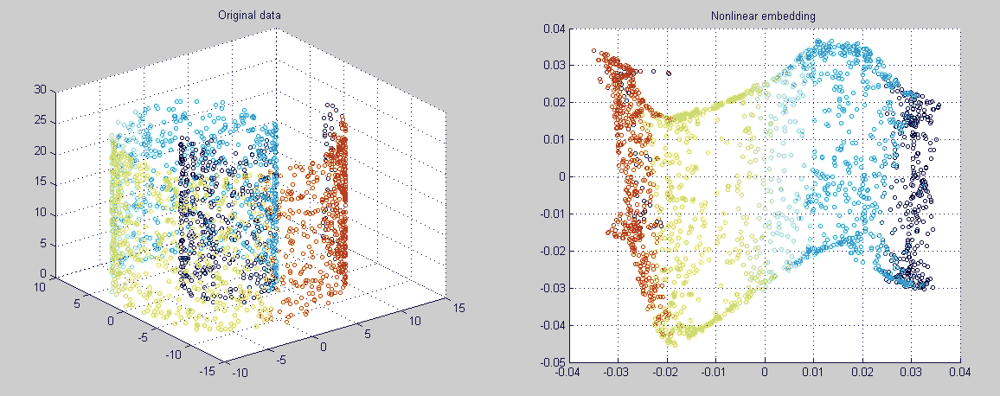

Dimensionality reduction with LE (Courtesy of MathWorld)

为了保持一阶近似性，该模型也是**拉普拉斯特征映射**的变体，这是一种图形嵌入/维度缩减技术。拉普拉斯特征映射嵌入算法**在相似节点在嵌入空间**中彼此远离映射时应用惩罚，从而允许通过最小化相似节点之间的空间来进行优化。

通过将 te 图的邻接矩阵传递给**无监督自动编码器来保持二阶接近度，该编码器具有内置的重建损失函数，必须最小化该函数。**

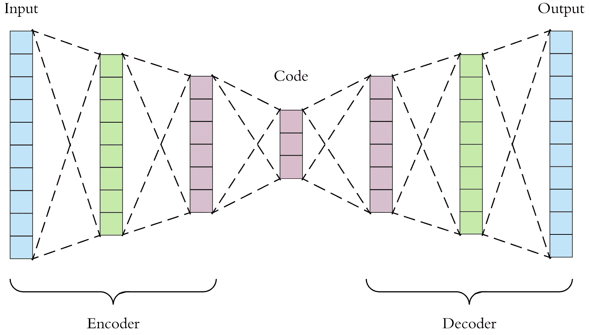

An autoencoder (Courtesy of Arden Dertat)

一阶邻近损失函数和二阶重建损失函数一起被联合最小化以返回图嵌入。然后通过神经网络学习嵌入。

## [大规模信息网络嵌入(线)——唐等](https://arxiv.org/abs/1503.03578)

行([汤集安](https://medium.com/u/370a562c29b0?source=post_page-----4305c10ad4a4--------------------------------)等人)明确定义了两个功能；一个用于**一阶接近度**，另一个用于**二阶接近度。**在原始研究进行的实验中，二阶近似的表现明显优于一阶，这意味着包含更高阶的近似可能会抵消精度的提高。

**LINE 的目标是最小化输入和嵌入分布之间的差异。**这是通过使用 KL 散度实现的:

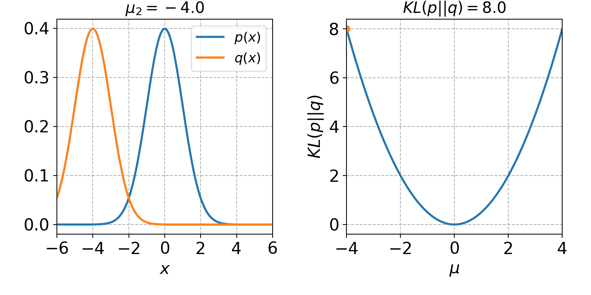

A simple case of KL-divergence minimization

可视化很简单，数学没那么简单。Aurélien Géron 有一个关于这个主题的很棒的[视频。](https://www.youtube.com/watch?v=ErfnhcEV1O8)另一方面，Géron 也是为数不多的图形学习研究人员之一，在 YouTube 工作期间，他将知识图形和深度学习结合起来，以改善视频推荐。

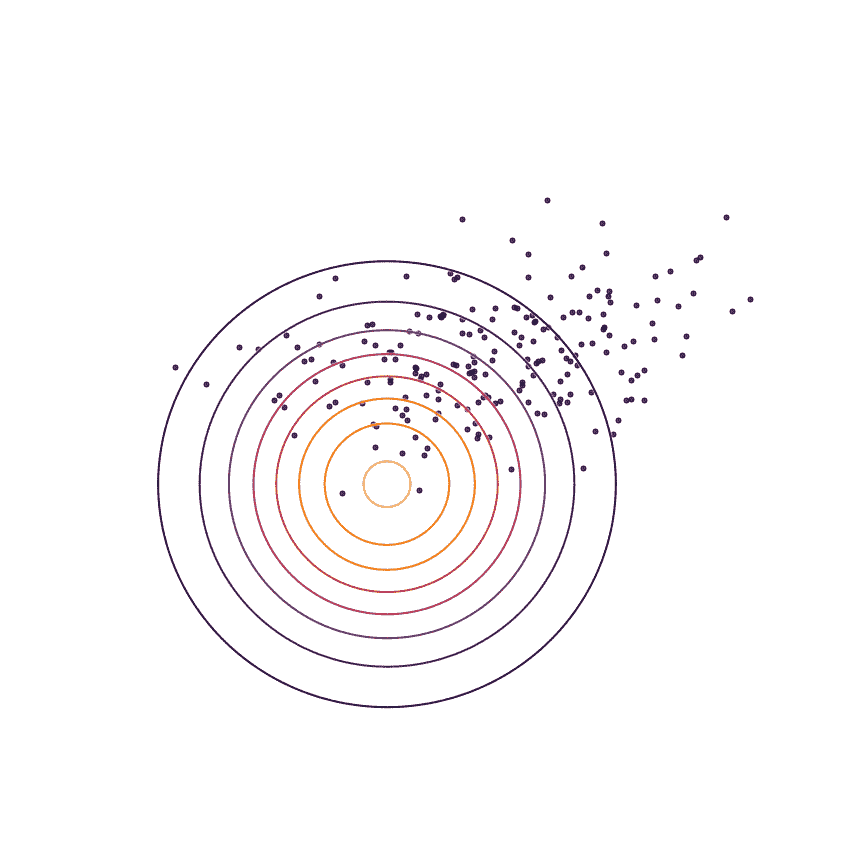

**LINE 为每对节点定义两个联合概率分布，然后最小化分布的 KL 散度。**这两种分布分别是邻接矩阵和节点嵌入的点积。KL 散度是信息论和熵中一个重要的相似性度量。该算法用在概率生成模型中，如变分自动编码器，其将自动编码器的输入嵌入到潜在空间中，该潜在空间成为分布。

由于该算法必须为每个递增的接近度定义新的函数，如果应用程序需要理解节点社区结构， **LINE 的性能不是很好。**

然而，LINE 的简单性和有效性只是它成为 2015 年 WWW 上被引用最多的论文的几个原因。这项工作有助于激发人们对图形学习的兴趣，将其作为机器学习的一个利基，并最终成为特定的深度学习。

## [网络的分层表示学习—陈等](https://arxiv.org/abs/1706.07845)

HARP 是对前面提到的基于嵌入/行走的模型的改进。以前的模型有陷入局部最优的风险，因为它们的目标函数是非凸的。基本上这意味着，球不可能滚到绝对的山脚。

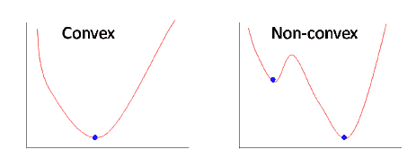

Gradient decent isn’t perfect (Courtesy of Fatih Akturk)

因此，意图**动机**:

> 通过更好的权重初始化来改进解决方案并避免局部最优。

以及建议的**方法**:

> 使用图粗化将相关节点聚集成“超级节点”

被制造出来。

HARP 本质上是一个**图形预处理步骤，它简化了图形**以利于更快的训练。

> **粗化图形后，它生成最粗“超节点”的嵌入，随后是整个图形的嵌入(图形本身由超节点组成)。**

整个图中的每个“超级节点”都遵循这一策略。

因为 HARP 可以**与之前的嵌入算法**结合使用，比如 LINE、Node2vec 和 DeepWalk。原始论文报道了当将 HARP 与各种图嵌入方法结合时，在分类任务中高达 ***14%*** 的显著改进:显著的飞跃。

# 本质上

我肯定错过了一堆算法和模型，尤其是最近对几何深度学习和图形学习的兴趣激增，导致几乎每天都有新的贡献出现在出版物上。

在任何情况下，图嵌入方法都是一种简单但非常有效的方法，可以将图转换为机器学习任务的最佳格式。由于它们的简单性，它们通常非常具有可伸缩性(至少与它们的卷积对应物相比)，并且易于实现。它们可以应用于大多数网络和图形，而不会牺牲性能或效率。**但是我们能做得更好吗？**

接下来是深入复杂而优雅的**图形卷积**世界！

# 关键要点

*   图形嵌入技术**在通过机器学习模型传递该表示之前，获取图形并将它们嵌入到较低维度的连续潜在空间**。
*   行走嵌入方法**执行图形遍历，目标是保持结构和特征**并聚集这些遍历，然后可以通过递归神经网络传递。
*   邻近嵌入方法使用**深度学习方法和/或邻近损失函数来优化邻近**，使得原始图中靠近在一起的节点同样在嵌入中。
*   其他方法使用类似**图粗化的方法来简化图，然后在图**上应用嵌入技术，在保留结构和信息的同时降低复杂性。

# 需要看到更多这样的内容？

*跟我上*[***LinkedIn***](http://www.linkedin.com/in/flawnson)*[***脸书***](https://www.facebook.com/flawnson)*[***insta gram***](https://www.instagram.com/flaws.non/?hl=en)*，当然还有* [***中***](https://medium.com/@flawnsontong1)**

***我所有的内容都在* [***我的网站***](http://www.flawnson.com) *我所有的项目都在*[***GitHub***](https://github.com/flawnson)**

***我总是希望结识新朋友、合作或学习新东西，所以请随时联系 flawnsontong1@gmail.com***

> ***向上和向前，永远和唯一🚀***