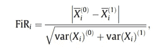
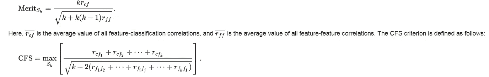

# 特征选择方法概述

> 原文：<https://towardsdatascience.com/overview-of-feature-selection-methods-a2d115c7a8f7?source=collection_archive---------4----------------------->

## 选择数据集中最相关要素的常用策略

## 特征选择的重要性

在高维输入数据的情况下，选择正确的特征集用于数据建模已被证明可以提高监督和非监督学习的性能，减少计算成本，如训练时间或所需资源，以减轻维度的*诅咒。*计算和使用特征重要性分数也是提高模型解释能力的重要一步。

## 这篇文章的概述

这篇文章分享了我在研究这个主题几天后获得的关于执行特征选择的监督和非监督方法的概述。对于所有描述的方法，我还提供了我使用的开源 python 实现的*参考，以便让您快速测试所呈现的算法。然而，就过去 20 年中提出的方法而言，这个研究领域非常丰富，因此这篇文章只是试图呈现我目前有限的观点，而没有任何完整性的借口。为了更全面的研究，你可以查看下面的[评论](http://citeseerx.ist.psu.edu/viewdoc/download?doi=10.1.1.295.8115&rep=rep1&type=pdf)。*

# 监督/非监督模型

有监督特征选择算法，其识别相关特征以最好地实现监督模型的目标(例如，分类或回归问题)，并且它们依赖于标记数据的可用性。然而，对于未标记的数据，已经开发了许多无监督的特征选择方法，这些方法基于各种标准对所有数据维度进行评分，这些标准例如是它们的方差、它们的熵、它们保持局部相似性的能力等。使用非监督试探法识别的相关特征也可以用于监督模型，因为它们可以发现数据中除特征与目标变量的相关性之外的其他模式。

从分类学的角度来看，特征选择方法通常属于下面详述的以下 4 个类别之一:*过滤器*、*包装器*、*嵌入式*和*混合*类。

# 包装方法

这种方法基于所应用的学习算法的结果性能来评估特征子集的性能(例如，对于分类问题，在准确性方面的增益是多少)。任何学习算法都可以用于这种搜索策略和建模的结合。

Image from **Analytics Vidhya**

*   **正向选择**:这种方法从一组空的特征开始，然后提供最佳性能的维度被迭代地添加到结果集中
*   **反向选择**:这种方法从所有特征的集合开始，在每次迭代中，最差的维度被移除

实现:这些算法在 [mlxtend](https://rasbt.github.io/mlxtend/#examples) 包中实现，在这里找到一个[的用法示例](https://stackabuse.com/applying-wrapper-methods-in-python-for-feature-selection/)。

*   **RFE** (递归特征消除):通过递归考虑越来越小的特征集来选择特征的贪婪搜索。它根据要素被消除的顺序对其进行排序。

实现: [scikit-learn](https://scikit-learn.org/stable/modules/feature_selection.html#recursive-feature-elimination)

# 嵌入式方法

这种方法包括同时执行模型拟合和特征选择的算法。这通常通过使用**稀疏正则化器**或约束来实现，使得一些特征的权重变为零。

*   **SMLR** (稀疏多项逻辑回归):该算法通过 ARD 先验(自动相关性确定)对经典多项逻辑回归实现稀疏正则化。这种正则化估计了每个特征的重要性，并删除了对预测无用的维度。

实施: [SMLR](https://github.com/KamitaniLab/smlr)

*   **ARD** (自动相关性确定回归):基于贝叶斯岭回归，该模型将比 OLS 等方法更多地将系数权重移向零。

ARD sparsity constraint makes the weights of some features 0 and thus helps identify the relevant dimensions

实现: [scikit-learn](https://scikit-learn.org/stable/auto_examples/linear_model/plot_ard.html)

正则化算法的其他例子: [Lasso](https://scikit-learn.org/stable/modules/generated/sklearn.linear_model.Lasso.html) (实现 *l1* 正则化)、[岭回归](https://scikit-learn.org/stable/modules/generated/sklearn.linear_model.Ridge.html)(实现 *l2* 正则化)、[弹性网](https://scikit-learn.org/stable/modules/generated/sklearn.linear_model.ElasticNet.html)(实现 *l1* 和 *l2* 正则化)。对这些不同正则化类型的直观描述表明，Lasso 回归将系数约束为方形，ridge 创建圆形，而弹性网介于两者之间:

[https://scikit-learn.org/stable/auto_examples/linear_model/plot_sgd_penalties.html](https://scikit-learn.org/stable/auto_examples/linear_model/plot_sgd_penalties.html)

这些算法的全面描述可以在[这里](http://enhancedatascience.com/2017/07/04/machine-learning-explained-regularization/)找到。

# 过滤方法

这种方法仅基于特征的固有特性来评估特征的重要性，而不结合任何学习算法。这些方法往往比包装器方法更快，计算成本更低。如果没有足够的数据来模拟特征之间的统计相关性，过滤方法可能会提供比包装方法更差的结果。与包装方法不同，它们不会过度拟合。它们被广泛用于高维数据，其中包装器方法具有令人望而却步的计算成本。

## 监督方法

*   **Relief** :该方法从数据集中随机抽取实例，并根据所选实例与相同和相反类的两个最近实例之间的差异更新每个特征的相关性。如果在相同类的相邻实例中观察到特征差异(“命中”)，则特征分数降低，或者，如果观察到具有不同分数的特征值差异(“未命中”)，则特征分数增加。

Feature weight decreases if it differs from that feature in nearby instances of the same class more than nearby instances of the other class and increases in the reverse case

扩展算法 ReliefF 应用特征加权并搜索更多最近邻。

实现: [scikit-rebate](https://github.com/EpistasisLab/scikit-rebate) ， [ReliefF](https://pypi.org/project/ReliefF/)

*   **Fisher score** :通常用于二元分类问题，Fisher ratio(FiR)定义为每个特征的每个类别的样本均值之间的距离除以它们的方差:

实现:[sci kit-特性](https://github.com/jundongl/scikit-feature)，用法[举例](http://featureselection.asu.edu/tutorial.php)。

*   **卡方评分**:测试 2 个分类变量的观察频率和预期频率之间是否存在显著差异。因此，零假设表明两个变量之间没有关联。

Chi square test of independence

为了正确应用卡方检验数据集中各种特征与目标变量之间的关系，必须满足以下条件:变量必须是*分类的*，独立采样的*，且值的*预期频率应大于 5* 。最后一个条件确保检验统计的 CDF 可以通过卡方分布来近似计算，更多细节可以在[这里](https://sites.google.com/a/lakeheadu.ca/bweaver/Home/statistics/notes/chisqr_assumptions)找到。*

*实现: [sklearn](https://scikit-learn.org/stable/modules/generated/sklearn.feature_selection.chi2.html) ， [scipy](https://docs.scipy.org/doc/scipy/reference/generated/scipy.stats.chisquare.html)*

*   ***(基于相关性的特征选择):这种方法的基本原理可以概括为:***

> ***"如果特性的值随着类别成员有系统地变化，那么特性就是相关的."***

***因此，好的特征子集包含与分类高度相关并且彼此不相关的特征。该方法如下计算 *k* 特征子集的价值:***

******

***[https://en.wikipedia.org/wiki/Feature_selection#Correlation_feature_selection](https://en.wikipedia.org/wiki/Feature_selection#Correlation_feature_selection)***

***实现:[sci kit-特性](https://github.com/jundongl/scikit-feature)，用法[举例](http://featureselection.asu.edu/tutorial.php)。***

*   ***[**FCBF**](http://www.public.asu.edu/~huanliu/papers/icml03.pdf) (快速相关基滤波器):这种方法比 ReliefF 和 CFS 都更快更有效，因此更适合高维输入。简而言之，它遵循一种典型的相关性冗余方法，首先计算所有特征的对称不确定性(x | y 的信息增益除以它们的熵之和),按此标准对它们进行分类，然后移除冗余特征。***

***实现: [skfeature](https://github.com/jundongl/scikit-feature/blob/master/skfeature/function/information_theoretical_based/FCBF.py) ，【https://github.com/shiralkarprashant/FCBF】T2***

## ***无监督方法***

*   *****方差**:已被证明是选择相关特征的有效方法，这些特征往往具有较高的方差分数***

***实现:[方差阈值](https://scikit-learn.org/stable/modules/generated/sklearn.feature_selection.VarianceThreshold.html)***

*   *****平均绝对差**:根据平均值计算平均绝对差([执行](https://github.com/ciortanmadalina/high_noise_clustering/blob/master/Unsupervised%20feature%20selection.ipynb))。***

******

***Higher values tend to have more discriminative power***

*   *****离差率**:算术平均值除以几何平均值。更高的分散对应于更相关的特征([实施](https://github.com/ciortanmadalina/high_noise_clustering/blob/master/Unsupervised%20feature%20selection.ipynb))***

******

***[https://www.sciencedirect.com/science/article/abs/pii/S0167865512001870](https://www.sciencedirect.com/science/article/abs/pii/S0167865512001870)***

*   *****拉普拉斯得分**:基于来自相同类别的数据通常彼此接近的观察，因此我们可以通过其局部保持能力来评估特征的重要性。该方法包括通过使用任意距离度量将数据嵌入最近邻图上，然后计算权重矩阵。然后为每个特征计算拉普拉斯得分，该得分具有最小值对应于最重要的维度的性质。然而，为了选择特征的子集，另一种聚类算法(例如 k-means)通常被后验地应用，以便选择性能最佳的组***

***实施: [scikit-feature](https://github.com/jundongl/scikit-feature)***

*   *****拉普拉斯得分结合基于距离的熵**:该算法建立在拉普拉斯得分之上，使用基于距离的熵来代替典型的 k-means 聚类，并在高维数据集中表现出更好的稳定性([实现](https://github.com/ciortanmadalina/high_noise_clustering/blob/master/Unsupervised%20feature%20selection.ipynb))***
*   *****MCFS** (多聚类特征选择):执行频谱分析以测量不同特征之间的相关性。拉普拉斯图的顶部特征向量用于对数据进行聚类，并且如最初的[论文](https://dl.acm.org/citation.cfm?id=1835848)中所述，正在计算特征分数。***

***实施:【https://github.com/danilkolikov/fsfc ***

*   *****LFSBSS** (局部特征选择)**加权 k-means** 、 **SPEC** 和 **Apriori** 算法已经在本综述[论文](https://pdfs.semanticscholar.org/f116/7e2e1fa07cdf432c10beb373e07efd6a5e58.pdf)中描述，并在本[包](https://github.com/danilkolikov/fsfc)中实现***

# ***混合方法***

***实现特征选择的另一个选项在于将过滤器和包装器方法组合成两阶段过程的混合方法:基于统计特性的特征的初始过滤(过滤器阶段)，随后是基于包装器方法的第二选择。***

# ***其他资源***

***有非常丰富的解决特征选择问题的文献，这篇文章只是触及了已经完成的研究工作的表面。我将提供其他已有但我还没有尝试过的资源的链接。***

***我在这篇文章中没有提到的其他特征选择算法的综合列表[已经在](http://featureselection.asu.edu/algorithms.php) [scikit-feature](https://github.com/jundongl/scikit-feature) 包中实现。***

***识别相关特征的其他方法是通过使用 **PLS** (偏最小二乘法)，如本文[帖子](https://www.idtools.com.au/variable-selection-method-pls-python/)中所举例说明的，或者通过执行本文中所介绍的[线性维度缩减技术。](https://jotterbach.github.io/2016/03/24/Principal_Component_Analysis/)***