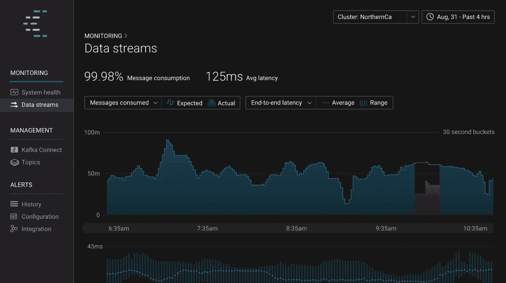
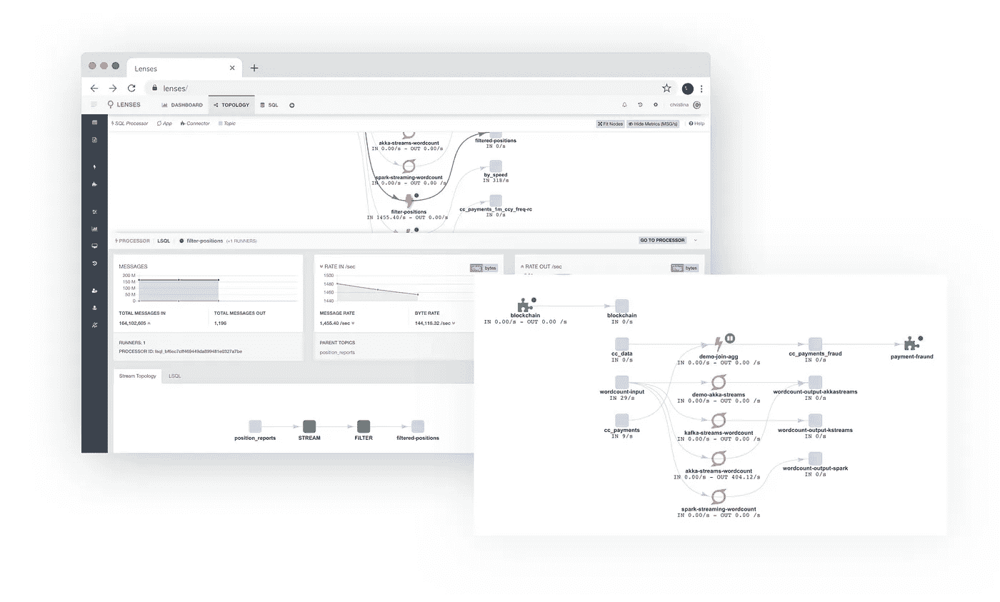
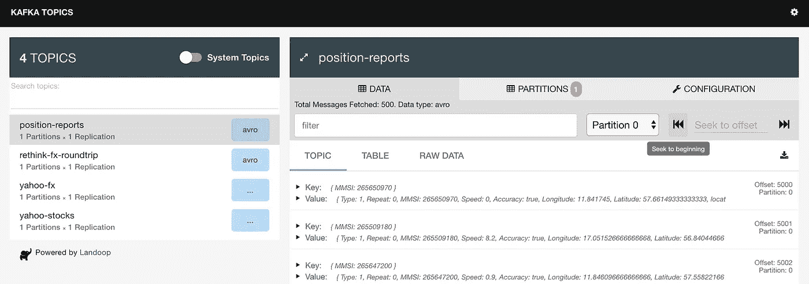
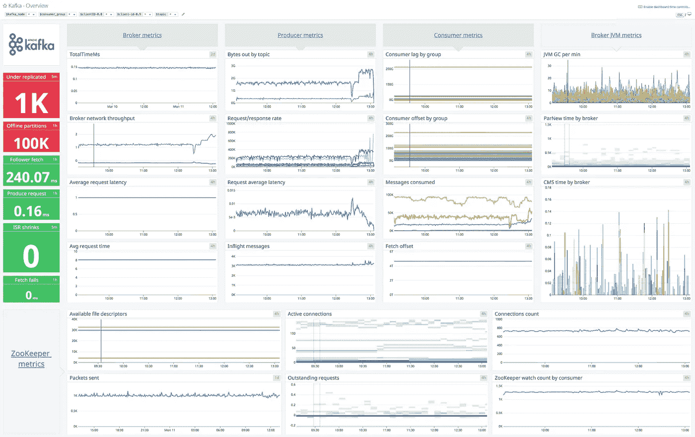
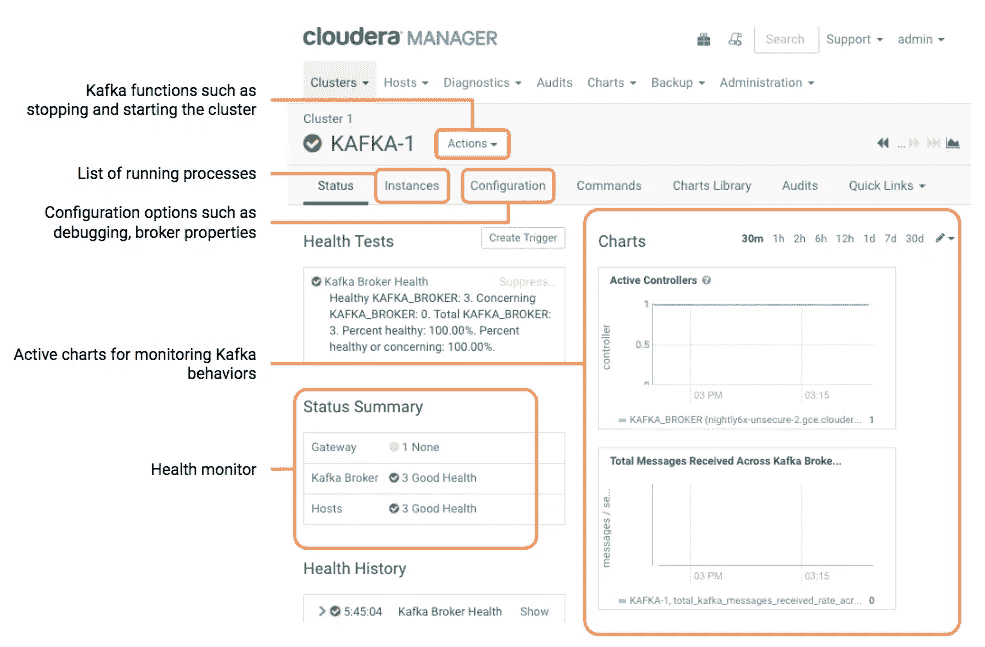
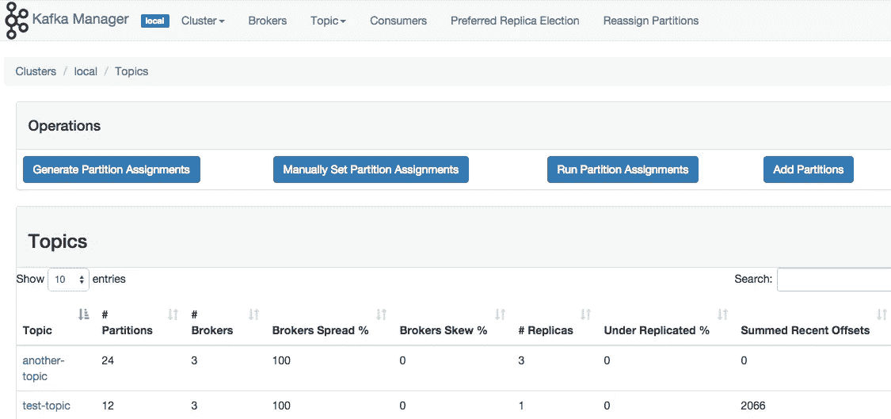
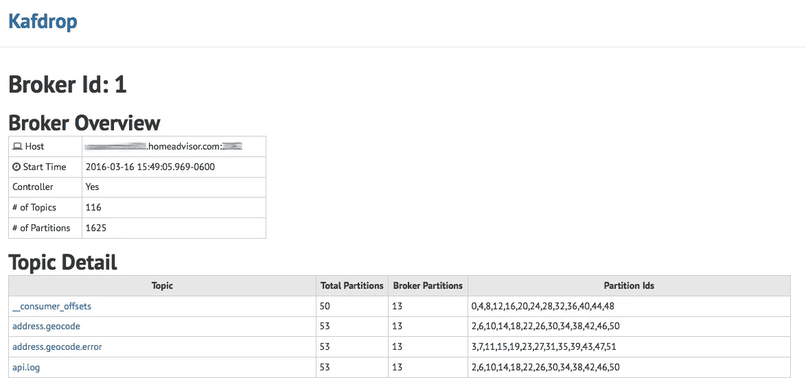

# Apache Kafka 集群的 UI 监控工具概述

> 原文：<https://towardsdatascience.com/overview-of-ui-monitoring-tools-for-apache-kafka-clusters-9ca516c165bd?source=collection_archive---------2----------------------->

## 阿帕奇卡夫卡最好的监控工具有哪些？

Photo by [Chris Liverani](https://unsplash.com/@chrisliverani) on [unsplash.com](https://unsplash.com/photos/dBI_My696Rk)

随着 Kafka 集群监控和管理需求的增加，大量开源和商业图形工具已经上市，提供了各种管理和监控功能。

## TL；dr:阿帕奇卡夫卡最好的监控工具是什么？

1.  合流控制中心
2.  镜头
3.  Datadog Kafka 仪表板
4.  Cloudera 经理
5.  雅虎 Kafka 经理
6.  卡夫多普
7.  LinkedIn Burrow
8.  卡夫卡工具

## 合流控制中心

[Confluent](https://www.confluent.io/) 是阿帕奇卡夫卡原创者创办的公司。合流企业，是一个-更完整的-生产环境的卡夫卡式分布。汇流平台的商业许可附带[汇流控制中心](https://www.confluent.io/confluent-control-center/)，这是 Apache Kafka 的管理系统，能够从用户界面进行集群监控和管理。

[Confluent Control Centre](https://www.confluent.io/confluent-control-center/)

> 汇合控制中心提供了对 Apache Kafka 集群内部工作方式以及流经集群的数据的理解和洞察。控制中心通过精心策划的仪表板为管理员提供监控和管理功能，以便他们能够提供最佳性能并满足 Apache Kafka 集群的服务级别协议。

## 镜头

[lens](https://lenses.io/lenses-features/)(前 Landoop)是一家为 Kafka 集群提供[企业功能和监控工具](https://lenses.io/lenses-features/)的公司。更准确地说，它通过用户界面、流式 SQL 引擎和集群监控增强了 Kafka。它还通过提供 SQL 和连接器对数据流的可见性，支持更快地监控 Kafka 数据管道。

Monitoring and managing streaming data flows with [Lenses](https://lenses.io/lenses-features/)

> Lenses 可与任何 Kafka 发行版配合使用，提供高质量的企业功能和监控、面向所有人的 SQL 以及 Kubernetes 上的自助式实时数据访问和流。

该公司还提供 [Lenses Box](https://lenses.io/lenses-box/) ，这是一款免费的多功能 docker，可以为单个经纪人提供多达 2500 万条消息。注意，开发环境推荐使用 Lenses Box。

[卡夫卡专题 UI](https://github.com/landoop/kafka-topics-ui)

此外，Lenses 还提供 Kafka Topics UI，这是一个用于管理 Kafka 主题的 web 工具。

[Kafka Topics UI](https://lenses.io/blog/2017/05/kafka-topics-ui-v2/) by Lenses

## Datadog Kafka 仪表板

Datadog 的 Kafka Dashboard 是一个全面的 Kafka Dashboard，显示 Kafka 经纪人、生产商、消费者和 Apache Zookeeper 的关键指标。Kafka 部署通常依赖于不属于 Kafka 的外部软件，如 Apache Zookeeper。Datadog 支持对部署的所有层进行全面监控，包括数据管道中不属于 Kafka 的软件组件。

[Kafka Dashboard](https://www.datadoghq.com/dashboards/kafka-dashboard/) by DataDog

> 使用 Datadog 的开箱即用仪表板，节省设置时间并在几分钟内可视化您的 Kafka 数据。

## Cloudera 经理

[与 Confluent、Lenses 和 Datadog 相比，Cloudera Manager](https://www.cloudera.com/documentation/enterprise/latest/topics/kafka_tour.html) 中的 Kafka 显然是一个不太丰富的监控工具。但是对于已经是 Cloudera 客户的公司，需要他们在同一个平台下的监控机制，就非常方便了。

Monitoring Kafka using [Cloudera Manager](https://www.cloudera.com/documentation/enterprise/latest/topics/kafka_tour.html)

> *以后想看这个故事吗？* [*保存在日志中。*](http://usejournal.com/app/signup?save_link=https://blog.usejournal.com/overview-of-ui-monitoring-tools-for-apache-kafka-clusters-9ca516c165bd)

## 雅虎 Kafka 经理

Yahoo Kafka Manager 是一个用于 Apache Kafka 集群的开源管理工具。使用 Kafka Manager，您可以:

*   管理多个集群
*   轻松检查集群状态(主题、消费者、偏移量、代理、副本分发、分区分发)
*   运行首选副本选举
*   生成分区分配，并提供选择要使用的代理的选项
*   运行分区的重新分配(基于生成的分配)
*   创建具有可选主题配置的主题
*   删除主题
*   批量生成多个主题的分区分配，可以选择要使用的代理
*   为多个主题批量运行分区重新分配
*   向现有主题添加分区
*   更新现有主题的配置
*   可以选择为代理级别和主题级别指标启用 JMX 轮询。
*   选择性地过滤掉 zookeeper 中没有 id/owners/& offsets/目录的消费者。

Topics Overview in [Yahoo Kafka Manager](https://github.com/yahoo/kafka-manager)

## 卡夫多普

[KafDrop](https://github.com/HomeAdvisor/Kafdrop) 是一个用于监控 Apache Kafka 集群的开源 UI。该工具显示信息，如经纪人，主题，分区，甚至让您查看消息。这是一个运行在 Spring Boot 上的轻量级应用程序，只需要很少的配置。

Broker Overview in KafDrop. Photo by [HomeAdvisor](https://homeadvisor.tech/kafdrop-open-source-kafka-ui/)

[KafDrop 3](https://github.com/obsidiandynamics/kafdrop)

Kafdrop 3 是一个用于导航和监控 Apache Kafka 代理的 UI。该工具显示代理、主题、分区、消费者等信息，并允许您查看消息。

这个项目是对 Kafdrop 2.x 的重新启动，它被拖进了 JDK 11+、Kafka 2.x 和 Kubernetes 的世界。

## LinkedIn Burrow

[LinkedIn Burrow](https://github.com/linkedin/Burrow) 是 Apache Kafka 的开源监控伴侣，提供消费者滞后检查服务，无需指定阈值。它监控所有消费者的承诺补偿，并根据需求计算这些消费者的状态。提供了一个 HTTP 端点来按需请求状态，以及提供其他 Kafka 集群信息。还有一些可配置的通知程序，可以通过电子邮件或 HTTP 调用将状态发送给另一个服务。陋居是用 Go 编写的，所以在你开始之前，你应该[安装并设置 Go](https://golang.org/doc/install) 。

## 卡夫卡工具

[Kafka Tool](http://www.kafkatool.com/) 是一个 GUI 应用程序，用于管理和使用 **Apache Kafka** 集群。它提供了一个直观的 UI，允许用户快速查看 Kafka 集群中的对象以及存储在集群主题中的消息。它包含面向开发人员和管理员的特性。使用 Kafka 工具，您可以:

*   查看集群、代理、主题和消费者级别的指标
*   查看分区中的消息内容并添加新消息
*   **查看抵消**的卡夫卡消费者，包括阿帕奇风暴的卡夫卡喷口消费者
*   以漂亮的打印格式显示 JSON 和 XML 消息
*   **添加和删除主题**以及其他管理功能
*   **将 Kafka 分区中的单个消息**保存到本地硬盘
*   编写你自己的[插件](http://www.kafkatool.com/plugins.html)，允许你查看定制的数据格式

该工具可以在 Windows、Linux 和 Mac OS 上运行。

## 比较和结论

如果你买不起商业许可证，那么你可以选择雅虎 Kafka Manager、LinkedIn Burrow、KafDrop 和 Kafka Tool。在我看来，前者是一个全面的解决方案，应该可以满足大多数用例。

如果您运行的是相对较大的 Kafka 集群，那么购买商业许可是值得的。与我们在这篇文章中看到的其他监控工具相比，Confluent 和 Lenses 提供了更丰富的功能，我强烈推荐这两个工具。

**要获得 Kafka UI 监控工具的最新列表，请务必阅读我最近的文章:**

 [## Kafka UI 监控工具(2021 年更新)

### 探索 Apache Kafka 集群的一些最强大的 UI 监控工具

towardsdatascience.com](/kafka-monitoring-tools-704de5878030) 

[**成为会员**](https://gmyrianthous.medium.com/membership) **阅读介质上的每一个故事。你的会员费直接支持我和你看的其他作家。**

## 你可能也喜欢

 [## 卡夫卡不再需要动物园管理员了

### 2.8.0 版本让你提前接触到没有动物园管理员的卡夫卡

towardsdatascience.com](/kafka-no-longer-requires-zookeeper-ebfbf3862104)  [## 如何在阿帕奇卡夫卡中获取特定信息

### 掌握 Kafka 控制台消费者和 kafkacat

better 编程. pub](https://betterprogramming.pub/how-to-fetch-specific-messages-in-apache-kafka-4133dad0b4b8)